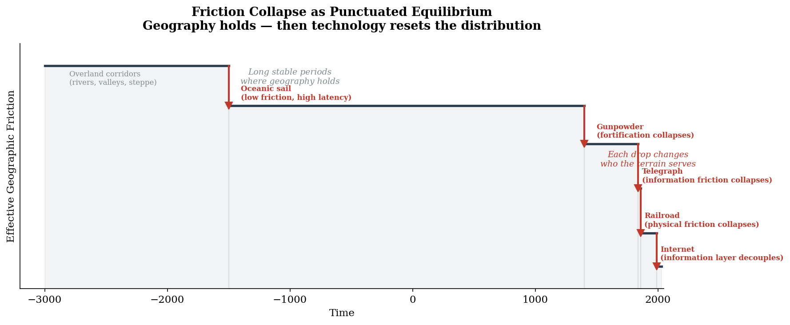
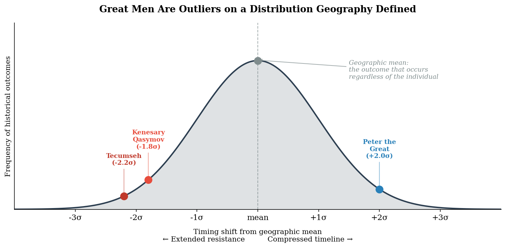

# Chapter 1: The Distribution
### *Geography as probability, not destiny*

---

## I.

If you reject the geographic explanation for why civilizations developed differently, you are left with two alternatives. The first is cultural: some peoples simply did not think of agriculture, writing, or centralized government. The second is biological: some peoples were incapable of it.[^1]

The cultural explanation fails a basic replication test. The same cognitive hardware that built Cahokia — a city of 20,000 on the Mississippi, larger than London in 1100 CE — also produced the Haudenosaunee confederacy, the Aztec engineering of Tenochtitlan, the Inca road system through the Andes, and the Comanche military empire that dominated the Southern Plains for over a century.[^2] The intelligence and organizational capacity were identical across populations. Nobody failed to think of agriculture. Many populations evaluated it against their geographic circumstances and found it unnecessary.[^3]

The biological explanation is eugenics.

If both alternatives fail, the geographic explanation is not merely interesting. It is necessary. The question is not whether geography matters, but how precisely it matters and through what mechanisms.

---

## II. The Claim

Geography sets the probability distribution of historical outcomes.

This is not determinism. Determinism says the outcome was inevitable. A probability distribution says some outcomes were far more likely than others given the terrain, and that the actual outcome — whoever happened to be king, whatever battle happened to be won — was a draw from that distribution. Some draws are near the mean. Some are outliers. But the distribution itself is shaped by rivers, mountains, climate, and the location of resources.

Three mechanisms shape the distribution. We call them lenses because each reveals a different layer of the same reality, and you need all three to see the full picture.

**The first lens is geographic determinism** — extended beyond its usual formulation. Jared Diamond established that continental axis orientation, the availability of domesticable plants and animals, and the geographic barriers to diffusion explain why civilizations developed at different rates across continents.[^4] This book accepts that foundation and refines it. Diamond treats geography as binary: you had the preconditions for agriculture or you did not. We treat geography as a probability gradient: the likelihood of centralized state formation given this terrain type is higher here than there, and the specific type of civilization that develops — mobile, compact-sedentary, or expansionist-sedentary — is a function of the shape of the resource gradient, not merely of its presence or absence.[^5]

The Nile is long, narrow, predictable, and deposits rich silt on a manageable floodplain. It produces a linear polity, binds people economically, and almost automatically generates a bureaucratic state. The Amazon is vast, nutrient-poor in its soils, and unmanageable in its flooding. It produces nothing resembling a river-spine civilization, despite being one of the largest rivers on earth. The Volga runs through latitudes too cold for surplus agriculture and drains into a landlocked sea with no connection to ocean trade networks. It produced the Khazar Khaganate — a sophisticated, cosmopolitan trading state that controlled the lower Volga corridor for centuries — but never a grain empire on the Nile's scale. Weaker geographic incentives produced a weaker, more commercial, less agricultural expression of the river-spine logic.[^6]

The claim is not that rivers cause civilization. The claim is that specific geographic preconditions cause civilization, and rivers are the most common delivery mechanism for those preconditions. The preconditions are identifiable: climate suitable for surplus agriculture, a linear organizing feature, a predictable cycle that rewards planning, a connected outlet to broader networks, and favorable adjacency — what is next to the river matters as much as the river itself.[^7] Score any body of water on these five variables and you can predict, with reasonable confidence, what kind of civilization it should produce. Where the prediction fails, something interesting has happened that requires explanation.

The Inca found a mountain range that delivered the same preconditions a river would. The Andes provide a linear spine, altitudinal zones that stack multiple ecological niches within a day's walk — potatoes here, maize lower, coca lower still, tropical fruits in the valleys — defensible terrain, predictable snowmelt for irrigation, and natural borders.[^8] The mountain range is a river valley rotated ninety degrees. The Great Plains of North America, by contrast, offered a resource gradient that rewarded seasonal north-south migration rather than settlement: fertile soil, abundant buffalo, and a continental orientation that made moving to where the food currently was cheaper than storing it in place. Plains nomadism was not a failure to develop agriculture. It was a rational optimization for terrain where agriculture had no competitive advantage.[^9]

The framework does not predict the same civilization everywhere. It predicts different civilizations from different gradients, and the specific differences are predictable from the terrain. Where the prediction holds, geography is doing explanatory work. Where it does not, we have found either an omitted variable or a genuine counterexample. Both are valuable.

**The second lens is friction collapse** — this book's original contribution. Geography holds until technology makes it irrelevant.

For most of human history, geographic constraints were effectively permanent. The steppe was impassable for sedentary armies. The ocean was crossable but slow. The mountain range was a wall. Then, periodically, a technology arrived that collapsed the friction those constraints imposed — and the probability distribution reset entirely.

The metaphor is thermodynamic, and it is not merely a metaphor. A river is a physical system solving an energy minimization problem: gravity pulls water downhill, and the river computes the optimal path through iterative physical experimentation across geological time. Every meander is a local optimization. The river does not know anything, but it has effectively run every trial.[^10] When you dam the river, you do not eliminate the energy. You accumulate it behind the obstruction. The pressure builds. If you stop maintaining the dam, the water goes where it was always going.

Geographic determinism is stored potential energy seeking equilibrium. Population pressure, resource gradients, technological differentials — these are all forms of potential energy, and they flow toward equilibrium the way water flows downhill. Empires dam the river. They accumulate pressure without eliminating it. Technology digs canals — it accelerates the flow in a chosen direction, but the redirected flow finds channels the engineer did not anticipate.[^11] The Soviet Union diverted the rivers feeding the Aral Sea to grow cotton. Within decades, one of the world's largest lakes ceased to exist. The river did not cooperate. The river has more information than the engineer.[^12]

The railroad is the canonical friction collapse. For four thousand years, the open steppe was a highway for nomadic peoples and a barrier for sedentary states.[^13] Horse-based mobility across flat terrain was the dominant military technology. No empire could project power across the steppe faster than a horse could retreat from it. Then, in the space of a single generation, the railroad inverted the steppe's military geography entirely. The same flat, open terrain that had been the nomad's greatest strategic asset became their greatest vulnerability. There was nowhere to flee that the rail could not reach. No terrain feature to hide behind. The relationship between terrain and power performed an orthogonal rotation: the steppe went from being legible only to the mobile to being legible only to the state.[^14]

This happened simultaneously on opposite sides of the planet — in the American West and across the Central Asian steppe — driven by the same technology, against the same kind of culture, with neither side aware of the other. We will return to this parallel in detail. For now, it is enough to note that the probability of this convergence without geographic causation is vanishingly small. The only variable shared across both cases is the combination of terrain type and technology. No other explanation accounts for all of the parallels.

But friction collapse is not unique to the railroad. It is a recurring pattern: long stable periods where geography holds, then a technology shock that resets the distribution. The progression of friction regimes structures the history this book tells:[^15]

Empire is the constant. Friction is the variable.

Ancient empires expanded along geographic corridors — rivers, valleys, steppe highways. The terrain defined where power could flow. Then oceanic sail collapsed the friction of distance, but at the cost of high latency: you could move enormous quantities across the ocean, but the return signal was slow. This produced a specific kind of colonial administration — autonomous, extractive, brutal — because the feedback loop was too slow to correct abuse.[^16] The telegraph collapsed information friction, making responsive administration possible for the first time. The railroad collapsed physical friction, making continental interiors accessible to state power. The internet collapsed information friction again, at a different scale, decoupling the information layer from the physical layer entirely.[^17]

Each collapse is a punctuated equilibrium event. The distribution holds. The technology arrives. The distribution resets. The new equilibrium is not the old one.

*[Figure 2: Friction Collapse as Punctuated Equilibrium](../../figures/fig-002-friction-collapse-timeline.md)*

Not everything that looks like a friction collapse is one. A faster horse is not a friction collapse. The railroad is. Aviation is not — it changed where people could visit, not where they could live; the terrain beneath the flight path remained geographically operative for everyone on the ground. The distinction matters for the framework's falsifiability, and it reduces to a single test: did the technology change *who the terrain serves*, or did it just help the same people do the same things faster?

The open steppe served nomads for four thousand years — their highway, their strategic depth, their military advantage. The railroad made the same steppe serve the state. That is a friction collapse. A faster camel would have helped the nomads move faster across terrain that still served them. That is an improvement. The test is whether the terrain's function — who it advantages, who it excludes, what kind of civilization it selects for — inverts. If it does, friction has collapsed. If it does not, you merely have a better tool for operating within the existing geographic regime.[^15a]

**The third lens is diffusion of innovations** — Everett Rogers' framework applied to historical transitions.[^18] Rogers developed his theory empirically, from studies of how Iowa farmers adopted hybrid corn. The statistical texture is baked in from the origin: innovations spread through populations in a predictable S-curve, and adopters fall into identifiable categories — innovators, early adopters, early majority, late majority, and laggards — each with distinct characteristics that determine when and why they adopt.

Most macro history presents change as event. A king decides. A battle is won. A treaty is signed. The diffusion lens restores the ground-level statistical texture that this framing erases. What looks like a decisive moment is usually a diffusion curve reaching its tipping point — the transition from early adopters to early majority, the moment when the innovation achieves critical mass and adoption becomes self-sustaining. The great man standing at the lectern announcing the new era is usually standing at the inflection point of a curve that was already bending.

We argue that Rogers is, at bottom, applied Claude Shannon.[^19] Shannon's mathematical theory of communication established that the outcome of any transmission depends on the receiver's decoding and the noise in the channel, not on the sender's intention. Rogers' diffusion model is a theory of how signals propagate through social networks with varying noise levels, receiver characteristics, and channel properties. The adopter categories are receiver categories — defined by their capacity and willingness to decode the signal.

This matters for history because history is almost entirely told from the sender's side. The British East India Company's intentions. The Tsar's edicts. Manifest Destiny. All sender framing. What actually determined historical outcomes was what the receiver did with the signal. How Kazakh nomads decoded Russian administrative documents.[^20] How Plains nations interpreted the approaching railroad. How a steppe resistance leader like Kenesary Qasymov — who assembled a coalition of twenty to fifty thousand across the three Kazakh hordes, attacked Russian forts, and was killed not by the Russians but by other steppe peoples who viewed him as a brigand — decoded the Russian advance as existential threat while his neighbors decoded it as manageable nuisance.[^21] Same signal. Different receivers. Different outcomes.

The three lenses are unified underneath by information theory. Geographic determinism describes the channel — the terrain that determines signal capacity and noise between populations. Friction collapse describes a sudden increase in channel capacity — technology removing noise and latency that previously degraded the signal. Diffusion describes signal propagation through receiver networks, with adoption rates determined by receiver characteristics and channel properties.[^22] Geography is the channel. Technology changes the channel. Diffusion is what flows through it.

The analogy generates a specific methodological advantage: written sources accumulate encoding layers with each transmission hop — from original actor to historian to popularizer to reader, each introducing distortion. Geography has zero transmission hops. The terrain is the terrain. No historian re-encoded it. No curator recontextualized it. No extractor removed it from its relational context. Any researcher with a topographic map can test the framework's predictions independently, against evidence that hasn't been touched by any human handler. The Pamir Knot cannot be moved to the British Museum. The Dunhuang manuscripts already were.[^22b]

The analogy also generates a contribution to diffusion theory that Rogers himself did not fully articulate. Rogers' S-curve begins with the first adopters. But the compass — used for geomancy in China for a thousand years before anyone applied it to maritime navigation — reveals a pre-recognition phase of indefinite length where an innovation exists physically but not cognitively. The maritime sailors did not reject the compass. They looked at a geomancy instrument and saw something irrelevant to navigation. The signal arrived and was filed as noise because the receiver's category structure had no slot for it. The S-curve starts at recognition, not at invention. Before recognition, the curve is flat at zero — for a thousand years in this case. Rogers needs a phase zero.[^22c]

A clarification on the nature of this claim. Shannon's framework is mathematical — channel capacity is a quantity measured in bits per second, noise has units, signal degradation is computable. We are not claiming that the Gansu Corridor has a measurable channel capacity in the Shannon sense, or that cultural noise degrades at a rate expressible in equations. We are claiming that the structural correspondence between Shannon's model and the geographic dynamics we describe is more than decorative — it illuminates relationships (sender/receiver asymmetry, noise as a function of distance, channel characteristics determining what can be transmitted) that purely geographic language obscures. This is an analogy with explanatory power, not a computational claim. We use Shannon as a structuring framework, not as a mathematics we can deliver. The analogy earns its place by generating predictions — the friction-filter principle, the receiver-side methodology, the absence-as-data inference — that the geographic vocabulary alone does not produce.[^22a]

---

## III. The Great Man Reframe

The great man theory of history fails two tests.

**The replication test.** If individuals were the primary driver of outcomes, similar patterns would not emerge independently in similar geographic contexts across cultures with no contact. But they do. River valley civilizations converge on bureaucratic states — on the Nile, the Tigris, the Indus, the Yellow River. Steppe peoples converge on horse confederacies. Chokepoint cities converge on mercantile cultures. Maritime peoples converge on naval power and trade networks.[^23] The convergence is not approximate. It is structural. The same terrain produces the same organizational logic, repeatedly, independently, across millennia.

There are hints that this convergence extends deeper than institutions — possibly into epistemology itself. Early civilizations that depended on reading the natural environment developed systematic pattern recognition, ritualized into divination, and the patterns they chose to read appear to map to their geographic context. River civilizations read the stars — predicting flood cycles was agriculture was survival. Steppe nomads read the earth — geomancy, sand patterns, terrain signs. Coastal peoples read wind and waves.[^24] If this pattern holds under rigorous comparative examination, it would suggest that even a civilization's way of knowing — how it thinks knowledge is structured and how hidden truths are accessed — reflects its geography. The convergence may go all the way down. That claim remains a hypothesis worth testing rather than an established finding, but the pattern is suggestive enough to name.

**The counterfactual removal test.** For any great man claim: remove the individual from history and ask whether the structural outcome changes within a generation.[^25]

Peter the Great is the test case on one end of the distribution. He compressed the timeline of Russian southward and eastward expansion by perhaps a generation. The geographic pressures driving that expansion — the warm-water port problem, the steppe frontier security problem, the technology differential accumulating through trade exposure — all predated Peter by centuries.[^26] Every Russian ruler faced the same constraints. Ivan IV tried for the Baltic. The trajectory was set. Remove Peter entirely and Russia still expands south and east within a generation, driven by the same geographic logic. Peter determined when and how. He did not determine whether.

Tecumseh is the test case on the other end. He extended the timeline of Native resistance by perhaps a generation. His strategy was explicitly geographic and political — he understood that fragmented resistance would be defeated piecemeal by a consolidated empire, and he independently derived the same unification logic the American founders had used.[^27] He was arguably the most strategically brilliant resistance leader of his era. He correctly diagnosed the problem, almost assembled the solution, and still could not overcome the structural differential. The technology gap, the population gap, and the organizational gap behind the expanding empire were too large. Remove Tecumseh and the resistance collapses slightly sooner. The outcome is identical.

Peter and Tecumseh are outliers on opposite tails of the same probability distribution. One is remembered as the great man who built an empire. The other is remembered as the tragic hero who could not save his people. Remove either and the outcome is essentially the same within a generation. The distribution does not notice.[^28]

*[Figure 1: The Great Man as Outlier](../../figures/fig-001-great-man-outlier.md)*

This is not a rebuttal of great man theory. It is a reframe. The strong version of great man theory — individuals as uncaused first movers who bend history by pure will — is wrong. But the hard determinist position — that the individual is irrelevant, that another person would have done exactly the same thing — is also wrong. It collapses variance to zero, and that is not how distributions work.[^29]

The actual model: geography and thermodynamic pressures define the probability distribution. Technology events shift the distribution. Great men are high-leverage draws from that distribution — they compress timelines, shape specific paths between locally stable states, and determine which of several probable outcomes actually occurs. But they operate within a constrained solution space they did not create.

This framing survives the hardest test cases. It survives Peter. It survives Tecumseh. It survives Hitler — Weimar Germany was a system under enormous structural pressure already selecting for authoritarian nationalist response; Hitler's specific pathologies shaped the specific path, but remove him and you almost certainly still get authoritarian Germany, even if the particular form that authoritarianism took might have differed.[^29a] It survives Timur, whose empire of skulls collapsed within two generations while the underlying geographic logic of Transoxiana reasserted itself in a cultural renaissance his grandchildren presided over but did not cause.[^30] Great men dam the river. They do not redirect it.

---

## IV. The Toolkit

For this framework to be a theory rather than a belief, it must be falsifiable. There must be conditions under which it fails. We name them here.[^31]

The framework fails if similar geographies consistently produce divergent outcomes with no identifiable intervening variable. If two river valleys with comparable climate, outlet, and adjacency produce radically different civilizational outcomes, and we cannot explain why, the framework has a problem.

The framework fails if an individual demonstrably shifts a structural outcome — not merely the timing — beyond what the geographic distribution would predict. If removing one person from history changes not when something happened but whether it happened at all, the framework gives too little weight to individuals.

The framework fails if a technology that should collapse friction does not, for reasons the framework cannot accommodate. If the railroad arrives in a steppe context and the predicted inversion does not occur, something is wrong with the model.

We believe the framework survives these tests. But the tests must remain open. A theory that cannot be falsified is not a theory. It is a belief wearing the vocabulary of science.

We also acknowledge what the framework cannot do.[^32] History is an open system. It provides limitless trials and minimal reproducibility. We cannot generate actual distribution curves with real data. We cannot rerun the nineteenth century without the railroad and observe the difference. We cannot assign precise probabilities to historical outcomes. The parallel cases we use — Russia and America, the Nile and the Yellow River, the Comanche and the Kazakhs — function as natural experiments, but they are not controlled experiments. The convergence across independent cases is more than anecdote and less than proof. It is evidence at the level history can provide.

But we can do something that comes closer to experimental validation than most historical frameworks attempt. We can build the model on data we have examined and then test it against data we have not.[^33]

In practice, this means generating predictions before consulting the record. During the research for this book, the framework was developed primarily from Central Asian history — the steppe frontier, the railroad, the parallel conquests. When the research turned to the Silk Road's oasis cities — material the framework had never been trained on — the model predicted a specific sequence: that oasis cities sustained by glacial meltwater should decline during aridification periods, that imperial power projection into the region should contract as the logistical substrate dried up, and that renewed projection should correlate with subsequent wetter periods. The prediction was documented in a reference card before the confirming material was consulted.[^34a]

We should be honest about the base rate. The first element of the prediction — less water means fewer cities — is close to thermodynamically necessary. Any reasonable framework would predict it. The non-trivial predictions are the second and third: that imperial projection specifically should contract in correlation with the water supply (rather than continuing through alternative logistics), and that the correlation should show a cyclical pattern matching climate oscillation (rather than a one-way decline). These predictions distinguish the thermodynamic framework from simpler models. They are specific enough to have been wrong — and they were not.

This is holdout validation — the standard test in any predictive discipline. You build the model on a subset of the data. You test it on data the model has never seen. If the predictions validate, the model has explanatory power beyond its training set. If they do not, the model is overfit to the cases that built it.

The framework would have failed the holdout if: imperial projection had continued despite oasis collapse (meaning non-geographic factors overrode the water dependency), or if the Tang resurgence had occurred during a dry period rather than a wet one (meaning the climate correlation was spurious), or if no cyclical pattern existed (meaning the sequence was coincidental rather than climate-driven).[^34c] None of these obtained. The framework passed.

That does not prove it is correct. It demonstrates that it generates accurate predictions about cases it was not designed to explain — which is more than most historical frameworks can claim.

What we can do is name more variables than previous models, acknowledge the variance we cannot explain, state the conditions under which we would be wrong, and show that the framework predicts data it was not built from.[^34b] We borrow the discipline of statistical reasoning — distributions, falsifiability, counterfactual testing, holdout validation — without claiming to have the data of a controlled experiment. The discipline is in the thinking, not in the math. That is enough.

A note on the book's organization. Traditional history is arranged by time — events are meaningful because of their sequence. This book is arranged by geographic phenomenon — rivers, chokepoints, corridors, friction collapses — because the explanatory power lives in the gradients, not in the timeline. The Han Dynasty projection and the Tang Dynasty projection are not primarily interesting because one preceded the other. They are interesting because they represent the same thermodynamic phenomenon — a civilization reaching sufficient energy density to push against geographic friction — expressing itself twice with a recovery gap between. The gap is not empty time. It is the gradient recovering. Time is the medium through which gradients express themselves. The gradient is the cause.[^34d]

We can't rerun the nineteenth century without the railroad. But we can predict what we are about to learn and check whether we were right. That is what separates a theory from a belief.

---

## V. The Distribution Applied

The framework makes a specific prediction. If geography shapes the probability distribution of outcomes, then the same geographic context subjected to the same technology shock should produce the same structural outcome — independently, without coordination, without contact.

In the 1860s through the 1880s, two events occurred simultaneously on opposite sides of the planet. The Russian Empire conquered the Central Asian steppe.[^34] The United States conquered the Great Plains.[^35] Same technology: railroad, firearms, telegraph. Same timeline. Same geographic type: open grassland that had sustained horse-based nomadic cultures for millennia. Same target culture: peoples who had rationally optimized for the terrain and whose military advantage depended on mobility across open space. Same resistance pattern: brilliant unifiers who correctly diagnosed fragmentation as fatal, built unprecedented coalitions, and still lost.[^36] Same economic warfare: the destruction of the resource base that made the nomadic optimization viable — Russia imposed cotton monoculture, America destroyed the buffalo herds.[^37] Same administrative outcome: colonial bureaucracy imposed on formerly stateless territory.

Neither empire was aware of the other's parallel campaign in any meaningful strategic sense. There was no coordination. There was no shared playbook. There was only the same terrain subjected to the same technology, producing the same result.

This is the thesis of the entire book, demonstrated in a single case. The distribution was set by geography. The technology collapsed the friction. The outcome was drawn from the distribution. The great men on both sides — the generals, the resistance leaders, the politicians — were high-leverage draws from a loaded distribution. They shaped the path. They did not create the destination.

The next seven chapters are the evidence.

---

*The river is old. The dams are new. Turn the page.*

---

## Notes

[^1]: The tripartite framing — geographic, cultural, or biological — follows Diamond's structure in *Guns, Germs, and Steel* but inverts his emphasis. Diamond asks why civilizations developed differently; we ask why the geographic explanation is the only one that survives elimination. See Jared Diamond, *Guns, Germs, and Steel: The Fates of Human Societies* (New York: W.W. Norton, 1997), chapters 1–3. The formulation that the geographic explanation is *necessary* rather than merely interesting emerged from [ref 011](../../references/011-eugenics-reductio-and-thermodynamic-complexity.md).

[^2]: On Cahokia's population and complexity: Timothy Pauketat, *Cahokia: Ancient America's Great City on the Mississippi* (New York: Penguin, 2009). On the Comanche as an imperial power: Pekka Hämäläinen, *The Comanche Empire* (New Haven: Yale University Press, 2008). Hämäläinen's reframing of the Comanche from victims of expansion to a dominant military and economic power is foundational to our treatment of Plains nomadism as rational optimization. See [Hämäläinen lit review](../../literature-review/hamalainen-comanche-empire.md).

[^3]: The argument that Plains nomadism was a rational optimization rather than a failure to develop builds on Diamond's continental axis argument but inverts it: the same variable (north-south orientation) that Diamond uses to explain why agriculture spread slowly also explains why it was unnecessary on the Plains. See [ref 010](../../references/010-plains-nomadism-rational-optimization.md) and [ref 011](../../references/011-eugenics-reductio-and-thermodynamic-complexity.md).

[^4]: Diamond, *Guns, Germs, and Steel*, chapters 5, 8, 10. Our departure from Diamond is in resolution and framing: he treats geographic advantage as binary; we treat it as a probability gradient. See [Diamond lit review](../../literature-review/diamond-guns-germs-steel.md).

[^5]: The resource gradient model — that the *shape* of resource distribution determines the *type* of civilization (mobile, compact-sedentary, or expansionist-sedentary) — is this book's extension of Diamond. The three types emerged from comparing Plains, Inca, and river-valley cases during seminar discussion. See [ref 018](../../references/018-resource-density-shapes-civilization-type.md).

[^6]: The Nile/Amazon/Volga triptych defines the river-spine model's success conditions by elimination. Each river fails on different variables: the Amazon on soil nutrients and floodplain manageability, the Volga on climate, outlet connectivity, and steppe adjacency. The triptych emerged from progressive Beta seminar discussions. See [ref 016](../../references/016-amazon-anti-nile.md) and [ref 020](../../references/020-volga-as-laggard-river.md).

[^7]: The five-variable model for river-spine civilization (climate, linear geometry, predictable flood cycle, connected outlet, favorable adjacency) was constructed inductively from the Nile/Amazon/Volga comparison and the lake-geometry analysis. A lake's radial geometry distributes population rather than concentrating it, which is why large lakes rarely produce centralized states despite providing food and water. See [ref 021](../../references/021-lake-geometry-vs-river-geometry.md).

[^8]: On the Inca exploitation of altitudinal zones: the foundational work is John Murra, *Formaciones económicas y políticas del mundo andino* (Lima: Instituto de Estudios Peruanos, 1975). The "river valley rotated ninety degrees" formulation emerged from a Beta seminar discussion comparing Inca mountain-spine organization to river-spine organization. See [ref 017](../../references/017-western-hemisphere-geographic-analogs.md).

[^9]: Hämäläinen, *Comanche Empire*, 23–68 on the horse-buffalo economy as a complete system. The argument that Plains nomadism was a rational optimization for terrain where seasonal north-south migration was trivially easy, making storage and sedentism unnecessary, extends Diamond's axis argument in a direction Diamond himself does not take. See [ref 010](../../references/010-plains-nomadism-rational-optimization.md).

[^10]: The river-as-optimization-model framing draws on thermodynamic principles of energy minimization. The comparison to high-dimensional regression modeling — the river as a system that has effectively run every trial — emerged from a discussion connecting physical optimization to statistical methodology. See [ref 023](../../references/023-river-as-regression-model-r-squared.md) and [ref 012](../../references/012-river-as-thermodynamic-framework.md).

[^11]: The canal metaphor — technology as deliberate acceleration of an existing gradient, producing unintended downstream reshaping — is developed in [ref 012](../../references/012-river-as-thermodynamic-framework.md). The formulation that "the river has more information than the engineer" captures the epistemological dimension: the terrain's complexity exceeds any administrative model's capacity.

[^12]: On the Aral Sea destruction: the Soviet diversion of the Amu Darya and Syr Darya for cotton agriculture destroyed the lake within decades. This is the most extreme instance of the canal metaphor — the attempted redirection of a geographic system producing consequences that dwarfed the intended outcome. The variance between intention and result is the measure of the system's complexity relative to the model's simplicity. See [ref 022](../../references/022-delusion-of-control-variance-explosion.md). On Soviet cotton monoculture in Central Asia: Richard Pierce, *Russian Central Asia, 1867–1917: A Study in Colonial Rule* (Berkeley: University of California Press, 1960).

[^13]: On the deep history of horse-based steppe warfare: David Anthony, *The Horse, the Wheel, and Language: How Bronze-Age Riders from the Eurasian Steppes Shaped the Modern World* (Princeton: Princeton University Press, 2007). Anthony traces the domestication of the horse on the Pontic-Caspian steppe and its spread, establishing the roughly four-thousand-year military equilibrium the railroad ended.

[^14]: The "orthogonal rotation" concept — the same terrain inverting its military function when the railroad arrives — emerged from connecting Morrison's logistics analysis with the legibility framework of James C. Scott, *Against the Grain: A Deep History of the Earliest States* (New Haven: Yale University Press, 2017). See [orthogonal rotation note](notes.md) and [ref 009](../../references/009-perovskii-khiva-camel-failure.md) for the pre-railroad geographic equilibrium demonstrated by Perovskii's 1839 Khiva campaign, which failed because the Russians could not manage camels in the desert.

[^15]: The four friction regimes — overland corridors, oceanic sail, telegraph, railroad — and the formulation "empire is the constant, friction is the variable" emerged from a Beta seminar discussion contextualizing the parallel conquests within the longer arc of imperial expansion. See [ref 013](../../references/013-empire-constant-friction-variable.md).

[^16]: The argument that colonial administrative models follow the friction/latency profile rather than the culture of the colonizer — that high-latency systems produce autonomous extraction and abuse because the feedback loop is too slow to correct — connects to Shannon's information theory via channel noise as a function of distance. See [ref 013](../../references/013-empire-constant-friction-variable.md) and [ref 014](../../references/014-normal-distribution-of-human-traits.md). The claim that cruelty is structurally amplified rather than culturally inherent follows from the observation that all human traits are normally distributed across populations; what varies is the incentive structure that determines which traits the system rewards.

[^17]: On the decoupling of information and physical layers: the internet collapses information friction without collapsing physical friction. The Arab Spring demonstrated this — same information environment across multiple countries, radically different physical outcomes depending on the geographic and institutional substrate. See [ref 015](../../references/015-information-layer-decoupling.md).

[^18]: Everett Rogers, *Diffusion of Innovations*, 5th ed. (New York: Free Press, 2003). Rogers developed his framework empirically from agricultural extension studies, not from theory. The S-curve and adopter categories are among the most widely validated models in the social sciences. See [Rogers lit review](../../literature-review/rogers-diffusion-of-innovations.md).

[^19]: Claude Shannon, "A Mathematical Theory of Communication," *Bell System Technical Journal* 27, no. 3 (1948): 379–423. The connection between Shannon and Rogers — that diffusion is applied information theory, with adopter categories as receiver categories and geographic distance as channel noise — is developed in [ref 033](../../references/033-shannon-receiver-side-information-theory.md) and [Shannon lit review](../../literature-review/shannon-mathematical-communication.md).

[^20]: On Kazakh responses to Russian administrative documents: Eren Tasar, *Crossroads of Civilization: A History of Central Asia* (The Great Courses, 2025), lectures 17–19. Tasar describes the incomprehension and resistance that met Russian bureaucratic impositions on the steppe. See [Tasar lit review](../../literature-review/tasar-crossroads-of-civilization.md).

[^21]: On Kenesary Qasymov: Tasar, *Crossroads of Civilization*, lecture 18. Kenesary was a grandson of Ablai Khan who assembled 20,000–50,000 men across the three Kazakh hordes, attacked Russian forts and caravans, and was killed in 1847 by Kyrgyz who viewed him as a brigand. His structural parallel to Tecumseh — brilliant unifier, harsh toward non-joiners, killed by internal rivals rather than the primary enemy — is developed in [ref 005](../../references/005-tecumseh-pattern-archetype.md) and [ref 006](../../references/006-pre-petrine-nomadic-taxation-rebellions.md).

[^22]: The unification of the three lenses via information theory — geography as channel, friction collapse as channel capacity change, diffusion as signal propagation — emerged from connecting Shannon's framework with the book's analytical structure. See [ref 033](../../references/033-shannon-receiver-side-information-theory.md).

[^23]: On convergent political evolution in similar geographic contexts: Peter Turchin, *Ultrasociety: How 10,000 Years of War Made Humans the Greatest Cooperators on Earth* (Chaplin, CT: Beresta Books, 2016). Turchin's data on the independent emergence of similar state forms in similar terrains is the statistical backbone of this claim. See [Chapter 1 stub](stub.md) for the full source assessment.

[^24]: The observation that divination systems map to geographic context — river civilizations reading stars for flood prediction, steppe peoples reading earth signs, coastal peoples reading wind and waves — emerged from a Beta seminar discussion triggered by a passing reference to geomancy in Tasar's lecture. The AI surfaced the broad pattern; the human recognized its relevance to the geographic epistemology argument. See [ref 001](../../references/001-divination-as-geographic-epistemology.md).

[^25]: The counterfactual removal test as a formal analytical tool — remove the individual, ask if the structural outcome changes — draws on Niall Ferguson, ed., *Virtual History: Alternatives and Counterfactuals* (London: Picador, 1997). Ferguson argues that counterfactual reasoning is not idle speculation but a necessary condition for causal claims in history. See [ref 003](../../references/003-falsifiability-and-counterfactual-method.md).

[^26]: On pre-Petrine Russian expansion pressures: the steppe frontier was a chronic security problem predating Peter by centuries, and the southward/eastward trajectory was already in motion under Ivan IV and Catherine. See [ref 002](../../references/002-peter-great-counterfactual-test.md). For the pre-Petrine rebellions and Russian taxation of nomadic routes: Tasar, *Crossroads of Civilization*, lectures 16–18. See also [ref 006](../../references/006-pre-petrine-nomadic-taxation-rebellions.md).

[^27]: On Tecumseh's explicit unification strategy: the identification of Tecumseh rather than Sitting Bull as the structurally correct parallel to Kenesary Qasymov is documented in [ref 007](../../references/007-process-journal-tecumseh-aha.md), which also illustrates the human-AI correction loop described in the Prologue. Dan Carlin, *Hardcore History*, episode 4, "Romanticizing the Tribes," covers Tecumseh's strategic vision.

[^28]: The Peter/Tecumseh mirror — outliers on opposite tails of the same distribution, one compressing the conquest timeline, the other extending the resistance timeline, both irrelevant to the structural outcome — is developed in [ref 004](../../references/004-peter-tecumseh-mirror.md).

[^29]: The formulation "great men are high-leverage draws from a loaded distribution" — neither the uncaused first movers of strong Great Man Theory nor the interchangeable placeholders of hard determinism — is the book's central position on individual agency. It emerged from a Beta seminar discussion refining the anti-great-man argument through the Hitler test case. See [ref 026](../../references/026-great-men-as-high-leverage-draws.md).

[^29a]: The claim is narrowed from "fascist Germany" to "authoritarian Germany" following committee feedback ([issue #7](https://github.com/gotoplanb/geography-as-destiny/issues/7)). The structural pressures on Weimar (humiliation, hyperinflation, institutional collapse, geopolitical encirclement) were selecting for authoritarian nationalist response broadly, but the specific form — whether fascist, military-authoritarian, or something else — is contested. Ian Kershaw's work on the contingency of Hitler's specific rise would be the strongest counterargument. The narrower claim is defensible without Weimar historiography; the broader claim would require it.

[^30]: On Timur and the Timurid cultural renaissance: S. Frederick Starr, *Lost Enlightenment: Central Asia's Golden Age from the Arab Conquest to Tamerlane* (Princeton: Princeton University Press, 2013). Whether Timur represents a genuine counterexample to the framework — a great man who shifted structural outcomes, not merely timing — is an open question this book addresses in Chapter 7. See Charlie's committee feedback, [issue #3](https://github.com/gotoplanb/geography-as-destiny/issues/3).

[^31]: The falsifiability framework draws on Karl Popper, *The Logic of Scientific Discovery* (London: Hutchinson, 1959), for the principle that a theory must specify the conditions under which it fails. The specific falsification conditions stated here emerged from Alpha discussion. See [ref 003](../../references/003-falsifiability-and-counterfactual-method.md).

[^32]: The acknowledgment that history is an open system with limitless trials and minimal reproducibility — and the argument that probabilistic discipline is valuable even without experimental data — emerged from discussion about the epistemological status of the book's claims. See [ref 024](../../references/024-history-as-open-system.md).

[^33]: The R-squared framing — that the book is not replacing previous models but improving their explanatory power by adding omitted variables — emerged from a Beta seminar discussion connecting the river-as-optimization metaphor to statistical methodology. Great man history ≈ R² of 0.2; Diamond ≈ 0.5; the three-lens model aims higher. See [ref 023](../../references/023-river-as-regression-model-r-squared.md).

[^22b]: The layered encoding problem — written sources accumulating distortion at each transmission hop, while geographic evidence has zero hops — emerged from a Beta seminar discussion about a modern historian retracing a medieval monk's journey through the Tarim Basin. Each encoding layer (original actor → historian → popularizer → reader) introduces noise. Geography bypasses the entire relay chain. See [ref 086](../../references/086-layered-encoding-written-vs-terrain.md). The reproducibility asymmetry — documents can be extracted and decontextualized (Aurel Stein removing the Dunhuang manuscripts), geography cannot — is developed in [ref 088](../../references/088-stein-dunhuang-reproducibility-geography-vs-documents.md).

[^22c]: The compass cognitive quarantine — a useful technology sitting in the wrong cognitive category for a thousand years (geomancy instead of navigation) — and the phase-zero extension of Rogers' diffusion curve emerged from a Beta seminar discussion about maritime navigation and the Diamond Sutra. See [ref 085](../../references/085-compass-cognitive-quarantine-encoding-barrier.md). Rogers' original S-curve assumes the innovation is recognized as relevant from the start. The compass case reveals unmapped territory before recognition where the curve is flat at zero for an arbitrarily long time.

[^34d]: The reframe of time as medium rather than primary axis — "the gradient is the cause, time is the medium through which gradients express themselves" — emerged from a Beta seminar discussion about why the book is organized by geographic phenomenon rather than chronology. See [ref 087](../../references/087-time-as-medium-gradient-as-cause.md).

[^34a]: The holdout validation of the framework's predictive capacity is documented in [ref 054](../../references/054-climate-pulse-imperial-cycle-prediction.md) and [ref 055](../../references/055-holdout-validation-methodology.md). The prediction — that oasis cities sustained by glacial meltwater should decline during aridification, that imperial projection should contract as the logistical substrate dried up, and that renewed projection should correlate with wetter periods — was generated from thermodynamic first principles during the research for this book, before consulting the specific historical record that confirmed it. The sequence (Han peak → aridification → withdrawal → Niya abandoned; wetter period → Tang peak → Talas → withdrawal) is supported by Valerie Hansen, *The Silk Road: A New History* (Oxford: Oxford University Press, 2012), and by paleoclimatology research on Central Asian climate variability.

[^34b]: The holdout validation concept — building a model on examined data and testing it against unexamined data — is standard in predictive modeling. Its application to historical methodology is developed in [ref 055](../../references/055-holdout-validation-methodology.md). The key claim: the framework was developed primarily from Central Asian steppe history (semester 1 material); the Silk Road oasis predictions were generated from that framework before the Silk Road material (semester 2) was consulted.

[^34]: On the Russian conquest of Central Asia: Alexander Morrison, *The Russian Conquest of Central Asia: A Study in Imperial Expansion, 1814–1914* (Cambridge: Cambridge University Press, 2021). Morrison is the spine source for the Russian side of the parallel conquests. His revisionist argument — that the conquest was ad hoc rather than strategically planned — strengthens the geographic-determinism thesis: if even the individuals were improvising, the structural outcome was terrain-driven. See [Morrison lit review](../../literature-review/morrison-russian-conquest.md).

[^35]: On the American conquest of the Great Plains: Hämäläinen, *Comanche Empire*; Richard White, *Railroaded: The Transcontinentals and the Making of Modern America* (New York: W.W. Norton, 2011). White's argument that the transcontinental railroads were economically irrational yet transformative parallels Morrison's argument about the ad hoc Russian conquest — on both sides, the structural outcome did not require competent execution. See [White lit review](../../literature-review/white-railroaded.md).

[^36]: On the Tecumseh Pattern — the recurring archetype of the brilliant unifier who emerges at the moment of existential threat, builds an unprecedented coalition, and still loses because the structural differential is too large: Tecumseh, Kenesary Qasymov, Sitting Bull, Vercingetorix, Boudicca. The pattern recurs wherever a sedentary empire with technological advantage expands into territory held by fragmented peoples. See [ref 005](../../references/005-tecumseh-pattern-archetype.md).

[^37]: On the destruction of the buffalo herds as deliberate policy: David Smits, "The Frontier Army and the Destruction of the Buffalo: 1865–1883," *Western Historical Quarterly* 25, no. 3 (1994): 313–38. On the parallel between buffalo destruction and Russian cotton monoculture as attacks on the economic foundation of nomadic geographic optimization: [ref 010](../../references/010-plains-nomadism-rational-optimization.md).
