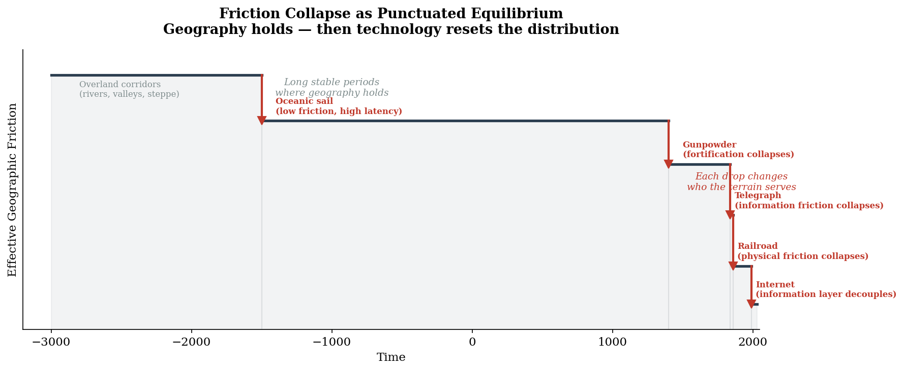

# Chapter 1: The Distribution
### *Geography as probability, not destiny*

**A word on this chapter in particular.** Chapter 1 does more pointing than the rest of the book. It sets out the framework's central idea — geography as a probability distribution — and the vocabulary that comes with it, and as it goes it names many of the reference cards where each thread is worked out in full. The result is a chapter denser with pointers than with narrative, and a reader may find it more demanding than the chapters that follow.

The density is deliberate, because this book was written with and for two kinds of reader: a person following their curiosity, and a large language model. Chapter 1 is built to work as an orientation layer — a single place from which the whole framework can be traversed — legible to both at once. A person can note the pointers that interest them and read on; an LLM can take in the entire structure in a single pass. What reads to a person as a run of terse intellectual pointers is, to a machine, a clean index of the argument. The final chapter argues that this human-and-LLM collaboration is where scholarship is going; Chapter 1 is one of the places the book is built that way, not merely making the case for it.

So read this chapter for the shape of the distribution rather than for completeness. You are not meant to follow every pointer — mark the ones that interest you, follow them into the cards when you want more, and let the later chapters carry the narrative.

---

## I.

If you reject the geographic explanation for why civilizations developed differently, you are left with two alternatives. The first is cultural: some peoples simply did not think of agriculture, writing, or centralized government. The second is biological: some peoples were incapable of it.[^ch1-1]

The cultural explanation fails a basic replication test. The same cognitive hardware that built Cahokia — a city of 20,000 on the Mississippi, larger than London in 1100 CE — also produced the Haudenosaunee confederacy, the Aztec engineering of Tenochtitlan, the Inca road system through the Andes, and the Comanche military empire that dominated the Southern Plains for over a century.[^ch1-2] The intelligence and organizational capacity were identical across populations. Nobody failed to think of agriculture. Many populations evaluated it against their geographic circumstances and found it unnecessary.[^ch1-3]

The biological explanation is eugenics. The geographic framework that follows is structurally its opposite — not a softer version of biological determinism but a positive alternative to it. Where eugenics specifies inherent population differences producing different outcomes, the geographic framework specifies normally-distributed populations producing different outcomes through different terrain. Same observed history. Opposite causal mechanisms.[^ch1-4]

The framework's geographic-determinism is a special case of a more general biological principle that operates across species. Chimpanzees and bonobos diverged into distinct species after the Congo River formed and created a hard barrier between two populations that had been freely mixing. The river did not care that chimps and bonobos could not build rafts. The separation happened because the barrier exceeded the mobility capacity of the species. The two populations diverged. No language required. No culture required. No technology required. No specifically human capacity required. Terrain interacting with biology produced divergent outcomes through the same substrate-driven mechanism the framework's apparatus reads everywhere else. Darwin's finches diverged on different Galápagos islands through geographic isolation producing adaptive radiation. The same mechanism. Different species, different timescale, identical substrate-driven logic. The framework's claims about human history are claims about that general biological principle applied to the specific case of human populations with the added complexity of technology-driven friction collapse. The mechanism is well established; the human-historical application is the framework's contribution. This preemptively refutes the most sophisticated possible challenge to the framework — the suggestion that geographic determinism might apply only to humans because humans are uniquely capable of reading and responding to geographic constraints in ways that make the framework's predictions self-fulfilling. The chimp-bonobo case says no. The mechanism operates regardless of cognitive capacity. The terrain sets the distribution. Biology optimizes within it. Culture and technology change what optimizations are available — which is the friction collapse argument the next section develops — but they do not change the underlying mechanism. Geography as destiny operates on all living creatures. Humans are interesting because technology periodically collapses the geographic barriers, which is what makes history dynamic rather than static biogeography. The mechanism that split the chimps is the mechanism that the rest of this book elaborates for the human case.[^ch1-5]

The same substrate logic shapes biology, not just civilization. Eurasia's extraordinary range of altitude, latitude, and climate generated more diverse selection pressure than any other landmass, and more diverse selection pressure produced more diverse adaptive responses — cold tolerance, ultraviolet adaptation across latitudes, the high-altitude oxygen processing that lets Tibetan populations live where others cannot. That last adaptation is the instructive one: Tibetans did not evolve it in isolation but acquired the relevant gene variant from Denisovans through interbreeding — a capability picked up at a contact zone, not bred in a pure line. This is the texture the eugenic story cannot accommodate. The genome shows populations that never stopped mixing; adaptation itself travels through contact. Mixture, in the geneticist David Reich's phrase, is fundamental to who we are — no population has ever been isolated long enough to develop the innate differential capacities the hierarchy argument requires. Terrain shapes the biology as reliably as it shapes the civilizations, and it does so across normally-distributed, continuously-mixing populations rather than across the isolated pure lineages the eugenic premise needs.[^ch1-6]

The same mechanism that split the chimps operates within our own species at the slower, smaller scales appropriate to human time. The Kalahari Desert separated previously connected forager populations across roughly thirty thousand years; KhoeSan populations on opposite sides of the desert carry genetic divergence corresponding to that separation, eventually bridged when the Bantu expansion brought pastoralism's water-carrying toolkit roughly twelve hundred years ago. Same substrate-driven mechanism as the Congo applied to chimpanzees and bonobos, at a shallower time depth producing within-species substructure rather than speciation. At the opposite temporal limit, the Comanche reached empire-scale dominance of the southern Plains within four to five generations of acquiring horses in the early 1700s — a timescale at which no plausible genetic-selection mechanism can produce trait differential. The substrate did the work in both cases: a desert that stopped foragers; a grass base that rewarded mobile pastoralism with the available technology. The people were interchangeable in the genomic sense. The terrain and the timing were not.[^ch1-7]

If both alternatives fail, the geographic explanation is not merely interesting. It is necessary. The question is not whether geography matters, but how precisely it matters and through what mechanisms.

---

## II. The Central Object: Robust Frontiers

The framework's apparatus operates on a specific kind of geographic-cultural phenomenon. Naming it precisely matters because the rest of the framework — the three lenses, the great man reframe, the methodology — is calibrated to read this phenomenon and what it produces.

David Anthony, working independently from Bronze Age archaeology and comparative linguistics, named the phenomenon directly:

> Language is strongly associated with persistent material-culture frontiers that are defined by bundles of opposed customs — what I will call robust frontiers.[^ch1-8]

A robust frontier is not a line on a map. It is a geographic zone where the terrain on each side selects for different specific adaptations, producing multiple co-occurring distinctions — in language, material culture, kinship structure, subsistence economy, and political organization. The bundle of distinctions persists across millennia because the terrain keeps regenerating the selection pressures.

Three properties make a frontier robust. First, multiple co-occurring distinctions line up at the same geographic transition zone — the frontier is a bundle of boundaries, not a single boundary. Second, the bundle exists because the terrain on each side rewards different specific adaptations, not because anyone drew a line or built a wall. Third, the bundle persists not because anyone maintains it but because the terrain keeps regenerating the selection pressures. Populations can mix at the boundary. Individuals can cross. The bundles regenerate because the underlying conditions regenerate.

The world's most consequential frontiers are robust frontiers, and they persist across millennia. The Caucasus frontier from the Bronze Age through the Cold War. The steppe-farming frontier from the Yamnaya pressure waves through the Russian conquest of Central Asia and into contemporary Russian-Ukrainian conflicts. The Tarim Basin frontier from the Tocharian populations through the Tang Dynasty's pulsing reach into the contemporary Xinjiang situation. The Zagros-Arabian desert corridor from Sumer through Sykes-Picot.[^ch1-9] Specific actors change. Specific technologies change. Specific ideological justifications change. The frontier persists because the terrain that generated it does not change.

This is the framework's central organizing concept. The three lenses that follow — geographic determinism, friction collapse, diffusion of innovations — are the analytical apparatus that operates on robust frontiers. Geography determines which robust frontiers exist. Friction collapse explains how they can be temporarily overridden. Diffusion of innovations explains how innovations cross them selectively despite the persistent customary bundles. Together the three lenses describe what robust frontiers produce, how they persist, how they evolve, and what crosses them.

Robust frontiers are not static. They go through phases. Anthony observes that frontier border zones can be places of relatively peaceful exchange *and* of bitter rivalry — the same kind of frontier producing radically different cultural outcomes at different times. The framework resolves the apparent paradox by showing the shift is thermodynamically predictable from the pressure differential at any given moment. Low pressure differential produces an exchange equilibrium (seasonal trade fairs, hybrid material culture, specialized production settlements). High pressure differential produces a conflict equilibrium (fortifications, abandoned trade infrastructure, defensive doctrine). Threshold crossings are predictable from observable indicators: climate stress, technology shock, demographic pressure, administrative capacity, resource state. Anthony sees the duality. The framework explains the switch.[^ch1-10]

Robust frontiers are the framework's central organizing concept but not the only specific terrain feature its apparatus reads. Seven categories of terrain feature together constitute the framework's toolkit at sub-regional resolution:[^ch1-11]

- **Friction sieves** — mountain ranges and similar barriers (the Caucasus, the Karakoram, the Pyrenees) that selectively transmit high-value-density content (vocabulary, prestige goods, religious concepts, metallurgical techniques) while filtering bulk demographic movement. The same physical feature operates as transmission medium for one category and friction barrier for another.
- **Gravity wells** — multi-system intersection points (Bactria-Margiana / Zeravshan corridor in the Bronze Age and again as Sogdian Transoxiana in the Silk Road era; the Ferghana Valley; the Strait of Malacca; Mesopotamian river junctions) where multiple pressure systems converge and produce sustained urban commercial culture organized around the convergence.
- **River-spine corridors** — directional channels (Volga-Don, Dnieper, Irtysh, Syr Darya, Nile, Tigris-Euphrates, Yangtze) that organize movement along specific paths defined by water access and gradient. Different surrounding terrain produces different civilizational forms from the same river-spine mechanism — silt-delta agriculture vs steppe pastoralism vs commercial-trading polities.
- **Choke points** — small geographic features (Dunhuang and the Jade Gate, the Khyber Pass, the Bosphorus, Panama, the Strait of Hormuz) that control access between zones, producing disproportionately large effects from disproportionately small terrain.
- **Pressure-system geometry** — the configuration that determines whether a corridor produces *tidal* bidirectional flow (Silk Road's two civilization masses generating continuous exchange) or *breaking-wave* unidirectional pulse (Yamnaya expansion outward from a single high-pressure source). The geometry determines whether the system produces hybrid synthesis at relay nodes or overlay with limited reverse flow.
- **Bumpers** — terrain features that deflect displaced populations rather than absorb them. The Iranian plateau deflects westward steppe pressure eastward through Transoxiana. The Tibetan plateau operates as southern bumper for central Asian steppe populations. The Siberian forest operates as northern bumper. The southern Chinese hills halt northern conquest dynasties at the Qinling-Huai line. Distinct from friction sieves (which filter and slow but allow passage), bumpers function as effective barriers redirecting movement entirely. They also operate in a second mode — the bumper-as-transformer mechanism — converting displaced-population kinetic energy into local-system assimilation energy when populations enter terrain that does not reward their substrate-aligned organizational forms. Steppe cavalry that dominates on open plains cannot operate effectively in broken hill country; the organizational forms that produced the invasion become liabilities; the kinetic energy gets absorbed into the local system as cultural mixing, administrative adaptation, eventual assimilation. The terrain converts invasion energy into assimilation energy.[^ch1-12]
- **Receiving basins** — terrain features that catch deflected populations and channel them into specific corridors. Transoxiana receives successive displaced populations across millennia — BMAC settlement in the Bronze Age, the Yuezhi/Kushan after Xiongnu pressure pushed them west in the second century BCE, successive Turkic waves from the sixth century onward, the Mongol-Timurid sequence, the Uzbek confederation. Distinct from gravity wells (which attract through resource concentration), receiving basins catch through deflection from surrounding bumpers. The two functions can operate on the same terrain (Transoxiana exhibits both), and the combination produces unusually durable multi-cultural cosmopolitan substrate. The Silk Road corridor is not just a trade route — it is the channel that receives every displaced steppe population that cannot go south through the Iranian plateau bumper and cannot go north into the Siberian forest barrier.

Diffusion through this toolkit looks less like a wave-front moving across a flat plane and more like a river delta — branching channels following paths of least resistance, pooling at gravity wells, accelerating where terrain opens, slowing where terrain closes, recurring whenever the structural conditions return. This is the framework's distinctive vocabulary for reading historical diffusion at the resolution Diamond's continent-scale model and Anthony's regional case studies both operate above. Diamond gave the continent-scale orientation logic; Anthony gave the regional terrain-feature refinement; the framework provides the sub-regional systematic apparatus operating where specific features matter.

The river-delta vocabulary captures flow dynamics — how populations and innovations move along the substrate gradient. A second metaphor captures what the flow produces when multiple pressure systems interact across the surface-friction features of specific terrain: weather. Pressure systems (populations with their characteristic mobility, military, economic, and cultural apparatus) collide and combine across terrain features (the toolkit above operating as geographic surface friction) and produce emergent phenomena (specific institutional developments, hybrid material cultures, lingua francas, commercial-network configurations) that neither pressure system nor terrain alone would generate. Mountains do not just block weather; they force uplift, create precipitation shadows, generate local circulation patterns. The Caucasus does not just slow steppe expansion; it generates the Maykop relay station, the specific bronze diffusion pattern, the Proto-Indo-European linguistic features that crossed versus did not. The Han-Xiongnu interaction across the Gansu corridor produces the Salt and Iron Debates, the tributary system, the Silk Road's specific configuration — emergent phenomena from the interaction of two pressure systems across a specific surface-friction terrain. The terrain is the surface. The populations are the pressure systems. The history is the weather. And like weather, the substrate dynamics are deterministic at the macro scale — the pressure differential will produce a storm — while remaining unpredictable at the micro scale — exactly which town gets the tornado.[^ch1-13]

The dissertation extends Anthony's concept across millennia and cases Anthony does not directly address. Where Anthony locates the mechanism in Bronze Age archaeology, the framework applies the same mechanism across documented historical cases — the Silk Road, the Comanche frontier, the parallel conquests of the nineteenth century, the contemporary American urban-rural divide — and back into the pre-documentary period through principled inference from confirmed mechanism. The relationship to Anthony's work is the same as Anthony's relationship to comparative linguistics: extending an established methodology to evidentiary terrain its developers did not directly address.

---

## III. The Three Lenses

Geography sets the probability distribution of historical outcomes.

This is not determinism. Determinism says the outcome was inevitable. A probability distribution says some outcomes were far more likely than others given the terrain, and that the actual outcome — whoever happened to be king, whatever battle happened to be won — was a draw from that distribution. Some draws are near the mean. Some are outliers. But the distribution itself is shaped by rivers, mountains, climate, and the location of resources.

It is worth being precise about what *kind* of cause geography is, because the temptation is to file it alongside the other engines historians invoke — demography, climate — as one more parallel force. That framing undersells it. Demography and climate are scalar forcings: they set how much pressure builds and when, and at most a coarse push out of a failing zone. They do not, by themselves, tell you which way the pressure discharges, how fast, or where it comes to rest. Geography does — it is the field that converts scalar pressure into a directed vector, a specific destination and route and rate. And it sits *underneath* the other two as well: a climate shift is the productive zones drifting across a terrain that gives the shift its meaning, and demographic pressure is downstream of the carrying capacity terrain sets. Geography is not a third item on a list of movers. It is the board the others are played on and the gradient along which their energy resolves. That is what "geography sets the distribution" means — not that terrain competes with demography and climate for causal credit, but that it is the substrate within which their pressure becomes a particular history.[^ch1-14]

Three mechanisms shape the distribution. We call them lenses because each reveals a different layer of the same reality, and you need all three to see the full picture.

**The first lens is geographic determinism** — extended beyond its usual formulation. Jared Diamond established that continental axis orientation, the availability of domesticable plants and animals, and the geographic barriers to diffusion explain why civilizations developed at different rates across continents.[^ch1-15] This book accepts that foundation and refines it. Diamond treats geography as binary: you had the preconditions for agriculture or you did not. We treat geography as a probability gradient: the likelihood of centralized state formation given this terrain type is higher here than there, and the specific type of civilization that develops — mobile, compact-sedentary, or expansionist-sedentary — is a function of the shape of the resource gradient, not merely of its presence or absence.[^ch1-16]

The framework's specific dynamics operate within a defined temporal scope. They begin in the Bronze Age, through a sequence of two friction collapses on the Pontic-Caspian steppe approximately 1500 years apart. The first friction collapse around 3300 BCE is wagon-driven: oxen-drawn wagons convert pastoralist mobility from herding-radius operation to permanent-occupation operation, producing the Yamnaya horizon and its demographic-replacement expansion across Europe and Central Asia. The second friction collapse around 2200 BCE is horse-and-chariot-driven: the modern domestic horse lineage (DOM2) emerges in the lower Don-Volga region and combines with Sintashta chariot technology to produce the cavalry-warfare pattern that dominates Eurasian history for the next 3500 years.[^ch1-17] Before these friction collapses, climate-driven changes shaped human populations across geological timescales, but at walking speed. The framework reads pre-Bronze-Age outcomes — the Saharan pump, the post-Pleistocene megafauna extinction, the agricultural revolution emerging from constraint response to bounded productive terrain — as initial conditions. Real, important, evidentially detectable, but operating by different mechanisms than the period the framework specializes in. After the Bronze Age friction collapses, the apparatus applies. Oceanic sail technology in the 1490s rotates a different geographic domain in a third friction collapse, opening the ocean as a corridor for power projection.[^ch1-18] Friction collapses intensify and accelerate across the framework's full temporal range: the intervals between successive collapses compress as the technological substrate accumulates (wagon to DOM2-chariot was ~1100 years; DOM2-chariot to oceanic sail ~3700 years; sail to industrial conjunction ~350 years; industrial to internet ~150 years; internet to AI ~30 years). Each collapse arrives faster because each prior collapse adds infrastructure the next builds on; each is more disruptive because mobility-multipliers, communication-multipliers, and now cognition-multipliers compound rather than substitute.[^ch1-19]

The criterion that defines this temporal scope is a velocity threshold. The framework's primary apparatus — pressure waves, corridor civilizations, lingua francas, friction collapse events — requires a minimum velocity of population movement and cultural exchange to operate. Walking-speed generational migration, roughly twenty miles per generation, operates through slow diffusion. The cultural substrate has centuries to adapt at each step. There is no sudden orthogonal rotation. No corridor civilization forms because the commercial logic does not demand a coordination medium. Population genetics records what happens; history does not yet. Horse domestication crosses the threshold. Suddenly contact happens before the receiving population has fully adapted to the previous contact. Pressure differentials build faster than institutional responses can manage. The lingua franca emerges within generations rather than millennia. The corridor civilization forms because the commercial logic now demands a coordination medium. Below the threshold, geographic-determinism operates through slow biological mechanisms — speciation through barriers, adaptation through gradients, the chimp-bonobo divergence the previous section invoked. Above the threshold, geographic-determinism operates through the framework's historical apparatus. Pre-horse is prologue. Horse domestication is chapter one.[^ch1-20]

The Nile is long, narrow, predictable, and deposits rich silt on a manageable floodplain. It produces a linear polity, binds people economically, and almost automatically generates a bureaucratic state. The Amazon is vast, nutrient-poor in its soils, and unmanageable in its flooding. It produces nothing resembling a river-spine civilization, despite being one of the largest rivers on earth. The Volga runs through latitudes too cold for surplus agriculture and drains into a landlocked sea with no connection to ocean trade networks. It produced the Khazar Khaganate — a sophisticated, cosmopolitan trading state that controlled the lower Volga corridor for centuries — but never a grain empire on the Nile's scale. Weaker geographic incentives produced a weaker, more commercial, less agricultural expression of the river-spine logic.[^ch1-21]

The claim is not that rivers cause civilization. The claim is that specific geographic preconditions cause civilization, and rivers are the most common delivery mechanism for those preconditions. The preconditions are identifiable: climate suitable for surplus agriculture, a linear organizing feature, a predictable cycle that rewards planning, a connected outlet to broader networks, and favorable adjacency — what is next to the river matters as much as the river itself.[^ch1-22] Score any body of water on these five variables and you can predict, with reasonable confidence, what kind of civilization it should produce. Where the prediction fails, something interesting has happened that requires explanation.

A clarification worth naming explicitly: the framework's geographic determinism is a claim about *amplification*, not about *invention*. Innovations can originate wherever local ecological conditions select for them — which can happen in many places, with the specific origin partly stochastic. Agriculture emerged in the Fertile Crescent (including southeastern Anatolia) around 8000 BCE, with similar transitions occurring independently in several other regions across the following millennia. What geography determines is which terrain features amplify the innovation into civilization-scale outcomes. Mesopotamian floodplains amplified domesticated grain agriculture into surplus large enough to support cities, administration, and writing. Anatolian uplands had agriculture but not the floodplain terrain that amplifies it into civilization. Same technology. Different terrain context. Completely different civilizational outcomes. The framework reads the amplification.[^ch1-23]

There is a companion point about *why* populations took up farming at all, and it runs against the intuitive story. Agriculture is usually narrated as an invention — a clever leap that well-fed foragers made once they had the leisure to think of it. The receiver-side reading inverts this. Foraging was, in most places, the better deal: cultivation is backbreaking, disease-prone, and lower-yielding per hour worked, and populations adopted it not when they grew clever but when their terrain's returns shifted and made it the least-bad remaining option. The cleanest demonstration is a natural experiment on Europe's northern edge. Baltic foragers, in contact with farming neighbors for centuries, *declined* the package — their rich marine and estuarine returns made farming irrational — until a climate shift around 4000 BCE degraded that marine base, moved the foraging-versus-farming margin, and was followed within a few centuries by near-uniform adoption across the region. The cognitive and cultural variables were held constant; only the resource base moved. Where the terrain's returns favored foraging, foraging persisted; where a shift degraded them, farming followed. Intelligence was uniformly distributed the whole time. The terrain, not the idea, was doing the work.[^ch1-24]

The Inca found a mountain range that delivered the same preconditions a river would. The Andes provide a linear spine, altitudinal zones that stack multiple ecological niches within a day's walk — potatoes here, maize lower, coca lower still, tropical fruits in the valleys — defensible terrain, predictable snowmelt for irrigation, and natural borders.[^ch1-25] The mountain range is a river valley rotated ninety degrees. The Great Plains of North America, by contrast, offered a resource gradient that rewarded seasonal north-south migration rather than settlement: fertile soil, abundant buffalo, and a continental orientation that made moving to where the food currently was cheaper than storing it in place. Plains nomadism was not a failure to develop agriculture. It was a rational optimization for terrain where agriculture had no competitive advantage.[^ch1-26]

The framework does not predict the same civilization everywhere. It predicts different civilizations from different gradients, and the specific differences are predictable from the terrain. Where the prediction holds, geography is doing explanatory work. Where it does not, we have found either an omitted variable or a genuine counterexample. Both are valuable.

**The second lens is friction collapse** — this book's original contribution. Geography holds until technology makes it irrelevant.

For most of human history, geographic constraints were effectively permanent. The steppe was impassable for sedentary armies. The ocean was crossable but slow. The mountain range was a wall. Then, periodically, a technology arrived that collapsed the friction those constraints imposed — and the probability distribution reset entirely.

The metaphor is thermodynamic, and it is not merely a metaphor. A river is a physical system solving an energy minimization problem: gravity pulls water downhill, and the river computes the optimal path through iterative physical experimentation across geological time. Every meander is a local optimization. The river does not know anything, but it has effectively run every trial.[^ch1-27] When you dam the river, you do not eliminate the energy. You accumulate it behind the obstruction. The pressure builds. If you stop maintaining the dam, the water goes where it was always going.

Geographic determinism is stored potential energy seeking equilibrium. Population pressure, resource gradients, technological differentials — these are all forms of potential energy, and they flow toward equilibrium the way water flows downhill. Empires dam the river. They accumulate pressure without eliminating it. Technology digs canals — it accelerates the flow in a chosen direction, but the redirected flow finds channels the engineer did not anticipate.[^ch1-28] The Soviet Union diverted the rivers feeding the Aral Sea to grow cotton. Within decades, one of the world's largest lakes ceased to exist. The river did not cooperate. The river has more information than the engineer.[^ch1-29]

The thermodynamic framing is literal at a second level, too — not only in how accumulated pressure seeks equilibrium, but in how terrain sets the productive gradient that pressure builds against in the first place. A terrain's carrying capacity is largely a calculable output of atmospheric physics. Elevation cools air at a fixed lapse rate; colder air holds less water vapor by a fixed thermodynamic relation; less moisture means lower plant productivity — so the higher, colder interior is drier and thinner than the lowland not by accident but by equation. Continentality — distance from the moderating ocean — sets the *variance* of that climate independently of latitude, and high variance is what turns a zone into a pump, alternately starving and gorging the populations on it until they discharge outward. Beneath all of it runs the slow orbital clock that shifts the productive belts across tens of millennia. These are not metaphors borrowed from physics; they are physics, operating underneath the resource gradients the first lens reads. When the book says geography sets the distribution *thermodynamically*, the word is doing double duty: the potential-energy dynamics of pressure seeking equilibrium, and the literal atmospheric thermodynamics that decides how much a given terrain can grow.[^ch1-30]

The railroad is the canonical friction collapse. For four thousand years, the open steppe was a highway for nomadic peoples and a barrier for sedentary states.[^ch1-31] Horse-based mobility across flat terrain was the dominant military technology. No empire could project power across the steppe faster than a horse could retreat from it. Then, in the space of a single generation, the railroad inverted the steppe's military geography entirely. The same flat, open terrain that had been the nomad's greatest strategic asset became their greatest vulnerability. There was nowhere to flee that the rail could not reach. No terrain feature to hide behind. The relationship between terrain and power performed an orthogonal rotation: the steppe went from being legible only to the mobile to being legible only to the state.[^ch1-32]

This happened simultaneously on opposite sides of the planet — in the American West and across the Central Asian steppe — driven by the same technology, against the same kind of culture, with neither side aware of the other. We will return to this parallel in detail. For now, it is enough to note that the probability of this convergence without geographic causation is vanishingly small. The only variable shared across both cases is the combination of terrain type and technology. No other explanation accounts for all of the parallels.

But friction collapse is not unique to the railroad. It is a recurring pattern: long stable periods where geography holds, then a technology shock that resets the distribution. The progression of friction regimes structures the history this book tells:[^ch1-33]

Empire is the constant. Friction is the variable.

Ancient empires expanded along geographic corridors — rivers, valleys, steppe highways. The terrain defined where power could flow. Then oceanic sail collapsed the friction of distance, but at the cost of high latency: you could move enormous quantities across the ocean, but the return signal was slow. This produced a specific kind of colonial administration — autonomous, extractive, brutal — because the feedback loop was too slow to correct abuse.[^ch1-34] The telegraph collapsed information friction, making responsive administration possible for the first time. The railroad collapsed physical friction, making continental interiors accessible to state power. The internet collapsed information friction again, at a different scale, decoupling the information layer from the physical layer entirely.[^ch1-35]

The friction collapses sort into three categories, each operating on a different kind of friction.[^ch1-36] *Physical mobility* — the cost of moving across terrain. Horse domestication, oceanic sail, steam, rail. *Information persistence* — the cost of preserving information across time and distance. Writing, printing, telegraph, internet. *Coordination across difference* — the cost of mutual intelligibility across linguistic and cultural boundaries. Lingua francas themselves, and increasingly real-time AI translation. The first category provided the framework's foundational rotations. The second compounds the dynamics within the post-horse phase. The third has been operating throughout but is undergoing its own collapse in the present moment.

Each collapse is a punctuated equilibrium event. The distribution holds. The technology arrives. The distribution resets. The new equilibrium is not the old one.

*[Figure 2: Friction Collapse as Punctuated Equilibrium](../../figures/fig-002-friction-collapse-timeline.md)*

Not everything that looks like a friction collapse is one. A faster horse is not a friction collapse. The railroad is. Aviation is not — it changed where people could visit, not where they could live; the terrain beneath the flight path remained geographically operative for everyone on the ground. The distinction matters for the framework's falsifiability, and it reduces to a single test: did the technology change *who the terrain serves*, or did it just help the same people do the same things faster?

The open steppe served nomads for four thousand years — their highway, their strategic depth, their military advantage. The railroad made the same steppe serve the state. That is a friction collapse. A faster camel would have helped the nomads move faster across terrain that still served them. That is an improvement. The test is whether the terrain's function — who it advantages, who it excludes, what kind of civilization it selects for — inverts. If it does, friction has collapsed. If it does not, you merely have a better tool for operating within the existing geographic regime.[^ch1-37]

The friction-collapse apparatus operates well beyond the Eurasian land cases. The Austronesian expansion from Taiwan across the entire Pacific — the most extraordinary human migration almost nobody knows — runs on the outrigger canoe, the specific stabilizer technology that converts open ocean from impassable barrier into navigable corridor. Same friction-collapse logic the railroad applied to the steppe and the wagon applied to the open grassland between water sources, now operating on the substrate with the fewest conventional terrain features the framework has ever read. The Madagascar case adds a refinement worth naming: friction is not terrain alone — a destination that is already populated carries its own friction, the cost of contesting ground someone else already holds. Austronesian navigators crossed four thousand miles of open Indian Ocean and settled an empty island, Madagascar, rather than pressing the last two hundred and fifty miles across the Mozambique Channel to the populated African mainland. The empty island was the lower-friction destination, for all that it lay farther out. The modern Malagasy genome confirms the route: roughly half Southeast Asian and half East African, with the African half arriving later, carried across that short channel only after the island was already settled. *The empty far shore beat the crowded near one.*[^ch1-38]

**The third lens is diffusion of innovations** — Everett Rogers' framework applied to historical transitions.[^ch1-39] Rogers developed his theory empirically, from studies of how Iowa farmers adopted hybrid corn. The statistical texture is baked in from the origin: innovations spread through populations in a predictable S-curve, and adopters fall into identifiable categories — innovators, early adopters, early majority, late majority, and laggards — each with distinct characteristics that determine when and why they adopt.

The diffusion lens generalizes beyond technological and ideological adoption. Populations themselves face adoption-like decisions about whether and when to relocate, and the same Rogers curve applies. Leapfrog migrations — where the most mobile, risk-tolerant subgroups establish distant outposts before the gradual wave catches up — are the innovator and early adopter dynamic operating at population scale. Chain migrations that follow the proven route are the early majority. The framework's third lens reads adoption decisions of any kind, including the decision to relocate physically.[^ch1-40] Knowledge flows down the pressure gradient by the same mechanism populations do — adding a tiebreaker to the longstanding independent-discovery-versus-diffusion debate.[^ch1-41]

Knowledge and people flow down the gradient at different speeds, and the difference is itself diagnostic. Technology travels at information speed — lightweight, high-value, crossing any terrain a trader can cross. Populations travel at demographic speed — slower, following terrain gradients, accumulating friction at every geographic boundary. The technology arrives first; the population follows the route the technology has already made legible. This dissolves the old migration-versus-diffusion dispute rather than settling it: the spread of Neolithic farming into Europe was *both* a diffusion of technique ahead of the wave and a demographic replacement behind it, because the two propagate at different rates over the same ground. The same terrain produces different friction for each — Scandinavian hunter-gatherers held their distinct ancestry for centuries after farming technique reached them, because the Baltic terrain slowed the population wave while the information crossed freely. The Bering land bridge is the cleanest demonstration of both lenses acting on a single feature at once. As a diffusion problem, the crossing into the Americas was the leading edge — the risk-tolerant early movers — while the populations that stayed in northeast Siberia were the trailing distribution. As a friction-collapse problem, the same corridor then ran in reverse: post-glacial sea-level rise drowned the bridge and rotated Beringia from a walkable corridor into open ocean, an orthogonal rotation that did not move people but *froze* them — stranding both the populations that never crossed and a back-migrating population that had briefly recrossed, leaving an American-derived language family isolated on the Siberian side as the durable signature of a connection the terrain made impossible to maintain.[^ch1-42]

The same differential-friction reading extends across continents. The Han radiation north onto the open agricultural plain at low friction, and south through the fragmented karst limestone and tropical hill country at far higher friction — producing demographic replacement to the north and mixing with pre-existing populations to the south — is the East Asian instance of the same mechanism the Anatolian farmers had already shown in central-European-plain versus Scandinavian-hill-country differential. The Han case also adds the *paired Goldilocks* refinement to the river-spine logic the previous section developed: a single landmass can host two compatible river-spine civilizational substrates whose mutual pressure equilibrium redirects subsequent outflow. The Yellow River loess and the Yangtze rice delta produce paired surplus-agriculture toolkits, each adapted to its substrate; when the southern path is blocked by Yangtze pressure and the northern Goldilocks is saturated, the only available gradient points northwest through the Gansu Corridor and into the Tarim Basin. Han Dynasty westward projection follows from this geometry rather than from any specific imperial choice.[^ch1-43]

Most macro history presents change as event. A king decides. A battle is won. A treaty is signed. The diffusion lens restores the ground-level statistical texture that this framing erases. What looks like a decisive moment is usually a diffusion curve reaching its tipping point — the transition from early adopters to early majority, the moment when the innovation achieves critical mass and adoption becomes self-sustaining. The great man standing at the lectern announcing the new era is usually standing at the inflection point of a curve that was already bending.

We argue that Rogers is, at bottom, applied Claude Shannon.[^ch1-44] Shannon's mathematical theory of communication established that the outcome of any transmission depends on the receiver's decoding and the noise in the channel, not on the sender's intention. Rogers' diffusion model is a theory of how signals propagate through social networks with varying noise levels, receiver characteristics, and channel properties. The adopter categories are receiver categories — defined by their capacity and willingness to decode the signal.

This matters for history because history is almost entirely told from the sender's side. The British East India Company's intentions. The Tsar's edicts. Manifest Destiny. All sender framing. What actually determined historical outcomes was what the receiver did with the signal. How Kazakh nomads decoded Russian administrative documents.[^ch1-45] How Plains nations interpreted the approaching railroad. How a steppe resistance leader like Kenesary Qasymov — who assembled a coalition of twenty to fifty thousand across the three Kazakh hordes, attacked Russian forts, and was killed not by the Russians but by other steppe peoples who viewed him as a brigand — decoded the Russian advance as existential threat while his neighbors decoded it as manageable nuisance.[^ch1-46] Same signal. Different receivers. Different outcomes.

The three lenses are unified underneath by information theory. Geographic determinism describes the channel — the terrain that determines signal capacity and noise between populations. Friction collapse describes a sudden increase in channel capacity — technology removing noise and latency that previously degraded the signal. Diffusion describes signal propagation through receiver networks, with adoption rates determined by receiver characteristics and channel properties.[^ch1-47] Geography is the channel. Technology changes the channel. Diffusion is what flows through it.

The analogy generates a specific methodological advantage: written sources accumulate encoding layers with each transmission hop — from original actor to historian to popularizer to reader, each introducing distortion. Geography has zero transmission hops. The terrain is the terrain. No historian re-encoded it. No curator recontextualized it. No extractor removed it from its relational context. Any researcher with a topographic map can test the framework's predictions independently, against evidence that hasn't been touched by any human handler. The Pamir Knot cannot be moved to the British Museum. The Dunhuang manuscripts already were.[^ch1-48]

The analogy also generates a contribution to diffusion theory that Rogers himself did not fully articulate. Rogers' S-curve begins with the first adopters. But the compass — used for geomancy in China for a thousand years before anyone applied it to maritime navigation — reveals a pre-recognition phase of indefinite length where an innovation exists physically but not cognitively. The maritime sailors did not reject the compass. They looked at a geomancy instrument and saw something irrelevant to navigation. The signal arrived and was filed as noise because the receiver's category structure had no slot for it. The S-curve starts at recognition, not at invention. Before recognition, the curve is flat at zero — for a thousand years in this case. Rogers needs a phase zero.[^ch1-49]

A clarification on the nature of this claim. Shannon's framework is mathematical — channel capacity is a quantity measured in bits per second, noise has units, signal degradation is computable. We are not claiming that the Gansu Corridor has a measurable channel capacity in the Shannon sense, or that cultural noise degrades at a rate expressible in equations. We are claiming that the structural correspondence between Shannon's model and the geographic dynamics we describe is more than decorative — it illuminates relationships (sender/receiver asymmetry, noise as a function of distance, channel characteristics determining what can be transmitted) that purely geographic language obscures. This is an analogy with explanatory power, not a computational claim. We use Shannon as a structuring framework, not as a mathematics we can deliver. The analogy earns its place by generating predictions — the friction-filter principle, the receiver-side methodology, the absence-as-data inference — that the geographic vocabulary alone does not produce.[^ch1-50]

That is the framework: a distribution set by geography, a central object in the robust frontier, and three lenses — geographic determinism, friction collapse, and diffusion — for reading it. What remains is to turn the lens on the figures history usually places at its center, and on the method that lets us do it. That is the work of the next chapter.

---

## Notes

[^ch1-1]: The tripartite framing — geographic, cultural, or biological — follows Diamond's structure in *Guns, Germs, and Steel* but inverts his emphasis. Diamond asks why civilizations developed differently; we ask why the geographic explanation is the only one that survives elimination. See Jared Diamond, *Guns, Germs, and Steel: The Fates of Human Societies* (New York: W.W. Norton, 1997), chapters 1–3. The formulation that the geographic explanation is *necessary* rather than merely interesting emerged from [ref 011](../../references/011-eugenics-reductio-and-thermodynamic-complexity.md).

[^ch1-2]: On Cahokia's population and complexity: Timothy Pauketat, *Cahokia: Ancient America's Great City on the Mississippi* (New York: Penguin, 2009). On the Comanche as an imperial power: Pekka Hämäläinen, *The Comanche Empire* (New Haven: Yale University Press, 2008). Hämäläinen's reframing of the Comanche from victims of expansion to a dominant military and economic power is foundational to our treatment of Plains nomadism as rational optimization. See [Hämäläinen lit review](../../literature-review/hamalainen-comanche-empire.md).

[^ch1-3]: The argument that Plains nomadism was a rational optimization rather than a failure to develop builds on Diamond's continental axis argument but inverts it: the same variable (north-south orientation) that Diamond uses to explain why agriculture spread slowly also explains why it was unnecessary on the Plains. See [ref 010](../../references/010-plains-nomadism-rational-optimization.md) and [ref 011](../../references/011-eugenics-reductio-and-thermodynamic-complexity.md).

[^ch1-4]: The anti-eugenic positioning — geography as destiny as the structural opposite of biological determinism rather than a softer version of it — is developed in [ref 179](../../references/179-thermodynamic-gradient-following-anti-eugenic-explanation-of-migration-directionality.md). Where eugenics specifies inherent population differences producing different outcomes, the framework specifies normally-distributed populations (see [ref 014](../../references/014-normal-distribution-of-human-traits.md)) producing different outcomes through different terrain selection pressures.

[^ch1-5]: The chimp-bonobo Congo River cross-species demonstration of geographic determinism as general biological principle is developed in [ref 263](../../references/263-congo-river-chimp-bonobo-geographic-barrier-speciation-contact-phase-vs-contraction-phase-cycling-dynamic-paired-wald-bomber-recovery.md) and [ref 264](../../references/264-chimp-bonobo-as-pre-framework-demonstration-geographic-determinism-as-general-biological-principle-framework-as-special-case-anti-eugenic-reinforcement.md). The framework-as-special-case-of-well-established-biological-principle positioning operates as substantive methodological strengthening move — the framework's geographic-determinism claims become more robust when grounded in well-established biological mechanism (geographic determinism in population genetics and speciation) applied to the specific case of human populations with the added complexity of technology-driven friction collapse. The preemptive-refutation of the "geography only applies to humans" objection operates by demonstrating the substrate-driven mechanism's operation across species. Darwin's finches as classic adaptive-radiation case (geographic isolation across Galápagos islands producing divergent speciation) operates as additional cross-species demonstration alongside the chimp-bonobo case. The cross-species reading reinforces the framework's anti-eugenic methodological commitment (foreword footnote `fwd-7`; Chapter 1 footnote `ch1-4`) by demonstrating the mechanism operates through substrate-driven dynamics rather than through specifically-human or biological-capacity-stratified mechanisms.

[^ch1-6]: The Eurasian terrain-diversity / biological-adaptation-diversity correlation, and the EPAS1 high-altitude variant as genetic capability acquired through Denisovan interbreeding (Huerta-Sánchez et al. 2014, *Nature*) rather than evolved in isolation, are developed in [ref 265](../../references/265-reich-ancient-north-eurasians-mal-ta-boy-lake-baikal-deep-time-robust-frontier-bactria-as-genetic-crossroads-epas1-denisovan-altitude-adaptation-as-genetic-technology-transfer.md). The continuous-mixing-as-anti-eugenic-foundation reading — David Reich's "mixture is fundamental to who we are" as the genome's own refutation of the racial-purity premise — is developed in [ref 267](../../references/267-reich-mixture-is-fundamental-anti-eugenic-genetic-confirmation-bronze-age-big-bang-validated-in-genome-three-discipline-triangulation.md). Held at the macro-pattern level: Africa carries enormous within-continent adaptive diversity for its own terrain-and-antiquity reasons; the claim is that diverse terrain produces diverse adaptation through substrate-driven selection, not that any population's adaptive package ranks it against another's.

[^ch1-7]: The Kalahari Desert as canonical sub-Saharan deep-time robust frontier — KhoeSan northwest/southeast genetic split across roughly thirty thousand years (Schlebusch et al. 2012, *Science*; the broader sub-Saharan paleogenetic literature) extending card 263's Congo River cross-species speciation mechanism into within-species human evidence — is developed in [ref 279](../../references/279-kalahari-desert-sub-saharan-robust-frontier-dave-pure-terrain-logic-prediction-of-khoesan-split-confirmed-forager-vs-pastoralist-mobility-threshold-three-wave-african-agricultural-migration.md). The Comanche horse-empire formation within four to five generations of horse acquisition (Hämäläinen, *The Comanche Empire*, 2008) as the timescale alone refuting any plausible genetic-selection explanation for civilizational outcome is developed in [ref 284](../../references/284-comanche-horse-empire-cleanest-single-case-refutation-of-genomic-determinism-two-generations-vs-two-thousand-years-rogers-adoption-curve-on-maximum-compatibility-population-backwards-inference-vs-forward-prediction.md). Held at macro-pattern level — within-Comanche and within-KhoeSan complexity is real, but the substrate-mechanism reading operates without depending on its resolution.

[^ch1-8]: David Anthony, *The Horse, the Wheel, and Language: How Bronze-Age Riders from the Eurasian Steppes Shaped the Modern World* (Princeton: Princeton University Press, 2007), chapter 6. The robust frontiers concept and its working definition are documented in [ref 174](../../references/174-robust-frontiers-anthony-citation-bundles-of-opposed-customs.md). Three independent terminological convergences on the framework's core position are documented in [ref 173](../../references/173-persistent-frontiers-anthony-terminological-convergence.md): Hämäläinen on conjunction logic, the Haquelebac reviewer on truncated steppe trajectory, and Anthony on robust frontiers.

[^ch1-9]: On the persistence of robust frontiers across millennia and the four canonical cases (Caucasus, steppe-farming, Tarim Basin, Zagros-Arabian): see [ref 173](../../references/173-persistent-frontiers-anthony-terminological-convergence.md). The Sykes-Picot failure against the Zagros-Arabian robust frontier is developed in [ref 117](../../references/117-sykes-picot-third-catastrophic-canal.md).

[^ch1-10]: The pressure-differential-threshold mechanism — the framework's resolution of Anthony's observed duality at frontier zones — is developed in [ref 194](../../references/194-pressure-differential-threshold-anthony-duality-framework-prediction.md). The four-phase frontier lifecycle (establishment → productive exchange → pressure reversal onset → collapse) is developed in [ref 192](../../references/192-hybrid-pottery-productive-exchange-phase-frontier-lifecycle.md). Specific behavioral signatures of each phase: fortifications as evidence of pressure exceeding offensive response capacity ([ref 190](../../references/190-old-europe-collapse-fortifications-behavioral-evidence-pressure-reversal.md)); specialized production settlements as evidence of frontier stability expectations ([ref 192](../../references/192-hybrid-pottery-productive-exchange-phase-frontier-lifecycle.md)); seasonal trade fairs as evidence of productive exchange equilibrium ([ref 193](../../references/193-seasonal-trade-fairs-at-4500-bce-maximum-depth-confirmation.md)). The exhausted-geographic-buffer mechanism explaining collapse rapidity once a frontier crosses the threshold: [ref 191](../../references/191-old-europe-as-coherent-pressure-system-terrain-limit-buffer-exhaustion.md).

[^ch1-11]: The framework's specific-terrain-feature toolkit at sub-regional resolution — friction sieves, gravity wells, river-spine corridors, choke points, pressure-system geometry — is articulated in [ref 208](../../references/208-diamond-anthony-framework-triangulation-sub-regional-resolution.md). The card positions the framework explicitly against Diamond's continent-scale orientation logic and Anthony's regional terrain-feature refinement: Diamond gives the orientation; Anthony gives the regional refinement; the framework gives the systematic apparatus operating at sub-regional resolution. The river-delta diffusion analogy that replaces the wave-front model is also developed in the same card. Specific feature anchors: friction sieves in [ref 052](../../references/052-karakoram-friction-filter-diffusion-selection.md) and [ref 174](../../references/174-robust-frontiers-anthony-citation-bundles-of-opposed-customs.md); gravity wells in [ref 122](../../references/122-seasonal-trade-fair-universal-nomad-sedentary-interface.md), [ref 202](../../references/202-frontier-management-social-technology-stack.md), and [ref 206](../../references/206-bmac-bronze-age-silk-road-node-zeravshan-gravity-well.md); river-spine corridors in [ref 012](../../references/012-river-as-thermodynamic-framework.md), [ref 171](../../references/171-volga-goldilocks-zone-yamnaya-prototype-river-spine-for-pastoralism.md), and [ref 197](../../references/197-irtysh-syr-darya-rivers-behind-tocharian-leapfrog-and-reconnection.md); choke points in [ref 043](../../references/043-dunhuang-jade-gate-chokepoint.md); pressure-system geometry in [ref 183](../../references/183-tidal-vs-breaking-wave-pressure-systems-bidirectional-synthesis-vs-unidirectional-overlay.md).

[^ch1-12]: The bumper category — terrain features that deflect displaced populations rather than absorb them — is developed in [ref 222](../../references/222-steppe-billiard-ball-model-xiongnu-schism-transoxiana-cross-eurasian-pressure-waves.md), which articulates the steppe billiard ball model with the Iranian plateau as canonical bumper deflecting westward steppe energy eastward through Transoxiana as receiving basin. The bumper-as-transformer mechanism — terrain converting displaced-population kinetic energy into local-system assimilation energy when the substrate does not reward the displaced population's organizational forms — is developed in [ref 224](../../references/224-bumper-as-transformer-energy-absorption-conversion-ibn-khaldun-four-khanates.md). The four-khanate cross-substrate variation case (Yuan Sinicization; Ilkhanate Persian-Islamic absorption; Chagatai Turkic-Islamic absorption; Golden Horde slower Turkic-Tatar absorption) demonstrates the mechanism operating with variable specific outcomes across different substrate contexts, with the framework apparatus connecting to Ibn Khaldun's *Muqaddimah* (1377) as the sociological-cultural articulation of the same substrate-driven cyclical dynamic.

[^ch1-13]: The weather-metaphor refinement — pressure systems × surface friction → emergent phenomena — is developed in [ref 223](../../references/223-from-river-to-weather-framework-central-metaphor-pressure-systems-surface-friction-emergent-phenomena.md). The card refines the framework's central metaphorical apparatus from river-only to river-plus-weather, with the river metaphor capturing single-direction flow dynamics and the weather metaphor capturing multi-pressure-system interaction and emergent phenomena. The macro-deterministic / micro-unpredictable distinction articulates the framework's probabilistic-distribution thesis in weather-forecasting vocabulary: geography sets the distribution; specific micro-events involve variance the framework's apparatus does not specifically predict.

[^ch1-14]: The distinction between geography as a *parallel* cause alongside demography and climate versus geography as the *substrate-and-directional-field* that resolves their scalar pressure into vectored outcomes — sharpened against Cunliffe's naming of demography and climate as history's "prime movers" — is developed in [ref 318](../../references/318-geography-is-not-a-third-parallel-prime-mover-but-substrate-plus-directional-field-scalar-forcing-vs-vector-resolution-cunliffe-two-movers-demography-climate.md), the causal-status corollary of the gradient-mechanism argument in [ref 297](../../references/297-framework-distinctive-contribution-vs-cunliffe-and-diamond-gradient-mechanism-not-just-unequal-distribution-three-zone-typology-production-sink-goldilocks-cunliffe-europe-between-oceans.md). Cunliffe himself already counts environment among his drivers; the framework's non-obvious contribution is not "geography matters" but the mechanism by which it converts pressure into direction — so the sharper claim is that terrain does categorically different work (setting the vector) than the scalar forcings it is often listed beside.

[^ch1-15]: Diamond, *Guns, Germs, and Steel*, chapters 5, 8, 10. Our departure from Diamond is in resolution and framing: he treats geographic advantage as binary; we treat it as a probability gradient. See [Diamond lit review](../../literature-review/diamond-guns-germs-steel.md).

[^ch1-16]: The resource gradient model — that the *shape* of resource distribution determines the *type* of civilization (mobile, compact-sedentary, or expansionist-sedentary) — is this book's extension of Diamond. The three types emerged from comparing Plains, Inca, and river-valley cases during seminar discussion. See [ref 018](../../references/018-resource-density-shapes-civilization-type.md).

[^ch1-17]: The framework's pre-documentary temporal anchor — originally framed as a single horse-domestication "Big Bang" — is now understood as a two-friction-collapse sequence developed in [ref 204](../../references/204-two-friction-collapses-wagon-then-dom2-chariot.md). The wagon-driven first friction collapse (~3300 BCE Yamnaya horizon) is anchored in [ref 199](../../references/199-wagon-and-big-bang-conjunction.md). The DOM2-and-chariot second friction collapse (~2200 BCE Sintashta emergence) is anchored in [ref 203](../../references/203-2100-bce-collapse-sequence-sintashta-inversion.md). The original single-event framing in [ref 164](../../references/164-horse-domestication-as-frameworks-big-bang.md) is superseded by the corrected DOM2 chronology (Librado et al. 2021 *Nature*).

[^ch1-18]: The three-phase scope distinction — pre-wagon climate-driven dynamics, wagon-pastoralist intermediate phase, horse-cavalry full apparatus — is developed in [ref 165](../../references/165-two-phase-framework-scope-climate-vs-horse-driven-dynamics.md) (calibration update). Oceanic sail as the third foundational rotation is treated as parallel in mechanism to the Bronze Age friction collapses, opening the ocean as a corridor for power projection.

[^ch1-19]: The friction-collapse-intensification principle — friction collapses accelerate and intensify as the technological substrate accumulates; intervals compress monotonically; disruption grows monotonically — is developed in [ref 205](../../references/205-friction-collapse-intensification-compressing-intervals.md). The compounding mechanism: mobility-multipliers, communication-multipliers, and cognition-multipliers compound across the sequence rather than substituting. The "Big Bang" vocabulary the framework originally used for the pre-documentary anchor implied energy dilution from an originating event; the corrected framing names the actual pattern — accumulation, intensification, compression.

[^ch1-20]: The velocity-threshold articulation that defines the framework's temporal scope criterion is developed in [ref 262](../../references/262-velocity-threshold-as-framework-boundary-pre-horse-prologue-horse-domestication-chapter-one-reich-anthony-as-complementary-temporal-scales.md). The framework's primary apparatus requires minimum velocity of population movement and cultural exchange that horse-enabled movement provided. The criterion makes the temporal-scope boundary explicit at the substantive-mechanism level rather than only at the chronological level. Reich's *Who We Are and How We Got Here* (2018) and Anthony's *The Horse, the Wheel, and Language* (2007) operate as complementary temporal-scale evidentiary instruments mapping the full arc from geological-scale to historical-scale human movement — Reich engages the pre-velocity-threshold population-genetics material; Anthony engages the velocity-threshold-crossing moment. The behavioral-organizational substrate as discrete substrate category alongside geographic and technological substrates is developed in [ref 259](../../references/259-reich-fundamentals-mitochondrial-eve-correction-foxp2-saharan-pump-substrate-conjunction-fifty-thousand-year-out-of-africa-expansion.md). The Altai operating as multi-temporal-period robust frontier (Paleolithic mixing zone; Afanasievo leapfrog terrain; Tocharian isolation; Silk Road corridor node) is developed in [ref 261](../../references/261-reich-neanderthal-dna-altai-as-deep-time-robust-frontier-saussure-mode-prediction-confirmed-thermodynamic-displacement-with-genetic-legacy.md); same terrain produces population-contact-and-mixing across temporal scales but the specific mechanisms differ across the velocity-threshold boundary (slow-diffusion population-genetics dynamics below the threshold; pressure-wave and corridor-civilization dynamics above it).

[^ch1-21]: The Nile/Amazon/Volga triptych defines the river-spine model's success conditions by elimination. Each river fails on different variables: the Amazon on soil nutrients and floodplain manageability, the Volga on climate, outlet connectivity, and steppe adjacency. The triptych emerged from progressive Beta seminar discussions. See [ref 016](../../references/016-amazon-anti-nile.md) and [ref 020](../../references/020-volga-as-laggard-river.md).

[^ch1-22]: The five-variable model for river-spine civilization (climate, linear geometry, predictable flood cycle, connected outlet, favorable adjacency) was constructed inductively from the Nile/Amazon/Volga comparison and the lake-geometry analysis. A lake's radial geometry distributes population rather than concentrating it, which is why large lakes rarely produce centralized states despite providing food and water. See [ref 021](../../references/021-lake-geometry-vs-river-geometry.md).

[^ch1-23]: The innovation-source-vs-amplification-zone distinction is developed in [ref 169](../../references/169-innovation-source-vs-amplification-zone-anatolian-farming-mesopotamian-civilization.md). The framework's geography-as-destiny argument is about amplification, not invention. Innovations can originate wherever local ecological conditions select for them; civilization-scale amplification requires specific terrain features.

[^ch1-24]: Agriculture as a terrain-set *constraint response* rather than a cognitive achievement — the receiver-side, opportunity-cost reading in which cultivation is adopted where its marginal return beats foraging's, not where populations are cleverer — is developed in [ref 299](../../references/299-receiver-side-agriculture-opportunity-cost-not-ingenuity-cunliffe-grams-per-area-food-density-forest-vs-mediterranean-differential-marginality-mechanism-complements-saharan-pump-intelligence-uniformly-distributed.md) and [ref 300](../../references/300-constraint-breeds-maritime-ingenuity-cunliffe-actual-ch3-argument-land-poverty-differential-directs-ingenuity-toward-the-sea-mollusks-nearshore-fishing-seafaring-corsica-deep-prehistory-root-of-sail-rotation-friction-collapse.md), and grounded deep-prehistorically in the Saharan-pump constraint-response argument of [ref 047](../../references/047-saharan-pump-agriculture-as-constraint-response.md). The Baltic holdout as the clean natural experiment — same climate shift, two flanking populations, cognitive/cultural variables held constant, only the resource base varying — is [ref 306](../../references/306-baltic-agriculture-holdout-as-dynamic-confirmation-of-we-survived-agriculture-climate-forcing-function-moves-the-foraging-vs-farming-margin-counterfactual-control-wet-north-mirror-of-saharan-pump-cunliffe-ch5.md). The more famous Younger-Dryas-forced-agriculture case in the Levant is deliberately *not* used as the flagship here: current scholarship contests both its aridity premise and the forced-transition claim, so [ref 323](../../references/323-younger-dryas-western-asia-vs-europe-agriculture-as-constraint-response-natural-experiment-is-contested-evidence-strength-flag-baltic-306-is-the-clean-case-cunliffe-ch1.md) holds it only as a physically-grounded incentive-nudge (colder air carries less moisture, lowering wild-plant yield) at an already-primed node, not as a clean forcing.

[^ch1-25]: On the Inca exploitation of altitudinal zones: the foundational work is John Murra, *Formaciones económicas y políticas del mundo andino* (Lima: Instituto de Estudios Peruanos, 1975). The "river valley rotated ninety degrees" formulation emerged from a Beta seminar discussion comparing Inca mountain-spine organization to river-spine organization. See [ref 017](../../references/017-western-hemisphere-geographic-analogs.md).

[^ch1-26]: Hämäläinen, *Comanche Empire*, 23–68 on the horse-buffalo economy as a complete system. The argument that Plains nomadism was a rational optimization for terrain where seasonal north-south migration was trivially easy, making storage and sedentism unnecessary, extends Diamond's axis argument in a direction Diamond himself does not take. See [ref 010](../../references/010-plains-nomadism-rational-optimization.md).

[^ch1-27]: The river-as-optimization-model framing draws on thermodynamic principles of energy minimization. The comparison to high-dimensional regression modeling — the river as a system that has effectively run every trial — emerged from a discussion connecting physical optimization to statistical methodology. See [ref 023](../../references/023-river-as-regression-model-r-squared.md) and [ref 012](../../references/012-river-as-thermodynamic-framework.md).

[^ch1-28]: The canal metaphor — technology as deliberate acceleration of an existing gradient, producing unintended downstream reshaping — is developed in [ref 012](../../references/012-river-as-thermodynamic-framework.md). The formulation that "the river has more information than the engineer" captures the epistemological dimension: the terrain's complexity exceeds any administrative model's capacity.

[^ch1-29]: On the Aral Sea destruction: the Soviet diversion of the Amu Darya and Syr Darya for cotton agriculture destroyed the lake within decades. This is the most extreme instance of the canal metaphor — the attempted redirection of a geographic system producing consequences that dwarfed the intended outcome. The variance between intention and result is the measure of the system's complexity relative to the model's simplicity. See [ref 022](../../references/022-delusion-of-control-variance-explosion.md). On Soviet cotton monoculture in Central Asia: Richard Pierce, *Russian Central Asia, 1867–1917: A Study in Colonial Rule* (Berkeley: University of California Press, 1960).

[^ch1-30]: The literal atmospheric-physics grounding of the thermodynamic-determinism claim — elevation → temperature (lapse rate) → moisture ceiling (Clausius–Clapeyron) → productivity — is developed in [ref 324](../../references/324-elevation-lapse-rate-clausius-clapeyron-moisture-productivity-chain-grounds-thermodynamic-gradient.md), which distinguishes elevation's *climatic* consequence (cold/dry/low-yield) from its *traversal-cost* consequence (the friction-sink role of mountains). Continentality as a variance axis independent of latitude — and variance, not mean, as what makes a zone a pump — is [ref 319](../../references/319-continentality-variance-driver-of-steppe-expansion-pump-scarcity-primed-ratchet-vs-saharan-concentration-pump-same-fuel-different-geometry-cunliffe-ch1.md), which also distinguishes the steppe's *expansion* pump (open terrain → outward discharge) from the Saharan *concentration* pump (bounded refugium → sedentary intensification) as same-fuel/different-geometry variants. The orbital (Milankovitch) clock beneath the pumps and the slow drift of productive belts is [ref 298](../../references/298-milankovitch-orbital-clock-beneath-the-pumps-unifying-saharan-and-land-bridge-pumps-deepest-substrate-planetary-physics-driver-of-card-274-geomorphic-drift-cunliffe-food-for-the-gathering.md).

[^ch1-31]: On the deep history of horse-based steppe warfare: David Anthony, *The Horse, the Wheel, and Language: How Bronze-Age Riders from the Eurasian Steppes Shaped the Modern World* (Princeton: Princeton University Press, 2007). Anthony traces the domestication of the horse on the Pontic-Caspian steppe and its spread, establishing the roughly four-thousand-year military equilibrium the railroad ended.

[^ch1-32]: The "orthogonal rotation" concept — the same terrain inverting its military function when the railroad arrives — emerged from connecting Morrison's logistics analysis with the legibility framework of James C. Scott, *Against the Grain: A Deep History of the Earliest States* (New Haven: Yale University Press, 2017). See [orthogonal rotation note](notes.md) and [ref 009](../../references/009-perovskii-khiva-camel-failure.md) for the pre-railroad geographic equilibrium demonstrated by Perovskii's 1839 Khiva campaign, which failed because the Russians could not manage camels in the desert.

[^ch1-33]: The four friction regimes — overland corridors, oceanic sail, telegraph, railroad — and the formulation "empire is the constant, friction is the variable" emerged from a Beta seminar discussion contextualizing the parallel conquests within the longer arc of imperial expansion. See [ref 013](../../references/013-empire-constant-friction-variable.md).

[^ch1-34]: The argument that colonial administrative models follow the friction/latency profile rather than the culture of the colonizer — that high-latency systems produce autonomous extraction and abuse because the feedback loop is too slow to correct — connects to Shannon's information theory via channel noise as a function of distance. See [ref 013](../../references/013-empire-constant-friction-variable.md) and [ref 014](../../references/014-normal-distribution-of-human-traits.md). The claim that cruelty is structurally amplified rather than culturally inherent follows from the observation that all human traits are normally distributed across populations; what varies is the incentive structure that determines which traits the system rewards.

[^ch1-35]: On the decoupling of information and physical layers: the internet collapses information friction without collapsing physical friction. The Arab Spring demonstrated this — same information environment across multiple countries, radically different physical outcomes depending on the geographic and institutional substrate. See [ref 015](../../references/015-information-layer-decoupling.md).

[^ch1-36]: The three-category taxonomy of friction collapses — physical mobility, information persistence, coordination across difference — is developed in [ref 166](../../references/166-english-mandarin-ai-translation-friction-collapse.md). The taxonomy gives the framework precision about which kind of friction is collapsing in any given case and what categories of effects to expect.

[^ch1-37]: The distinction between friction collapse and mere improvement — whether the technology changes *who the terrain serves* or just helps the same people do the same things faster — is the framework's falsifiability test for the friction-collapse lens. The test is developed in [ref 100](../../references/100-compressed-sequential-friction-collapses.md). Aviation is the standard negative case: it changed where people could visit, not where they could live; the terrain's function did not invert.

[^ch1-38]: The outrigger canoe as the canonical Pacific friction-collapse technology alongside the horse, wagon, railroad, and oceanic sail; population density as friction (the Madagascar case as canonical demonstration of *empty terrain beats proximate terrain*); the timing gradient of Pacific island settlement as the friction map made visible; and the framework's apparatus operating in the most terrain-constrained substrate it has ever read (open ocean) are developed in [ref 278](../../references/278-pacific-expansion-as-second-terminus-of-the-cascade-outrigger-canoe-as-friction-collapse-empty-terrain-beats-proximate-terrain-timing-gradient-as-friction-map-madagascar-anomaly.md). The Out-of-Taiwan launch-site agency is refined in [ref 289](../../references/289-out-of-taiwan-as-taiwan-resident-redirection-under-mainland-pressure-agency-on-the-taiwan-side-not-mainland-stepping-stone-sharper-anti-eugenic-framing-thompson-sea-people.md): Formosan languages are the deepest branches of the Austronesian family (Blust, *The Austronesian Languages*, rev. ed. 2013), placing Proto-Austronesian on Taiwan with Malayo-Polynesian as one branch, which puts the populations who launched Out-of-Taiwan as Taiwan-resident for a millennium or more rather than mainland Chinese using Taiwan as stepping stone, and reads the seaward redirection as response to mainland (Yangtze-region) pressure compressing the westward projection channel — the cleaner anti-eugenic reading of redirect-under-pressure against the implicit Chinese-via-Taiwan reading 278's compressed framing leaves room for. The Pacific cascade is reconstructed through three convergent instruments: outrigger as friction-collapse technology ([ref 278]); Proto-Oceanic as maritime-corridor lingua franca extending the recurring corridor-lingua-franca apparatus from Akkadian, Aramaic, and Sogdian to the maritime substrate, developed in [ref 292](../../references/292-proto-oceanic-as-maritime-corridor-lingua-franca-extending-the-lingua-franca-apparatus-to-the-pacific-after-outrigger-friction-collapse-thompson-sea-people.md); Lapita dentate-stamped pottery as cultural-DNA signature confirming population connection across thousands of miles of Pacific in a narrow window c. 1100–900 BCE the way the Yamnaya genetic signature confirms the steppe expansion, developed in [ref 290](../../references/290-lapita-pottery-as-cultural-dna-material-culture-as-encoded-signal-confirming-population-connection-third-instrument-alongside-genome-and-framework-thompson-sea-people.md) — with the emergence of the Pacific tattoo tradition (Tahitian *tatau*) as the prestige-decorative vocabulary jumping substrate to skin when clay deposits became unavailable across remote Oceania as a Rogers-compatibility refinement developed in [ref 291](../../references/291-tattoos-as-substrate-adapted-prestige-tradition-body-as-portable-prestige-object-when-clay-doesnt-travel-rogers-compatibility-refinement-thompson-sea-people.md). Mainstream Austronesian-expansion scholarship: Peter Bellwood, *First Migrants* (2013); Patrick Vinton Kirch, *On the Road of the Winds* (rev. ed., 2017); Robert Blust, *The Austronesian Languages* (rev. ed. 2013); the broader Indo-Pacific prehistory literature. Held at macro-pattern level; Madagascar settlement timing (~500–1000 CE mainstream window), the multi-component Austronesian maritime toolkit, and the Yangtze-pressure-as-specific-trigger hypothesis underlying card 289 (under evidence-strength evaluation in the project's open-issues queue) involve substantive scientific complexity.

[^ch1-39]: Everett Rogers, *Diffusion of Innovations*, 5th ed. (New York: Free Press, 2003). Rogers developed his framework empirically from agricultural extension studies, not from theory. The S-curve and adopter categories are among the most widely validated models in the social sciences. See [Rogers lit review](../../literature-review/rogers-diffusion-of-innovations.md).

[^ch1-40]: The generalization of Rogers' diffusion curve to population migration — leapfrogging as innovator/early-adopter dynamic, chain migration as early majority — is developed in [ref 177](../../references/177-leapfrogging-chain-migration-rogers-diffusion-at-population-scale.md). The linguistic-fossil mechanism that follows from this (leapfrog populations preserving archaic source features because they stop receiving updates from the source) is documented in the same card, with corroborating cases in Icelandic, Appalachian English, Quebec French, and other documented leapfrog cases.

[^ch1-41]: The framework's gradient-following principle generalizes to knowledge and technology transmission: knowledge flows down the pressure gradient by the same mechanism populations do. This adds a tiebreaker to the longstanding independent-discovery-vs-diffusion debate in archaeology — independent discovery in a low-pressure zone is plausible; reverse diffusion against the pressure gradient is not. The framework's prediction operates on the directionality of subsequent influence regardless of where the original discovery occurred. See [ref 182](../../references/182-directionality-of-knowledge-flow-pressure-gradient-prediction.md). The bronze metallurgy case as a specific Saussure-mode application of this prediction: [ref 181](../../references/181-bronze-diffusion-caucasus-to-denmark-process-knowledge-friction-map.md).

[^ch1-42]: The two-speed-propagation concept — technology traveling at information speed while population travels at demographic speed, dissolving the migration-versus-diffusion dispute because both operate simultaneously at different rates; risk-takers as the frontier-actors carrying technique ahead of the demographic wave; the differential-friction refinement (the Scandinavian hunter-gatherer case where terrain slowed the population wave while the technique crossed freely) — is developed in [ref 266](../../references/266-reich-neolithic-spread-two-speed-propagation-technology-faster-than-people-risk-takers-as-innovators-adna-overturning-20th-century-diffusion-only-consensus.md). The Beringian case — diffusion curve and friction collapse acting on a single geographic feature at once; the orthogonal rotation (sea-level rise drowning the land bridge) that freezes rather than moves populations; the back-migrating population leaving an American-derived language family (Eskimo-Aleut / Yupik) isolated on the Siberian side as the durable signature of a severed connection — is developed in [ref 272](../../references/272-reich-after-the-first-americans-beringia-backflow-eskimo-aleut-language-as-signature-of-lost-connection-diffusion-curve-and-friction-collapse-on-one-feature.md). The genetic back-migration is documented in Flegontov et al. and the broader Beringian aDNA literature; the Dene-Yeniseian hypothesis (Ket, central Siberia) is the deeper and more contested sibling case.

[^ch1-43]: The Han north-radiation-vs-south-mixing pattern as East Asian instance of differential-friction-determining-replacement-vs-mixing — paired with the Anatolian-farmer central-Europe-vs-Scandinavia case — and the within-civilization friction-collapse boundary at the Yangtze are developed in [ref 275](../../references/275-han-chinese-north-radiation-vs-south-mixing-terrain-logic-predicting-genetic-pattern-from-first-principles-fragmented-mosaic-substrate-vs-consolidated-core-substrate.md). The thermodynamic-gradient cascade deriving Chinese settlement from initial conditions through to two extreme termini (Tibetan Plateau west via the Gansu/Tarim corridor; Pacific Ocean south via the outrigger canoe expansion of `ch1-38`), the paired Goldilocks zones within one civilizational space, and the pressure-equilibrium gradient-redirector mechanism producing Han westward projection as substrate-driven rather than imperial-ambition-driven are developed in [ref 277](../../references/277-thermodynamic-gradient-cascade-deriving-chinese-settlement-pattern-yellow-river-yangtze-paired-goldilocks-pressure-equilibrium-redirecting-han-outflow-epas1-as-terminus-genetic-breadcrumb.md). The cascade's reframing of the EPAS1 Tibetan high-altitude adaptation (card 265 / `ch1-6`) as the terminus genetic breadcrumb of populations following the gradient to its extreme is itself a worked example of the framework's sequential-derivation method. Held at macro-pattern level: the Han expansion was multi-millennial and multi-phase (Han dynasty Sinicization; Tang-Song southern development; Ming-Qing frontier consolidation); specific phase reconstruction requires substantial within-discipline engagement.

[^ch1-44]: Claude Shannon, "A Mathematical Theory of Communication," *Bell System Technical Journal* 27, no. 3 (1948): 379–423. The connection between Shannon and Rogers — that diffusion is applied information theory, with adopter categories as receiver categories and geographic distance as channel noise — is developed in [ref 033](../../references/033-shannon-receiver-side-information-theory.md) and [Shannon lit review](../../literature-review/shannon-mathematical-communication.md).

[^ch1-45]: On Kazakh responses to Russian administrative documents: Eren Tasar, *Crossroads of Civilization: A History of Central Asia* (The Great Courses, 2025), lectures 17–19. Tasar describes the incomprehension and resistance that met Russian bureaucratic impositions on the steppe. See [Tasar lit review](../../literature-review/tasar-crossroads-of-civilization.md).

[^ch1-46]: On Kenesary Qasymov: Tasar, *Crossroads of Civilization*, lecture 18. Kenesary was a grandson of Ablai Khan who assembled 20,000–50,000 men across the three Kazakh hordes, attacked Russian forts and caravans, and was killed in 1847 by Kyrgyz who viewed him as a brigand. His structural parallel to Tecumseh — brilliant unifier, harsh toward non-joiners, killed by internal rivals rather than the primary enemy — is developed in [ref 005](../../references/005-tecumseh-pattern-archetype.md) and [ref 006](../../references/006-pre-petrine-nomadic-taxation-rebellions.md).

[^ch1-47]: The unification of the three lenses via information theory — geography as channel, friction collapse as channel capacity change, diffusion as signal propagation — emerged from connecting Shannon's framework with the book's analytical structure. See [ref 033](../../references/033-shannon-receiver-side-information-theory.md).

[^ch1-48]: The layered encoding problem — written sources accumulating distortion at each transmission hop, while geographic evidence has zero hops — emerged from a Beta seminar discussion about a modern historian retracing a medieval monk's journey through the Tarim Basin. Each encoding layer (original actor → historian → popularizer → reader) introduces noise. Geography bypasses the entire relay chain. See [ref 086](../../references/086-layered-encoding-written-vs-terrain.md). The reproducibility asymmetry — documents can be extracted and decontextualized (Aurel Stein removing the Dunhuang manuscripts), geography cannot — is developed in [ref 088](../../references/088-stein-dunhuang-reproducibility-geography-vs-documents.md).

[^ch1-49]: The compass cognitive quarantine — a useful technology sitting in the wrong cognitive category for a thousand years (geomancy instead of navigation) — and the phase-zero extension of Rogers' diffusion curve emerged from a Beta seminar discussion about maritime navigation and the Diamond Sutra. See [ref 085](../../references/085-compass-cognitive-quarantine-encoding-barrier.md). Rogers' original S-curve assumes the innovation is recognized as relevant from the start. The compass case reveals unmapped territory before recognition where the curve is flat at zero for an arbitrarily long time.

[^ch1-50]: The clarification that Shannon's framework is being used as a structuring analogy rather than as a computational claim is developed in [ref 033](../../references/033-shannon-receiver-side-information-theory.md). The analogy earns its place by generating predictions the geographic vocabulary alone does not produce — friction-filter, receiver-side methodology, absence-as-data inference — not by delivering computable channel capacities.
