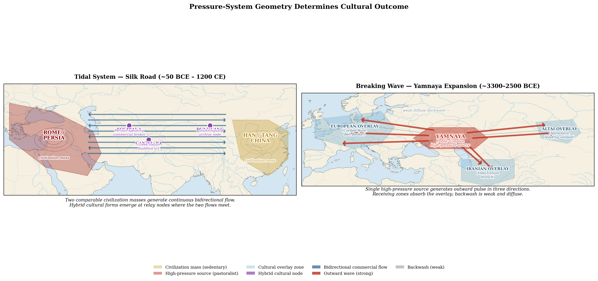

# Interlude: The Bronze Age Substrate
### *Before the documentary record*

---

## I. The Reach

Chapter 1 established that the framework's specific dynamics begin in the Bronze Age, when terrain-mediated friction collapses on the Pontic-Caspian steppe converted human population movement from foot-speed to mobility-multiplied scale. Everything before that period the framework reads as initial conditions: real, important, evidentially detectable, but operating by different mechanisms than the period the framework specializes in. After the Bronze Age friction collapses, the framework's apparatus applies.[^int-1]

The Bronze Age substrate is not a single event but a sequence of two friction collapses approximately 1500 years apart, both centered on the Pontic-Caspian steppe. The first friction collapse (~3300 BCE) is wagon-driven: oxen-drawn wagons convert pastoralist mobility from herding-radius operation to permanent-occupation operation, producing the Yamnaya horizon and its demographic-replacement expansion across Europe and Central Asia. The second friction collapse (~2200 BCE) is horse-and-chariot-driven: the modern domestic horse lineage (DOM2) emerges in the lower Don-Volga region and combines with Sintashta chariot technology to produce the cavalry-warfare pattern that dominates Eurasian history for the next 3500 years.[^int-1a]

This interlude demonstrates the framework operating at its temporal lower bound — the two thousand years that contain both friction collapses, the Yamnaya horizon they produced, and the Sintashta inflection point that links them. The populations the substrate produced — Yamnaya, Anatolian farmers, Afanasievo, Sintashta, eventually Tocharians and Indo-Iranians — are the deep substrate of the documented chapters that follow.

The reach is principled, not speculative. The framework operates here through the same apparatus it uses elsewhere: theoretical predictions from accumulated mechanism, tested against multiple independent evidence channels — archaeology, comparative linguistics, ancient DNA, sometimes religious narrative preserved as cultural memory.[^int-2] David Anthony's *The Horse, the Wheel, and Language* is the dissertation's primary source for this period; his linguistic-archaeological-genetic apparatus provides the substrate the framework reads.

What the framework adds to Anthony's work is the structural explanation for *why* the patterns Anthony documents take the directions they take. Anthony establishes what happened. The framework explains why directionality went one way rather than another, drawing on accumulated case work from the dissertation's documented-period chapters projected backward through the Rosetta Stone move.[^int-3]

---

## II. Two Friction Collapses

The framework's Bronze Age substrate runs through a sequence of two friction collapses, not a single Big Bang. Both center on the Pontic-Caspian steppe. Both convert geographic constraints that had bounded human population movement for millennia. Both follow climate-forcing-function plus technology-conjunction mechanisms the framework's apparatus reads identically. The two events together establish the post-Bronze-Age civilizational landscape that the documented chapters analyze.[^int-1a]

### The First Friction Collapse — The Wagon (~3300 BCE)

Before the wagon, pastoralist mobility was bounded by what a household could carry on foot or what a herd could be driven across over short distances. Households were tied to fixed base camps; herds operated within a herding-radius from those bases; the elderly, children, and food stores stayed at the base while younger members ranged outward. The wagon, drawn by oxen with solid-disc wheels, converted this constraint by making the household itself mobile. The full material toolkit — tents, food stores, women, children, elderly — moved with the herd. Yamnaya kurgan burials frequently contain wagon parts and wagon imagery, marking the integration of the wagon into the institutional and economic substrate of the population that the technology produced.[^int-24]

The wagon converts operational range into permanent-occupation range. Without the wagon, a raiding population must return to a fixed base. With the wagon, the entire pastoral household moves with the herd to new terrain that becomes the new home. The wagon transforms the population from raiders returning to a fixed base into a mobile civilization with no fixed base to return to. **The wagon is to the Yamnaya expansion what the railroad would be to the American and Russian conquests five thousand years later.** Same friction-collapse mechanism — converting operational range into occupation range, producing demographic replacement rather than negotiated coexistence. Different specific technology. Same structural function.

Horses are present in the Pontic-Caspian pastoral economies through this period (Sredny Stog, Khvalynsk, early Yamnaya contexts) but they are *not* yet the demographic-replacement-scale mobility technology. Pre-DOM2 horse populations include limited herding use and possibly some riding, but the mass-scale horse-mobility revolution does not happen until the second friction collapse ~1500 years later. The first friction collapse runs primarily on oxen-drawn wagons, with horses present as a supplementary species in the mixed pastoral toolkit.

The climate forcing function for the first friction collapse is the **4200 BCE cold event** (~6.2 kya). The cold episode produced winters severe enough to decimate cattle and sheep populations across the affected steppe. Cattle and sheep require relatively reliable water access and gentler winters; their hooves are not adapted for breaking through snow to reach buried forage; their fat reserves and coat density are insufficient for sustained sub-freezing conditions. Horses, by contrast, can paw through snow to find grass beneath; their winter coats and metabolic flexibility allow them to survive conditions that decimate cattle herds. The cold event eliminated cattle and sheep as viable pastoral species across the cold-affected zone and consolidated pastoral economies around the surviving combinations — mixed herd composition emphasizing horses for cold tolerance, and wagons for the household mobility that allowed populations to follow grazing across larger ranges with fewer fixed-base requirements.[^int-14] **The cold killed the cattle; the horses survived; the wagons made the households portable.** The forcing event consolidated the population around the wagon-and-horse toolkit that would carry the first friction collapse's outward demographic discharge.

The pressure-system state at the first friction collapse is the **charging capacitor**.[^int-11] Pre-Big Bang Anatolian farming expansion compressed surplus and pastoralist culture into the Pontic-Caspian frontier zone for millennia. The accumulated potential was substantial. The wagon-and-horse conjunction released the accumulated pressure as outward demographic discharge along the same gradient axes the original pressure had compressed. The result is the Yamnaya horizon (~3300-2500 BCE) and its three-direction expansion (Section IV below).

### The Second Friction Collapse — DOM2 and the Chariot (~2200 BCE)

The second friction collapse occurs approximately 1500 years after the first, in roughly the same geographic zone but in a fundamentally different pressure-system state. Recent ancient DNA work (Librado et al. 2021 *Nature*) establishes that the modern domestic horse lineage (DOM2) emerges in the lower Don-Volga region around 2200 BCE — not 4000 BCE as Anthony's 2007 reconstruction had placed it. DOM2 horses are selected for docility and back resilience — adaptations suited to riding and to pulling light chariots — and within a few centuries they replace almost all other horse populations across Eurasia, spreading explosively after ~2000 BCE synchronous with Sintashta chariot culture.[^int-25]

The Sintashta chariot — light spoked-wheel design, two-horse draft, warrior-driver plus archer configuration — is the earliest documented chariot, well-attested in Krivoe Ozero burials and other Sintashta sites. The DOM2-and-chariot conjunction produces the horse-cavalry-warfare pattern that dominates Eurasian history from approximately 2000 BCE forward. The Scythian, Xiongnu, Mongol, and Comanche confederations the framework reads in later chapters all descend from the cavalry-warfare template the second friction collapse established. The horse-mobility-multiplier mechanism the framework had originally attributed to the Yamnaya expansion is more precisely the mechanism the second friction collapse produces.

The climate forcing function for the second friction collapse is the **4.2 kya event** (~2200 BCE megadrought) — a globally documented climate episode associated with the Akkadian Empire collapse, Old Kingdom Egypt collapse, and Indus Valley contraction. The forcing event is the same mechanism as the 4200 BCE cold event but operates on a system in a different state. The pressure-system state at the second friction collapse is the **overextended Yamnaya-successor system**. Centuries of outward Yamnaya expansion have exhausted the geographic buffer; the system has reached its terrain limits across multiple frontiers. The 4.2 kya megadrought hits this overextended system and produces the *opposite* response to the 4200 BCE event's outward discharge: **inward concentration around critical-resource production.**[^int-26]

Card 203's state-dependent climate forcing principle reads this case precisely: climate stress on a charging-capacitor system discharges outward; climate stress on an overextended system concentrates inward. The 4.2 kya event drives Sintashta concentration around copper and bronze production — the defensible critical-resource node where populations facing collapse can maintain pastoral economies under siege conditions. The fortified Sintashta settlements are the archaeological signature of this concentration response. From the concentration node emerges the DOM2-and-chariot technology conjunction: defensively-motivated concentration producing the offensive military technology that powers the subsequent second-wave expansion. **The Sintashta concentration is the inflection point where the wagon-pastoralist era transitions into the horse-cavalry era through the concentration-then-emergence sequence.**

The koryos institutional mechanism (Section III below) also inverts at this transition. During the Yamnaya expansion phase the koryos produced federation cohesion through outward-projecting youth warrior bands. During the post-Yamnaya contraction phase the same institutional mechanism produces fragmentation — outward projection no longer pays because the targets are themselves stressed; youth warriors turn inward and compete for shrinking internal resources. The federation that built itself through outward koryos raiding dissolves through inward koryos competition. Same institutional mechanism. Opposite outcome. The mechanism's directional output depends on whether the resource base is expanding or contracting.[^int-26]

### Two Friction Collapses, One Substrate

The two friction collapses operate as a coherent Bronze Age substrate, not as two separate cases. The first establishes mobile pastoral civilization (wagon, ~3300 BCE). The second establishes cavalry-warfare aristocracies (DOM2 + chariot, ~2200 BCE). Together they produce the post-Bronze-Age civilizational landscape — Yamnaya-derived demographic substrate across Europe and Central Asia, Indo-Iranian linguistic expansion southward, cavalry-warfare pattern dominating Eurasian military history for the next 3500 years. The framework's apparatus operates on both events through identical mechanism (geographic terrain + climate forcing + friction-collapse technology = demographic-scale outcome) with different specific drivers and different specific outcomes.

The first friction collapse is the framework's clearest pre-documentary case of the **railroad-equivalent mechanism**: a single transportation technology converting operational range into occupation range and producing demographic replacement. The second friction collapse is the framework's clearest pre-documentary case of the **state-dependent climate-forcing-function** mechanism: the same forcing event producing opposite responses depending on the pressure system's state at the time of forcing. The two events together demonstrate the framework's apparatus operating with maximum analytical reach on pre-documentary material.

Oceanic sail technology in the 1490s rotates a different geographic domain in a third foundational friction collapse, opening the ocean as a corridor for power projection. The dissertation's three documented friction collapses — the wagon (~3300 BCE), DOM2-and-chariot (~2200 BCE), and oceanic sail (~1490s CE) — bracket the framework's full operation. Subsequent friction collapses (steam, rail, telegraph, internet, AI translation) compound the dynamics within the period the three Bronze Age and Early Modern rotations have completed. This interlude operates within the period between the first two rotations and before the third arrives.

### The Kurgan Hypothesis Lineage

The framework's pre-documentary apparatus operates within an established scholarly tradition. The archaeological model of Indo-European expansion the dissertation is now extending is the Kurgan hypothesis — developed by Marija Gimbutas in the 1950s, partly as an explicit rejection of the Aryan race narrative that had dominated PIE scholarship through the 1930s-40s, and refined by David Anthony in *The Horse, the Wheel, and Language* (2007) with genetic and archaeological evidence.[^int-15] Recent ancient DNA work — particularly Librado et al. 2021's redating of modern domestic horse emergence — has further refined the chronology and clarified the two-friction-collapse structure that Anthony's 2007 single-Big-Bang reading had collapsed into one event. The standard Kurgan expansion maps showing arrows radiating outward from the Pontic-Caspian steppe in three directions are, structurally, the framework's pressure-gradient model visualized for the first friction collapse. The framework did not invent the directionality reading; it derived it from first principles applied to the same evidence Gimbutas, Anthony, and the ancient DNA studies built their reconstructions from. The convergence confirms the framework's apparatus operates correctly on the prehistoric period and places the framework's anti-eugenic positioning within seventy years of established academic scholarship rather than as independent assertion.

---

## III. The Volga as Pastoralist Spine

Chapter 2 develops the river-spine logic through silt-delta civilizations — the Nile, the Tigris-Euphrates, the Indus, the Yellow River. Each river produces a specific bureaucratic-agricultural civilization through the combination of predictable flooding, silt deposition, bounded floodplain, and irrigation management.

The same river-spine logic operates on different terrain to produce a completely different civilizational form. The Volga-Don steppe north of the Caucasus is the Goldilocks zone not for silt-fed agriculture but for wagon-enabled mobile pastoralism. Reliable water from the river system. Extensive grassland for herd grazing. Mild enough winters for livestock survival. Open enough terrain for wagon-borne household mobility across multi-day distances. None of the silt-delta conditions that produce surplus agricultural civilization — but all the conditions that select for semi-nomadic pastoralism centered on the river as organizing spine.[^int-4]

The cultural complex that emerged in this terrain context is the Yamnaya horizon (roughly 3300-2500 BCE). Anthony's reconstruction shows the Yamnaya combining wagon-enabled household mobility, copper-and-bronze metallurgy, wheeled transport, distinctive burial practices, mixed-herd pastoralism (cattle, sheep, horses), and a linguistic substrate that comparative linguistics reconstructs as Proto-Indo-European. Pre-DOM2 horses are part of the toolkit but as supplementary livestock, not as the primary mobility technology. The Yamnaya were not a unified political entity in the sedentary sense — they were a confederation of bands sharing enough material culture and linguistic substrate to coordinate while maintaining the distributed authority that semi-nomadic pastoralism selects for.

The Volga organizes pastoralism the way the Nile organizes agriculture. Same river-spine mechanism. Different terrain context. Completely different civilizational outcome. This is the framework's most important refinement of Chapter 2's river-spine logic — rivers organize civilizational form across multiple terrain contexts, and the form produced depends on what surrounds the river.

The Yamnaya horizon is the prototype. Every subsequent steppe confederation across the next four thousand years operates on the same geographic logic the Yamnaya established, refined by the cavalry-warfare template the second friction collapse adds at Sintashta. The Scythians on the Pontic steppe centered on the Dnieper-Don-Volga corridor system. The Xiongnu on the Mongolian steppe centered on the Orkhon-Selenge river system. The Mongol confederation operating from the Onon River. The Comanche confederation organized around the Arkansas River corridor on the southern Plains. Each confederation iterates on the same pattern: mobile pastoralism centered on a river-spine, with expansion-contraction pulses synchronized to climate cycles. The Yamnaya provide the wagon-pastoralist template; the post-Sintashta cavalry-warfare template completes the institutional toolkit each successor confederation inherits.[^int-4]

The Yamnaya are not the first steppe confederation. They are the original template. Once wagon-enabled mobile pastoralism makes the template possible, the template recurs wherever terrain reproduces the Goldilocks zone conditions.

The institutional mechanism the prototype operates through is preserved in the reconstructed PIE vocabulary itself. Anthony's comparative-linguistic apparatus recovers terms for cattle raiding, bride price, and youth warrior bands — the *koryos* — that name the specific social technology the Yamnaya were running. Young men with low inherited status need cattle for bride price. Cattle acquisition in a surplus-less mobile pastoralist economy requires raiding. Wagon-enabled household mobility multiplies the operational range over which raiding parties can operate before returning to mobile bases. Extended range creates internal-cooperation economics — raiding the populations within your operational radius destroys the alliance relationships you need for defense against more distant raiders. The federation emerges from the bottom up through the practical logic of the raiding economy itself, not from top-down ideological unification or great-leader decision-making. The youth warrior bands project outward. The internal zone stabilizes into federation.[^int-21]

This is structurally identical to the institutional mechanism the Comanche confederation operated on the southern Plains four thousand years later — the Arkansas valley commercial hub as the internal-cooperation zone, the outward-directed raiding toward Apache settlements and Mexican haciendas, the bride-price economy through captive and horse acquisition, the distributed authority that maps to the koryos pattern. Same institutional response. Different continent. No plausible transmission pathway between them. The framework reads this as the strongest confirmation type available: identical institutional forms emerging independently from identical geographic-economic conditions in cases with no historical connection. Not diffusion. Not cultural transmission. Parallel evolution from identical structural substrates.

**The steppe produces the koryos. Every time. Everywhere steppe conditions exist.** The Yamnaya are not the inventors of this pattern but the first population for which the structural conditions converged at scale: mobile pastoralism, wagon-enabled household range, surplus-less raid-based status acquisition for marginal young men, and demographic pressure exceeding local cooperation capacity. Every subsequent steppe confederation that meets the conditions reproduces the institutional response, with the post-Sintashta cavalry-warfare extension when DOM2-and-chariot become available. The Scythian *hippeis*. The Xiongnu *xian*. The Mongol *nökör*. The Comanche raiding bands. Six thousand years of the same social technology emerging wherever the conditions converge.

The mechanism the koryos pattern names operates across a specific temporal sequence that locates PIE's emergence with precision. PIE did not become a widespread lingua franca during the Yamnaya expansion. It crystallized earlier, during the federation phase that produced the expansion's substrate. Three phases structure the pre-Big-Bang and Big Bang sequence:

- **Phase 1 — Federation crystallization (~5000-4200 BCE).** The Dnieper-Volga zone stabilizes a large internal-cooperation region. Seasonal trade fairs, koryos raiding economies, bride-price marriage networks, and federation-from-operational-range cooperation demand a common coordination medium across the operational range. PIE develops as that medium. Raid and trade west to the Danube. Raid and trade east to the Urals. The federation matures with the lingua franca operating across its full extent.
- **Phase 2 — Power explosion (~4200-3500 BCE).** The climate forcing function tips the pressure differential past the threshold from exchange to conflict (treated in Section V below). The accumulated federation energy prepares for outward release.
- **Phase 3 — Simultaneous expansion (~3500-2500 BCE).** The Yamnaya wave carries the federation's accumulated apparatus outward in three directions (Section IV). The lingua franca travels with the expansion as the coordination medium that already existed within the federation, now spreading into the contact populations on both sides.

The expansion was the carrier mechanism, not the creation mechanism. The federation that preceded it did the creation work. The archaeological cultural sequence Anthony reconstructs — Sredny Stog and Khvalynsk preceding Yamnaya — corresponds to the three phases. Federation-phase material culture signatures (seasonal trade settlements, koryos-related burials, hybrid material culture at the Old European frontier) should appear in Sredny Stog and Khvalynsk before Yamnaya material culture shows the expansion signatures of rapid geographic spread and derivative cultures appearing across distant terrain.[^int-22]

This timing generalizes. Lingua francas are federation-phase outputs, not expansion-phase outputs. Sogdian crystallized during the Silk Road's productive tidal-system phase before traveling with Sogdian commerce. The Comanche lingua franca crystallized during the Plains federation phase before spreading. English crystallized during the British commercial-empire federation phase before spreading globally. Expansion carries lingua francas outward. Federation creates them.

---

## IV. The Pressure Wave

The Yamnaya horizon expanded outward from the Pontic-Caspian homeland in three independent directions during the period roughly 3000-2500 BCE. The expansion is wagon-driven — household-mobile pastoral populations carrying their full material toolkit into new terrain — not yet horse-cavalry-driven. The horse-cavalry-warfare pattern that dominates Eurasian history afterward is a product of the second friction collapse at Sintashta; the first friction collapse's expansion runs on wagons, oxen, mixed herds, and pre-DOM2 horses.

**Westward** into the European farming frontier. Yamnaya-derived populations spread northwest into central and northern Europe, where they encountered and partially absorbed the Anatolian farmer populations that had occupied the terrain since roughly 7000 BCE. The Corded Ware cultural complex (~2900-2350 BCE) shows strong Yamnaya genetic affinity and burial practices. The Bell Beaker cultural complex (~2800-1800 BCE) extends the same population history further west into Iberia, the British Isles, and parts of the Mediterranean. The genetic signature of the Yamnaya wave is detectable in contemporary European populations.[^int-5]

**Eastward** toward the upper Yenisei drainage. The Afanasievo cultural complex (~3300-2500 BCE) appears as a Yamnaya-derived outpost thousands of miles east of the Pontic-Caspian homeland, centered in the Minusinsk Basin between the Sayan and Altai mountain ranges, before the intervening steppe was fully settled. This is what migration theory calls a leapfrog — a population skipping over adjacent territory to establish a distant outpost in compatible terrain. The Indo-European-speaking populations of the Tarim Basin attested as Tocharians in late first-millennium manuscripts emerge from complex demographic mechanisms layered onto an earlier genetic substrate that ancient DNA evidence shows was not direct Afanasievo descent.[^int-6]

**Southeastward** into the Iranian plateau and the Indian subcontinent. The Indo-Iranian branch of the PIE-derived language family moved through the Caucasus margins and along the southern Caspian, eventually reaching the Iranian plateau and (with the Indo-Aryan sub-branch) the northwestern subcontinent. The southeastward expansion takes its definitive form during the post-Sintashta period when DOM2-and-chariot technology makes cavalry-warfare-based projection viable across the longer distances and harsher intervening terrain. The pastoralist toolkit adapted to the new terrain through mixed-economy transitions across both friction-collapse phases.

Why these three directions and not others? Chapter 1's anti-eugenic positioning specifies the framework's answer. The directionality follows the gradient — populations move from high-pressure zones toward low-pressure zones, along paths of least friction, toward resource bases their technological and cultural toolkit makes accessible.[^int-7] The Yamnaya moved west because the European farming frontier offered extractable agricultural surplus at traversable friction levels given wagon-enabled mobility. They did not move south through the Caucasus in bulk because the mountain friction was too high for wagon-borne population movement, even though high-value vocabulary and ideas crossed the friction zone freely. They moved east because the Central Asian steppe offered compatible terrain with lower population pressure. The Indo-Iranian branch moved southeast because the Iranian plateau and the Indus Valley offered terrain compatible with pastoralist-to-mixed-economy transitions, with the cavalry-warfare technology from Sintashta eventually providing the operational range to sustain the projection.

No racial hierarchy is required to explain the directionality. No random contingency is required either. Just populations following the path of least resistance toward resource bases their specific toolkit could exploit. The framework's apparatus reads the migration patterns as thermodynamic gradient following — the same mechanism the framework applies to every other historical migration the dissertation analyzes.

The geometry of the expansion is structurally different from the Silk Road tidal system that would emerge millennia later. The Silk Road operates as a *tidal* pressure system — two civilization masses of comparable complexity at opposite ends of the corridor generating continuous bidirectional flow, producing rich hybrid cultural forms at the relay nodes (Sogdian commerce, Gandharan Buddhist art, Dunhuang's multilingual archive). The Yamnaya expansion operates as a *breaking wave* — a single high-pressure source generating outward pulse with weak diffuse backwash, producing population overlay rather than synthesis. The difference is geometric, not cultural. Where the geometry supports tides, the framework predicts hybrid synthesis at relay nodes. Where the geometry supports breaking waves, the framework predicts overlay with limited reverse flow. The Yamnaya case is the second; the Silk Road case is the first.[^int-12]

*[Figure 15: Tidal vs Breaking Wave Pressure Systems](../../figures/fig-015-tidal-vs-breaking-wave.md)*

The three vectors triangulate to the homeland. Work backwards from each expansion's origin point; the convergence locates where the population started. This is the methodology comparative linguistics, archaeology, and ancient DNA use together — three independent evidentiary channels converging on the same reconstructed homeland through different specific evidence types. The result places the Yamnaya homeland in the Pontic-Caspian steppe, roughly the Volga-Don river system, exactly the Goldilocks zone for horse-enabled pastoralism the framework's river-spine logic would predict.

---

## V. The Receiving End — Frontier Lifecycle and Threshold Crossing

The Yamnaya expansion encountered populations on the receiving end. What happened to those populations across the centuries that followed reveals the framework's most refined account of frontier dynamics — and demonstrates that the framework's apparatus reads the same threshold-crossing mechanism in 3500 BCE Old Europe that it reads in 1875 CE on the southern Plains.

Anthony observes that frontier border zones can be places of relatively peaceful exchange *and* of bitter rivalry. Specific frontiers shift between these modes; the same kind of geographic feature produces radically different cultural outcomes at different times. The duality is real. The framework resolves the apparent paradox by showing that the shift between modes is thermodynamically predictable based on the pressure differential at any given moment.[^int-16]

**The exchange equilibrium operates at low pressure differential.** Both sides extract more value from continued exchange than they could from conflict. Material culture signatures: seasonal trade fairs at the frontier; hybrid pottery incorporating aesthetic conventions from both sides; specialized production settlements oriented toward frontier trade; partial miscibility producing material forms that belong fully to neither origin culture but emerge from sustained commercial-aesthetic contact.

Anthony explicitly documents seasonal trade fairs at the Old Europe-steppe frontier around 4500 BCE. This is the framework's seasonal-trade-fair mechanism confirmed at the deepest temporal point its pre-documentary reach can support. The same institutional form recurs across the dissertation's documented cases — Sogdian seasonal markets in Transoxiana, Chinese-steppe tributary fairs, the Comanche Arkansas valley commercial hub, Spanish New Mexico trading posts. Same structural mechanism. Different periods. Seven thousand years apart, in some cases.[^int-17] Terrain creates the frontier. Frontier creates the exchange opportunity. Exchange opportunity produces the seasonal fair. Every time. Everywhere. Regardless of the specific cultures involved.

The Cucuteni-Tripolye culture — the canonical Old Europe complex — produced pottery with steppe aesthetic conventions and supported specialized pottery settlements oriented toward frontier trade. Specialization requires sustained capital investment: production infrastructure, trained craftspeople, distribution networks, established commercial relationships. Populations do not make this investment if they expect the trading relationship to collapse imminently. **Specialized production settlements oriented toward frontier trade are behavioral evidence of frontier stability expectations.** The investment reveals what populations believed about the frontier's durability at the time of investment. The hybrid pottery and specialized settlements are the framework's evidence that the Old Europe steppe frontier worked productively for centuries before it didn't.[^int-18]

**The conflict equilibrium operates at high pressure differential.** The cost-benefit calculation flips. One side has sufficient advantage that extraction through force exceeds the value of continued exchange. Material culture signatures: fortifications going up; specialized trade settlements abandoned or destroyed; hybrid pottery production stopping; defensive infrastructure investment replacing commercial infrastructure investment.

Anthony documents increasingly elaborate fortifications constructed by Cucuteni-Tripolye communities in the centuries before the final collapse. This is the framework's behavioral signature of a specific structural condition. **Populations build walls when they cannot project power far enough to stop the threat at distance.** Offensive power projection — raiding the source of the threat, eliminating personnel before they reach you — is more efficient than defensive fortification when offensive projection is possible. Populations choose walls only when offensive projection is not viable. The fortifications are behavioral evidence that external pressure exceeded the response capacity of the threatened population.[^int-19]

The fortifications also reveal a doctrine mismatch. Walls work against armies that approach on predictable routes and can be forced into siege warfare. They work poorly against mobile raiders who can choose when and where to strike and simply avoid fortified positions while raiding the unfortified countryside. The Old Europe communities built fortifications appropriate for the *previous* threat environment — slow, predictable, sedentary armies — but inappropriate for the post-horse threat the framework's pressure reversal created. The doctrine mismatch is itself evidence that the new threat was outside cultural-strategic experience. Populations were running accurate models on inputs that had quietly changed at the order of magnitude; the same pattern Chapter 6 documents for the Comanche-American frontier four thousand years later.

**The threshold crossing is predictable from the pressure-differential indicators.** Climate stress (the 4200 BCE cooling event), technology shock (horse domestication scaling into mobile pastoralism), demographic pressure, administrative capacity, resource state. Each indicator is observable. The framework predicts threshold crossings by tracking changes in the indicators rather than waiting for the crossing to occur and explaining it retroactively.

Old Europe's collapse followed the same structural sequence the framework documents across the post-horse phase. The productive exchange phase came first — hybrid pottery, seasonal trade fairs, specialized production settlements. Climate stress at 4200 BCE increased the pressure differential by stressing cattle economies and enabling horse mobility simultaneously. The frontier crossed the threshold from exchange to conflict. Fortifications went up. The receiving-end populations applied yesterday's defensive doctrine to a novel mobile threat. The collapse followed.

A specific structural feature accelerated the collapse: **the exhausted geographic buffer.** Old Europe's farming frontier had advanced eastward for centuries until it reached the ecological boundary between farmable terrain and steppe. The farming wave was not a coordinated army — it was an aggregate phenomenon emerging from thousands of independent farming communities each making local decisions to clear land, plant crops, and expand by the minimum necessary to sustain population growth. The wave advanced because the gradient rewarded the advance. It stopped at the terrain limit because the gradient stopped past the limit. Old Europe held the ecological boundary for centuries before the reversal began.[^int-20]

This is the framework's exhausted-geographic-buffer mechanism: **pressure systems that have advanced to their terrain limits are vulnerable to reversal because they have exhausted the geographic buffer that absorbed incoming pressure during the expansion phase.** When the gradient reverses, the reverse pressure encounters no buffer. Collapse follows rapidly. Old Europe had nowhere to retreat that maintained its farming toolkit because Europe was already filled with farming populations whose terrain capacity was also at its limit.

The same structural vulnerability operates across multiple cases the dissertation documents. The Mexican empire's northern frontier collapsed because the empire could not retreat to a defensible position when American and Comanche pressure increased. The Spanish empire collapsed when Napoleonic disruption hit colonies already at administrative capacity. The Comanche apex collapsed when railroad and bison destruction reversed pressure against a confederation already at the Plains' functional limits. Old Europe is the prehistoric case of the same pattern. Five thousand years earlier, no documentary record, but archaeological and climate evidence sufficient to identify the pattern through the framework's apparatus.

The framework's contribution to frontier theory stated cleanly: **Anthony sees the duality. The framework explains the switch.** Frontier zones are not stably one thing or the other. They are pressure systems that shift between exchange equilibrium and conflict equilibrium based on the pressure differential at any given moment. The shift is not random, not paradoxical, not culturally contingent — it is thermodynamically predictable from observable indicators. The framework converts frontier studies from descriptive (here are some frontiers; here are some outcomes; here is contextual variation) into predictive (these are the indicators; this is the threshold; here is what happens next).

Every frontier that ends badly had a period when it worked. The hybrid pottery is the proof that the Old European steppe frontier worked before it didn't. The fortifications are the proof that the threshold was crossed. The collapse is the proof that the buffer had been exhausted by the time the reversal arrived. The framework predicts all three phases.

---

## VI. The Second Friction Collapse — Sintashta and the DOM2 Horse

The Yamnaya horizon's three-direction expansion ran for approximately eight hundred years. By ~2500-2400 BCE the wave had reached its terrain limits across the European, Eastern, and Southeastern frontiers. The Yamnaya-successor cultures — Corded Ware in Europe, Afanasievo in the Minusinsk Basin, the early Indo-Iranian-speaking populations in the Caucasus margins — had absorbed the wagon-pastoralist template but were no longer expanding as a coordinated outward wave. The pressure-system state had inverted from charging-capacitor to overextended-system.

Then, around 2200 BCE, the global climate event known as the 4.2 kya megadrought struck. Documented in archaeological records across Eurasia as the trigger for the Akkadian Empire collapse, Old Kingdom Egypt collapse, and Indus Valley contraction, the 4.2 kya event produced widespread aridification and pastoral stress. On the post-Yamnaya steppe, the event hit an already-overextended pressure system. The response was not outward discharge — the system had no remaining buffer — but inward concentration around the resources whose defense was still viable.[^int-26]

The concentration node that emerges is the **Sintashta cultural complex** (~2200-1800 BCE). Sintashta settlements are fortified — concentric ditches, palisaded perimeters, organized internal layouts — and centered on copper and bronze production. The fortifications are the archaeological signature of resource-defensive territoriality under stress: populations concentrate around the critical-resource production that gives them a defensible competitive advantage when broader pastoral viability is threatened.[^int-26a] The same population that had been mobile across vast ranges during the Yamnaya expansion now consolidates into permanent fortified settlements organized around metal production. Mobile pastoral civilization concentrates into proto-urban metal-production centers.

From this concentration emerges the technology conjunction that defines the second friction collapse. The **modern domestic horse lineage (DOM2)** appears in the lower Don-Volga region around 2200 BCE, with selection for docility and back resilience suited to riding and to pulling light vehicles. Within a few centuries DOM2 has replaced almost all other horse populations across Eurasia, spreading explosively after ~2000 BCE.[^int-25] The **Sintashta chariot** — light spoked-wheel design, two-horse draft, warrior-driver plus archer configuration — is the earliest documented chariot, well-attested in Krivoe Ozero burials and other Sintashta sites. The chariot is what defensive concentration produced: an offensive military technology that emerged from a defensively-motivated production center and went on to power the second wave of outward expansion.

The DOM2-and-chariot conjunction establishes the cavalry-warfare pattern that dominates Eurasian history from approximately 2000 BCE onward. The Scythian, Xiongnu, Mongol, and Comanche confederations the dissertation reads in later chapters all descend from the cavalry-warfare template Sintashta established. The horse-mobility-multiplier mechanism that subsequent chapters trace through documented periods is the second friction collapse's signature.

The post-Sintashta expansion runs in a different direction than the Yamnaya wave. The Yamnaya expansion went west into European farming terrain, east into compatible Central Asian steppe, and southeast into the Iranian plateau margins. The post-Sintashta expansion is dominantly **southward** — Indo-Iranian populations carrying chariot-warfare and DOM2 horses through Central Asia into the Iranian plateau and (with the Indo-Aryan sub-branch) into the northwestern Indian subcontinent. The Vedic civilization's eventual emergence in India connects to this trajectory. The southward direction is selected because the cavalry-warfare technology made traversable terrain that wagon-pastoralism could not effectively project across.

The koryos institutional mechanism (Section III) inverts at the Yamnaya-to-Sintashta transition. During the Yamnaya expansion phase the koryos produced federation cohesion: young warriors projected outward, outward projection made raiding internal allies economically irrational, the federation stabilized through the bottom-up logic of the outward raiding economy. During the post-Yamnaya contraction phase the same institutional mechanism produces fragmentation: outward projection no longer pays because the targets are themselves stressed; the same youth warriors who had been projecting outward now compete inward for shrinking internal resources. The federation that built itself through outward koryos raiding dissolves through inward koryos competition. **Same institutional mechanism. Opposite outcome. The mechanism's directional output depends on whether the resource base is expanding or contracting.**[^int-26] Sintashta's concentration around defensible critical-resource production is the institutional response that survives the contraction phase. The resulting fortified-settlement-and-chariot template then becomes the launch platform for the second wave of expansion.

The frontier-management institutional stack (Section V's exchange-equilibrium mechanism) also operates differently in the post-Sintashta period. The Yamnaya productive-exchange phase ran through the five-layer stack of commercial gravity, lingua franca, guest-host protocols, patron-prestige-song elaboration, and religious encoding — the institutional infrastructure that allowed sustained frontier exchange across cultural distance.[^int-27] The post-Sintashta expansion operates through the same stack but now with cavalry-warfare adding a sixth layer: military projection that can be deployed when exchange relationships fail. The result is the institutional template that subsequent chapters read in Scythian, Xiongnu, and Mongol confederations — frontier exchange backed by cavalry-warfare projection, the stack and the threat together producing the durable steppe-empire form.

The second friction collapse is the framework's clearest pre-documentary case of the **state-dependent climate-forcing-function** mechanism. The same forcing event (cold or drought stressing pastoral economies) produced opposite responses depending on the pressure system's state at the time of forcing. Charging-capacitor system → outward discharge (first friction collapse, 4200 BCE event, Yamnaya expansion). Overextended system → inward concentration → emergence of new technology at the concentration node → eventual second-wave expansion (second friction collapse, 4.2 kya event, Sintashta concentration → DOM2-and-chariot → Indo-Iranian southward expansion). Same forcing mechanism. Different system state. Opposite outcome.

The framework reads both events through identical apparatus. The two together demonstrate the framework's pre-documentary reach at maximum analytical strength.

---

## VII. The Three-Wave European Population History

Anthony's reconstruction of European population history identifies three successive waves, each detectable in contemporary genetics:[^int-5]

1. **Hunter-gatherer substrate.** Populations occupying Europe through the Pleistocene and into the early Holocene. Mesolithic European foragers. The genetic baseline before agriculture or pastoralism arrived.

2. **Anatolian farmer wave** (~7000-6000 BCE). Neolithic farming populations spreading northwestward from the Anatolian innovation source. They carry the domesticated agricultural package developed in the Fertile Crescent — wheat, barley, sheep, goats, cattle. They settle across Europe, sometimes mixing with hunter-gatherer populations and sometimes replacing them. This is the first major population movement that left detectable genetic and linguistic traces in European populations after the original substrate.

3. **Yamnaya steppe wave** (~3000-2500 BCE). Horse-enabled steppe populations spreading PIE and pastoralist culture westward over the existing farming populations. This is the second major detectable movement, and the one the dissertation's framework specifically reads through the post-horse apparatus.

European genetics today shows three populations stacked: hunter-gatherer substrate, Anatolian farmer overlay, Yamnaya steppe overlay. All three layers are visible in ancient DNA. Each entered through a different population movement at a different time, in response to different selection pressures, carrying different cultural and technological packages.

The methodological significance is the multi-channel convergence. Anthony's apparatus operates across linguistics (comparative reconstruction of PIE and earlier substrates), archaeology (distribution of distinctive material culture across the corridor), and genetics (ancient DNA sampling across the relevant burial sites and time horizons). Three independent evidence channels converging on the same three-wave reconstruction. This is the theoretical-experimental physics methodology Chapter 1 named — theoretical apparatus generating predictions, multiple instruments testing them, convergent confirmation establishing the reading.[^int-2]

The framework's geography-as-destiny lens reads this material through the innovation-source-versus-amplification-zone distinction. The Anatolian farmer wave amplifies an innovation that originated in the Fertile Crescent. The Yamnaya wave amplifies a different innovation (horse-enabled mobility) that originated in the Pontic-Caspian terrain. Different innovations. Different origins. Both following the gradient through the terrain types their respective toolkits could exploit.[^int-7]

---

## VIII. The Tocharian Bridge

The eastward Yamnaya expansion and the post-Sintashta Indo-Iranian expansion together produce a population-historical bridge connecting this interlude's Bronze Age material to the dissertation's existing Silk Road chapters. The bridge is layered rather than single-pulse, but it remains the framework's most analytically important connection between pre-documentary and documented periods.

The Afanasievo cultural complex (~3300-2500 BCE) in the **Minusinsk Basin (upper Yenisei drainage), between the Sayan and Altai mountain ranges**, is the leapfrog outpost of the Yamnaya eastward push. Afanasievo material culture, burial practices, and genetic signature show direct Yamnaya affinity, marking the easternmost extent of the first friction collapse's wagon-pastoralist expansion. The connection from Afanasievo to the **Tocharian-speaking populations** of the Tarim Basin oasis cities — Kucha, Turfan, Yanqi, the Dunhuang region — attested in documents dating to the late first millennium CE, is more complex than originally proposed. Ancient DNA evidence (Zhang et al. 2021; Damgaard et al. 2018) shows that the earliest Tarim Basin populations (Xiaohe horizon, ~2100-1700 BCE) were a genetic isolate descended primarily from Ancient North Eurasian ancestry, with no detectable Western Steppe (Yamnaya/Afanasievo) admixture. The Indo-European-speaking Tocharian populations emerge through later, more complex demographic mechanisms — possibly through Indo-Iranian-speaking groups arriving from the post-Sintashta southward expansion and being layered onto the earlier genetic substrate, or through other multi-pulse migrations the current evidence does not yet fully resolve.[^int-6]

The river-spine logic still operates on the corridor's geography. The Irtysh flows northeast from the Altai toward the Ob basin; for a steppe population moving east from the Ural region, the Irtysh corridor pulls them progressively eastward toward the Altai foothills. No conscious destination required — the river provides the gradient, and the population follows. The Syr Darya flows southwest from the Tian Shan toward the Aral Sea and Transoxiana; for later populations operating in the Tarim Basin, the Syr Darya drainage maintains hydrological connection to the southwestern world that would eventually become the central node of the Silk Road tidal system. Same continuous geography, two specific rivers, two functions at different historical moments: the Irtysh enabled the Afanasievo leapfrog east; the Syr Darya later enabled Tarim-Silk-Road reconnection through Transoxiana.[^int-23]

What the Tarim Basin oasis populations Chapter 4 analyzes as Silk Road chokepoint civilizations actually inherit is a multi-layered substrate. The Yamnaya eastward expansion produced an early outpost (Afanasievo) that did not directly populate the later Tarim oasis cities but contributed cultural-linguistic substrate to the broader corridor. Later movements during and after the post-Sintashta period brought Indo-European-speaking populations southward through the Iranian plateau and Central Asia. The Tocharian-speaking Tarim populations of the late first millennium CE represent the accumulated layering of these multiple pulses with the earlier Ancient North Eurasian substrate. The PIE-derived linguistic presence reaches the corridor that subsequently becomes the Silk Road's central node not through a single demographic pulse but through repeated terrain-mediated population movements across the two friction collapses' aftermaths.

The lineage is layered rather than continuous-through-one-population, but the framework's apparatus operates on each layer through the same mechanism. The structural connection remains: Bronze Age PIE-derived populations reach the corridor where the dissertation's Silk Road material operates, through terrain-mediated migration following the gradient. The framework reads each successive layer through the same analytical tools.

A related observation supports the bridge reading. Tocharian languages preserve archaic PIE features that the European branches of Indo-European lost. The standard reading attributes this to chronological isolation — Tocharian populations were cut off from the central evolution of the language family and preserved an older form. The framework's reading sharpens this: Tocharian is the linguistic fossil produced by the leapfrog migration mechanism, regardless of which specific demographic pulse carried the language eastward. Populations carrying Indo-European linguistic substrate moved east into terrain that isolated them from continued source evolution. The homeland kept evolving. The leapfrog populations preserved the form they carried when they left. The same mechanism produces Icelandic preserving archaic Old Norse and other documented fossilization cases. Different domains. Same structural mechanism.[^int-8]

The Tocharian bridge demonstrates that the framework's post-friction-collapse apparatus operates uniformly across the entire post-Bronze-Age arc, even when the specific demographic chains are more complex than originally reconstructed. Future framework engagements with material from any point in this arc can deploy the same analytical tools and expect them to operate consistently.

---

## IX. The Robust Frontier in Bronze Age Form

Chapter 1 introduced robust frontiers — bundles of opposed customs persisting across millennia because terrain regenerates the selection pressures on each side. The Bronze Age period is when Anthony's apparatus most directly demonstrates the mechanism, since the terrain-mediated cultural distinctions are visible in the archaeological record while the political-administrative overlay that later periods produce is largely absent.

The Caucasus frontier is the framework's clearest Bronze Age robust-frontier case. The mountain range running east-west between the Pontic-Caspian steppe to the north and the Anatolian-Iranian world to the south creates a sharp transition zone. Horse-enabled bulk population movement cannot cross the mountain friction at scale. High-value-density transmission — vocabulary, ideas, prestige goods, religious concepts, metallurgical knowledge — crosses the passes freely. The frontier is asymmetric in what it permits and what it filters.[^int-9]

The asymmetric filtering produces the specific evidence pattern the period shows. PIE shows substantial Anatolian agricultural vocabulary, suggesting that high-value vocabulary crossed the Caucasus southward into the steppe and then spread westward and eastward with the Yamnaya expansion. But the genetic record shows comparatively little Anatolian population admixture in the homeland Yamnaya population, suggesting bulk demographic movement did not cross the same friction barrier in significant numbers. Ideas and words crossed. People mostly did not. The frontier sieved.

This is the framework's reading of the Caucasus operating as a robust frontier across millennia. The same friction logic that the Bronze Age evidence demonstrates persists through every subsequent period the framework documents. Roman vs Parthian negotiation across the Caucasus. Byzantine vs Arab contestation. Russian vs Ottoman vs Persian. The 20th-century Iron Curtain. The contemporary Russia-Georgia and Armenian-Azerbaijani tensions. Same mountain range. Different specific actors. Same persistent friction zone across approximately five thousand years.

The Bronze Age substrate is not a special case requiring different framework treatment. It is the same robust-frontier mechanism Anthony names in the Bronze Age context and the framework applies across millennia.[^int-10] The persistence is structural. The terrain that generates the frontier does not change.

---

## X. The Long Way Home

The framework's reading of the post-Bronze-Age phase as continuous operation across one substrate finds its most elegant structural expression in an arc that begins and ends on the Pontic-Caspian steppe. The arc spans approximately five thousand years from the first friction collapse (~3300 BCE) through the Golden Horde's return (~13th century CE), with the second friction collapse at Sintashta (~2200 BCE) and the post-Sintashta cavalry-warfare era providing the institutional template that the Mongol confederation eventually inherits.

The Yamnaya horizon expanded outward from the Pontic-Caspian homeland in the three directions described above (~3000-2500 BCE). The eastern branch leapfrogged through the Afanasievo cultural complex into the Minusinsk Basin and contributed substrate to the populations that would later operate in the Tarim Basin as Tocharian-speakers. For approximately four millennia after the initial leapfrog, Indo-European-speaking populations occupied the Tarim Basin as geographically isolated communities — preserved by the desert's friction conditions the way the Dunhuang documents were preserved by their cave's microclimate. The Tarim Basin is not just an isolation zone but a *geographic preservation environment* whose physical properties (extreme aridity, geographic isolation, low population pressure) functioned as a museum for the deep substrate's cultural and linguistic forms.[^int-13]

The cavalry-warfare template the second friction collapse established at Sintashta (~2200 BCE) becomes the dominant Eurasian military pattern for the next 3500 years. The Scythian, Xiongnu, and successor confederations carry the institutional template — wagon-pastoralist substrate plus cavalry-warfare overlay — across the same terrain that supported the original Yamnaya expansion. Each successor confederation operates on the same Goldilocks-zone terrain that produced the original prototype, with the post-Sintashta cavalry technology layered onto the original wagon-pastoralist substrate.

In the early 13th century CE, Genghis Khan's generals chased the Khwarazmian Shah northwest from Persia after the Otrar incident (the case Chapter 7 develops as the framework's hardest test). The pursuit took the Mongol confederation across the steppe in directions it had not previously systematically operated. The Mongol Empire briefly reunified the entire post-Bronze-Age steppe arc — from the Tarim Basin where Tocharian-speaking populations still operated as a linguistic remnant of the original eastward layering, all the way back to the Pontic-Caspian steppe where the first friction collapse had originated five thousand years earlier.

When the Mongol Empire fractured into the four khanates (Chapter 7), each settled into the terrain context that selected for its specific form. The Golden Horde got the western steppe — the same terrain that had been the Yamnaya homeland. The Chagatai Khanate got the Tarim Basin corridor — the same terrain that had hosted the Afanasievo leapfrog and the later Tocharian-speaking populations. The Ilkhanate got Persia — the same terrain that had hosted the Indo-Iranian southeastward expansion the second friction collapse had carried. Each terminal khanate location aligned structurally with the terrain type one of the post-Bronze-Age expansion vectors had reached millennia earlier.

**The Golden Horde returned to the location of the first horde.** The Tocharian linguistic remnant was the frozen eastern echo of the deep substrate, preserved in the desert museum of the Tarim Basin. The Golden Horde was the western return, the Mongol expansion finding the terrain that most resembled the original homeland and staying there. Two endpoints of the same arc. One frozen in the desert. One returned to the grassland.

The framework reads the circuit as terrain-driven rather than as cultural memory or intentional return. The Yamnaya did not anticipate Genghis Khan. The Tocharian-speakers did not preserve themselves in expectation of being rediscovered. The Golden Horde did not deliberately choose the original homeland. The pattern emerged because the same terrain selects for the same civilizational form whenever the institutional toolkit (wagon-pastoralist substrate plus cavalry-warfare overlay, the combined output of the two Bronze Age friction collapses) becomes available again. The steppe remembered where it was going because the terrain's stable selection pressures had not changed across the five-thousand-year arc. The "memory" is the terrain, not anything anyone preserved or transmitted.

This is geography-as-destiny operating at the framework's maximum temporal scale.

---

## XI. Substrate Established — Continuous Operation Forward

This interlude does specific work for the dissertation. It establishes that the framework's apparatus operates at its temporal lower bound — the period beginning at horse domestication and continuing into the documented periods the subsequent chapters analyze. It demonstrates that the methodology Chapter 1 articulated produces analytical traction on pre-documentary material when applied through Anthony's evidence channels combined with the framework's accumulated case-library reasoning.

The Bronze Age substrate is not a separate case requiring different framework treatment. It is the first phase of the post-horse-domestication period the framework specializes in. The Yamnaya prototype establishes the steppe-pastoralist civilizational form that subsequent confederations iterate on for five thousand years. The pressure-wave expansions produce the populations that subsequent chapters read in their documented form. The Tocharian bridge connects this interlude's material directly to Chapter 4's Silk Road analysis through a specific six-thousand-year continuous lineage.

The framework's reach is now continuous from approximately 3300 BCE through the present. The Bronze Age substrate is the substrate. Chapter 2 develops the river-spine logic in its silt-delta civilizational form (the post-Bronze-Age period's second major terrain context after the Volga-Don pastoralist form this interlude introduced). Chapter 3 develops the chokepoint logic. Chapter 4 returns to the Tarim Basin where the layered descendants of this interlude's eastern population movements operate as Silk Road chokepoint populations. Chapter 6's parallel conquests demonstrate the friction-collapse mechanism — operating in the documented period through the railroad, telegraph, and industrial conjunction — that this interlude has shown operating in the pre-documentary period through the wagon and DOM2-and-chariot conjunctions.

One framework. Two Bronze Age friction collapses establishing the substrate. Continuous operation across more than five thousand years through multiple terrain contexts. Demonstrable through layered population history (Yamnaya horizon → Afanasievo leapfrog → post-Sintashta southward expansion → Tarim Basin layering → Silk Road oasis populations) plus the converging evidence channels (linguistics, archaeology, ancient DNA, religious narrative, documentary record). The Bronze Age substrate establishes what came before the documentary record so subsequent chapters can build on it.

---

*The river is older than the documents. The wagon and the chariot are older than the river civilizations. Turn the page.*

---

## Notes

[^int-1]: The framework's pre-documentary temporal anchor — originally framed as a single horse-domestication "Big Bang" — is now understood as a two-friction-collapse sequence developed in [ref 204](../../references/204-two-friction-collapses-wagon-then-dom2-chariot.md). The first friction collapse (~3300 BCE) is wagon-driven (Yamnaya horizon). The second friction collapse (~2200 BCE) is DOM2-and-chariot driven (Sintashta and post-Sintashta expansion). The original single-event framing in [ref 164](../../references/164-horse-domestication-as-frameworks-big-bang.md) and the two-phase scope in [ref 165](../../references/165-two-phase-framework-scope-climate-vs-horse-driven-dynamics.md) both require refinement against the corrected empirical anchor. David Anthony, *The Horse, the Wheel, and Language: How Bronze-Age Riders from the Eurasian Steppes Shaped the Modern World* (Princeton: Princeton University Press, 2007), places horse-management evidence on the Pontic-Caspian steppe around 4000-3500 BCE; Librado et al., "The origins and spread of domestic horses from the Western Eurasian steppes," *Nature* 598 (2021): 634-640, redates modern domestic horse lineage (DOM2) emergence to the lower Don-Volga region around 2200 BCE. The wagon-driven Yamnaya expansion and the DOM2-driven Sintashta horse-cavalry expansion are now understood as distinct friction-collapse events with separate climate forcing functions.

[^int-1a]: The two-friction-collapse structure of the Bronze Age substrate, including the climate-forcing distinction (4200 BCE cold event driving Yamnaya expansion vs 4.2 kya megadrought driving Sintashta concentration) and the state-dependent pressure-system response (charging-capacitor system discharges outward vs overextended system concentrates inward), is developed in [ref 204](../../references/204-two-friction-collapses-wagon-then-dom2-chariot.md). The state-dependent climate forcing principle is developed in [ref 203](../../references/203-2100-bce-collapse-sequence-sintashta-inversion.md). The wagon's role as the first friction collapse's defining technology — converting operational range into permanent occupation range, parallel to the railroad's later role in the American and Russian conquests — is developed in [ref 199](../../references/199-wagon-and-big-bang-conjunction.md).

[^int-2]: The theoretical-experimental physics methodology applied to historical analysis — historical linguistics as theoretical, archaeology and ancient DNA as experimental, convergent confirmation as validation — is developed in [ref 162](../../references/162-theoretical-experimental-physics-as-methodology-anthony-exemplar.md). The Big Bang epistemic barrier as analogy for the documentary horizon, and principled inference from mechanism plus boundary conditions as the framework's epistemic category, are developed in [ref 160](../../references/160-lingua-francas-as-recurring-universes-big-bang-epistemic-barrier.md). Religious narrative as compressed cultural memory of pre-documentary events — the Babel narrative as encoded memory of Bronze Age linguistic fragmentation — is developed in [ref 161](../../references/161-babel-as-encoded-memory-religion-as-cultural-transmission.md).

[^int-3]: The Rosetta Stone move — using better-documented modern cases as receiver-side inference tools for pre-documentary periods — is developed in [ref 163](../../references/163-modern-cases-as-rosetta-stone-receiver-side-inference.md). The dissertation's accumulated case work (Plains, Silk Road, parallel conquests, contemporary cases) has methodological status, not just content status: the case library is the inference instrument for the deeper-time readings.

[^int-4]: The Volga-Don steppe as Goldilocks zone for horse-enabled pastoralism — the river-spine logic from Chapter 2 generalized beyond silt-delta civilizations to produce semi-nomadic pastoralist civilizational form — is developed in [ref 171](../../references/171-volga-goldilocks-zone-yamnaya-prototype-river-spine-for-pastoralism.md). The Yamnaya horizon as the prototype every subsequent steppe confederation iterates on for five thousand years is also documented in the same card. On the Scythian, Xiongnu, Mongol, and Comanche confederations as iterations of the same pattern: see Chapters 6 and 7 for the dissertation's existing treatment of the later cases.

[^int-5]: The three-wave European population history (hunter-gatherer substrate, Anatolian farmer overlay ~7000-6000 BCE, Yamnaya steppe overlay ~3000-2500 BCE) is documented in Anthony, *The Horse, the Wheel, and Language*, and in subsequent ancient-DNA studies including David Reich, *Who We Are and How We Got Here: Ancient DNA and the New Science of the Human Past* (New York: Pantheon, 2018). The framework's reading of this three-wave structure as demonstrating multi-channel evidence convergence is developed in [ref 169](../../references/169-innovation-source-vs-amplification-zone-anatolian-farming-mesopotamian-civilization.md).

[^int-6]: The Afanasievo cultural complex as the leapfrog outpost of the Yamnaya eastward push, and the Tocharian populations in the Tarim Basin as the eventual descendants of the Afanasievo leapfrog, are documented in Anthony, *The Horse, the Wheel, and Language*. The Tocharian bridge connecting the Anthony arc material to the dissertation's existing Silk Road / Tarim Basin material through a specific six-thousand-year continuous population lineage is developed in [ref 172](../../references/172-triangulation-methodology-tocharian-bridge-yamnaya-silk-road.md). On the Tocharian A and B languages attested in Tarim Basin manuscripts: see Chapter 4's references for the broader Silk Road documentary record.

[^int-7]: The framework's anti-eugenic positioning — explaining migration directionality through thermodynamic gradient following rather than racial hierarchy or random contingency — is developed in [ref 179](../../references/179-thermodynamic-gradient-following-anti-eugenic-explanation-of-migration-directionality.md). The innovation-source-versus-amplification-zone distinction is developed in [ref 169](../../references/169-innovation-source-vs-amplification-zone-anatolian-farming-mesopotamian-civilization.md). On the normal distribution of human cognitive and physical capacities across populations: [ref 014](../../references/014-normal-distribution-of-human-traits.md). The triangulation methodology — locating the homeland by working backwards from multiple simultaneous expansion vectors — is developed in [ref 172](../../references/172-triangulation-methodology-tocharian-bridge-yamnaya-silk-road.md).

[^int-8]: The leapfrog-fossil mechanism — leapfrog populations preserving archaic source features because they get cut off from continued source evolution — is developed in [ref 177](../../references/177-leapfrogging-chain-migration-rogers-diffusion-at-population-scale.md). Corroborating cases beyond Tocharian include Icelandic preserving archaic Old Norse, Appalachian English preserving 17th-century British features, Quebec French preserving 17th-century French, Old Believer Russian Orthodox preserving pre-1660s liturgy, and Amish German preserving Pennsylvania Dutch features. The Rogers diffusion curve generalized from technological/ideological adoption to population migration is also developed in the same card.

[^int-9]: The Caucasus as friction sieve — selective transmission across mountain passes, with high-value-density vocabulary and ideas crossing freely while bulk population movement does not — is the Bronze Age expression of the chokepoint logic Chapter 3 develops for the documented period. On persistent frontiers across millennia, with the Caucasus as one of the framework's four canonical cases: [ref 173](../../references/173-persistent-frontiers-anthony-terminological-convergence.md).

[^int-10]: Anthony's robust frontiers concept — "bundles of opposed customs" persisting because terrain regenerates the selection pressures on each side — is the framework's central organizing concept as developed in Chapter 1 and is documented in [ref 174](../../references/174-robust-frontiers-anthony-citation-bundles-of-opposed-customs.md). The dissertation extends Anthony's concept across millennia and cases Anthony does not directly address. The relationship to Anthony's work is the same as Anthony's relationship to comparative linguistics: extending an established methodology to evidentiary terrain its developers did not directly address.

[^int-11]: The pre-Big Bang causal sequence — Carpathian piedmont livestock domestication producing surplus agricultural communities whose eastward expansion compressed pressure into the Pontic-Caspian frontier, then horse domestication discharging the accumulated pressure as an amplified outward wave — is developed in [ref 185](../../references/185-pre-big-bang-pressure-reversal-steppe-capacitor-horse-discharge.md). The capacitor-discharge metaphor gives the framework thermodynamic precision: the steppe accumulated potential from millennia of farming expansion; the horse converted that potential into rapid energy transfer that traveled faster and further than the original pressure wave, along the same gradient axes the original pressure had compressed. The framework's prediction that horse domestication probably occurred in piedmont or transitional terrain rather than on open steppe — the Comanche lens applied to a pre-documentary case — is developed in [ref 184](../../references/184-horse-domestication-piedmont-prediction-comanche-lens.md).

[^int-12]: The tidal-vs-breaking-wave distinction is developed in [ref 183](../../references/183-tidal-vs-breaking-wave-pressure-systems-bidirectional-synthesis-vs-unidirectional-overlay.md). Three properties distinguish the two pressure-system geometries: mass symmetry at the corridor's ends, compatible commercial logic at both ends, stable corridor between them. Tidal systems (Silk Road) produce hybrid cultural forms at relay nodes through bidirectional flow. Breaking-wave systems (Yamnaya) produce overlay with weak backwash through unidirectional pulse from a single high-pressure source. On the bronze metallurgy diffusion as another Bronze Age case of process-knowledge transmission across friction maps: [ref 181](../../references/181-bronze-diffusion-caucasus-to-denmark-process-knowledge-friction-map.md).

[^int-13]: The five-thousand-year steppe circuit — Yamnaya expansion outward, Tocharian preservation in Tarim Basin for four millennia, Mongol reunification under Genghis Khan, Golden Horde return to the Pontic-Caspian homeland — is developed in [ref 187](../../references/187-the-long-way-home-five-thousand-year-steppe-circuit.md). The Tarim Basin as a *geographic preservation environment* (extreme aridity, geographic isolation, low population pressure functioning as museum for the early expansion's cultural and linguistic forms) is named in the same card. The Mongol fracture's terminal-location alignment with prior Yamnaya derivative terrain types — Golden Horde on Pontic-Caspian (Yamnaya homeland), Chagatai on Tarim Basin corridor (Afanasievo/Tocharian terrain), Ilkhanate on Iranian plateau (Indo-Iranian terrain) — is the framework's most temporally ambitious empirical claim about the post-horse phase.

[^int-14]: The climate forcing function — the ~4200 BCE cold event eliminating cattle and sheep viability and forcing the transition to horse-only pastoralism — is developed in [ref 188](../../references/188-cold-killed-cattle-climate-forcing-function-horse-domestication.md). Species-specific climate sensitivity makes this mechanism precise: horses can paw through snow to find grass beneath; cattle and sheep cannot. The cold made horse management the only viable pastoral option, not a technological achievement but a survival adaptation. The Saharan pump parallel (climate stress eliminating options; populations adapting to whatever remains viable; survival adaptation becoming the foundation for whatever civilization emerges next) is documented in [ref 081](../../references/081-imperial-tolerance-cycle.md). The same constraint-response mechanism operating on different terrain, different species, different climate stress.

[^int-15]: The Kurgan hypothesis as the established archaeological model for Proto-Indo-European expansion: Marija Gimbutas, *The Civilization of the Goddess* (San Francisco: HarperSanFrancisco, 1991), among other works developed across the 1950s-1990s. David Anthony's refinement: *The Horse, the Wheel, and Language* (Princeton: Princeton University Press, 2007). The framework's structural convergence with the Kurgan hypothesis and the scholarly lineage that places the framework's pre-documentary reach within seventy years of established academic position is developed in [ref 189](../../references/189-kurgan-hypothesis-as-frameworks-prehistoric-map-gimbutas-anthony-lineage.md). Gimbutas developed the Kurgan hypothesis partly as explicit rejection of the Aryan race narrative; the framework's anti-eugenic positioning (Chapter 1, ref 179) has scholarly precedent in this tradition rather than being independent assertion.

[^int-16]: The pressure-differential-threshold mechanism — Anthony observes the duality (peaceful exchange and bitter rivalry at frontier zones); the framework resolves the apparent paradox through thermodynamic prediction — is developed in [ref 194](../../references/194-pressure-differential-threshold-anthony-duality-framework-prediction.md). The framework's contribution to frontier theory converts descriptive observation (here are frontiers; here are outcomes; here is contextual variation) into predictive apparatus (these are the indicators; this is the threshold; here is what happens next).

[^int-17]: The seasonal trade fair as universal nomad-sedentary interface mechanism — documented across cases from Anthony's 4500 BCE Old Europe-steppe frontier through Sogdian, Chinese-steppe, Comanche, Spanish New Mexico, and contemporary international trade fairs — is developed in [ref 122](../../references/122-seasonal-trade-fair-universal-nomad-sedentary-interface.md) and confirmed at maximum temporal depth in [ref 193](../../references/193-seasonal-trade-fairs-at-4500-bce-maximum-depth-confirmation.md). The mechanism chain stated as discrete framework prediction: terrain creates the frontier; frontier creates the exchange opportunity; exchange opportunity produces the seasonal fair. Where the three structural conditions hold (robust frontier, low pressure differential, seasonal cycles), the fair appears automatically — no cultural invention required.

[^int-18]: The frontier lifecycle (establishment → productive exchange → pressure reversal onset → collapse) and the specialized-production-settlements-as-behavioral-evidence move are developed in [ref 192](../../references/192-hybrid-pottery-productive-exchange-phase-frontier-lifecycle.md). The hybrid pottery and specialized production settlements at the Old Europe-steppe frontier are structurally identical evidence to Gandharan Buddhist art (Greek-Indian synthesis), Sogdian commercial culture, and the Dunhuang multilingual archive — same productive-exchange-phase mechanism across different periods, different terrain, different cultural contexts.

[^int-19]: The fortifications-as-behavioral-evidence move — populations build walls when they cannot project power offensively to stop a threat at distance — is developed in [ref 190](../../references/190-old-europe-collapse-fortifications-behavioral-evidence-pressure-reversal.md). The wrong-defensive-doctrine pattern (sedentary populations applying sedentary defensive solutions to mobile offensive threats) operates as the strategic-doctrine version of card 143's "accurate models on bad inputs" pattern. The Comanche-Mexico-Old Europe structural parallel demonstrates the framework's apparatus reading the same mechanism four thousand years apart on opposite sides of the planet.

[^int-20]: The aggregate-pressure-system-without-central-authority reading and the exhausted-geographic-buffer mechanism are developed in [ref 191](../../references/191-old-europe-as-coherent-pressure-system-terrain-limit-buffer-exhaustion.md). The wave-vs-army distinction extends the framework's structural reading to all aggregate pressure systems: sedentary agricultural expansions, mobile pastoralist expansions, and commercial diffusion networks can all be coherent pressure systems without centralized coordination. Pressure systems that have advanced to their terrain limits are vulnerable to reversal because they have exhausted the geographic buffer that absorbed incoming pressure during the expansion phase — the structural principle visible across Old Europe, Mexican empire (ref 134), Spanish empire (ref 127), Comanche apex (ref 149), and the Soviet collapse.

[^int-21]: The koryos institutional mechanism and the federation-from-operational-range logic are developed in [ref 195](../../references/195-koryos-and-comanche-parallel-evolution-federation-from-raiding-range.md). The parallel evolution between the PIE-era steppe institutional vocabulary and the Comanche confederation four thousand years later is the framework's strongest single confirmation type — identical institutional forms emerging independently from identical geographic-economic conditions in cases with no plausible transmission pathway. The mechanism's four-condition trigger (mobile pastoralism + horse-enabled operational range + surplus-less raid-based status acquisition + demographic pressure) is testable across six independent cases spanning ~6000 years: PIE-era steppe, Scythian, Xiongnu, Mongol, Comanche, and related 19th-century Plains parallels. Card 195 also articulates the framework's confirmation typology, with parallel evolution as the strongest type because it eliminates diffusion, cultural transmission, and historical inheritance as alternative explanations. On the universal status acquisition mechanism that produces the demographic-pressure component: [ref 138](../../references/138-universal-status-acquisition-demography-of-expansion.md). On the decentralized nomadic authority that the federation-from-operational-range mechanism produces: [ref 133](../../references/133-decentralized-nomadic-authority-cultural-substrate-solution.md).

[^int-22]: The three-phase sequence (federation crystallization → power explosion → simultaneous expansion) and the lingua-franca-during-federation timing claim are developed in [ref 196](../../references/196-dnieper-volga-federation-three-phase-pie-crystallization.md). The Dnieper-Volga federation is specifically named as the PIE crystallization zone. The archaeological cultural sequence Sredny Stog → Khvalynsk → Yamnaya maps onto the three phases as a Saussure-mode prediction the Anthony reading can confirm. The generalization: lingua francas are federation-phase outputs not expansion-phase outputs; expansion is the carrier mechanism, federation is the creation mechanism. This timing claim is testable across Sogdian (Silk Road tidal-system productive phase), Comanche (Plains federation), English (British commercial-empire federation), Arabic (early Caliphate consolidation), and Latin (Roman urban network) — each should show federation-phase crystallization preceding expansion-phase spread.

[^int-23]: The Irtysh and Syr Darya river-spine reading of the Tocharian story is developed in [ref 197](../../references/197-irtysh-syr-darya-rivers-behind-tocharian-leapfrog-and-reconnection.md). The same river-spine system can function as both isolation mechanism and reconnection conduit at different temporal points for the same population — the Irtysh enabled the Afanasievo leapfrog east; the Syr Darya later enabled the Tocharian-Silk-Road reconnection southwest. The generalization adds temporal variation to the framework's river-spine logic — Chapter 2's silt-delta cases and card 171's Volga case show different terrain contexts; card 186's Dnieper rapids case shows sub-river-system friction discontinuities; card 197's Tocharian case shows the same river system serving different gradients at different historical moments.

[^int-24]: The wagon as the first friction collapse's defining technology — converting operational range into permanent occupation range, structurally parallel to the railroad's role in the 19th-century American and Russian conquests — is developed in [ref 199](../../references/199-wagon-and-big-bang-conjunction.md) and elaborated in [ref 204](../../references/204-two-friction-collapses-wagon-then-dom2-chariot.md). The wagon-and-Big-Bang conjunction reading was originally framed as horse-and-wheel-and-wagon combining at ~3300 BCE; under the corrected DOM2 chronology, the conjunction is more precisely wagon-and-pre-DOM2-mixed-pastoralism, with horses as supplementary livestock rather than the primary mobility technology. The wagon is the technology that did the friction-collapse work of the first event.

[^int-25]: The redating of modern domestic horse lineage emergence to ~2200 BCE in the lower Don-Volga region is established in Pablo Librado et al., "The origins and spread of domestic horses from the Western Eurasian steppes," *Nature* 598 (2021): 634-640; and further developed in Pablo Librado et al., "Widespread horse-based mobility arose around 2200 bce in Eurasia," *Nature* (2024). The DOM2 lineage replaced almost all other horse populations across Eurasia within a few centuries of its emergence. The earliest documented chariots are from Sintashta culture sites (Krivoe Ozero and others), dated ~2000-1800 BCE, contemporaneous with the rapid DOM2 spread. The framework restructuring required by this redating is developed in [ref 204](../../references/204-two-friction-collapses-wagon-then-dom2-chariot.md). Pre-DOM2 horse populations (Botai-related, Sredny Stog, early Yamnaya) had been present in Pontic-Caspian pastoral economies for centuries before the second friction collapse, but did not produce the demographic-replacement-scale mobility revolution that subsequent Eurasian history runs on.

[^int-26]: The Sintashta cultural complex (~2200-1800 BCE) as the framework's clearest pre-documentary case of resource-defensive territoriality under climate stress, and the cohesion-mechanism-inversion principle (the koryos mechanism producing cohesion under expansion and fragmentation under contraction), are developed in [ref 203](../../references/203-2100-bce-collapse-sequence-sintashta-inversion.md). The state-dependent climate-forcing-function refinement — climate stress on a charging-capacitor system discharges outward; climate stress on an overextended system concentrates inward — is also developed there. The 4.2 kya event as the climate forcing function for the second friction collapse is documented in extensive paleoclimate literature; for the steppe specifically, the event drove pastoral concentration around critical-resource production at Sintashta rather than continued outward expansion. The two friction collapses' distinct climate forcing functions (4200 BCE cold event for the first, 4.2 kya megadrought for the second) and their distinct pressure-system-state responses are developed in [ref 204](../../references/204-two-friction-collapses-wagon-then-dom2-chariot.md).

[^int-26a]: The kurgan-access-restriction mechanism as social-cohesion technology, with the Sintashta fortifications providing complementary evidence of resource-defensive territoriality, is developed in [ref 201](../../references/201-kurgan-access-restriction-cohesion-technology.md). The Sintashta fortifications operate as the institutional response to the inversion of pressure conditions: where the Yamnaya horizon's outward expansion made restricted kurgan-access serve federation cohesion, the Sintashta concentration's fortified-settlement form makes critical-resource-production-zone access the new institutional anchor.

[^int-27]: The frontier-management social technology stack — commercial gravity, lingua franca, guest-host protocols, patron-prestige-song elaboration, religious encoding — and the way the institutional template extends through the Bronze Age into the documented post-Bronze-Age cases (Silk Road operators, Comanche confederation, Spanish-Indigenous Andean encounter) is developed in [ref 202](../../references/202-frontier-management-social-technology-stack.md). The post-Sintashta cavalry-warfare extension adds a sixth layer (military projection deployable when exchange relationships fail) that produces the durable steppe-empire form subsequent chapters read in Scythian, Xiongnu, and Mongol contexts.
