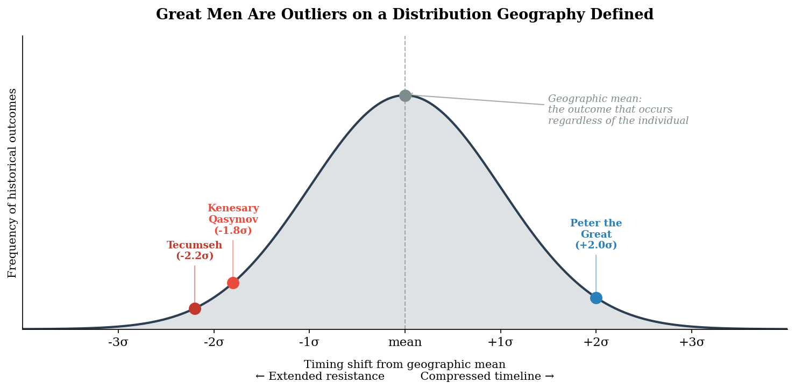

# Chapter 2: The Anti-Hero
### *The great man reframe, the method, and the toolkit*

---

## I. The Great Man Reframe

The great man theory of history fails two tests.

**The replication test.** If individuals were the primary driver of outcomes, similar patterns would not emerge independently in similar geographic contexts across cultures with no contact. But they do. River valley civilizations converge on bureaucratic states — on the Nile, the Tigris, the Indus, the Yellow River. Steppe peoples converge on horse confederacies. Chokepoint cities converge on mercantile cultures. Maritime peoples converge on naval power and trade networks.[^ch1-23] The convergence is not approximate. It is structural. The same terrain produces the same organizational logic, repeatedly, independently, across millennia.

There are hints that this convergence extends deeper than institutions — possibly into epistemology itself. Early civilizations that depended on reading the natural environment developed systematic pattern recognition, ritualized into divination, and the patterns they chose to read appear to map to their geographic context. River civilizations read the stars — predicting flood cycles was agriculture was survival. Steppe nomads read the earth — geomancy, sand patterns, terrain signs. Coastal peoples read wind and waves.[^ch1-24] If this pattern holds under rigorous comparative examination, it would suggest that even a civilization's way of knowing — how it thinks knowledge is structured and how hidden truths are accessed — reflects its geography. The convergence may go all the way down. That claim remains a hypothesis worth testing rather than an established finding, but the pattern is suggestive enough to name.

**The counterfactual removal test.** For any great man claim: remove the individual from history and ask whether the structural outcome changes within a generation.[^ch1-25]

Peter the Great is the test case on one end of the distribution. He compressed the timeline of Russian southward and eastward expansion by perhaps a generation. The geographic pressures driving that expansion — the warm-water port problem, the steppe frontier security problem, the technology differential accumulating through trade exposure — all predated Peter by centuries.[^ch1-26] Every Russian ruler faced the same constraints. Ivan IV tried for the Baltic. The trajectory was set. Remove Peter entirely and Russia still expands south and east within a generation, driven by the same geographic logic. Peter determined when and how. He did not determine whether.

Tecumseh is the test case on the other end. He extended the timeline of Native resistance by perhaps a generation. His strategy was explicitly geographic and political — he understood that fragmented resistance would be defeated piecemeal by a consolidated empire, and he independently derived the same unification logic the American founders had used.[^ch1-27] He was arguably the most strategically brilliant resistance leader of his era. He correctly diagnosed the problem, almost assembled the solution, and still could not overcome the structural differential. The technology gap, the population gap, and the organizational gap behind the expanding empire were too large. Remove Tecumseh and the resistance collapses slightly sooner. The outcome is identical.

Peter and Tecumseh are outliers on opposite tails of the same probability distribution. One is remembered as the great man who built an empire. The other is remembered as the tragic hero who could not save his people. Remove either and the outcome is essentially the same within a generation. The distribution does not notice.[^ch1-28]

*[Figure 1: The Great Man as Outlier](../../figures/fig-001-great-man-outlier.md)*

This is not a rebuttal of great man theory. It is a reframe. The strong version of great man theory — individuals as uncaused first movers who bend history by pure will — is wrong. But the hard determinist position — that the individual is irrelevant, that another person would have done exactly the same thing — is also wrong. It collapses variance to zero, and that is not how distributions work.[^ch1-29]

The actual model: geography and thermodynamic pressures define the probability distribution. Technology events shift the distribution. Great men are high-leverage draws from that distribution — they compress timelines, shape specific paths between locally stable states, and determine which of several probable outcomes actually occurs. But they operate within a constrained solution space they did not create.

This framing survives the hardest test cases. It survives Peter. It survives Tecumseh. It survives Hitler — Weimar Germany was a system under enormous structural pressure already selecting for authoritarian nationalist response; Hitler's specific pathologies shaped the specific path, but remove him and you almost certainly still get authoritarian Germany, even if the particular form that authoritarianism took might have differed.[^ch1-29a] It survives Timur, whose empire of skulls collapsed within two generations while the underlying geographic logic of Transoxiana reasserted itself in a cultural renaissance his grandchildren presided over but did not cause.[^ch1-30] Great men dam the river. They do not redirect it.

The framework's critique of great man theory deserves its most precise and most generous statement. The great man theory is valid microeconomics. At the transaction level — the specific decision, the specific moment, the specific individual whose specific qualities shaped which draw from the distribution actually occurred — the great-man framework has genuine explanatory power. Churchill's specific rhetorical gifts shaped how Britain experienced and narrated its resistance in 1940 in ways that mattered for morale and cohesion. Genghis Khan's specific military genius shaped the speed and completeness of the Khwarazmian collapse in ways that a less capable leader would not have produced. An Lushan's specific court position and the specific Yang family faction's specific actions shaped the timing and catastrophic scale of the Tang crisis. At the micro level, great individuals are real and their specific qualities produce real variance in outcomes.[^ch1-64]

The error is not the observation. The error is the extrapolation. Taking the valid micro observation — this specific person shaped this specific outcome — and generalizing it to a macro theory — history is primarily the product of exceptional individuals. That is the same error as observing that a specific rock in a specific riverbed created a specific eddy and concluding that rocks explain where rivers flow. The rock is real. The eddy is real. The rock's influence on that specific eddy is real and worth documenting. But the river's course was determined before the rock existed. The great man theory mistakes the rock for the river.[^ch1-65]

The framework's relationship to traditional historiography follows the same division of labor that economics institutionalized between macro and micro a century ago. Traditional historiography is microeconomics: it describes the specific transactions, the specific actors, the specific decisions, the specific prices at which specific exchanges occurred. Rich, detailed, often fascinating, essential for understanding what actually happened at the ground level. The framework is macroeconomics: it describes the aggregate forces, the structural conditions, the pressure differentials that determine the distribution of outcomes regardless of which specific transactions occur. Macroeconomics cannot tell you what happened in any specific market; microeconomics cannot tell you why the overall price level rises. Same division of explanatory labor. The historian focused on the succession crisis describes the random walk step. The framework describes the gradient the random walk is walking along. Both descriptions are true. Only one is explanatory. The river's macro gradient determines where it flows. The specific rocks in the specific riverbed determine exactly where the rapids form. Both worth knowing. Different questions. Different tools.[^ch1-66]

The framework's anti-great-man apparatus reaches naturally across domains beyond political-military great-man cases. Scientific intellectual history provides the cleanest available natural experiment for the overdetermined-outcome argument: simultaneous independent discovery of the same scientific framework by multiple receivers working with no direct communication. Newton developing his fluxions in the 1660s. Leibniz publishing his differential calculus in the 1680s. Two people on opposite ends of Europe, working independently, deriving the same mathematical framework within roughly the same decade. The priority dispute that consumed both their later years — and poisoned the Royal Society's relationship with continental European mathematics for decades — was arguing over who deserved credit for an invention that the intellectual substrate had already made inevitable. The pre-calculus substrate had assembled essentially every component over decades of European mathematical work: Fermat's tangent lines and maxima; Cavalieri's method of indivisibles; Barrow's fundamental theorem connecting differentiation and integration; Descartes' coordinate geometry; Wallis's infinite series. By 1660 the pressure differential between what mathematicians could almost do and what calculus would let them do was enormous. The gradient was pointing directly at calculus. Newton and Leibniz did not invent calculus from nothing. They crystallized what the substrate had made ready.[^ch1-67]

This produces a substantive reframe of scientific genius itself. The standard great-man-of-science narrative treats Newton as the uncaused first mover whose singular intellect produced the scientific revolution. The framework reads Newton as Shannon's most gifted decoder — the most sensitive receiver of his era, absorbing what the substrate had produced, synthesizing it with extraordinary precision, articulating the connections that everyone else was almost seeing. The greatest scientists are not the ones who think thoughts nobody else could have thought. They are the ones who think the thoughts the substrate has made ready before anyone else does and with more clarity than anyone else could have managed. Newton's specific gifts — mathematical training, philosophical sophistication, sustained analytical attention — produced real variance in outcomes; the specific formulation of calculus that became canonical owes substantially to the specific receivers who crystallized the substrate's signal. Extraordinary. Irreplaceable in his specific combination of gifts. Genuinely great by any meaningful definition. And overdetermined as an outcome. Stigler's law of eponymy — Stephen Stigler's 1980 empirical observation that no scientific discovery is named after its original discoverer — is the sociological-historical instantiation of the same pattern. If great-man-of-science theory were correct, naming conventions should track first-discoverers reliably. Empirically they do not. Discoveries are typically named after subsequent receivers who decoded the substrate signal with greater clarity than the original receiver and whose decoding spread more effectively through the scientific community. The substrate-prepared-receiver apparatus is what the framework predicts; Stigler's law is what subsequent empirical sociology of science observes; the convergence is substrate-resonance evidence operating in another domain.[^ch1-68]

### The Anti-Hero

A second category of individual action requires distinct treatment. Some individuals do not function as outlier draws on the distribution but as variance-mechanisms within it — actors whose locally rational calculation goes against the substrate flow with catastrophic consequences proportional to the system's accumulated potential. Call these anti-heroes. They are not necessarily evil; they are acting from within their own logic without perceiving the larger system they are embedded in.

The Shah of Khwarazm did not create the Mongol Empire. He accidentally unleashed it by executing Mongol trade envoys in 1218 CE, violating the institutional framework that had been managing the pressure differential between sedentary Persia and the rising Mongol confederation. The river was flowing. He built a dam in the wrong place. The dam broke catastrophically — the Mongol invasion that followed killed perhaps millions and reorganized the entire Eurasian landmass. Soviet engineers did not intend the Aral Sea's collapse; they were trying to grow cotton. The local calculation was rational. The systemic consequence was catastrophic because they were redirecting energy that the larger system had been managing sustainably. The Tang court minister Yang Guozhong did not create Tang decline; he triggered the An Lushan Rebellion in 755 CE by creating court conditions that left a loyal frontier commander no rational alternative to revolt. The river was flowing. He redirected it into a canyon. The flood was catastrophic — eight years of civil war, demographic disruption at continental scale, permanent damage to Tang centralized administration. The Yalta Conference in February 1945 — Roosevelt physically dying, Churchill negotiating from declining-British-power constraints he could not fully acknowledge, Stalin operating with singular clarity of purpose — produced the asymmetric-negotiating-capacity case of the anti-hero apparatus operating through a multi-actor diplomatic configuration. Exhausted great powers dividing post-war geography into spheres of influence based on the military positions of the moment, with two of the three parties operating under cognitive-capacity constraints that prevented optimal defense of their substrate-aligned positions. The canal dug in February 1945 was still generating floods forty years later — Korean War, Chinese Civil War outcome, Berlin crises, Cuban Missile Crisis, Vietnam War — all downstream of the specific territorial and influence arrangements agreed at the conference. The substrate-misalignment outcome emerged from the configuration of actors with unequal capacity at the decision-making moment rather than from any single actor's substrate-blindness.[^ch1-60]

The pattern is consistent: locally rational action against the substrate flow producing catastrophic consequences proportional to the energy the system had accumulated. Wu wei violated, in the Taoist vocabulary that names the mechanism precisely. The fundamental human problem is local optimization without perceiving the larger system. The river always wins; the only question is how catastrophically it reasserts itself when we try to redirect it.

This produces the framework's humility case. Geography sets the distribution. Geography does not eliminate variance within the distribution. The structural conditions for Tang decline were already present in the frontier-management and tributary-system strains of the late Tang; the An Lushan catastrophe was not thermodynamically inevitable in its specific timing and scale. Anti-hero action selected the worst draw from the available outcomes the substrate had defined. The framework is honest about this: it predicts the distribution; it does not predict which specific draw from the distribution actually occurs. The dam-vs-flow distinction operates on the substrate; the anti-hero specifies the variance mechanism within the distribution that selects catastrophic specific events.[^ch1-61]

The framework's complete apparatus for reading individual action in history has three categories. Great men are outlier draws on substrate-determined distributions — Peter, Tecumseh, Hitler, Timur, high-leverage individuals operating within the constrained solution space the substrate defines. Anti-heroes are variance-mechanism actors whose wu-wei-violating calculations select catastrophic draws from those distributions — the Shah, Yang Guozhong, the Soviet engineers, the Yalta configuration, the architects of various other locally-rational catastrophes. Substrate-aligned actors operate with the flow, achieving outcomes proportional to their substrate-alignment rather than to their personal capacity — the various successful dynasty-founders and reform-administrators whose accomplishments persist because they ran with rather than against the substrate. All three categories together produce the framework's reading of individual action. None of them creates the distribution. All of them operate within it.

A substantive analytical distinction operates within the framework's reading of violence in these categories. Targeted violence operates through substrate-aligned strategic logic — eliminating specific threats to maintained position, destroying specific infrastructure that would allow reconstitution of resistance, removing specific potential alternative power centers. Random violence operates as substrate-misaligned action without coherent strategic logic — terror as end rather than means. Both produce substantial body counts; the operational logic differs substantially. Genghis Khan's destruction of the Khwarazmian cities was targeted violence in the framework's sense — aimed at the institutional infrastructure that would have allowed reconstitution of organized resistance — not random barbarism though it produced random brutality as side effect. The framework's apparatus reads strategic-violence cases through the targeted-vs-random distinction as substantive analytical move; the moral judgment about the violence operates on what the apparatus has read accurately rather than on encoded simplifications that obscure the actual operational logic.[^ch1-69]

The framework is the tool for perceiving the larger system that wu-wei-violating actors systematically miss. The dissertation is the argument that the larger system is geographic and thermodynamic and legible if you use the right lens. The anti-hero is the recurring proof that ignoring the larger system has consequences proportional to its scale.

### The Optimization Trap

The anti-hero apparatus reads the discrete case where an actor's locally rational calculation operates against the substrate flow. A related but distinct dynamic operates whenever populations successfully optimize for specific stable conditions. The optimization is genuinely rational; the success is genuinely real; the optimization simultaneously creates dependencies that operate as catastrophic vulnerabilities when conditions change.[^ch1-62]

Borrowing vocabulary from computer science makes the mechanism more precise. Optimization through gradient descent — following the steepest local descent toward what looks like the lowest point — can produce trapped positions where the algorithm has no way to distinguish a local minimum (lowest point in immediate vicinity; every direction appears to go uphill) from a global minimum (lowest point in the entire landscape). The Southern Song commercial economy is a canonical case: every local decision was correct given the immediate gradient (specialize in high-value manufactured goods rather than grain; trade with the Jin for grain rather than producing it; tax maritime commerce rather than agricultural production; concentrate population in commercial cities). Each step followed the steepest local descent. The system settled into what looked like the optimal position — the most advanced commercial economy in the world during the 12th-13th centuries. The Mongol conquest revealed it was a local minimum rather than the global minimum. The previously-optimal position was maximally vulnerable rather than maximally productive once the substrate conditions that had supported the optimization changed.

What this implies for civilizational resilience is uncomfortable. The better you optimize for current conditions, the more vulnerable you become to the disruption that changes those conditions. The dependencies optimization creates are invisible during stable conditions and catastrophic when conditions change. The perceptual-temporal asymmetry is structural, not contingent — actor intelligence and strategic foresight cannot reliably distinguish substrate-aligned optimization (that will continue to operate when conditions change) from condition-specific optimization (that will collapse when conditions change). Both look identical during stable conditions. The distinction only becomes visible after disruption reveals it.

This gives the framework a three-metaphor toolkit. Thermodynamics explains the flow — populations and innovations following gradients toward equilibrium. The weather metaphor (the second metaphor articulated in the previous chapter) explains the multi-pressure-system interaction and emergent phenomena that pure flow dynamics do not capture. Gradient descent explains why the flow gets trapped — local optimization producing positions that look optimal from the local perspective but cannot escape disruption-revealed vulnerabilities. Each metaphor captures specific dynamics the others do not; deploying them together produces analytical reach no single metaphor alone provides.[^ch1-63]

The complement to the optimization trap is the cultural-moral apparatus that operates as regularization — penalizing pure optimization in favor of maintained generalizability across conditions. In machine learning, regularization prevents overfitting by adding penalty terms that discourage the model from optimizing too aggressively for the training data; the resulting model performs slightly worse on the training data and substantially better on previously unseen data. Cultural and moral frameworks perform structurally analogous work at civilizational scale. They look inefficient under stable conditions — they penalize pure optimization that would maximize performance under those conditions — but they preserve resilience apparatus that pure efficiency-optimization would have destroyed. Zhu Xi's Neo-Confucianism, emerging during the late Southern Song period, operated partly as regularization in this sense: the moral revival argued that pursuit of profit at the expense of Confucian values had produced cultural and spiritual shallowness; the penalty term it sought to add to the commercial optimization function was meant to preserve cultural-moral substrate that civilizational resilience requires. Whether the regularization was the right kind at the right moment is debatable; the instinct that pure optimization without countervailing values produces fragility is what the framework's apparatus predicts.

---

## II. The Methodology

A framework that operates across six thousand years and multiple evidentiary registers needs methodology that handles the variability honestly. The framework's approach is structurally similar to theoretical and experimental physics: theoretical apparatus generates predictions about what evidence should exist; multiple evidentiary instruments test the predictions; convergent confirmation across instruments establishes durable knowledge.[^ch1-46] Each discipline alone produces incomplete results. Together they produce reliable readings of cases neither could reach alone. Historical linguistics derives proto-languages from comparative analysis; archaeology and ancient DNA test the predictions; convergent confirmation across the three channels establishes the population history. The framework operates the same way across the cases it analyzes.

This methodology runs into a problem specific to historical analysis. Most surviving evidence is sender-side — produced by the literate administrative classes of sedentary civilizations, preserved by populations who valued their own records, encoded through institutional frameworks that flatten what they describe. The receivers — nomadic populations, pre-literate cultures, populations whose internal deliberations were never recorded — appear in the record only as endpoints of population movements or objects of administrative action. Their internal logic is structurally invisible to the standard documentary apparatus.

The framework's response is the *Rosetta Stone move*. Better-documented modern cases — Comanche encountering Spanish settlements, Kazakh nomads encountering Russian expansion, Sogdian merchants mediating Chinese-Persian contact — provide ground-level receiver-side evidence for how populations respond to specific types of pressure waves. The mechanisms are structural, not period-specific. A pre-documentary receiving population facing horse-enabled steppe pastoralists in 4000 BCE faces a structurally similar problem to a documented receiving population facing horse-enabled pressure waves in 1700 CE. The framework projects mechanisms from well-documented cases onto less-documented periods through principled inference from confirmed mechanism.[^ch1-47]

This is candid inference, not direct observation. The framework does not pretend to recover what specific pre-documentary populations actually thought, decided, or remembered. What it recovers is the *structural shape* of likely responses based on accumulated case evidence operating through the same mechanisms. The epistemic structure is closer to cosmology's reach into the early universe through cosmic microwave background measurements than to traditional historical scholarship's reliance on direct textual evidence: principled inference from mechanism plus boundary conditions, more than speculation, less than direct observation.[^ch1-48]

The framework generates falsifiable predictions in the mode of Ferdinand de Saussure's 1879 prediction of laryngeal consonants in Proto-Indo-European. Saussure derived the prediction from systematic analysis of gap patterns in daughter languages — purely theoretical, with no direct evidence at the time. Thirty-six years later, Hittite was deciphered, and the predicted sounds were attested. The methodology was validated by the gap between theory and confirmation, not despite it.[^ch1-49] The framework's predictive moves operate in the same mode: specific predictions about what evidence should exist, calibrated to be specific enough to fail. Several predictions are currently on record awaiting confirmation or refutation by future evidence.

Several specific methodological moves operate throughout the framework's analysis. *Reading the terrain instead of the sources* — geographic evidence has zero transmission hops while documentary evidence accumulates encoding distortion at each hop. *Treating silence as data* — the absence of records about a population is itself information about who was producing records and who was not. *Reconstructing engine hits from the shape of the craters* — surviving documentation often shows the negative space of suppressed perspectives even when those perspectives themselves did not survive. *Reading hypocrisy as encoding mismatch* rather than as moral failure — most apparent inconsistencies in historical actors are multiple locally-coherent frames running simultaneously without reconciliation.[^ch1-53] *Distinguishing process knowledge from physical artifact transmission* — some technologies transmit through observation alone, leaving no physical trail along the corridor; comparative linguistic descent patterns detect these transmissions where archaeology structurally cannot.[^ch1-52] *Reading paired positive-evidence and absence-as-data Wald-bomber-recovery cases* — the framework's Wald survivorship apparatus operates through both positive-evidence cases (recovered signal in surviving substrate-objective evidence) and absence-as-data cases (negative-space evidence from what the substrate-objective instrument does not detect); combination of the two modes is particularly robust. The 1–4 percent Neanderthal DNA in non-African modern humans is positive-evidence Wald-bomber-recovery through population-genetics evidentiary instrument; the absence of living Neanderthals is the paired absence-as-data signal of what happened to Neanderthal populations during the climate-oscillation contraction phases. Both modes operate as Wald-bomber-recovery; together they articulate the substrate-driven contact-and-displacement cycling dynamic the documentary record could never have captured.[^ch1-72]

Ancient DNA evidence operates as a third substrate-objective evidentiary instrument category alongside documentary and geographic evidence. Documentary evidence is sender-positioned — produced by specific senders with specific encoding choices; subject to Wald-bomber distortion. Geographic-terrain evidence has zero transmission hops — the terrain is the terrain. Ancient DNA evidence is substrate-objective in a specific technical sense — genetic ancestry traces persist regardless of documentary survival or sender-side decisions about what to record. Population-genetics analysis recovers what conventional historiography could never have captured. The Yamnaya genetic signature sweeping across Europe in the third millennium BCE is engine-hit material that the documentary record could not have produced; ancient DNA recovers it. Reich's lab and others have made the population-genetics evidence available across the framework's full temporal range — from the 50,000-year out-of-Africa expansion through the Bronze Age substrate transitions through the post-Mongol demographic substrate dynamics of various Eurasian populations. Convergent confirmation across the three substrate-objective evidentiary categories — geographic terrain plus documentary record plus ancient DNA — operates as particularly robust validation when all three categories engage the same prediction.[^ch1-73]

The substrate-objective instrument has a boundary worth stating precisely. Ancient DNA records that mixing happened, and in which direction it was asymmetric — but it does not record how the mixing was experienced. Voluntary exchange at a seasonal trade fair and violent conquest can leave the identical genomic signature; the male-biased admixture that marks so many expansions registers the asymmetry of power without registering whether that power was negotiated or imposed. The genome records the outcome, not the experience. The returning bomber is the surviving genetic mixture; the engine hit is the experience of the absorbed population, which the surviving signal cannot by itself recover. The instrument is itself terrain-gated: ancient DNA survives where cold and dryness preserve it and degrades where heat destroys it, so the evidentiary record runs thinnest exactly where the climate is harshest — the entire genetic picture of the Indus Valley Civilization rests on a single usable genome recovered from dozens of screened skeletons, because the subcontinent's heat leaves almost nothing to read. Geography shapes not only what happened but what of it survives to be recovered. And the instrument disciplines the framework's own predictions: when the framework's terrain logic suggested an African-migration origin for the Indus Valley population, the genome refused it, pointing instead to a deep local lineage that had diverged before farming existed. Logging that miss alongside the confirmations is what keeps the apparatus falsifiable rather than self-sealing.[^ch1-76]

The framework's three substrate-objective evidentiary instruments sort along two distinct axes. Along *encoding hops* — how many times the signal has been re-encoded by senders — terrain has none, the genome has near none, the documentary record has many. Along *temporal stability* — how much the instrument has drifted from the historical moment whose dynamics it records — historical geology is most stable across the framework's range (the Caucasus today is the Caucasus of the Proto-Indo-European expansion), the genome is frozen at the moment of mixing (a 3000 BCE Yamnaya genome records 3000 BCE Yamnaya admixture whether the steppe today still looks like 3000 BCE steppe or not), and current geomorphology is a reliable proxy for recent-historical terrain that breaks down at sufficient temporal depth (the Bering land bridge is gone; the Green Sahara is desert). The two axes do different work. The genome's specific epistemological role is *recovering the population-scale dynamics of terrain configurations that no longer exist in their original form* — the Wald-bomber flight recorder that survives when the original substrate does not. And the framework's strongest validation methodology is *two instruments detecting the same signal*: when the framework's terrain logic (top-down, from substrate-driven mechanism) and the substrate-objective evidentiary instruments (bottom-up, from population-genetics signature) converge on the same claim, the convergence is meaningful evidence because the two operate through completely different mechanisms on completely different evidentiary substrates.[^ch1-80]

Reich's ancient DNA produces unprecedented precision about *what* happened — population timestamps, ancestry proportions, specific admixture events. The framework's complementary contribution is the causal apparatus explaining *why* the genomic what has the specific shape it does. The two operate at different analytical levels; neither is complete without the other; the framework's role is explanatory rather than descriptive, and the genome's substrate-objective record disciplines the framework's predictions by allowing them to fail. The boundary on the genome as instrument sharpens further still: the genome records the *concentration* outcome of population events without recording *which mechanism* produced what fraction of the concentration. The Y-chromosome star-cluster pattern Reich documents in the Bronze Age stratification period can arise from direct sexual coercion, from arranged marriage based on rational household economic calculation, from status-driven reproductive access, from captive-taking, and from various combinations operating simultaneously. The genome records the asymmetry without recovering its mechanistic decomposition. The framework reads the substrate-driven bulk-pattern dynamics that produce the concentration; moral evaluation of the system the mechanism operated within is a different analytical level the framework deliberately does not occupy.[^ch1-81]

A note on the framework's institutional position. The academic citation incentive structure rewards work that concentrates within the sender-side documentary record. Tenure, peer review, and citation metrics all depend on dense citation of primary sources, which are almost entirely produced by the literate administrative classes of sedentary civilizations. The framework's apparatus — reading terrain instead of sources, treating silence as data, applying receiver-side methodology — is the kind of work the citation incentive structure cannot easily reward.[^ch1-50] This is partly why the dissertation operates outside the standard journal publication form. The framework is not less rigorous than the conventional approach. It is differently rigorous in ways the citation apparatus is not calibrated to recognize.[^ch1-51] The methodology also operates as a filter on the analytical claims it makes. Where a structural mechanism explains a pattern, the framework prefers the structural explanation over psychological or ideological causation that may be mistaking shared structural cause for direct causation between effects.[^ch1-54]

---

## III. The Toolkit

For this framework to be a theory rather than a belief, it must be falsifiable. There must be conditions under which it fails. We name them here.[^ch1-31]

The framework fails if similar geographies consistently produce divergent outcomes with no identifiable intervening variable. If two river valleys with comparable climate, outlet, and adjacency produce radically different civilizational outcomes, and we cannot explain why, the framework has a problem.

The framework fails if an individual demonstrably shifts a structural outcome — not merely the timing — beyond what the geographic distribution would predict. If removing one person from history changes not when something happened but whether it happened at all, the framework gives too little weight to individuals.

The framework fails if a technology that should collapse friction does not, for reasons the framework cannot accommodate. If the railroad arrives in a steppe context and the predicted inversion does not occur, something is wrong with the model.

We believe the framework survives these tests. But the tests must remain open. A theory that cannot be falsified is not a theory. It is a belief wearing the vocabulary of science.

We also acknowledge what the framework cannot do.[^ch1-32] History is an open system. It provides limitless trials and minimal reproducibility. We cannot generate actual distribution curves with real data. We cannot rerun the nineteenth century without the railroad and observe the difference. We cannot assign precise probabilities to historical outcomes. The parallel cases we use — Russia and America, the Nile and the Yellow River, the Comanche and the Kazakhs — function as natural experiments, but they are not controlled experiments. The convergence across independent cases is more than anecdote and less than proof. It is evidence at the level history can provide.

But we can do something that comes closer to experimental validation than most historical frameworks attempt. We can build the model on data we have examined and then test it against data we have not.[^ch1-33]

In practice, this means generating predictions before consulting the record. During the research for this book, the framework was developed primarily from Central Asian history — the steppe frontier, the railroad, the parallel conquests. When the research turned to the Silk Road's oasis cities — material the framework had never been trained on — the model predicted a specific sequence: that oasis cities sustained by glacial meltwater should decline during aridification periods, that imperial power projection into the region should contract as the logistical substrate dried up, and that renewed projection should correlate with subsequent wetter periods. The prediction was documented in a reference card before the confirming material was consulted.[^ch1-34a]

We should be honest about the base rate. The first element of the prediction — less water means fewer cities — is close to thermodynamically necessary. Any reasonable framework would predict it. The non-trivial predictions are the second and third: that imperial projection specifically should contract in correlation with the water supply (rather than continuing through alternative logistics), and that the correlation should show a cyclical pattern matching climate oscillation (rather than a one-way decline). These predictions distinguish the thermodynamic framework from simpler models. They are specific enough to have been wrong — and they were not.

This is holdout validation — the standard test in any predictive discipline. You build the model on a subset of the data. You test it on data the model has never seen. If the predictions validate, the model has explanatory power beyond its training set. If they do not, the model is overfit to the cases that built it.

The framework would have failed the holdout if: imperial projection had continued despite oasis collapse (meaning non-geographic factors overrode the water dependency), or if the Tang resurgence had occurred during a dry period rather than a wet one (meaning the climate correlation was spurious), or if no cyclical pattern existed (meaning the sequence was coincidental rather than climate-driven).[^ch1-34c] None of these obtained. The framework passed.

That does not prove it is correct. It demonstrates that it generates accurate predictions about cases it was not designed to explain — which is more than most historical frameworks can claim.

What we can do is name more variables than previous models, acknowledge the variance we cannot explain, state the conditions under which we would be wrong, and show that the framework predicts data it was not built from.[^ch1-34b] We borrow the discipline of statistical reasoning — distributions, falsifiability, counterfactual testing, holdout validation — without claiming to have the data of a controlled experiment. The discipline is in the thinking, not in the math. That is enough.

A note on the book's organization. Traditional history is arranged by time — events are meaningful because of their sequence. This book is arranged by geographic phenomenon — rivers, chokepoints, corridors, friction collapses — because the explanatory power lives in the gradients, not in the timeline. The Han Dynasty projection and the Tang Dynasty projection are not primarily interesting because one preceded the other. They are interesting because they represent the same thermodynamic phenomenon — a civilization reaching sufficient energy density to push against geographic friction — expressing itself twice with a recovery gap between. The gap is not empty time. It is the gradient recovering. Time is the medium through which gradients express themselves. The gradient is the cause.[^ch1-34d]

We can't rerun the nineteenth century without the railroad. But we can predict what we are about to learn and check whether we were right. That is what separates a theory from a belief.

---

## IV. The Distribution Applied

The framework makes a specific prediction. If geography shapes the probability distribution of outcomes, then the same geographic context subjected to the same technology shock should produce the same structural outcome — independently, without coordination, without contact.

In the 1860s through the 1880s, two events occurred simultaneously on opposite sides of the planet. The Russian Empire conquered the Central Asian steppe.[^ch1-34] The United States conquered the Great Plains.[^ch1-35] Same technology: railroad, firearms, telegraph. Same timeline. Same geographic type: open grassland that had sustained horse-based nomadic cultures for millennia. Same target culture: peoples who had rationally optimized for the terrain and whose military advantage depended on mobility across open space. Same resistance pattern: brilliant unifiers who correctly diagnosed fragmentation as fatal, built unprecedented coalitions, and still lost.[^ch1-36] Same economic warfare: the destruction of the resource base that made the nomadic optimization viable — Russia imposed cotton monoculture, America destroyed the buffalo herds.[^ch1-37] Same administrative outcome: colonial bureaucracy imposed on formerly stateless territory.

Neither empire was aware of the other's parallel campaign in any meaningful strategic sense. There was no coordination. There was no shared playbook. There was only the same terrain subjected to the same technology, producing the same result.

This is the thesis of the entire book, demonstrated in a single case. The distribution was set by geography. The technology collapsed the friction. The outcome was drawn from the distribution. The great men on both sides — the generals, the resistance leaders, the politicians — were high-leverage draws from a loaded distribution. They shaped the path. They did not create the destination.

The chapters that follow are the evidence.

---

*The river is old. The dams are new. Turn the page.*

---

## Notes

[^ch1-23]: On convergent political evolution in similar geographic contexts: Peter Turchin, *Ultrasociety: How 10,000 Years of War Made Humans the Greatest Cooperators on Earth* (Chaplin, CT: Beresta Books, 2016). Turchin's data on the independent emergence of similar state forms in similar terrains is the statistical backbone of this claim. See [Chapter 1 stub](stub.md) for the full source assessment.
[^ch1-24]: The observation that divination systems map to geographic context — river civilizations reading stars for flood prediction, steppe peoples reading earth signs, coastal peoples reading wind and waves — emerged from a Beta seminar discussion triggered by a passing reference to geomancy in Tasar's lecture. The AI surfaced the broad pattern; the human recognized its relevance to the geographic epistemology argument. See [ref 001](../../references/001-divination-as-geographic-epistemology.md).
[^ch1-25]: The counterfactual removal test as a formal analytical tool — remove the individual, ask if the structural outcome changes — draws on Niall Ferguson, ed., *Virtual History: Alternatives and Counterfactuals* (London: Picador, 1997). Ferguson argues that counterfactual reasoning is not idle speculation but a necessary condition for causal claims in history. See [ref 003](../../references/003-falsifiability-and-counterfactual-method.md).
[^ch1-26]: On pre-Petrine Russian expansion pressures: the steppe frontier was a chronic security problem predating Peter by centuries, and the southward/eastward trajectory was already in motion under Ivan IV and Catherine. See [ref 002](../../references/002-peter-great-counterfactual-test.md). For the pre-Petrine rebellions and Russian taxation of nomadic routes: Tasar, *Crossroads of Civilization*, lectures 16–18. See also [ref 006](../../references/006-pre-petrine-nomadic-taxation-rebellions.md).
[^ch1-27]: On Tecumseh's explicit unification strategy: the identification of Tecumseh rather than Sitting Bull as the structurally correct parallel to Kenesary Qasymov is documented in [ref 007](../../references/007-process-journal-tecumseh-aha.md), which also illustrates the human-AI correction loop described in the Prologue. Dan Carlin, *Hardcore History*, episode 4, "Romanticizing the Tribes," covers Tecumseh's strategic vision.
[^ch1-28]: The Peter/Tecumseh mirror — outliers on opposite tails of the same distribution, one compressing the conquest timeline, the other extending the resistance timeline, both irrelevant to the structural outcome — is developed in [ref 004](../../references/004-peter-tecumseh-mirror.md).
[^ch1-29]: The formulation "great men are high-leverage draws from a loaded distribution" — neither the uncaused first movers of strong Great Man Theory nor the interchangeable placeholders of hard determinism — is the book's central position on individual agency. It emerged from a Beta seminar discussion refining the anti-great-man argument through the Hitler test case. See [ref 026](../../references/026-great-men-as-high-leverage-draws.md).
[^ch1-29a]: The claim is narrowed from "fascist Germany" to "authoritarian Germany" following committee feedback ([issue #7](https://github.com/gotoplanb/geography-as-destiny/issues/7)). The structural pressures on Weimar (humiliation, hyperinflation, institutional collapse, geopolitical encirclement) were selecting for authoritarian nationalist response broadly, but the specific form — whether fascist, military-authoritarian, or something else — is contested. Ian Kershaw's work on the contingency of Hitler's specific rise would be the strongest counterargument. The narrower claim is defensible without Weimar historiography; the broader claim would require it.
[^ch1-30]: On Timur and the Timurid cultural renaissance: S. Frederick Starr, *Lost Enlightenment: Central Asia's Golden Age from the Arab Conquest to Tamerlane* (Princeton: Princeton University Press, 2013). Whether Timur represents a genuine counterexample to the framework — a great man who shifted structural outcomes, not merely timing — is an open question this book addresses in Chapter 10. See Charlie's committee feedback, [issue #3](https://github.com/gotoplanb/geography-as-destiny/issues/3).
[^ch1-31]: The falsifiability framework draws on Karl Popper, *The Logic of Scientific Discovery* (London: Hutchinson, 1959), for the principle that a theory must specify the conditions under which it fails. The specific falsification conditions stated here emerged from Alpha discussion. See [ref 003](../../references/003-falsifiability-and-counterfactual-method.md).
[^ch1-32]: The acknowledgment that history is an open system with limitless trials and minimal reproducibility — and the argument that probabilistic discipline is valuable even without experimental data — emerged from discussion about the epistemological status of the book's claims. See [ref 024](../../references/024-history-as-open-system.md).
[^ch1-33]: The R-squared framing — that the book is not replacing previous models but improving their explanatory power by adding omitted variables — emerged from a Beta seminar discussion connecting the river-as-optimization metaphor to statistical methodology. Great man history ≈ R² of 0.2; Diamond ≈ 0.5; the three-lens model aims higher. See [ref 023](../../references/023-river-as-regression-model-r-squared.md).
[^ch1-34d]: The reframe of time as medium rather than primary axis — "the gradient is the cause, time is the medium through which gradients express themselves" — emerged from a Beta seminar discussion about why the book is organized by geographic phenomenon rather than chronology. See [ref 087](../../references/087-time-as-medium-gradient-as-cause.md).
[^ch1-34a]: The holdout validation of the framework's predictive capacity is documented in [ref 054](../../references/054-climate-pulse-imperial-cycle-prediction.md) and [ref 055](../../references/055-holdout-validation-methodology.md). The prediction — that oasis cities sustained by glacial meltwater should decline during aridification, that imperial projection should contract as the logistical substrate dried up, and that renewed projection should correlate with wetter periods — was generated from thermodynamic first principles during the research for this book, before consulting the specific historical record that confirmed it. The sequence (Han peak → aridification → withdrawal → Niya abandoned; wetter period → Tang peak → Talas → withdrawal) is supported by Valerie Hansen, *The Silk Road: A New History* (Oxford: Oxford University Press, 2012), and by paleoclimatology research on Central Asian climate variability.
[^ch1-34b]: The holdout validation concept — building a model on examined data and testing it against unexamined data — is standard in predictive modeling. Its application to historical methodology is developed in [ref 055](../../references/055-holdout-validation-methodology.md). The key claim: the framework was developed primarily from Central Asian steppe history (semester 1 material); the Silk Road oasis predictions were generated from that framework before the Silk Road material (semester 2) was consulted.
[^ch1-34c]: The specific holdout failure conditions for the Silk Road predictions — imperial projection continuing despite oasis collapse, Tang resurgence in a dry period rather than a wet one, or no cyclical pattern — are documented in [ref 054](../../references/054-climate-pulse-imperial-cycle-prediction.md) and [ref 055](../../references/055-holdout-validation-methodology.md). The framework's predictions on the unexamined Silk Road material were specific enough to be wrong; they were not.
[^ch1-34]: On the Russian conquest of Central Asia: Alexander Morrison, *The Russian Conquest of Central Asia: A Study in Imperial Expansion, 1814–1914* (Cambridge: Cambridge University Press, 2021). Morrison is the spine source for the Russian side of the parallel conquests. His revisionist argument — that the conquest was ad hoc rather than strategically planned — strengthens the geographic-determinism thesis: if even the individuals were improvising, the structural outcome was terrain-driven. See [Morrison lit review](../../literature-review/morrison-russian-conquest.md).
[^ch1-35]: On the American conquest of the Great Plains: Hämäläinen, *Comanche Empire*; Richard White, *Railroaded: The Transcontinentals and the Making of Modern America* (New York: W.W. Norton, 2011). White's argument that the transcontinental railroads were economically irrational yet transformative parallels Morrison's argument about the ad hoc Russian conquest — on both sides, the structural outcome did not require competent execution. See [White lit review](../../literature-review/white-railroaded.md).
[^ch1-36]: On the Tecumseh Pattern — the recurring archetype of the brilliant unifier who emerges at the moment of existential threat, builds an unprecedented coalition, and still loses because the structural differential is too large: Tecumseh, Kenesary Qasymov, Sitting Bull, Vercingetorix, Boudicca. The pattern recurs wherever a sedentary empire with technological advantage expands into territory held by fragmented peoples. See [ref 005](../../references/005-tecumseh-pattern-archetype.md).
[^ch1-37]: On the destruction of the buffalo herds as deliberate policy: David Smits, "The Frontier Army and the Destruction of the Buffalo: 1865–1883," *Western Historical Quarterly* 25, no. 3 (1994): 313–38. On the parallel between buffalo destruction and Russian cotton monoculture as attacks on the economic foundation of nomadic geographic optimization: [ref 010](../../references/010-plains-nomadism-rational-optimization.md).
[^ch1-46]: The theoretical-experimental physics analogy for the framework's methodology — historical linguistics as theoretical, archaeology and ancient DNA as experimental, convergent confirmation across channels as validation — is developed in [ref 162](../../references/162-theoretical-experimental-physics-as-methodology-anthony-exemplar.md). Anthony's *The Horse, the Wheel, and Language* serves as the methodological exemplar a skeptical reader can be directed to.
[^ch1-47]: The Rosetta Stone move — using better-documented modern cases as receiver-side inference tools for pre-documentary periods — is developed in [ref 163](../../references/163-modern-cases-as-rosetta-stone-receiver-side-inference.md). The dissertation's accumulated case work (Plains, Silk Road, parallel conquests, contemporary cases) has methodological status, not just content status: the case library is the inference instrument for the deeper-time readings.
[^ch1-48]: The Big Bang epistemic barrier as analogy for the documentary horizon, and principled inference from mechanism plus boundary conditions as the framework's epistemic category, are developed in [ref 160](../../references/160-lingua-francas-as-recurring-universes-big-bang-epistemic-barrier.md). The framework operates in the same epistemic category as cosmology, evolutionary biology, and other mature scientific fields that reach beyond direct observation through principled inference.
[^ch1-49]: The Saussure-Hittite case — 1879 prediction confirmed by 1915 decipherment — is developed in [ref 167](../../references/167-saussure-laryngeals-inverse-wald-bomber-prediction-validation.md). The case is the framework's clearest exemplar for the methodological claim that theoretical prediction can produce durable historical knowledge confirmed by independent evidentiary instruments operating decades after the prediction was made.
[^ch1-50]: The structural critique of academic citation incentives as a sender-side bias generator is developed in [ref 154](../../references/154-citation-incentives-as-sender-side-bias-generator.md). Primary sources are almost entirely produced by literate administrative classes of sedentary civilizations; the engine hits left no primary sources; the citation incentive structure rewards work that concentrates in the surviving sender-side record. See also [ref 064](../../references/064-wald-survivorship-bias-returning-bomber.md) on the underlying Wald survivorship-bias mechanism.
[^ch1-51]: The renegade historian methodological position — operating outside the academic incentive structure deliberately, in order to do the kind of analysis that incentive structure makes structurally difficult — is developed in [ref 155](../../references/155-renegade-historian-methodological-position.md). The framework is differently rigorous, not less rigorous; citation density is one rigor metric among several.
[^ch1-52]: The process-knowledge-vs-physical-artifact transmission distinction — and language as the Wald bomber's flight recorder for transmission events that left no physical trail — is developed in [ref 168](../../references/168-wheels-process-knowledge-vs-artifact-transmission-language-as-flight-recorder.md). Comparative linguistic evidence detects transmissions that artifact-based archaeology structurally cannot recover.
[^ch1-53]: Reading hypocrisy as encoding mismatch rather than as moral failure — multiple locally-coherent frames running simultaneously without reconciliation — is developed in [ref 148](../../references/148-hypocrisy-as-encoding-mismatch-not-moral-failure.md). The encoding-mismatch reading does not exculpate; it makes the behavior legible in a way pure moral condemnation cannot. The methodology travels: changing frames is more effective than shaming structural encoding mismatches.
[^ch1-54]: The framework's preference for structural over psychological causation — and the diagnostic for spurious correlation through geographic common cause — are developed in [ref 178](../../references/178-terrain-produces-both-variables-spurious-correlation-multilingualism.md) and [ref 175](../../references/175-naming-impulse-sedentary-nationalism-projection-iroquois-case.md). The framework reads structure first; psychological intermediaries get invoked only where structure alone is insufficient.
[^ch1-60]: The anti-hero concept — actors whose locally rational calculation goes against the substrate flow with catastrophic consequences proportional to the system's accumulated potential — is developed in [ref 230](../../references/230-anti-hero-wu-wei-violated-framework-humility-locally-rational-action-against-flow.md). The card distinguishes anti-hero from anti-great-man: anti-great-man addresses individuals as outliers on substrate-determined distributions; anti-hero addresses individuals as variance-mechanism within those distributions. The cross-civilizational pattern (Shah of Khwarazm and the Mongol invasion 1218 CE; Yang Guozhong and the An Lushan Rebellion 755 CE; Soviet engineers and the Aral Sea collapse 1960s onward; Sykes and Picot and the modern Middle East 1916 onward) operates as same structural mechanism in radically different specific contexts. The Buddhist/Taoist wu wei apparatus provides the substantive language for the mechanism — the anti-hero violates wu wei by acting against the flow without perceiving the flow's direction or magnitude; the framework's apparatus and the Buddhist/Taoist apparatus read the same underlying mechanism through different specific vocabularies.
[^ch1-61]: The framework's humility case — geography sets the distribution but does not eliminate variance within the distribution; the substrate-determinism apparatus is probabilistic, not deterministic at the specific-event level — is developed in [ref 230](../../references/230-anti-hero-wu-wei-violated-framework-humility-locally-rational-action-against-flow.md), building on the macro-deterministic / micro-unpredictable distinction articulated in [ref 223](../../references/223-from-river-to-weather-framework-central-metaphor-pressure-systems-surface-friction-emergent-phenomena.md) and the methodological self-discipline of definitional limits articulated in [ref 225](../../references/225-roman-institutional-software-bosphorus-hardware-continuity-debate-methodological-limits.md). The framework's three-category apparatus for reading individual action in history (great men as outliers; anti-heroes as variance-mechanism; substrate-aligned actors operating with the flow) is articulated across [ref 213](../../references/213-marcus-aurelius-sender-position-philosophical-form-triangulation.md), [ref 217](../../references/217-coercive-unification-vs-legitimating-sustainment-qin-timur-mongol-pattern.md), [ref 226](../../references/226-reunification-substrate-driven-inevitability-sui-tang-recursive-cycle-tang-cosmopolitan-flowering.md), and [ref 230](../../references/230-anti-hero-wu-wei-violated-framework-humility-locally-rational-action-against-flow.md).
[^ch1-62]: The risk-invisibility-during-optimization principle — when conditions support optimization, dependency on those conditions feels like smart economics rather than strategic vulnerability; risk only becomes visible when conditions change — is developed in [ref 237](../../references/237-risk-invisibility-optimization-southern-song-commercial-boom-government-revenue-intoxication.md). Builds on the commercial-specialization-strategic-vulnerability pattern articulated in [ref 235](../../references/235-pressure-equalization-trade-establishment-song-jin-hangzhou-commercial-specialization-vulnerability.md). The Southern Song commercial economy and the Comanche horse-based commercial economy operate as cross-civilizational structural-equivalence cases of the same optimization-vulnerability mechanism in radically different specific contexts.
[^ch1-63]: The local-minimum-trap and regularization concepts extending the framework's analytical apparatus with machine learning vocabulary are developed in [ref 238](../../references/238-local-minimum-trap-regularization-machine-learning-apparatus-neo-confucianism-resilience-penalty.md). The three-metaphor apparatus (thermodynamics explains the flow; gradient descent explains why the flow gets trapped; regularization explains why cultural and moral frameworks that seem inefficient are actually doing load-bearing resilience work) extends the central-metaphor refinement articulated in [ref 223](../../references/223-from-river-to-weather-framework-central-metaphor-pressure-systems-surface-friction-emergent-phenomena.md) with the explicit machine learning dimension. Neo-Confucianism as canonical regularization case operates as one analytical lens among multiple scholarly framings of the Neo-Confucian phenomenon; the regularization framing makes explicit the analytical mechanism through which the moral-revival operates as resilience apparatus rather than as merely aesthetic-philosophical preference.
[^ch1-64]: The generous-critique articulation of great man theory — conceding the framework's micro-level validity (specific individuals shaped specific outcomes through specific qualities) while identifying the specific error as macro-level extrapolation — is developed in [ref 244](../../references/244-great-man-theory-as-valid-micro-error-is-extrapolation-rock-vs-river.md). The three illustrative micro-level examples (Churchill 1940, Genghis Khan in the Khwarazmian campaign, An Lushan in the Tang crisis) are chosen for accessibility rather than as load-bearing specific claims; each can be argued either way at the micro level, and the framework should hold the examples lightly. The framework's anti-great-man critique sharpens substantially when articulated in this generous form: the disagreement is located at the extrapolation step, not at the underlying observation. This methodological move — concede what the critiqued tradition observes correctly; identify what it overgeneralizes; name the specific error — operates as the framework's general pattern for engaging with disagreed-with traditions and matches Charlie's v1.1 acceptance criterion that the framework position itself as additive to existing scholarship rather than displacement.
[^ch1-65]: The rock-vs-river apparatus — the river's macro gradient determines where it flows; the specific rocks in the specific riverbed determine exactly where the rapids form — is developed in [ref 243](../../references/243-macroeconomics-analogy-description-vs-explanation-complementary-tools.md) and made structurally specific to the anti-great-man critique in [ref 244](../../references/244-great-man-theory-as-valid-micro-error-is-extrapolation-rock-vs-river.md). The apparatus extends the framework's river-metaphor toolkit (per [ref 223](../../references/223-from-river-to-weather-framework-central-metaphor-pressure-systems-surface-friction-emergent-phenomena.md)) with the macro/micro distinction: the gradient is macro, the rocks are micro, both are real, only the gradient is explanatory for the river's overall course. Great individuals are rocks. Terrain is the river. The rock shapes the eddy. The rock does not explain the river's course. The great man theory mistakes the rock for the river.
[^ch1-66]: The macro/micro economics analogy as canonical division-of-labor model for the framework's relationship to traditional historiography is developed in [ref 243](../../references/243-macroeconomics-analogy-description-vs-explanation-complementary-tools.md). The micro/macro causation distinction — random walk steps around a terrain-determined trend line — is developed in [ref 242](../../references/242-micro-macro-causation-random-walk-on-terrain-gradient.md). Both descriptions are true; only one is explanatory. The framework does not displace traditional historiography; it does what traditional historiography structurally cannot do. The macroeconomics analogy positions the framework as additive to existing scholarship in the same way macroeconomics is additive to microeconomics within economics itself. Caveat on the analogy's epistemic baggage: macroeconomics is famously contested as an explanatory enterprise; the analogy is illuminating about the *division of labor*, not about the *epistemic certainty* of macro-level claims. See Appendix C entry 14 for the macroeconomics primer.
[^ch1-67]: The Newton/Leibniz simultaneous discovery of calculus as natural experiment for the framework's overdetermined-outcome argument is developed in [ref 245](../../references/245-newton-leibniz-simultaneous-discovery-substrate-prepared-receiver-shannon-decoder.md). The pre-calculus substrate enumeration (Fermat, Cavalieri, Barrow, Descartes, Wallis) is the canonical European mathematical-substrate trace; the framework should note the deeper substrate trace extends through Kepler's planetary motion, Galileo's kinematics, medieval-Islamic and ancient-Greek precursors (Archimedes' method of exhaustion; the Madhava-of-Sangamagrama Kerala school's infinite series in the 14th century). The fuller substrate trace strengthens rather than weakens the framework's case — the gradient was operating across multiple centuries and civilizations before Newton and Leibniz crystallized the unifying framework. The simultaneous-discovery natural-experiment apparatus generalizes to multiple other scientific cases: Darwin/Wallace (natural selection); Mendeleev/Meyer (periodic table); Einstein/Lorentz-Poincaré pre-substrate (relativity); various others. Each case operates as substantive holdout test for the framework's overdetermined-outcome apparatus extending into scientific intellectual history.
[^ch1-68]: The substrate-prepared-receiver apparatus — great scientists as Shannon's most gifted decoders of signals the intellectual substrate has already been transmitting — is developed in [ref 245](../../references/245-newton-leibniz-simultaneous-discovery-substrate-prepared-receiver-shannon-decoder.md). The apparatus extends the framework's Shannon receiver-side methodology (per Chapter 1 Section III; Appendix C entry 1) from population-level reception of geographic/technological pressures to individual scientific genius itself. Stigler's law of eponymy is documented in Stephen Stigler, "Stigler's Law of Eponymy," *Transactions of the New York Academy of Sciences* 39, no. 1 (1980): 147-157. The framework reads Stigler's empirical observation as substrate-resonance convergence — the sociological-historical pattern Stigler observed matches the framework's substrate-prepared-receiver prediction. Stigler himself was applying his law reflexively (Robert Merton observed the pattern before Stigler did), which is itself an instance of the pattern operating recursively. The framework's reframe of scientific genius is structurally generous-critique (per [ref 244](../../references/244-great-man-theory-as-valid-micro-error-is-extrapolation-rock-vs-river.md)): concede the micro-level validity (Newton's specific gifts produced real variance; the specific formulation matters); identify the error as macro-level extrapolation (treating Newton as uncaused first mover); deploy the framework's apparatus to address the macro-level question (substrate gradient determines destination; specific receiver shapes specific path). Newton becomes the canonical scientific-domain instantiation of the same pattern Peter the Great and Tecumseh demonstrate in political-military domains.
[^ch1-69]: The targeted-vs-random violence analytical distinction is developed in [ref 256](../../references/256-stalin-genghis-both-tremendously-intelligent-marginal-environments-selecting-for-strategic-intelligence-barbarism-encoding-obscures-sophistication.md). The card's broader argument articulates the framework's intellectual-honesty methodological commitment — analytical accuracy over moral comfort when the two conflict; substrate-aligned strategic competence should not be dismissed as idiocy or barbarism when reading historical actors. The Yalta Conference as anti-hero case operating through asymmetric-negotiating-capacity rather than through single-actor substrate-blindness is developed in [ref 254](../../references/254-yalta-as-sykes-picot-of-wwii-exhausted-great-power-divides-the-map-asymmetric-negotiating-capacity-vs-confident-ignorance.md) — "Yalta is the Sykes-Picot of WWII" as substantive cross-case framework pattern (exhausted-great-powers-divide-the-map). The substrate-precondition / substrate-aligned-action pairing (Yalta producing the substrate-conditions Stalin's August 1945 timing exploited) is developed across [ref 253](../../references/253-soviet-pacific-campaign-august-1945-thermodynamic-redirect-stalin-as-substrate-aligned-timing-three-weeks-redirecting-seventy-five-years.md) and [ref 254](../../references/254-yalta-as-sykes-picot-of-wwii-exhausted-great-power-divides-the-map-asymmetric-negotiating-capacity-vs-confident-ignorance.md).
[^ch1-72]: The paired Wald-bomber-recovery articulation (positive-evidence + absence-as-data) is developed in [ref 261](../../references/261-reich-neanderthal-dna-altai-as-deep-time-robust-frontier-saussure-mode-prediction-confirmed-thermodynamic-displacement-with-genetic-legacy.md) and [ref 263](../../references/263-congo-river-chimp-bonobo-geographic-barrier-speciation-contact-phase-vs-contraction-phase-cycling-dynamic-paired-wald-bomber-recovery.md). The contact-phase-vs-contraction-phase cycling-dynamic apparatus (resource-abundance phases produce contact-and-mixing; resource-contraction phases produce competitive-displacement; same populations interact differently under different resource conditions) operates substantively in the Neanderthal-modern-human encounter case. The thermodynamic-displacement-with-genetic-legacy framing — "Not genocide. Not peaceful blending. Thermodynamic displacement with genetic legacy" — articulates the substrate-driven dynamic between the extreme framings of genocidal-extermination and peaceful-blending. The Wald survivorship apparatus extends substantially through ancient DNA evidentiary instrument into pre-documentary archaic-population engagement; the Neanderthals as engine hits and the 1–4 percent Neanderthal DNA as recovered signal articulates the apparatus operating at 50,000+ year temporal scale that the documentary record could never have engaged.
[^ch1-73]: The ancient DNA as third substrate-objective evidentiary instrument category articulation is developed in [ref 258](../../references/258-reich-book-as-systematic-wald-bomber-recovery-source-saussure-mode-prediction-validation-territory-for-framework.md). The framework's apparatus now operates with three substrate-objective evidentiary instrument categories alongside documentary evidence: geographic-terrain evidence (zero transmission hops; substrate is the substrate); ancient DNA evidence (substrate-objective in the technical sense that genetic-ancestry traces persist regardless of documentary survival or sender-side decisions about what to record); various other emergent substrate-objective evidentiary categories. Convergent confirmation across multiple substrate-objective categories operates as particularly robust validation; the Saussure-mode prediction-validation methodology (Section IV of Chapter 11) extends naturally across the three categories. Reich's *Who We Are and How We Got Here* (2018) operates as the canonical contemporary synthesis of ancient DNA evidence; future framework engagement with substantive Reich-arc material continues producing prediction-validation cases across multiple specific framework predictions.
[^ch1-76]: The boundary on the ancient-DNA instrument — *the genome records the outcome, not the experience* — and male-biased (sex-asymmetric) admixture as the genomic record of asymmetric power are developed in [ref 270](../../references/270-reich-ancestry-and-sexual-dominance-venture-capital-risk-takers-need-backing-male-biased-admixture-as-genomic-record-of-asymmetric-power-genome-records-outcome-not-experience.md); the male-biased Bronze Age steppe signal is quantified in Goldberg et al. 2017 (*PNAS*), with Lazaridis and Reich debating the magnitude while accepting the direction. The terrain-gating of the evidentiary record (DNA preservation as a function of climate; the Indus Valley Civilization's genetic picture resting on the single Rakhigarhi genome, Shinde et al. 2019 *Cell*) and the honest hit-and-miss scoring of framework predictions against new evidence — including the framework's clean miss on an African-origin hypothesis for the Indus Valley population — are developed in [ref 271](../../references/271-reich-indus-valley-civilization-genetics-aasi-plus-iranian-related-pre-farming-divergence-ivc-as-deep-time-robust-substrate-not-erased-dave-hypotheses-scored.md). The boundary pairs with the intellectual-honesty commitment of Chapter 11 Section VII: the framework reads the substrate-driven outcome accurately and does not let the recoverable outcome stand in for the unrecoverable experience.
[^ch1-80]: The framework's meta-synthesis articulating migration-as-pressure-wave (not clean linear event), the genome as the second-least-encoded channel, the Wald-bomber flight-recorder extension recovering populations who did not survive to write, and *two instruments detecting the same signal* as the framework's general validation methodology is developed in [ref 273](../../references/273-reich-arc-meta-synthesis-migration-as-pressure-wave-not-clean-linear-event-genome-as-receiver-side-uncontaminated-signal-wald-bomber-flight-recorder-two-instruments-detecting-same-signal.md). The temporal-stability axis distinct from the encoding-hops axis, historical geology as the deepest substrate-objective signal across the framework's temporal range, paleogeography reconstruction as a discrete evidentiary category, and the genome's specific role as the record of terrain that has since changed are developed in [ref 274](../../references/274-genetics-frozen-in-time-vs-geography-subtly-changing-historical-geology-as-deepest-substrate-genome-as-record-of-terrain-that-has-since-changed.md).
[^ch1-81]: The description-vs-explanation distinction (extending [ref 243](../../references/243-macroeconomics-analogy-description-vs-explanation-complementary-tools.md)'s macroeconomics analogy) applied specifically to genomics — Reich's aDNA produces unprecedented descriptive precision; the framework provides the causal apparatus explaining why the descriptive *what* has the specific shape it does; mutual contribution rather than competition — is developed in [ref 276](../../references/276-description-vs-explanation-genome-records-what-framework-explains-why-thermodynamics-as-deepest-foundation-reich-and-framework-as-mutual-contributors.md). The multi-mechanism convergence refinement of card 270's outcome-not-experience boundary (the genome records the concentration without recovering which mechanism produced what fraction; multiple distinct mechanisms produce identical genomic signatures), the horse-economy stratification cycle as the bulk-pattern producer of the Y-chromosome star cluster (Karmin et al. 2015 *Genome Research*; Batini et al. 2017 *Nature Communications*), the Comanche-Yamnaya cross-continental parallel at the genomic-outcome scale extending [ref 195](../../references/195-koryos-and-comanche-parallel-evolution-federation-from-raiding-range.md)'s koryos parallel-evolution apparatus, and moral evaluation as a separate analytical level from mechanistic description are developed in [ref 281](../../references/281-y-chromosome-star-cluster-inequality-multi-mechanism-convergence-horse-economy-stratification-cycle-comanche-yamnaya-cross-continental-parallel-moral-evaluation-separate-from-mechanism.md).
