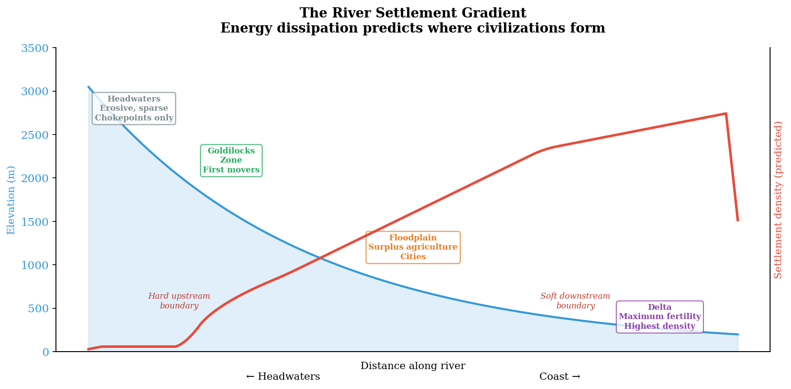

# Chapter 2: The River Spine
### *How water builds states — and class structures*

---

## I. The Physics

A river is a thermodynamic system. Gravity provides the potential energy. The terrain determines the path. The gradient — the rate of elevation change per unit distance — determines everything else: velocity, erosive power, sediment carrying capacity, and the conditions for human settlement.

At the headwaters the gradient is steep. The water moves fast, cuts deep, strips material from the banks and bedrock. V-shaped valleys. Unstable terrain. Nothing stays in place long enough to accumulate. You cannot farm erosion.

As the river descends the gradient flattens. Velocity drops. The water can no longer carry everything it collected upstream. Sediment begins to deposit. Valleys widen. Floodplains emerge — flat, fertile, annually renewed by the same process that stripped the headwaters bare.

By the delta the energy is nearly exhausted. The river releases everything it carried across hundreds or thousands of miles. The sediment accumulates in layers. The soil deepens. The fertility is extraordinary — charged by the entire upstream watershed and discharged at the coast like a battery reaching its terminal.

This is not a metaphor for civilization. It is the mechanism that produces civilization.[^ch2-1] The physics of energy dissipation along a gradient determines where humans can farm, where they concentrate, what kind of societies they build, and — as we will see — who has power over whom.

---

## II. The Settlement Gradient

The physics predicts a settlement pattern, and the archaeological record confirms it across every major river civilization on Earth.

**Headwaters:** Too energetic, too erosive, too unstable for sustained agriculture or grazing. The water cuts faster than vegetation can establish. Animals need relatively level terrain with consistent grass cover — the headwaters strip that away. Population is sparse. What settlement exists is strategic rather than agricultural: chokepoints, defensive positions, passes. Gandhara sits at the headwaters of the Indus not because the farming is good — it is not — but because it commands the intersection of four routes connecting India, Central Asia, China, and Kashmir.

**Middle river:** The energy moderates. Valleys widen enough for early agriculture. The terrain is elevated enough for defense and flood safety, low enough for reliable water access. This is the Goldilocks zone — not too hot, not too cold — and it is where first movers settle. The earliest known habitation along most river systems clusters here, in the zone where the gradient is manageable but the resources are sufficient.

**Lower floodplain:** Energy dissipating. Silt depositing annually. Flat, fertile, flood-prone terrain that rewards intensive agriculture but demands sophisticated water management. This is where surplus is produced — the agricultural output that enables cities, bureaucracies, armies, and monuments. But it is also more vulnerable: flooding can destroy a season's work, and defense is harder on flat ground without natural barriers.

**Delta:** Maximum deposition, maximum fertility, maximum density. The great urban civilizations cluster here — where the river has fully discharged its energy and the accumulated sediment of the entire watershed creates the richest agricultural substrate on the planet. Memphis on the Nile. Ur and Eridu at the mouth of the Tigris-Euphrates. The Mekong Delta. Every delta is a sediment battery fully discharged.

*[Figure 3: The River Settlement Gradient](../../figures/fig-003-river-settlement-gradient.md)*

This gradient is not approximate. It is testable. Take any river system on Earth — the Nile, the Indus, the Yellow River, the Tigris-Euphrates, the Mekong, the Mississippi — and map settlement density against elevation gradient. The pattern should hold: sparse at the headwaters, concentrated at the floodplain and delta, with first-settlement dates earliest in the middle zone.

The pattern should also be asymmetric.[^ch2-2] The cost of being too far upstream — erosion, flooding, steep terrain — is more immediately catastrophic than being too far downstream, which degrades more gradually through waterlogging and flood-management challenges. Archaeological sites should cluster with a hard upstream boundary and a softer downstream boundary — a signature of the underlying physics that can be checked against digital elevation models and excavation records without any cultural theory at all.

---

## III. How the River Builds the State

A river that is long, narrow, and predictable does something no other geographic feature does: it binds a population economically along a single axis and makes centralized administration not merely possible but inevitable.

The Nile is the prototype.[^ch2-3] A single river running through a narrow valley — rarely more than a few miles wide between the desert margins — for over a thousand miles. Everyone lives within walking distance of the same water source. Everyone's agricultural cycle is governed by the same flood. Everyone's surplus moves along the same channel. The economic life of the entire population is linear, synchronous, and interdependent.

This creates coordination problems that can only be solved at scale. When the flood arrives, who gets water first? When the grain is harvested, how is it stored and distributed? When the river changes course — as rivers do — who adjudicates the property disruption? The farmer cannot solve these problems alone. The village cannot solve them without reference to the villages upstream and downstream. The problems are structurally linear — they extend along the river — and the solutions must be linear too.

The bureaucratic state is the solution. The tax collector who walks the same linear path every year. The calendar that predicts the flood. The granary that stores the surplus. The scribe who records who owes what to whom. None of this requires a visionary king to invent. It requires a river that creates the problems for which centralized administration is the only available answer.

The five variables that make a river a state-builder:

**Climate suitable for surplus agriculture.** The river must flow through latitudes where growing seasons are long enough to produce more food than the population consumes. The Nile, the Tigris-Euphrates, the Indus, and the Yellow River all run through temperate to subtropical zones where two crops per year are possible. The Volga does not — its latitudes are too cold, its seasons too short for the surplus agriculture that drives state formation.[^ch2-4]

**A linear organizing feature.** The geometry matters. A river is linear — it creates a spine along which population concentrates, trade flows, and administration extends. A lake is radial — it distributes population around a perimeter at roughly equal distance from the resource, with no upstream advantage, no chokepoint to control, no natural hierarchy. The linear geometry of the river maps almost directly onto the hierarchical geometry of the state.

**A predictable cycle that rewards planning.** The Nile flood arrives on schedule. The farmer who predicts it eats. The farmer who plans around it produces surplus. The civilization that coordinates the prediction — through astronomy, calendar-keeping, and bureaucratic communication — dominates. Predictability is what makes planning superior to improvisation, and planning at scale is what states do.

**A connected outlet to broader networks.** The Nile reaches the Mediterranean. The Tigris-Euphrates reach the Persian Gulf. These outlets connect river civilizations to the broader trading world — making the surplus produced by the river exchangeable for goods the river valley cannot produce. The Volga drains into the Caspian — a landlocked sea with no ocean connection — which dramatically limits the commercial logic of urban development along it. The Volga produced the Khazar Khaganate — a sophisticated, cosmopolitan trading state that controlled the lower corridor for centuries — but never a grain empire on the Nile's scale. Weaker geographic incentives produced a weaker, more commercial expression of the river-spine logic.

**Favorable adjacency.** What is next to the river matters as much as the river itself. The Nile has desert on both sides — which means the valley is defensible, the population is contained, and there is no competing resource gradient to draw people away. The Volga's entire basin is the western edge of the great Eurasian steppe — which selects for mobility rather than sedentism. The Amazon's adjacency is impenetrable tropical forest with nutrient-poor soil — which provides no reason to leave the canopy for the riverbank.

---

## IV. How the River Builds the Hierarchy

The settlement gradient is not merely spatial. It is temporal — and the temporal sequence produces social stratification.

The first people to arrive at a river system do not settle at the delta.[^ch2-5] They settle in the Goldilocks zone — the middle river, where conditions are manageable and the terrain is defensible. They establish, consolidate, and hold. Over generations, they develop the early forms of agriculture and social organization that the moderate environment permits.

Late arrivals find the Goldilocks zone occupied. They are pushed toward the margins — downstream, toward the lower floodplain. This terrain is more fertile but more vulnerable. The flooding is more severe. The water management is more demanding. The defense is harder on flat ground. But the productivity, once managed, is extraordinary.

The people with less political power end up doing the hardest and most productive agricultural work in the most fertile but most dangerous terrain. The early middle-river settlers become the landed aristocracy — they hold the defensible high ground and the moderate conditions. The late-arriving lowland farmers become the agricultural labor force — they produce the surplus that the entire civilization depends on, extracted by those who control the administrative infrastructure from above.

This is not a moral judgment. It is a geographic observation. The river gradient creates a succession dynamic, and the succession dynamic produces class. The people who arrived first claimed the optimal terrain. The people who arrived later filled the productive-but-vulnerable terrain below. The resulting hierarchy — administrators above, producers below — maps onto the physical geography of the river itself.

Mesopotamia confirms this almost perfectly. The earliest settlements — the Ubaid period — are in the middle zones. The great Sumerian city-states emerge later in the southern alluvial plain, the lowland overflow zone, controlled by priestly and administrative classes who manage the irrigation infrastructure and extract the surplus. The class structure of Sumer is legible in the elevation profile of the Tigris-Euphrates.

Egypt confirms it through the Saharan pump.[^ch2-6] When the green Sahara desertified roughly five thousand years ago, populations were pushed toward the remaining water gradients. The Nile was the primary attractor — the only major river punching north through the emerging desert. The people who arrived first claimed the middle Nile's moderate conditions. Later arrivals — pushed by continuing desertification — filled the lower floodplain and became the agricultural workforce whose surplus built the pyramids.

The timing correlation is tight enough to suggest causation. Egyptian civilization emerges roughly five thousand years ago. The final Saharan desertification completed roughly fifty-five hundred years ago. The river didn't just organize people linearly. It trapped them in a productive but bounded space where increasing population density — driven by external climate pressure — could only be managed through increasing organizational complexity.

Egypt is not a choice. It is a funnel. The people did not decide to build a civilization. They were squeezed into a geography that made civilization the only remaining option.

---

## V. The Counter-Cases

The framework is falsifiable. Not all rivers build states. The specific reasons they fail illuminate what makes the model work.

**The Amazon.**[^ch2-7] One of the largest rivers on Earth. It does not produce a river-spine civilization. The reason is not insufficient water — it is too much water in the wrong environment. The nutrient cycle in the Amazon basin is almost entirely above ground, in the forest canopy. The soil beneath is nutrient-poor laterite — the moment you clear the forest, the nutrients wash away in the tropical rainfall. The Amazon floods massively and unpredictably, drowning everything rather than depositing fertile silt on a manageable floodplain. The river is too wide to organize around linearly — it is an inland sea, not a spine.

The Amazon fails on variables 1 (climate/soil chemistry), 3 (predictable cycle — the flooding is chaotic), and 2 (linear organizing feature — the river is too wide to be a spine). Different variables than the Volga's failure, but the model predicts both.

**The Volga.** Discussed above — fails on climate (too cold for surplus agriculture), outlet (Caspian, landlocked), and adjacency (steppe, selecting for mobility). Produces a partial expression — the Khazar Khaganate — confirming that the model predicts gradients, not binaries. Weak inputs produce weak outputs. The Volga is a laggard on the civilization diffusion curve for geographic reasons.

**Lakes.**[^ch2-9] A lake provides water and food. It does not build states. The geometry is wrong. A lake is radial — everyone sits on the perimeter at roughly equal distance from the resource. There is no upstream advantage, no chokepoint, no linear hierarchy to impose. Fishing is essentially a hunter-gatherer adaptation — mobile, dispersed, requiring no surplus management. A lake produces distributed semi-independent communities, not centralized states.

The Aztec exception proves the rule. Tenochtitlan on Lake Texcoco worked because the Aztecs imposed linear and grid logic onto the lake artificially — causeways, chinampas, engineered connections that manufactured the organizing geometry the lake's natural radial shape did not provide.

**The Andes.**[^ch2-8] The Inca found a mountain range that delivered the same preconditions a river would, through a different mechanism. The Andes provide a linear spine (the river's organizing feature), altitudinal zones stacking multiple ecological niches within a day's walk (the river's resource diversity, compressed vertically instead of extended horizontally), defensible terrain (the river valley's desert margins), predictable snowmelt for irrigation (the river's flood cycle), and natural borders on both sides (Pacific to the west, Amazon basin to the east).

The mountain range is a river valley rotated ninety degrees. The vertical resource density is actually superior in one dimension — a thousand miles of climate zones stacked within a day's walk, rather than extended over hundreds of miles downstream. This produced a compact, self-sufficient civilization with less pressure to expand laterally than a river civilization faces.

**Archipelagos — the opposite forcing function.** The river traps. The island archipelago offers exit. With seventeen thousand islands and no single scarce Goldilocks zone, the forcing function is horizontal rather than vertical. You spread out and specialize rather than stack and stratify. Different islands develop different economic niches. The social organization that emerges is networked rather than hierarchical — trading confederations rather than pharaohs. The Majapahit and earlier Indonesian polities were loose networks with nominal centers because the periphery could always sail to the next island if the hierarchy became extractive.[^ch2-10a]

The river valley produces the pharaoh because exit is impossible. The archipelago produces the trading confederation because exit is always available. Same humans. Different terrain. Different governance. The geographic forcing function determines not just where civilization forms but what kind of power structure it develops.

---

## VI. The Prediction

The framework makes a quantitative prediction that can be tested against existing public data.

Calculate the energy dissipation curve for any river system from digital elevation models[^ch2-10] — freely available at high resolution through SRTM satellite data. Identify the gradient threshold range where Goldilocks conditions should emerge: low enough energy for agriculture, high enough elevation for defense and flood safety, sufficient remaining gradient for reliable water flow.

Plot the predicted Goldilocks zone for each major river civilization — Nile, Indus, Tigris-Euphrates, Yellow River, Mekong, Mississippi.

Then overlay the actual archaeological site locations from existing databases.

If early settlements cluster in the predicted zone across multiple independent river civilizations, the model has explanatory power beyond any single case. If the clustering shows the predicted asymmetry — hard upstream boundary, soft downstream boundary — the model captures not just the location but the physics.

This test requires no new fieldwork. No proprietary data. No cultural theory. Only topography and archaeology — the terrain and the evidence of what humans did with it.

The river runs downhill. The prediction follows.

---

*The river does not ask permission to build the state. It does not ask permission to build the hierarchy. Turn the page.*

---

## Notes

[^ch2-1]: The thermodynamic framing of rivers as energy dissipation systems draws on standard hydrology but the application to predicting settlement patterns is this book's synthesis. The connection between energy gradient and civilization type emerged from a Beta seminar discussion correcting a mistaken prediction about the Indus. See [ref 069](../../references/069-universal-river-settlement-gradient.md).

[^ch2-2]: The Goldilocks zone concept and the asymmetric boundary prediction (hard upstream, soft downstream) emerged from connecting the river gradient model to the pilot's lift-to-drag optimization analogy. See [ref 071](../../references/071-goldilocks-zone-predictive-model-quantitative.md).

[^ch2-3]: On the Nile as state-building prototype: Fernand Braudel, *The Mediterranean and the Mediterranean World in the Age of Philip II* (New York: Harper & Row, 1972), establishes the principle of geographic time determining political forms. The five-variable model (climate, linear geometry, predictable cycle, connected outlet, favorable adjacency) is this book's synthesis, constructed inductively from the Nile/Amazon/Volga comparison. See [ref 021](../../references/021-lake-geometry-vs-river-geometry.md).

[^ch2-4]: On the Volga and the Khazar Khaganate: the characterization of the Khazars as a gradient outcome (weaker geographic incentives producing a weaker, more commercial expression of river-spine logic) draws on the standard historical assessment. The gradient framing — weak inputs producing weak outputs — is our contribution. See [ref 020](../../references/020-volga-as-laggard-river.md).

[^ch2-5]: The civilizational succession model — first movers claiming the Goldilocks zone, late arrivals pushed to the productive-but-vulnerable lowlands, producing class stratification — emerged from a Beta seminar discussion. This synthesis has not been found in existing literature in this specific form, though the general observation that early settlers hold better land is widely recognized. See [ref 070](../../references/070-civilizational-succession-along-energy-gradient.md).

[^ch2-6]: On the Saharan pump hypothesis: the concept that Saharan desertification funneled populations into the Nile valley is established in paleoanthropology. See Nick Brooks, "Cultural responses to aridity in the Middle Holocene and increased social complexity," *Quaternary International* 151 (2006): 29–49. The timing correlation (Egyptian civilization ~5,000 years ago, final desertification ~5,500 years ago) is documented in the paleoclimate literature. The specific formulation "Egypt is a funnel" and the connection to the civilizational succession model are our synthesis. See [ref 047](../../references/047-saharan-pump-agriculture-as-constraint-response.md).

[^ch2-7]: On the Amazon's nutrient cycle: the claim that Amazon basin soils are nutrient-poor laterite once the forest canopy is cleared is standard tropical ecology. The comparison to the Nile as a different failure mode — "too much river in too hostile an environment" — is our framing. See [ref 016](../../references/016-amazon-anti-nile.md).

[^ch2-8]: On the Inca exploitation of altitudinal zones: John Murra, *Formaciones económicas y políticas del mundo andino* (Lima: Instituto de Estudios Peruanos, 1975). The "river valley rotated ninety degrees" formulation is our synthesis. See [ref 017](../../references/017-western-hemisphere-geographic-analogs.md).

[^ch2-9]: On lake geometry vs. river geometry: the observation that radial geometry distributes population while linear geometry concentrates it, and the Aztec Tenochtitlan as the exception that proves the rule (linear logic imposed artificially on a lake), emerged from a Beta seminar discussion. See [ref 021](../../references/021-lake-geometry-vs-river-geometry.md).

[^ch2-10a]: The archipelago as opposite forcing function — horizontal networks vs. vertical hierarchies, exit option changing the power dynamic — emerged from a Beta seminar discussion about Indonesia's monsoon-forced stopover civilization. The river traps and produces pharaohs; the archipelago offers exit and produces trading confederations. See [ref 083](../../references/083-archipelago-horizontal-networks-vs-river-vertical-hierarchy.md) and [ref 082](../../references/082-indonesia-monsoon-forced-stopover-civilization.md).

[^ch2-10]: The quantitative prediction — that early settlement should cluster in a predictable gradient threshold zone, testable against SRTM elevation data and archaeological databases — is stated as a hypothesis. It has not been tested by the authors. The SRTM data and archaeological databases required for the test are publicly available. See [ref 071](../../references/071-goldilocks-zone-predictive-model-quantitative.md) and Charlie's committee feedback [issue #14](https://github.com/gotoplanb/geography-as-destiny/issues/14).
