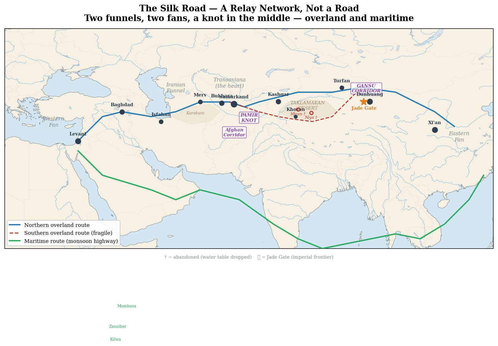
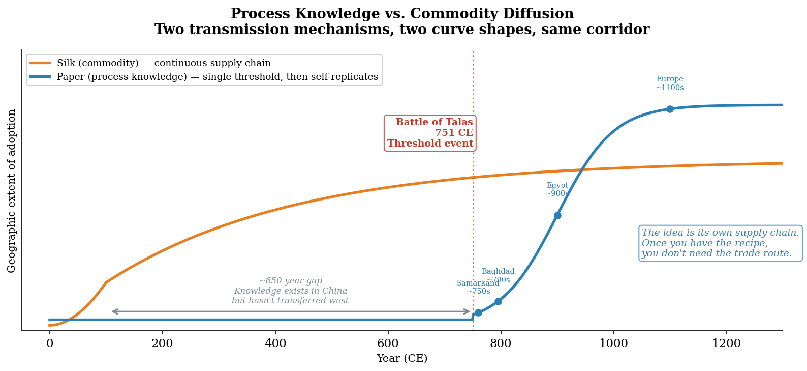

# Chapter 4: The Silk Road as Circulatory System
### *A relay network, not a road — overland and maritime*

---

## I. The Name Is Wrong

The Silk Road was never a road. It was not built. It was not planned. It had no starting point and no endpoint. Nobody traveled its length. The goods that moved along it changed hands dozens of times. The merchants who carried them rarely ventured more than a few hundred miles from home.

The name was invented in 1877 by Ferdinand von Richthofen, a German geographer surveying potential railroad routes for German imperial interests in China.[^ch4-1] He called it the *Seidenstraße* — the Silk Road — because he was thinking about infrastructure. A road implies linearity, directionality, intentionality. A road can become a railroad. The name served his purpose.

We have been decoding it his way for a hundred and fifty years.

This is a sender-side distortion of the kind Chapter 1 identified. Richthofen encoded the concept in a way that served his transmission purpose — a railroad planner seeing a road where none existed. The actual phenomenon was something else entirely:[^ch4-2] a self-organizing relay network of overlapping local exchanges, emerging along lines of least geographic resistance between resource differentials. Nobody built it. The terrain built it. The nodes emerged where geography concentrated exchange. The connections between them followed the paths the terrain permitted.

The Silk Road is not a road. It is a river — in the precise thermodynamic sense this book has been developing. It follows the gradient. It pools at nodes. It finds the path of least resistance. It was not engineered. It emerged.

The Appian Way is a road.[^ch4-3] Rome built it to project military and political power to its periphery — sender-side infrastructure, deliberate, engineered. The Silk Road is the opposite: receiver-side emergence, organic, terrain-following. One is a canal. One is a river. Understanding the difference is understanding the difference between imposed infrastructure and geographic self-organization.

---

## II. The Overland Corridor

The geographic structure of the overland corridor is legible from a topographic map.[^ch4-4] Two fans, two funnels, a knot in the middle.

**The western fan:** The Mediterranean and Levant, spreading into multiple routes through Anatolia, Syria, and Mesopotamia. Many starting points, many paths, converging as they move east.

**The Iranian plateau:** The first funnel. The multiple western routes compress into a narrower corridor as the terrain forces them between the mountains of Iran and the deserts to the south. By the time you reach eastern Iran, the options have narrowed.

**The Afghan corridor:** The chokepoint. Everything funnels through. Afghanistan's significance in world history is not intrinsic wealth — it is position. The same terrain that makes it unconquerable from outside and ungovernable from inside makes it unavoidable for anyone moving between the western and eastern halves of Eurasia.

**The Pamir Knot:** The mountain hinge. Where Afghanistan, Tajikistan, and China meet. The terrain compresses to its absolute minimum passability. This is where the world's highest mountain ranges converge — the Himalayas, the Karakoram, the Hindu Kush, the Tian Shan. Every route through this zone is brutal. The passes are high, seasonal, and deadly.

**Transoxiana:** The heart. Between the Oxus and Syr Darya rivers — Samarkand, Bukhara, the Sogdian cities. This is where the relay network reached its greatest density. Not because it was the destination but because it was the crossroads. Every route from west to east passed through or near this space. The Sogdians — Persian-speaking, commercially brilliant, cosmopolitan — operated this intersection for centuries. The corridor's gravity-well function predates the Silk Road by two millennia: the Bactria-Margiana Archaeological Complex (BMAC) operated the same Zeravshan corridor as a sustained commercial node around 2200-1700 BCE, with Sintashta-derived populations from the northern steppes meeting BMAC merchants in elite graves containing chariot technology layered onto oasis ceramics. The Bronze Age substrate interlude tracks the BMAC iteration; the recursive principle is that the same terrain produces gravity-well nodes whenever multi-system trade conditions converge, so the Sogdian commercial culture is the documented-period iteration of a structural position the Zeravshan corridor has been producing for four millennia.[^ch4-28]

*[Figure 5: The Silk Road Corridor — Terrain Determines Routes](../../figures/fig-005-silk-road-corridor.md) | [Interactive version](/book/figures/fig-005-silk-road-corridor)*

**The Tarim Basin:** The eastern gap. The Taklamakan Desert — whose name in Uyghur means roughly "you go in, you don't come out" — cannot be crossed. It can only be skirted. The basin's oasis populations have Bronze Age ancestry traceable to the Yamnaya eastward expansion through the Afanasievo cultural complex — the Tocharian-speaking populations attested in the basin's late first-millennium manuscripts are the documented-period descendants of a leapfrog migration the Bronze Age substrate interlude tracks back to the Pontic-Caspian homeland.[^ch4-26] Two routes diverge at Dunhuang:

The **northern route** hugs the Tian Shan mountains. Better water from snowmelt, more pasture, more reliable. This is where the commercial traffic flowed — the Sogdian merchant letters, the bulk goods, the continuous trade. Cities on the northern route survived into the modern era because the water systems feeding them were robust.

The **southern route** hugs the Kunlun Mountains and the edge of the Tibetan Plateau. Smaller water systems, more fragile oases, climatically precarious. Niya thrived for centuries on a river fed by glacial melt — then was abandoned in the fourth century when the water table dropped.[^ch4-6] Not conquered. Not destroyed. The river shrank and the city died. The sand covered it and preserved the documents perfectly for a thousand years — a Silk Road Pompeii, killed by geography alone.

The two routes had different fragility profiles because they depended on different water sources.[^ch4-5] The northern route's mountains provided more resilient snowmelt. The southern route's oases were sensitive to small shifts in glacial melt rates. A few centuries of reduced precipitation could close the southern route entirely — not through human decision but through the physics of water supply.

**The Gansu Corridor:** The eastern funnel. Sometimes only fifteen miles wide between the Tibetan Plateau to the south and the Mongolian steppe to the north. The Great Wall runs along its northern edge — not merely as a military barrier but as an economic control surface. The Jade Gate, just west of Dunhuang, marked the symbolic and administrative frontier of Chinese imperial control.

**The Chinese interior:** The eastern fan. The corridor opens into the Chinese plains and the routes multiply again — many destinations, many paths, spreading from the funnel's narrow exit.

The terrain names the segments; the powers that controlled them are half-forgotten. The western overland corridor — the Iranian plateau and Mesopotamia, the funnel through which everything moving between Rome and the East had to pass — was held for nearly five centuries by Parthia, the Arsacid empire that was Rome's most persistent rival and that annihilated a Roman army under Crassus at Carrhae in 53 BCE. Parthia is barely remembered, and the reason is instructive: the Parthians were literate but wrote no dynastic histories, so they survive almost entirely through the records of their enemies — Roman, Greek, and Chinese, who knew them as *Anxi* — and through their own coins. A five-century great power sitting on the corridor's western hinge is nearly invisible not because it was minor but because it did not produce, or did not preserve, the self-encoding the record rewards. It is the western, imperial-scale echo of what would happen to the Sogdians who ran the eastern relay: the intermediary controls the flow and loses the narrative.[^ch4-44]

---

## III. The Friction Filter

The overland corridor did not transmit everything equally. The terrain filtered what could pass through — and the filtering was predictable from the physics of friction.

The northern route, with its lower friction — established relay stations, Sogdian merchant networks, reliable water, moderate terrain — carried the full spectrum of goods. Silk moving west. Cotton moving east. Paper, spices, metalworking techniques, musical instruments, disease.[^ch4-27] Commercial traffic generating routine correspondence — the Sogdian letters found near Dunhuang are among the earliest Silk Road documents and they are almost entirely mercantile: commodity prices, debt records, trade disputes.

The southern route through the Karakoram and the mountain passes connecting India to the Tarim Basin had radically higher friction. The Karakoram Highway — built in the modern era — took twenty years to construct, killed hundreds of workers, and still closes seasonally. Ancient travelers navigated on foot with pack animals through some of the highest and most brutal terrain on Earth.

This friction did not stop transmission. It selected what could survive the crossing.[^ch4-7]

Only the highest-value, lowest-weight content justified the mountain route. Buddhist scriptures qualify — they are weightless when carried in a monk's memory, infinitely valuable to a devoted practitioner, and worth risking death for. Commercial goods do not qualify — not when the northern route offers a viable alternative at a fraction of the energy cost.

The archaeological record confirms this prediction with precision. What survives along the mountain corridors and in the southern route's oasis cities is almost exclusively religious and intellectual content — Buddhist cave paintings, manuscript fragments, pilgrimage accounts, monastery ruins. The Dunhuang caves are essentially a library of what made it through the high-friction filter: thousands of manuscripts, overwhelmingly Buddhist.

What survives along the northern low-friction route is different in kind: trade goods, commercial records, administrative documents, luxury items.[^ch4-8] The Sogdian merchant letters. Chinese silk. Roman glass. The full bandwidth of human economic activity.

High-friction corridors select for religious pilgrims — high-commitment early adopters with infinite motivation and zero cargo weight. Low-friction corridors select for merchants — rational actors optimizing profit margins across the full adopter spectrum.

Same diffusion logic. Different channel friction. Completely different content selection. Completely different archaeological signature.

You could reconstruct the friction level of ancient trade routes purely from the content of what they transmitted — without any other geographic data. High-friction routes leave religious artifacts. Low-friction routes leave commercial records. This is a testable prediction. Check it against any corridor on Earth.[^ch4-11]

The mountains selected for Buddhism the same way the Nile selected for grain farmers. Geography as destiny operating on the content of human thought itself.

*[Figure 9: Process Knowledge vs. Commodity Diffusion](../../figures/fig-009-process-vs-commodity-diffusion.md)*

---

## IV. What Happened in Transit

The content that survived the friction filter did not arrive unchanged. It was re-encoded at every node by every receiver. The signal transformed in transmission — not degraded, but reconstructed in the receiver's framework.

Gandharan Buddhist art is the most vivid evidence.[^ch4-9] Greek artistic conventions — draped robes, idealized facial features, contrapposto posture — traveled from the Mediterranean to northwestern India through Alexander's conquests and the subsequent Greco-Bactrian kingdoms. There they merged with Buddhist iconography. Apollo's posture became Buddha's posture. The artistic form survived. The theological content was replaced.

Then the hybrid traveled further — carried by refugees and pilgrims through the mountain corridor into the Tarim Basin oasis cities. The signal moved. The encoding changed at each relay.

In Sogdiana, Hindu iconography underwent the same transformation. Shiva — depicted with the lingam, deeply Indian in theological content — appeared wearing Sogdian boots. The theology traveled the high-friction corridor in memory. The aesthetic got localized at the destination. The same mechanism as Apollo becoming Buddha: the concept arrives, the visual language adapts to the receiver's cultural vocabulary.

This is Shannon's model applied to religious iconography. The sender encoded Greek divine imagery. The receiver decoded Buddhist sacred art. The channel was the mountain corridor. The transformation happened in transmission — determined by the receiver's framework, not the sender's intention.

And none of this left a trail along the route itself.[^ch4-10] The documents appear at the destination, not along the path. The Kharoshthi texts at Niya — Buddhist dharmas formalized in writing — were almost certainly not carried as written documents over the Karakoram. They were memorized. Monks carried them in their heads through the high-friction corridor and wrote them down at the destination, where sedentary administrative infrastructure provided the materials and context for documentation.

The absence of a document trail between India and the Tarim Basin is not a gap in the record. It is the record. The silence along the route tells you the transmission mechanism — oral encoding through high friction, written decoding at low-friction destinations. The gap is data about the channel.

Every historian who has searched for the trail of breadcrumbs connecting civilizations and found nothing between the endpoints has been looking for the wrong kind of evidence. The breadcrumbs were carried in human memory and left no physical trace until someone sat down at a destination and wrote them out.

The absence of evidence is evidence of friction.

---

## V. The Maritime Corridor

The Silk Road's overland story is only half the story — and possibly the less significant half by volume.

The Indian Ocean trade system is arguably the world's oldest sustained maritime network. It predates the overland Silk Road in some forms and outlasted it significantly. The reason is geographic: the monsoon.

The monsoon is a natural friction collapse mechanism that required no human engineering.[^ch4-12] Summer monsoon blows northeast to southwest — perfect for sailing from India to East Africa. Winter monsoon reverses — perfect for the return journey. A seasonal clock that ancient mariners read. The Indian Ocean was not a barrier. It was a highway with a timetable — reliable, low-friction, high-capacity, bidirectional.

The ocean provided what the Karakoram never could.

What drove the volume through this timetable was demand, and the demand pulled from the wealthy consuming end rather than the producing one. When Roman crews mastered the monsoon in the first century CE, direct Rome–India sailing opened and Roman gold and silver began draining east in exchange for pepper, spices, and gems — enough that Pliny complained of India as "the sink of the world's gold," a hundred million sesterces a year leaving the empire. The East stayed the world's bullion sink for the better part of two millennia, because it made what the wealthy West wanted and wanted little in return; the Manila galleon later poured American silver into the same sink, and the Opium Wars were finally the West forcing the flow to reverse. The mechanism carries a lesson the framework applies elsewhere: producer-side political stability is *permissive* — it secures and administers the routes — but it is *demand* that sets the volume. The Mauryan Empire had unified the Indian subcontinent and run a state maritime administration centuries before this boom; the boom itself fired only when Roman demand and the monsoon route arrived, under later and more fragmented polities. Stability opens the road. Demand fills it.[^ch4-45]

Maritime routes carried bulk goods that the overland routes could never justify: timber, ceramics, raw metals, building materials. Pearls from Sri Lanka reached Niya — almost certainly not via the Karakoram but via the maritime route around Southeast Asia to Chinese ports, then redistributed overland. The pearl at Niya is a friction map — its presence tells you which route it took, without any written record of the journey.

The maritime corridor connected:
- Sri Lanka and southern India (the resource origin for many luxury goods)
- The Bay of Bengal (the crossing to Southeast Asia)
- The Malay Peninsula and the Strait of Malacca (the maritime chokepoint)
- The South China Sea (access to Chinese markets)
- And critically: the East African coast

The Swahili Coast — running from modern Somalia through Kenya, Tanzania, and Mozambique — was built entirely on the Indian Ocean connection.[^ch4-13] Kilwa, Mombasa, Zanzibar were cosmopolitan trading ports where Arab, Indian, Persian, and African merchants met. Chinese porcelain has been found in archaeological sites all along the East African coast.

These were not peripheral outposts. They were node civilizations following the same chokepoint logic as Transoxiana — not resource-rich themselves, but extracting value from their position at the intersection of multiple networks. The Swahili city-states did not produce the gold or the porcelain. They controlled the exchange point where African interior resources met Indian Ocean maritime capacity.

Same chokepoint logic. Different terrain. Ocean instead of steppe.

The interior African trading networks that supplied goods to the coast — routes along which gold and ivory traveled from the Great Lakes region — are almost entirely undocumented. The coast was written about by Arab and Chinese visitors. The interior generated no sender-side transmission that survived.

The silence of the interior African record is not evidence of absence. It is the returning bomber.[^ch4-14] The planes that came back — the coastal trading cities with their written records and stone architecture — tell us about the network's endpoints. The planes that didn't come back — the interior supply chains — tell us about the friction that prevented documentation while the trade itself clearly occurred.

---

## VI. The Climate Pulse

The overland corridor was not stable across time. It pulsed — advancing and retreating like a glacier — driven by climate operating on the water systems that sustained the oasis cities.

Chinese imperial power flowed west through the Jade Gate during strong dynasties and retreated during weak ones. The pulsing was not merely political. It correlated with climate:[^ch4-15]

The Han Dynasty at its peak projected power deep into the Tarim Basin — garrisoning oases, controlling trade, countering the Xiongnu. This correlates with a period of adequate water supply sustaining the oasis cities.

Then aridification. The glacial melt from surrounding mountains decreased. The rivers feeding the southern route oases shrank. Niya was abandoned. The logistical substrate dried up. Imperial power retreated — not from military defeat but because the infrastructure that supported projection was no longer viable. The cost of maintaining distant garrisons rose as the local water supply declined.

The Tang Dynasty — reaching its Central Asian peak in the seventh and eighth centuries — corresponds with a documented wetter period. Tang projection reached further into the Tarim Basin than almost any dynasty before, extending influence as far west as the Pamirs and into areas of modern Afghanistan and Kyrgyzstan. The reach was not military projection alone. It operated through the cultural middleware stack that five centuries of prior Silk Road diffusion had built up: Buddhism already present across the Central Asian corridor providing common institutional framework, the tributary system establishing hierarchical relationships that did not require constant military enforcement, the Silk Road commercial relationships creating mutual dependency that made Tang protection valuable to oasis-city rulers, the protectorate system (the Anxi Protectorate and the Four Garrisons) allowing local rulers to maintain internal autonomy while acknowledging Tang suzerainty.[^ch4-30] The cultural substrate had been prepared in advance of the Tang reach. The projection succeeded operationally because the substrate was ready.

What the substrate produced at the corridor terminus was the Tang cosmopolitan flowering — Chang'an at peak as the most cosmopolitan city in the world, the Silk Road operating at maximum function, Buddhist pilgrims and Zoroastrian merchants and Nestorian Christians and Manichaeans and Muslims all present simultaneously, the major artistic, literary, scientific, and religious-philosophical flourishing of the period unfolding from the cosmopolitan substrate. The chain operates cleanly: terrain produces the corridor; the corridor produces the cosmopolitanism at the terminus; the cosmopolitanism produces the cultural flowering. Geography as destiny expressing itself as the most open and creative period in Chinese history.[^ch4-31]

The Battle of Talas in 751, where Tang China met the expanding Abbasid Caliphate in the Talas River valley in modern Kyrgyzstan, marks the maximum extension — and the beginning of withdrawal. The named battle gets remembered in the standard accounts: specific date, specific commanders (the Goguryeo-descended Tang general Gao Xianzhi against the Abbasid commander Ziyad ibn Salih), specific outcome (a Tang defeat decided substantially by the defection of allied Karluk Turks), specific structural significance as the boundary-marker between Tang and Islamic expansion. What gets a footnote is what may have mattered more historically: the paper-making technology transfer that accompanied the battle's aftermath, whether through the canonical captured-papermakers narrative or through the broader Silk Road commercial-network diffusion the period intensified. The technology transfer permanently transformed Islamic and eventually European intellectual, administrative, and scientific culture. The battle is the returning bomber; the technology transfer is the engine hit. The two have inverse relationships to historical consequence and historical memorability. The Wald survivorship apparatus operating on a specific named event with unusual analytical clarity.[^ch4-32]

The sequence: Han peak → aridification → withdrawal → oasis cities abandoned. Wetter period → Tang peak → maximum extension → Talas → An Lushan Rebellion → withdrawal. The cycle repeats.

This is the glacier metaphor rendered literal. Imperial power advances when the water advances. It retreats when the water retreats. The gate opens and closes with the climate.

The infrastructure trap operates here at catastrophic scale.[^ch4-16] The karez system at Turfan — hand-dug underground tunnels tapping glacial meltwater and delivering it underground to prevent evaporation — was brilliant engineering that maximized population in marginal terrain. When the underlying water supply declined, the population supported by that infrastructure had no fallback. The gap between engineered carrying capacity and natural carrying capacity was the measure of the catastrophe. The An Lushan Rebellion (755–763 CE) and its aftermath saw the Tang Dynasty's registered population drop from roughly fifty-three million to seventeen million — a loss of approximately thirty-six million people through death, displacement, and administrative collapse.[^ch4-16a] The precise death toll is disputed, but the scale is not. This is the cost of centuries of successful friction collapse meeting the constraint's reassertion.

The more you dam the river, the more catastrophic the dam failure.

---

## VII. The Sogdians

For five centuries — roughly the 300s through the 800s CE — the Silk Road had an operating system. The Sogdians ran it.

They were an Iranian-speaking, sedentary merchant people centered in Samarkand and the cities of Transoxiana.[^ch4-17] They operated the relay network — moving goods between nodes, maintaining commercial relationships across vast distances through family networks and trading colonies, conducting business in multiple languages, navigating the cultural intersections that the corridor forced upon anyone who worked it.

Their identity was sustained by four conditions: Zoroastrian and Buddhist religious practice, a merchant class and trade network, political autonomy in the Transoxianan city-states, and the Sogdian script and literary tradition.

The Abbasid conquest in the eighth century removed all four. Islam replaced the religion. Arab and Persian administration replaced the merchant class structure. Arabic replaced the script. Political autonomy was absorbed into the caliphate.

The Sogdian identity category became unviable — not through extermination but through the removal of the ecological niche that sustained it. Like a species whose habitat disappears. The population did not vanish. They assimilated into the emerging Islamic Central Asian synthesis — some becoming Persianate Muslims, contributing to the Samanid cultural renaissance. Their merchant networks continued under new institutional frameworks. Their genetic and cultural legacy flows forward under different labels.

The Tajiks are the closest modern descendants. Persian-speaking, centered in the same geographic area, maintaining the Iranian linguistic tradition that the Sogdians represented. The Sogdians did not become the Turks — the Turks filled the political and military space the Sogdian collapse left open. The Sogdians became the Tajiks.

But the identity-substrate continuity runs deeper than Sogdian-to-Tajik linguistic descent. The Transoxianan corridor has produced a sustained locational-identity substrate across four millennia of political overlays — BMAC merchants in the Bronze Age, Achaemenid satrapy populations under the Persian empire, Greco-Bactrian and then Kushan inhabitants of the same corridor, Sogdian commercial culture during the Silk Road's peak, Samanid Persianate-Islamic urban civilization, Bukharan Emirate populations into the modern period. The specific cultural content adapts across each iteration; the locational substrate — defined by network position in the multi-system gravity well rather than by demographic descent — persists because the terrain keeps regenerating the gravity-well conditions. The Soviet 1924 National Delimitation imposed lineage-categorical vocabulary (Uzbek, Tajik, Turkmen) on this four-millennium locational substrate, producing the persistent regional dissonance that contemporary ethnic-conflict signatures still document. Bactrian identity is locational, not ethnic. The river found its canyon. The canyon kept producing the same kind of city.[^ch4-29]

The Sogdians were squeezed from both sides. The Abbasid conquest dissolved their world from the west; from the east, the declining Tang scapegoated them. When a dominant power's projection wanes it turns on the visible, wealthy, politically powerless trading minority in its midst — the recurring middleman-minority pattern of which antisemitism is the most lethal instance — and the Tang are a textbook case with a pointed trigger: An Lushan, the rebel whose 755 revolt broke the dynasty, was himself of Sogdian-Turkic descent, and the backlash generalized from the man to foreigners at large. Sogdians in China began hiding their origins — one senior minister petitioned to drop the surname he shared with An Lushan — and as the dynasty fell the foreign-merchant communities were massacred outright: tens of thousands of Arab and Persian traders at Yangzhou in 760, a far larger toll at Guangzhou in 879, scapegoated, the sources say plainly, for being foreign and wealthy. A middleman minority is both blamed and structurally unable to control the record that blames it, so it disappears twice — once in life and once in memory. That the Sogdians ran the Silk Road for five centuries and are barely remembered for it is that pattern's signature.[^ch4-43]

Identity categories are adaptive responses to conditions, not primordial essences.[^ch4-18] Remove the conditions and the identity dissolves. New conditions generate new identities from the same human substrate. Same people. Changed incentive structure. Different output.

The river finds a new channel. The water is the same.

---

## VIII. The Silence

After the Abbasid conquest restructured the corridor's religious and commercial logic, after the Tang withdrew behind the Jade Gate, after the Uyghur Khaganate collapsed — the documentary record at Dunhuang goes dark. Roughly two hundred years of silence. No new texts produced. No field reports filed. No translation curriculum updated.[^ch4-19]

The silence is not a mystery. It is data.

Three energy inputs sustained the documentary production infrastructure at Dunhuang: the imperial patron (Tang), the commercial logistics network (Sogdian merchants), and the steppe political structure that tolerated Buddhist activity (Uyghurs). All three failed simultaneously between roughly 840 and 1000 CE. Without missionaries deployed, no field reports were generated. Without a trade network, no commercial correspondence was written. Without political protection, no institutional activity required documentation.

The full causal chain runs across nearly two centuries. Han Yu's 819 CE memorial criticizing Emperor Xianzong's veneration of a Buddha relic — calling Buddhism a foreign barbarian religion unworthy of Chinese imperial dignity — was the bellwether: xenophobic moral revival detecting the substrate-level contraction the Tang was undergoing, articulating the detection in cultural-religious language before the political-military evidence made the contraction undeniable. The Huichang Suppression of Buddhism (842–845 CE) under Emperor Wuzong was the institutional consequence — the most severe anti-Buddhist persecution in Chinese history, dismantling much of the Buddhist middleware that had supported the Tang cosmopolitan flowering. The Tang collapse in 907 CE following decades of warlord fragmentation after the An Lushan damage marked the political end of the structure that had sustained the Silk Road's maximum function. The Dunhuang cave sealing approximately 1000 CE was the terminal preservation event in this chain.[^ch4-33] Someone protecting the curriculum of a missionary network that was going dark, expecting conditions to improve. Conditions never improved in the form they anticipated.[^ch4-20]

The library sealed in Cave 17 is the physical embodiment of the entire Tang cosmopolitan moment preserved in darkness. Tens of thousands of manuscripts in Chinese, Tibetan, Uighur, Sogdian, Khotanese, Sanskrit, and several other languages. Sogdian commercial documents, Buddhist sutras in multiple languages and traditions, Tibetan-period administrative records from when the Tibetan Empire controlled Dunhuang, Chinese imperial paperwork, personal correspondence, medical texts, astronomical materials, calendrical documents, ritual manuals — essentially the full apparatus that the Tang cosmopolitan substrate supported, frozen at the moment the substrate system that produced it had stopped functioning. The cave is the framework's clearest case of time-capsule preservation: when the substrate system that produced cultural artifacts stops functioning, local communities can preserve the artifacts through specific protective actions; the preserved artifacts become available for future analytical recovery at a later moment when the apparatus for reading them exists. The cave was rediscovered in 1900 CE by Wang Yuanlu; the materials became available to modern scholarship through subsequent dispersal. The standard Wald bomber dynamics produce systematic bias against engine-hit preservation; the Dunhuang case is the discrete exception where deliberate community action preserved engine-hit material from anticipated destruction. The cave was sealed because the world that filled it had ended. The river had found a new channel.

The silence breaks not with the return of Buddhism but with the arrival of the Mongols — a completely different political structure producing completely different documents for completely different purposes. The Buddhist missionary field reports never resume. What resumes is Mongol administrative recording at the same friction-zone nodes. Different power structure. Different documentary signature. Same geographic logic driving production at chokepoints.

---

## IX. The Maritime Pivot

While the overland Silk Road went silent, the substrate-driven commercial flow found a different channel. The Jurchen Jin conquest of northern China (1115–1127 CE) cut the Song commercial class off from the overland corridor entirely. The Southern Song retreated south, established a new capital at Hangzhou on the Yangtze delta in 1138 CE, and the commercial energy that could no longer flow west along the Gansu Corridor flowed southeast toward the ocean instead.[^ch4-34]

The capital's geographic position shaped the direction of the commercial energy projection. Chang'an as Tang capital meant the commercial energy flowed west along the Gansu Corridor. Hangzhou as Southern Song capital meant it flowed southeast through the southern ports — Quanzhou, Guangzhou, Hangzhou itself — out into the Indian Ocean maritime network. The Arab and Persian merchants who had been arriving by sea for centuries suddenly found a much more sophisticated and commercially hungry Chinese partner than before. Song copper coins became the de facto currency across maritime Southeast Asia, Japan, and Korea — not through deliberate Song monetization policy but because the coins were the most reliable widely-trusted medium of exchange available. Song and later Yuan ceramics traveled the same routes; the archaeological distribution map of Chinese ceramics across the Indian Ocean world (East Africa, the Persian Gulf, Southeast Asia, Japan) is essentially the map of the maritime Silk Road's reach during this period.

The pressure-equalization-trade-establishment dynamic also operated at the new Song-Jin frontier. After the Treaty of Shaoxing (1141 CE) formalized the Huai River line as the boundary between the two dynasties, the border that had been a war zone became a trade zone. Licensed border markets operated at specific frontier locations; substantial unofficial trade filled gaps the official markets did not cover. The Southern Song commercial economy was genuinely more productive per acre than northern grain farming; the Jin produced grain and pastoral surplus in territory the Southern Song could no longer access agriculturally. Comparative-advantage logic operated at civilization-scale: the Song specialized in higher-value manufactured goods while effectively outsourcing staple food production to the Jin. From a pure commercial logic standpoint, this was rational and worked well while the frontier remained stable.

Hangzhou under this arrangement became one of the largest cities in the world, with population estimates of one to one-and-a-half million substantially exceeding any contemporary European city. The commercial sophistication produced paper money circulation, sophisticated banking and credit, substantial international trade infrastructure, and substantial cultural-philosophical production (Neo-Confucianism reaching its mature articulation under Zhu Xi during this period). The Southern Song commercial economy was the most advanced in the world during its operating period.

It was also a local minimum trap. Every Southern Song decision was correct given the immediate gradient: specialize in higher-value goods; trade for grain rather than producing it; tax maritime commerce rather than agricultural production; concentrate population in commercial cities. Each step followed the steepest local descent. The system settled into what looked like the optimal position. The commercial sophistication and the supply-chain dependency were inseparable — Hangzhou's grain import dependency was simultaneously evidence of commercial sophistication and strategic vulnerability that would become catastrophic if the supply chains were disrupted. The Mongol conquest changed the loss function entirely. Previously-optimal positions became maximally vulnerable. The Southern Song had optimized for the world as it was; the Mongols changed the world. The commercial sophistication that made Hangzhou the most advanced 12th-century city in the world was built on a supply chain vulnerability the Mongols eventually cut. Same structural pattern as the Comanche optimizing their horse-based commercial economy perfectly for pre-railroad Plains conditions — sophisticated optimization preceding catastrophic vulnerability through the same general mechanism operating in radically different specific civilizational contexts.

The river found the ocean route because the land route was blocked. No strategic vision required. Pressure differential following the path of least resistance — the same substrate-driven dynamic the framework reads everywhere else, operating now on commercial flow rather than population flow. The commercial markets organically reoriented to maritime; the government followed the revenue gradient by becoming progressively commerce-dependent through the Shibosi maritime trade superintendencies; the comparative-advantage trade with Jin operated as rational civilization-scale specialization. Each stage organic. None of it strategic. All of it predictable from the substrate dynamics if anyone had been reading them.

The Mongols were reading them.

---

## X. The Peak — and the Encoding That Hides It

The Mongol Empire produced the highest-bandwidth, lowest-friction period the Silk Road corridor ever experienced. The Pax Mongolica — roughly 1250 to 1350 CE — unified the entire Eurasian landmass under a single political umbrella for the first time in history. A merchant could travel from the Mediterranean to China with standardized weights, measures, and commercial law. The yam postal relay system was faster and more reliable than anything Europe would build until the nineteenth century.[^ch4-21]

Religious tolerance was imperial policy. Not as a moral stance but as administrative pragmatism — the Mongol Empire needed Muslim administrators, Christian scribes, Buddhist monks, and Confucian bureaucrats all functioning within the same system. The expansion phase demanded diverse inputs, and the empire could afford tolerance because the incoming energy exceeded the cost of diversity. The tolerance cycle operating at its most extreme expression.[^ch4-22]

And yet Genghis Khan remains, in Western imagination, a figure of pure terror. Pyramids of skulls. Rivers of blood. "Mongol" as synonym for barbarism.

This is phase-dependent encoding contaminating the historical record at civilizational scale.[^ch4-23] The conquest phase — brutal, fast, traumatic — generated vivid documentation. European chronicles written by people who experienced or feared the western invasion. Persian accounts written by survivors of the Khwarazmian destruction. Maximum terror encoding from maximum trauma receivers. The administrative phase — longer, more stable, more economically significant — generated routine commercial records that nobody preserved as literature.

The terror gets remembered. The postal system gets forgotten. The returning bombers are the trauma accounts. The century of commercial prosperity is the engine hits. Western historiography has been adding armor to the wings ever since.

The Pax Mongolica also carried the Black Death along the same low-friction corridor it had opened for trade. The infrastructure that maximized connectivity maximized vulnerability — the infrastructure trap applied to disease rather than water. The plague traveled the yam routes. The same channels that moved silk and paper moved pathogens. The more you connect, the more catastrophically you can be disconnected by what flows through the connection.[^ch4-24]

---

## XI. The Corridor Goes Dark

The Silk Road did not fade because the terrain changed. It faded because someone found a lower-friction alternative.

The Portuguese rounding the Cape of Good Hope in 1498 and the Spanish crossing the Atlantic in 1492 — the same decade — opened oceanic routes that made the overland Central Asian corridor economically obsolete. The ocean carried bulk goods at a fraction of the energy cost. No mountain passes. No desert crossings. No relay stations. No oasis water dependencies. Wind power was essentially free.

The corridor that had been the spine of Eurasian commerce for two thousand years became a backwater within a century. Samarkand, Bukhara, Kashgar — the gravity wells that had concentrated wealth and culture for millennia — lost the traffic that sustained them. The nodes persisted as cities but the network that gave them significance had shifted to the sea.

This is the Age of Sail friction collapse — the oceanic parallel to the railroad. The Atlantic and Indian Oceans underwent the same orthogonal rotation the steppe would undergo three centuries later: terrain that had been a barrier became a highway. The ocean that separated civilizations became the corridor that connected them.[^ch4-25]

The terrain is still there. The Pamir Knot has not moved. The Taklamakan has not shrunk. The Gansu Corridor is still fifteen miles wide. But the traffic that made those features historically significant found a new channel — the same way a river finds a new canyon when the old one silts up.

The framework predicts that the corridor should revive if a technology makes overland transit competitive with oceanic shipping again. The railroad did this partially in the nineteenth century — and the Russian and Chinese empires immediately fought over the revived corridor. The modern Belt and Road Initiative is another attempt to reactivate the same geographic logic with updated infrastructure.

The terrain is patient. It waits for the next technology to make it relevant again.

---

## XII. The Pacific Recurrence

The corridor logic did not die when the overland Silk Road went dark. It recurred on the Pacific.

The Manila Galleon trade ran continuously from 1565 to 1815 — 250 years, one or two ships per year, carrying silver westward and Chinese manufactured goods eastward across the Pacific. The route's positional logic is structurally identical to the overland Silk Road's: two large economies with complementary surpluses connected through a corridor controlled by intermediate actors who extracted value from the connection. Spain controlled the silver supply, mined in Bolivia at Potosí and in Mexico, transported overland to Acapulco. China controlled the manufactured-goods supply — silk, porcelain, luxury goods that the Spanish economy demanded and that no European production could match. The Philippines served as the corridor's eastern entrepôt where the exchange happened. Manila as the Pacific Silk Road's Samarkand. Acapulco as its Antioch. The Spanish galleons as its caravans.[^ch4-35]

The trade required a specific friction collapse to make round-trip Pacific commerce tractable. The westward Acapulco-to-Manila crossing rode the North Equatorial Current and the northeast trade winds — straightforward with the wind and current behind you. The eastward return voyage against the trades was structurally impossible by any direct route. The solution, discovered by Andrés de Urdaneta in 1565, was to sail far north — up to roughly 40-42 degrees north latitude into the North Pacific Current — then ride the westerlies east across the entire Pacific toward California, then south along the California coast back to Acapulco. The 1565 founding of Manila as colonial entrepôt directly followed Urdaneta's discovery. The eastward route's wind-pattern discovery is the framework's cleanest case of a specific-wind-system discovery operating as friction collapse on a specific oceanic route — even though oceanic mobility per se had been achieved by the Spanish, the Portuguese, and others for over a century, the specific Pacific eastward route required Urdaneta's specific solution. The friction-collapse apparatus operates not just on the broad transition from terrestrial to oceanic mobility but on specific route-discoveries within the oceanic regime.[^ch4-36]

The framework's apparatus reads the Manila Galleon trade as concrete cross-civilizational substrate-coupling. The Spanish silver-mining substrate (Potosí mines; Mexican coastal infrastructure) coupled through the Pacific maritime substrate (Urdaneta route; trade-wind system; the wind-and-current configuration that determined which Pacific routes were tractable) to the Chinese fiscal substrate (the Single Whip Reform consolidating multiple tax obligations into single silver-denominated payment). The coupling produced effects in each substrate that neither would have produced alone. Spanish colonial-extraction operated at higher intensity because of Chinese silver demand — the Potosí mines that killed indigenous laborers at industrial scale were responding to the price signal that Chinese demand generated. Chinese fiscal administration experienced inflation pressure from American silver supply that Ming officials never managed effectively. The late-Ming fiscal crisis — military expenditure overrunning revenue; bureaucratic dysfunction; the late-Ming substrate stress that the Manchu Qing eventually exploited — operated within the substrate-coupling-induced volatility that the Manila Galleon trade had introduced into Chinese silver supply.[^ch4-37]

The Single Whip Reform operates as canonical cross-civilizational optimization-trap case. The tax structure was optimized for stable silver-supply conditions; American silver flooding into China changed the silver-supply substrate; the previously-optimal tax structure became maximally vulnerable when the substrate conditions shifted. The structural pattern matches the Southern Song commercial-optimization case (Chapter 4 Section IX) and the Comanche horse-based-commercial-optimization case (Chapter 6) — sophisticated economic-administrative optimization for specific stable conditions producing vulnerability when conditions change. The Single Whip Reform's vulnerability is cross-civilizational structural-equivalence with both prior cases operating through a different specific mechanism. Three independent civilizational substrates; three optimization-and-substrate-shift sequences; same structural pattern. The framework's apparatus reads all three through the same optimization-trap and risk-invisibility-during-optimization apparatus articulated in Chapter 1's Optimization Trap subsection.[^ch4-38]

The Pacific corridor's chokepoints — Manila at the western terminus, Hawaii at the mid-Pacific waystation where the Urdaneta route turned south, Guam as the coaling station between — persisted in strategic significance across the political-actor transition from Spanish to American control. When the 1898 Spanish-American War provided the political opportunity, the American strategic establishment — Mahan having articulated the chokepoint apparatus explicitly in *The Influence of Sea Power Upon History* (1890), Roosevelt and Lodge having read and internalized it — acquired the same three Pacific Silk Road nodes the Spanish had pioneered over 250 years. Chapter 6's parallel-conquests material develops the substantive 1898 case; the framework's reading here is the cross-temporal continuity. The chokepoints persisted because the substrate-driven geographic logic that produced their significance is independent of which specific political actor controls them. The Spanish pioneered the route. The Americans took the chokepoints. Same nodes. Same positional logic. New political actor.[^ch4-39]

The Pacific corridor also exhibits a substrate dynamic that the overland Silk Road's apparatus had not made cleanly explicit. Different colonial powers with different commercial logics literally see different geographic landscapes operating on the same physical terrain. The northern California coast was commercially invisible to Spain in the same period the Manila Galleon trade was operating at full intensity. Spain's silver-and-mission commercial logic could not see sea otter pelts as resource — the pelt economy required completely different commercial infrastructure (processing; transport to Asian luxury markets; trading relationships with indigenous hunters) that the encomienda and mission model had not developed. Russia arrived in the early nineteenth century with exactly the commercial toolkit that made the vacuum valuable — fur-trade infrastructure; trading relationships with coastal indigenous populations; Pacific maritime infrastructure connecting to the same Chinese luxury market the Spanish had been accessing through silver. Fort Ross (1812–1841) operated as Russian-American Company outpost in terrain Spain's commercial logic had made invisible. The vacuum selected for the actor whose specific toolkit matched the available resource. Same logic as the Comanche filling the power vacuum left by Spanish administrative retreat in Texas (Chapter 6); same logic as the Americans filling the vacuum left by Comanche collapse. Each transition selecting for the actor whose specific toolkit matched the terrain's available resources at that specific moment. Terrain value is sender-positioned, not substrate-objective. The framework's apparatus reads terrain through the receiving-actor's commercial-logic toolkit — no view from nowhere on what makes terrain valuable. Spain's silver logic made northern California invisible. Russia's pelt logic made it visible. The terrain was always there.[^ch4-40]

The corridor logic also has a dark mirror. The Silk Road at its best — the Pax Mongolica period in particular — operated as genuinely mutual exchange. Both endpoints extracting value from the connection; corridor civilizations prospering from facilitation; the commercial flow sustained by demand at both ends of the corridor and willingness to participate at both ends. The Opium Wars (First Opium War 1839–1842; Second Opium War 1856–1860) operated as the inverse: extraction disguised as exchange. The British had a fundamental trade-imbalance problem with China — Britain wanted Chinese tea, silk, and porcelain enormously; China wanted almost nothing British production could supply; the trade deficit was draining British silver eastward continuously. The East India Company's elegant commercial solution was the triangle trade: grow opium in British India using Indian peasant labor under coercive cultivation requirements; smuggle it into China through licensed and unlicensed trading networks; convert Chinese silver into opium payment flowing back to Britain and India; use the profits to buy tea. Each leg profitable. The entire system sustained by Chinese addiction. When Commissioner Lin Zexu seized and destroyed 20,000 chests of opium in 1839 — acting entirely within Chinese sovereign authority over Chinese territory — the British government deployed the world's most powerful navy to force China to accept the right of British merchants to sell drugs to Chinese citizens. And encoded the operation as a defense of commercial liberty.[^ch4-41]

The free-trade encoding operates as encoding-as-active-contradiction in the framework's apparatus. Free trade requires willing buyers and sellers; addiction physiologically eliminates the willing buyer; the encoding claims the legitimacy of a framework whose preconditions the encoded activity systematically destroyed. That is not free trade. That is extraction with extra steps. The Wald bomber apparatus operates at full power on the surviving documentary record: the returning bombers are the free-trade arguments in Hansard; the engine hits are the millions of Chinese opium addicts whose consumption was the mechanism of silver extraction. The substrate-coupling pattern card 247 articulated for the Manila Galleon trade operates here at greater intensity and more catastrophic substrate consequences — Indian agricultural substrate forced into opium monoculture under coercive cultivation; Chinese commercial substrate destabilized through silver outflow and social-addiction effects; British imperial substrate sustained by the silver-and-tea revenues the triangle generated. The long-term substrate consequence ran forward through the treaty port system, the unequal treaties, the Taiping Rebellion partially fueled by opium-trade social disruption, the eventual collapse of the Qing Dynasty, and the revolutionary movements that produced modern China. Britain extracted the silver; China spent a century rebuilding from the extraction. The drug dealer's long-term consequence: radicalization of the customer base.[^ch4-42]

The mutual-vs-extractive distinction is substantive within the corridor-civilization apparatus. Both patterns look superficially similar from the surface-commercial-form perspective; both involve merchants moving goods through corridor stations across long-distance commercial networks. They operate through structurally different substrate mechanisms with opposite long-term substrate consequences. Mutual exchange produces prosperity at both endpoints and at corridor civilizations; extraction-disguised-as-exchange produces prosperity at one endpoint at the cost of the other endpoint's social-and-economic decline. The Silk Road at its best was genuinely mutual. The opium trade was extraction concealed within commercial form.

The corridor logic also looks forward. Card 246's contemporary-geopolitical analysis (held outside this chapter as material more appropriate to potential future epilogue) reads contemporary US-China-Europe-Russia configuration as another instance of the same corridor-civilization positional logic operating on contemporary terrain — Europe and Russia in the Eurasian middle between American Atlantic power and Chinese Pacific power as contemporary expression of the Transoxianan corridor logic. The framework's apparatus operates with continuity across the temporal sweep: Bronze Age substrate → overland Silk Road → Pacific Silk Road → contemporary configuration. Same positional logic; different specific terrain features; different specific political actors; substrate-driven dynamics persisting across all the specific changes.

Geography as destiny expressed in oceanic wind patterns rather than mountain passes and river valleys. The terrain is just bigger and wetter.

---

*The corridor is old. The name is new and wrong. The terrain knows what it carried. And the terrain is still waiting. Turn the page.*

---

## Notes

[^ch4-1]: On Ferdinand von Richthofen and the coining of "Seidenstraße": Richthofen used the term in his 1877 work *China: Ergebnisse eigener Reisen und darauf gegründeter Studien*. His purpose was explicitly to survey potential railroad routes for German imperial interests. The observation that the name is a sender-side imposition reflecting the technology he wanted to build rather than the reality he was describing emerged from a Beta seminar discussion at the start of Hansen's audiobook. See [ref 036](../../references/036-richthofen-railroad-agenda-sender-side.md).

[^ch4-2]: The "relay network, not a road" framing draws directly from Valerie Hansen, *The Silk Road: A New History* (Oxford: Oxford University Press, 2012), introduction and chapters 1–2. Hansen's archaeological approach emphasizes that no single merchant traveled the route's length — goods changed hands at nodes through overlapping local exchanges. The "series of lakes connected by streams" metaphor is our synthesis. See [ref 035](../../references/035-silk-road-relay-trade-not-road.md).

[^ch4-3]: The contrast between the Appian Way (canal — deliberate, engineered, sender-side infrastructure) and the Silk Road (river — organic, terrain-following, receiver-side emergence) emerged from a Beta seminar discussion comparing the two. The analytic claim — that the distinction illustrates the book's core framework difference between imposed infrastructure and geographic self-organization — is our synthesis. See [ref 037](../../references/037-appian-way-vs-silk-road-canal-vs-river.md).

[^ch4-4]: The overland corridor's geographic structure ("two funnels, two fans, a knot in the middle") is described in the seed document and draws on Peter Frankopan, *The Silk Roads: A New History of the World* (New York: Knopf, 2015), and Hansen, *The Silk Road*. The specific characterization of each segment is synthesized from multiple sources.

[^ch4-5]: On the northern vs. southern route fragility: Hansen, *The Silk Road*, chapters 2–4, covers the two routes around the Taklamakan and their different characteristics. The analytical framing — that the two routes had different fragility profiles determined by their water source resilience — is our synthesis connecting Hansen's archaeology to the climate-pulse framework. See [ref 051](../../references/051-niya-silk-road-pompeii-southern-route-fragility.md).

[^ch4-6]: On Niya's abandonment: Hansen, *The Silk Road*, chapter 2. Niya was excavated by Aurel Stein circa 1900. The Kharoshthi documents found there date to roughly the 2nd–4th century CE. The city's abandonment correlates with documented Tarim Basin aridification. The characterization as "a Silk Road Pompeii, killed by geography alone" is our framing. See [ref 051](../../references/051-niya-silk-road-pompeii-southern-route-fragility.md).

[^ch4-7]: The friction-as-content-filter principle — that high-friction corridors select for weightless, high-commitment content (Buddhism via monks) while low-friction corridors carry the full spectrum (commercial goods via merchants) — emerged from a Beta seminar discussion connecting the Karakoram corridor's archaeological signature to Rogers' adopter categories. The testable prediction (reconstruct friction from content signature) is our contribution. This claim has not been verified beyond the Silk Road case but is stated as a falsifiable prediction applicable to any corridor. See [ref 052](../../references/052-karakoram-friction-filter-diffusion-selection.md).

[^ch4-8]: On the Sogdian merchant letters: these documents, found near Dunhuang and dating to the early 4th century CE, are among the earliest Silk Road texts and are overwhelmingly commercial in content. They are widely cited in Silk Road scholarship as evidence of the merchant network's character. The contrast between their commercial content and the religious content of the mountain-route documents confirms the friction-filter prediction.

[^ch4-9]: On Gandharan Buddhist art as content transformation in transit: the hybridization of Greek artistic conventions with Buddhist iconography in the Gandhara region (2nd century BCE–5th century CE) is well-documented in art history. The Shannon framing — sender encoded Greek imagery, receiver decoded Buddhist sacred art, the channel determined the transformation — is our synthesis. The additional example of Shiva depicted with Sogdian boots extends the same principle. See [ref 062](../../references/062-gandharan-buddha-greek-deities-weightless-diffusion.md).

[^ch4-10]: The methodological principle "the absence of evidence is evidence of friction" — that the lack of documents along high-friction routes indicates oral transmission rather than absence of connection — emerged from a Beta seminar discussion about the Kharoshthi documents at Niya. The inference that dharmas were memorized through the mountain crossing and written down at the destination is supported by the well-documented oral transmission practices of Buddhist monasticism. See [ref 063](../../references/063-absence-of-evidence-is-evidence-of-friction.md).

[^ch4-11]: On the intrinsic vs. transactional document taxonomy: the distinction between documents produced for internal cultural reasons (cave paintings, burial goods — telling you where people lived) and documents produced at cultural boundaries for external communication (translation texts, commercial records — telling you where people met and traded) emerged from a Beta seminar discussion about what the Silk Road's archaeological record actually reveals. This taxonomy is our methodological contribution. See [ref 074](../../references/074-intrinsic-vs-transactional-documents-taxonomy.md).

[^ch4-12]: On the Indian Ocean trade system and the monsoon as natural friction collapse: Edward Alpers, *The Indian Ocean in World History* (Oxford: Oxford University Press, 2014), provides overview. The monsoon's function as a bidirectional, seasonal, wind-powered highway requiring no human engineering — and the characterization of this as a "natural friction collapse" — is our framing. See [ref 067](../../references/067-indian-ocean-monsoon-highway-swahili-coast.md).

[^ch4-13]: On the Swahili Coast as chokepoint civilization: Mark Horton and John Middleton, *The Swahili: The Social Landscape of a Mercantile Society* (Oxford: Blackwell, 2000). Chinese porcelain found at East African sites is extensively documented in Indian Ocean archaeology. The framing of Swahili city-states as "the same chokepoint logic as Transoxiana, different terrain" is our synthesis. See [ref 067](../../references/067-indian-ocean-monsoon-highway-swahili-coast.md).

[^ch4-14]: The Wald bomber applied to interior Africa — the observation that the coastal Swahili cities left abundant evidence while the interior supply networks are undocumented, and that this silence is evidence of the network's existence (the planes that didn't return) rather than its absence — is our synthesis extending the methodology developed in [ref 064](../../references/064-wald-survivorship-bias-returning-bomber.md).

[^ch4-15]: On the climate pulse and the glacier metaphor: the correlation between Chinese imperial projection into the Tarim Basin and wetter/drier periods draws on paleoclimatology research on Central Asian climate variability. The specific framing as a "glacier advance and retreat" driven by climate operating on water systems is our synthesis. The sequence (Han peak → aridification → withdrawal; wetter period → Tang peak → Talas → withdrawal) was predicted from the thermodynamic framework before being confirmed by Hansen's material. See [ref 044](../../references/044-tarim-basin-glacier-metaphor-climate-correlation.md) and [ref 054](../../references/054-climate-pulse-imperial-cycle-prediction.md).

[^ch4-16]: On the karez system at Turfan: Hansen, *The Silk Road*, chapter 4. The karez are hand-dug underground irrigation tunnels tapping glacial meltwater — a well-documented engineering achievement of the Turfan region. The "infrastructure trap" principle — that successful engineering around geographic constraints creates catastrophic vulnerability when constraints reassert — is our synthesis. See [ref 075](../../references/075-turfan-karez-infrastructure-trap.md).

[^ch4-16a]: The An Lushan Rebellion death toll is based on Tang Dynasty census data: the 754 CE census recorded approximately 52.9 million registered persons; the post-rebellion census of 764 CE recorded approximately 16.9 million. The difference (~36 million) represents some combination of death, displacement, and loss of administrative control over populations. The figure is widely cited in Chinese historiography but its interpretation is disputed — census collapse may reflect administrative failure as much as population loss. See Mark Edward Lewis, *China's Cosmopolitan Empire: The Tang Dynasty* (Cambridge, MA: Harvard University Press, 2009). The original "45 million" figure in our seminar discussion was imprecise and has been corrected. See [issue #15](https://github.com/gotoplanb/geography-as-destiny/issues/15).

[^ch4-17]: On the Sogdians as the Silk Road's operating system: the characterization of the Sogdians as Iranian-speaking merchants who ran the relay network for centuries draws on S. Frederick Starr, *Lost Enlightenment: Central Asia's Golden Age from the Arab Conquest to Tamerlane* (Princeton: Princeton University Press, 2013), and Étienne de la Vaissière, *Sogdian Traders: A History* (Leiden: Brill, 2005). The specific framing of identity dissolution as "removal of the ecological niche" and the claim that "the Sogdians became the Tajiks" (with the Turks filling the political-military space) emerged from a Beta seminar discussion. See [ref 076](../../references/076-sogdian-identity-dissolution-ethnogenesis.md).

[^ch4-18]: The principle that "identity categories are adaptive responses to conditions, not primordial essences" is stated as our theoretical position. It connects to the normal distribution of human traits argument (ref 014) — the population is the constant, the identity is the variable, and geographic/political conditions determine which identity framework is viable. This extends the anti-essentialist position in social constructionist theory to ethnogenesis specifically.

[^ch4-19]: The 200-year documentary silence and its interpretation as infrastructure collapse rather than historical gap emerged from connecting Hansen's account of the post-Tang Dunhuang decline with the missionary training center model. Three simultaneous infrastructure failures predicted the silence from first principles. See [ref 092](../../references/092-200-year-silence-infrastructure-collapse-signature.md).

[^ch4-20]: The sealed cave at Dunhuang (~1000 CE) and its interpretation as a missionary network preserving its curriculum while expecting conditions to improve draws on Hansen, *The Silk Road*, chapter 7. The progressive silence hypothesis — that documentary production should correlate with the Islamic conquest timeline moving eastward through the Tarim Basin — is our contribution and remains untested. See [ref 090](../../references/090-dunhuang-missionary-training-vs-cosmopolitanism.md).

[^ch4-21]: On the Pax Mongolica: the characterization of the Mongol period as the highest-bandwidth moment in Silk Road history draws on standard Mongol historiography. The yam postal relay system is documented extensively. Rabban Sauma's westward journey (a Nestorian monk from China visiting the Pope) provides the reverse-perspective evidence for the corridor's connectivity. See [ref 095](../../references/095-genghis-khan-phase-dependent-encoding.md).

[^ch4-22]: The imperial tolerance cycle — expanding empires afford tolerance because diverse inputs exceed the cost of diversity, contracting empires scapegoat as the resource base shrinks — is developed in [ref 081](../../references/081-imperial-tolerance-cycle.md). The Mongol Empire at expansion phase represents the cycle's most extreme expression.

[^ch4-23]: Phase-dependent encoding contaminating imperial reputation: the Mongol conquest phase produced vivid traumatic documentation (returning bombers), while the administrative Pax Mongolica produced routine commercial records (engine hits). Western historiography reads the conquest phase and misses the administrative phase. See [ref 095](../../references/095-genghis-khan-phase-dependent-encoding.md) and [ref 064](../../references/064-wald-survivorship-bias-returning-bomber.md).

[^ch4-24]: The Black Death traveling the Mongol corridor is the infrastructure trap (ref 075) applied to connectivity rather than water. The same low-friction channels that enabled maximum commerce enabled maximum pathogen transmission. The principle: the more you connect, the more vulnerable you are to what flows through the connection.

[^ch4-25]: The Age of Sail as friction collapse — the Atlantic and Indian Oceans undergoing the same orthogonal rotation the steppe would undergo with the railroad — is developed in [ref 094](../../references/094-atlantic-crossing-friction-collapse-sail-parallels.md). The Spanish/Portuguese oceanic expansion of the 1490s is structurally parallel to the Russian/American railroad expansion of the 1860s: same technology, same decade, opposite directions, same outcome.

[^ch4-26]: The Tocharian bridge connecting the Tarim Basin oasis populations to the Yamnaya eastward expansion through the Afanasievo cultural complex is developed in [ref 172](../../references/172-triangulation-methodology-tocharian-bridge-yamnaya-silk-road.md). The Bronze Age substrate interlude (positioned between Chapter 1 and Chapter 2) provides the substantive treatment of the Yamnaya — Afanasievo — Tocharian — Silk Road continuous lineage spanning six thousand years through one identifiable population history. On the leapfrog-fossil mechanism that explains why Tocharian preserves archaic Proto-Indo-European features the European branches lost: [ref 177](../../references/177-leapfrogging-chain-migration-rogers-diffusion-at-population-scale.md).

[^ch4-27]: The Silk Road papermaking diffusion (China → Islamic world → Europe over approximately one thousand years) operates by the same process-knowledge-transmission mechanism the framework reads for Bronze Age bronze metallurgy (Caucasus frontier → Denmark over approximately one thousand years). Same mechanism, two thousand years apart. Both cases demonstrate that timing lags in technology diffusion are the friction map made visible — adoption delays mapping the friction gradient along the diffusion path. See [ref 181](../../references/181-bronze-diffusion-caucasus-to-denmark-process-knowledge-friction-map.md) for the side-by-side analysis. On the broader framework's preference for structural over psychological causation in diffusion timing: [ref 168](../../references/168-wheels-process-knowledge-vs-artifact-transmission-language-as-flight-recorder.md) and [ref 182](../../references/182-directionality-of-knowledge-flow-pressure-gradient-prediction.md) (knowledge flows down the pressure gradient by the same mechanism populations do).

[^ch4-28]: The BMAC (Bactria-Margiana Archaeological Complex) as the Bronze Age structural equivalent of the later Silk Road's Transoxianan node — same Zeravshan corridor, same multi-system gravity-well-at-friction-zone mechanism, different actors 2000 years apart — is developed in [ref 206](../../references/206-bmac-bronze-age-silk-road-node-zeravshan-gravity-well.md). The documented archaeological smoking gun for the Sintashta-BMAC convergence is an elite grave on the Zeravshan in Tajikistan containing a horse-drawn chariot with Sintashta-Arkaim-type bits and bone cheek-pieces together with typically BMAC ceramic and a bronze sceptre topped with horse imagery. The Tugai metal-working colony (~1900 BCE) is the canonical Petrovka-migration node documenting Sintashta-descended populations operating in BMAC territory. The recursive structural parallel principle — same terrain regenerates gravity-well conditions across millennia — is articulated in [ref 208](../../references/208-diamond-anthony-framework-triangulation-sub-regional-resolution.md).

[^ch4-29]: The locational identity vs ethnic/lineage identity distinction, with Bactria as the canonical four-millennium case, is developed in [ref 207](../../references/207-locational-identity-vs-ethnic-identity-bactria-soviet-mismatch.md). The political-overlay sequence (BMAC → Achaemenid satrapy → Hellenistic → Kushan → Sasanian → Samanid → Bukharan Emirate → Soviet → contemporary) shows structural-position persistence through different political vocabularies, while the populations, languages, and religious substrates change across phases. Scholarship on Soviet nationality policy producing categorical mismatch with locational substrate: Adeeb Khalid, *Making Uzbekistan* (Cornell, 2015); Francine Hirsch, *Empire of Nations* (Cornell, 2005); Terry Martin, *The Affirmative Action Empire* (Cornell, 2001). Eren Tasar's *Crossroads of Civilization* lectures provided the project's earliest engagement with this mismatch (referenced in the foreword's intellectual lineage paragraph).

[^ch4-30]: The cultural middleware stack that enabled Tang westward projection — Buddhism + tributary system + Silk Road commercial relationships + protectorate system — is developed in [ref 228](../../references/228-what-gets-breezed-past-tang-projection-battle-talas-wald-bomber-methodological-contribution.md). The card articulates the full multi-card framework integration case: Tang projection to Afghanistan as canonical example of substrate-aligned projection operating through middleware infrastructure that prior centuries of Silk Road diffusion had built up. Cultural middleware as discrete framework concept: [ref 216](../../references/216-cultural-middleware-religion-cross-cultural-interoperability-protocol.md). Buddhism's specific middleware function: [ref 220](../../references/220-buddhism-psychological-stability-middleware-confucian-synthesis-framework-buddhist-substrate.md). Combined-toolkit effect (assimilated conquest-dynasty lineage Northern Wei → Sui producing combined administrative-plus-military toolkit the Tang inherited): [ref 226](../../references/226-reunification-substrate-driven-inevitability-sui-tang-recursive-cycle-tang-cosmopolitan-flowering.md). The substrate-driven reunification pressure that produced the unified Chinese state capacity enabling the projection: same card.

[^ch4-31]: The Tang cosmopolitan flowering as terrain-to-culture chain expression — terrain → corridor → cosmopolitanism → cultural flowering — is developed in [ref 226](../../references/226-reunification-substrate-driven-inevitability-sui-tang-recursive-cycle-tang-cosmopolitan-flowering.md). The framework's reach extends from continental geographic conditions through to the highest expressions of cultural creativity; the Tang at its high point is the framework's canonical case. Calibration: the cosmopolitan-flowering period peaked under Taizong, Gaozong, and early Xuanzong (roughly 626–755 CE), with the 845 CE Huichang persecution substantially reducing the cosmopolitan character; the framework's claim about Tang cosmopolitan flowering operates on the high-period.

[^ch4-32]: The Battle of Talas (751 CE) as canonical Wald bomber moment — named military engagement as returning bomber while the paper technology transfer that accompanied or followed gets a footnote — is developed in [ref 228](../../references/228-what-gets-breezed-past-tang-projection-battle-talas-wald-bomber-methodological-contribution.md). The paper-technology-transfer-at-Talas attribution is historiographically contested in modern scholarship; the framework's claim operates regardless of whether the technology transfer occurred specifically through captured papermakers at this battle or through the broader Silk Road commercial-network diffusion the period intensified. The Wald bomber asymmetry (testable named events surviving in curriculum vs explanatorily-important substrate processes systematically obscured) is articulated in [ref 215](../../references/215-philosophy-as-sender-side-document-wald-bomber-history-of-ideas.md) and applied to historiography in [ref 228](../../references/228-what-gets-breezed-past-tang-projection-battle-talas-wald-bomber-methodological-contribution.md).

[^ch4-33]: The full causal chain (Han Yu 819 CE bellwether → Huichang Suppression 842–845 CE → Tang collapse 907 CE → Dunhuang Cave 17 sealing ~1000–1002 CE) and the time-capsule preservation mechanism are developed in [ref 232](../../references/232-dunhuang-cave-sealing-causal-chain-closure-time-capsule-tang-cosmopolitan-moment.md). The xenophobic-moral-revival-as-bellwether mechanism (Han Yu's memorial detecting substrate-level contraction in cultural-religious language before political-military evidence made contraction undeniable) is developed in [ref 231](../../references/231-han-yu-moment-xenophobic-moral-revival-bellwether-waning-power.md). The Huichang Suppression dismantled the Buddhist middleware that had supported the Tang cosmopolitan flowering — a substrate-misaligned policy (per the substrate-alignment apparatus in [ref 214](../../references/214-taoism-pastoral-village-contradiction-resource-gradient-test.md), [ref 220](../../references/220-buddhism-psychological-stability-middleware-confucian-synthesis-framework-buddhist-substrate.md)) whose long-term effects contributed to the continued late-Tang contraction. The time-capsule preservation mechanism (Wald bomber apparatus operating in deliberate-preservation mode rather than accidental-survival mode) generalizes beyond the Dunhuang case to multiple cross-civilizational instances (Dead Sea Scrolls; Nag Hammadi library; various other religious-text and secular-archive preservation cases).

[^ch4-34]: The Southern Song maritime pivot as substrate-driven commercial flow finding alternative channel when overland route was blocked is developed in [ref 235](../../references/235-pressure-equalization-trade-establishment-song-jin-hangzhou-commercial-specialization-vulnerability.md). The buffer-removal anti-hero variant — Song arming the Jurchen against the Liao, producing the Jurchen Jin that then pushed the Northern Song out of northern China entirely — is developed in [ref 233](../../references/233-buffer-removal-anti-hero-song-jurchen-pressure-system-momentum-southern-hills-bumper.md). The risk-invisibility-during-optimization principle (commercial sophistication and strategic vulnerability inseparable; risk visible only after disruption changes conditions) is developed in [ref 237](../../references/237-risk-invisibility-optimization-southern-song-commercial-boom-government-revenue-intoxication.md). The local-minimum-trap analytical apparatus (gradient descent settling into trapped positions that look optimal locally; Mongol conquest as loss-function change revealing the trap) and the cross-civilizational structural parallel to Comanche horse-based commercial optimization are developed in [ref 238](../../references/238-local-minimum-trap-regularization-machine-learning-apparatus-neo-confucianism-resilience-penalty.md). The cultural-middleware typology distinguishing administrative-technology middleware (Confucianism) from existential-technology middleware (Buddhism), with implications for Buddhism-before-Confucianism diffusion sequence visible in Korea, Japan, and Manchurian populations, is developed in [ref 234](../../references/234-differential-adoption-cultural-middleware-existential-vs-administrative-technology.md).

[^ch4-35]: The Manila Galleon trade (1565-1815) as Pacific expression of the Silk Road's corridor-civilization positional logic is developed in [ref 247](../../references/247-manila-galleon-trade-pacific-silk-road-urdaneta-wind-system-american-silver-late-ming-fiscal-crisis.md). The structural-recurrence reading positions the Manila Galleon trade as substantive historical case for the corridor-civilization apparatus operating on oceanic rather than terrestrial substrate. Spain controlling silver-supply endpoint; China controlling manufactured-goods endpoint; the Philippines as intermediate entrepôt extracting value from the connection — same positional logic as the Sogdian merchants operating between Tang China and Sassanid Persia in the seventh century, operating on different terrain features through different specific mechanisms. The Pacific Silk Road also produced a recurring instance of the [ref 220](../../references/220-buddhism-psychological-stability-middleware-confucian-synthesis-framework-buddhist-substrate.md) steppe-conqueror convergence pattern at oceanic scale — the Pacific corridor's positional logic generated similar commercial-political dynamics across European maritime powers in succession (Spanish-Portuguese 16th-17th century; Dutch 17th century; British 18th-19th century) just as the overland Silk Road generated similar dynamics across successive steppe-conqueror groups.

[^ch4-36]: The Urdaneta wind-system discovery (1565) as friction-collapse on Pacific scale is developed in [ref 247](../../references/247-manila-galleon-trade-pacific-silk-road-urdaneta-wind-system-american-silver-late-ming-fiscal-crisis.md). The friction-collapse apparatus refinement: the framework has emphasized broad transitions in mobility regime (terrestrial vs oceanic; pre-rail vs rail) as friction-collapse cases; the Urdaneta case demonstrates that specific-route-discoveries within an already-established mobility regime can operate as discrete friction collapses on specific routes. The same logic applies to: Indian Ocean monsoon-wind-system discoveries that made Arab-to-East-African-to-Indian commerce tractable; the Atlantic gyre-system that Columbus's voyage navigated; specific wind-and-current discoveries on other oceanic routes. The friction-collapse apparatus refines from broad mobility-regime transitions to specific-route-discovery cases operating within mobility regimes. The 1565 date is densely meaningful — Urdaneta's discovery, Manila's founding, and the Manila Galleon trade's establishment all 1565 — making this one of the more concentrated friction-collapse moments in commercial history.

[^ch4-37]: The cross-civilizational substrate-coupling mechanism (Spanish silver-mining substrate ↔ Pacific maritime substrate ↔ Chinese fiscal substrate) is developed in [ref 247](../../references/247-manila-galleon-trade-pacific-silk-road-urdaneta-wind-system-american-silver-late-ming-fiscal-crisis.md). The framework's apparatus has primarily operated on substrate-driven dynamics within specific civilizational contexts (Mongol four-khanate; Tang cosmopolitan flowering; Southern Song commercial optimization). The Manila Galleon case demonstrates substrate-driven mechanism operating across civilizational contexts through commercial coupling — effects in each substrate that neither would have produced alone. Caveat: the standard historical reading varies on relative weight of silver-flow vs other late-Ming fiscal pressures (military expenditure on northern frontier; Manchu pressure; demographic decline from late-Ming disease/famine; bureaucratic dysfunction). The framework's reading is that American silver inflow was one substrate-coupling mechanism among several producing late-Ming substrate stress, not the singular cause. Other potential cross-civilizational substrate-coupling cases include the Atlantic slave trade (West African slave-supply ↔ Caribbean plantation labor-demand ↔ European capital substrate) and various other multi-substrate coupling cases the framework's apparatus should engage.

[^ch4-38]: The Single Whip Reform as canonical cross-civilizational optimization-trap case extends the framework's apparatus articulated in Chapter 1's Optimization Trap subsection ([ref 237](../../references/237-risk-invisibility-optimization-southern-song-commercial-boom-government-revenue-intoxication.md), [ref 238](../../references/238-local-minimum-trap-regularization-machine-learning-apparatus-neo-confucianism-resilience-penalty.md)). The Single Whip Reform consolidated multiple tax obligations (corvée labor; in-kind grain payments; various other levies) into single silver-denominated payment, progressively implemented through the Ming dynasty culminating in the late 16th century. The reform optimized tax administration for stable silver-supply conditions and produced substantial administrative efficiency gains during stable periods. American silver flooding into China through the Manila Galleon trade changed the silver-supply substrate; the previously-optimal tax structure became maximally vulnerable when the substrate conditions shifted. Three independent civilizational substrates (Southern Song commercial economy; Comanche horse-based commercial economy; Ming Single Whip Reform); three optimization-and-substrate-shift sequences; same structural pattern operating through different specific mechanisms.

[^ch4-39]: The chokepoint-continuity-across-political-actor-transitions apparatus is developed in [ref 248](../../references/248-spanish-american-war-1898-pacific-chokepoint-acquisition-mahan-doctrine-sender-side-encoding-of-strategic-logic.md). The substantive 1898 American Pacific acquisition material is developed in Chapter 6 Section XI; the framework's reading here is the cross-temporal continuity — the same chokepoints (Manila, Hawaii, Guam) remained strategically significant across the Spanish-to-American political-actor transition because the substrate-driven geographic logic that produced their significance is independent of which specific political actor controls them. Mahan articulated the chokepoint apparatus explicitly in *The Influence of Sea Power Upon History* (1890); Roosevelt and Lodge read it; the 1898 acquisitions followed. McKinley's prayer story is the sender-side encoding artifact — strategic acquisition encoded as moral obligation because honest articulation of chokepoint logic would have triggered anti-imperialist political mobilization. See Chapter 6 footnote `ch6-37` on the encoding-work-scales-with-gap principle and Chapter 6 Section XI's substantive 1898 case material.

[^ch4-40]: The commercial-toolkit-determines-visibility mechanism and the vacuum-filling-selection-mechanism are developed in [ref 249](../../references/249-commercial-toolkit-determines-visibility-russian-fort-ross-vacuum-filling-selection-mechanism.md). The Fort Ross case (1812–1841) operates as canonical illustration — northern California coast as zone Spanish commercial logic could not see, allowing Russian commercial-logic-matched occupation through Russian-American Company fur trade operations. Sea otter pelts visible as resource to Russian fur-trade-to-Chinese-luxury-market apparatus; commercially invisible to Spanish silver-and-encomienda apparatus. The vacuum selected for the actor whose specific toolkit matched the available resource. The sea-otter-population-collapse triggering Russian withdrawal in 1841 operates as sub-case of the optimization-trap apparatus (Chapter 1's Optimization Trap subsection): Russia optimized for sea otter pelt extraction; the optimization destroyed the resource the operation depended on; the commercial logic became unviable when the resource was exhausted. The card also articulates sender-positioned terrain valuation as extension of card 240's no-view-from-nowhere principle from historiography to commercial-strategic valuation of terrain itself.

[^ch4-41]: The Opium Wars as Silk Road's dark mirror — extraction disguised as exchange — and the triangle trade as cross-civilizational substrate-coupling at unprecedented scale and intensity are developed in [ref 250](../../references/250-opium-wars-east-india-company-corporate-structure-as-encoding-free-trade-as-extraction-disguised-as-exchange.md). The East India Company operated as quasi-governmental private corporation throughout the period; the corporate structure functioned as plausible-deniability encoding mechanism (the British government could simultaneously direct strategic operations, benefit from tax revenues, deploy military infrastructure to defend Company interests, and disclaim direct governmental responsibility when politically convenient). On the substantive historical material: Jonathan Spence, *The Search for Modern China* (3rd ed., New York: W. W. Norton, 2013), chapter on the Opium Wars; John Newsinger, *The Blood Never Dried: A People's History of the British Empire* (London: Bookmarks, 2006). On the Single Whip Reform substrate vulnerability through which American and subsequently British silver dynamics operated: Chapter 4 Section XII earlier material; footnote `ch4-38`.

[^ch4-42]: The encoding-as-active-contradiction apparatus — encoding that claims the legitimacy of a framework whose preconditions the encoded activity systematically eliminates — is developed in [ref 250](../../references/250-opium-wars-east-india-company-corporate-structure-as-encoding-free-trade-as-extraction-disguised-as-exchange.md). Substantive refinement of the framework's encoding-analysis apparatus from passive obfuscation to active contradiction. Free trade requires willing buyers and sellers; addiction eliminates the willing buyer; the encoding claims the legitimacy of a framework the activity destroyed. The Wald bomber apparatus operating at full power on the surviving documentary record: returning bombers are the free-trade arguments in Hansard; engine hits are the millions of Chinese opium addicts whose consumption was the mechanism of silver extraction. The drug-dealer's-customer-base-radicalization framing — opium-trade social disruption contributing to long-term substrate dynamics culminating in revolutionary movements producing modern China — should be held probabilistically; opium-trade-social-disruption was substantive contributing factor among several producing the long-term substrate dynamics rather than singular cause. The framework's reading at the macro-pattern level is robust; specific causal pathways are historiographically contested in detail.

[^ch4-43]: The middleman-minority scapegoat as the *target-selection* mechanism of the imperial tolerance cycle — why a declining power turns on the *trading* minority specifically (visible, wealthy, middleman-squeezed, politically powerless, unable to control the narrative), with antisemitism as the most-lethal instance of a broad structural pattern, and the Tang anchors (An Lushan's Sogdian-Turkic descent; Sogdian identity-concealment; the Yangzhou 760 and Guangzhou 879 massacres of foreign merchants "scapegoated as the dynasty declined") — is developed in [ref 334](../../references/334-middleman-minority-scapegoat-target-selection-of-imperial-tolerance-cycle-bonacich-antisemitism-most-lethal-instance-tang-sogdian-anchors.md), the target-selection companion to the expansion-includes/contraction-excludes cycle of [ref 081](../../references/081-imperial-tolerance-cycle.md). Calibration carried from the card: the 740s Sogdian *discontent* was likely real material grievance (agency), not scapegoating — the boogeyman pattern is anchored in the post-755 episodes; and the sweeping "cosmopolitan Tang flipped to xenophobic Tang" narrative is a contested oversimplification, so the pattern is held at the level of the documented episodes, not a wholesale civilizational flip.

[^ch4-44]: Parthia as the flagship *documented-but-invisible* great power — a ~500-year Arsacid empire (247 BCE–224 CE), Rome's primary eastern rival, controlling the western overland corridor, yet nearly absent from popular Western memory because the Parthians wrote no dynastic histories and survive mainly through their enemies' records (Roman, Greek, Chinese *Anxi*) plus their own coinage — is developed in [ref 331](../../references/331-parthia-documented-but-invisible-great-power-rome-eastern-rival-erased-by-narrative-lineage-selection-not-channel-silence-refines-314-han-xiongnu-twin.md). This is invisibility by *narrative selection despite abundant documentation*, distinct from card 314's channel-silence; the Rome:Parthia relation mirrors Han:Xiongnu (the great rival known mainly through the enemy's record). Held at the popular/curricular level — Parthia is well studied in the specialist literature.

[^ch4-45]: The demand-pull driver of the maritime Silk Road (luxury *consumables* after luxury durables) and the recurring "East as the world's bullion sink" — Rome → India/China (Pliny; Hippalus's monsoon route ~45 CE), the Manila galleon's American silver → China, and the Opium Wars as the West's violent reversal of a millennial trade deficit — are developed in [ref 321](../../references/321-maritime-silk-road-demand-pull-luxury-consumables-east-as-bullion-sink-rome-deepest-instance-pliny-silver-drain-extends-247-250.md). The permissive-vs-driver distinction (producer-side stability *secures* routes; demand sets *volume*), anchored on the Mauryan case where abundant producer-side order failed to ignite the maritime boom that later Roman demand did, is [ref 330](../../references/330-mauryan-stability-vs-maritime-silk-road-boom-post-mauryan-demand-pulled-stability-permissive-demand-drives-volume.md).
