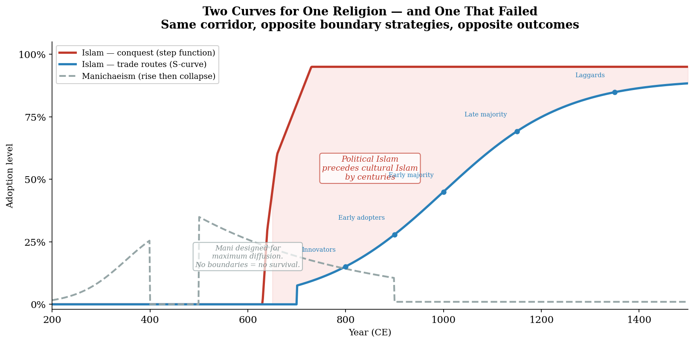

# Chapter 5: The Islamic Diffusion
### *Two curves for one religion — and one that failed*

---

## I. The Controlled Experiment

In the seventh and eighth centuries, two religions competed for the same corridor. They shared a geography, an era, and a missionary impulse. They differed in one variable: their boundary strategy.

Islam drew lines. You are Muslim or you are not. The shahada — the declaration of faith — is a clean bright boundary. Inside: the ummah, the community of believers. Outside: everyone else. The boundary is clear enough to organize armies, tax systems, and empires around it. It is clear enough to tell you who you are.

Manichaeism dissolved lines. Mani, a third-century Persian prophet, deliberately designed a religion for maximum cross-cultural adoptability.[^6][^7] He incorporated Zoroastrian dualism, Buddhist cosmology, Christian narrative structure, and Gnostic philosophy into a single universal system. He translated his own texts into multiple languages. He built a missionary infrastructure explicitly modeled on what worked in every tradition he absorbed. He was doing product-market-fit optimization for a spiritual system — three centuries before Muhammad.

Same corridor. Same era. Opposite boundary strategies. Opposite outcomes.

Islam became one of the world's dominant civilizational systems and remains so thirteen centuries later. Manichaeism essentially disappeared — persecuted to extinction by every major empire it touched, its texts surviving only accidentally in desert caves.

This chapter argues that the outcome was structurally predictable.[^1] Not because Islam was theologically superior. Not because Muhammad was a greater man than Mani. Because the thermodynamic logic of human social organization selects for boundary-drawing over boundary-dissolving, and the geographic conditions of the seventh-century corridor amplified that selection.

---

## II. Why Boundaries Are Load-Bearing

Friction zones between cultures are not bugs in the human social system. They are load-bearing features.[^2] The boundary between cultures is where identity gets defined, where group cohesion gets maintained, where the us-versus-them distinction that organizes collective action gets drawn.

Remove the boundary and you remove the social structure that depends on it.

A religion that works for everyone simultaneously works as an identity marker for no one. Identity — the *us* that defines itself against a *them* — is precisely what religions get selected for in the competitive environment of expanding empires and contested frontiers. Christianity succeeded partly because it could be weaponized as an identity boundary: you are Christian or you are not. The Roman Empire could use it to define membership. Islam succeeded for the same reason: the clean shahada, the clear in-group, the defined boundary.

Manichaeism dissolved boundaries rather than drawing them. In a world that needed boundaries drawn — a world of competing empires, contested frontiers, ethnic and linguistic friction zones — it was the wrong tool.

The thermodynamic framing: Mani was trying to build a maximum-entropy religion. Maximum entropy means complete diffusion — all gradients equalized, all boundaries dissolved, all energy uniformly distributed. But you need gradients to have structure. You need pressure differentials to have flow. You need boundaries to have civilization. A maximum-entropy state is, by definition, a state of zero structure.

Mani was right about the destination — a world where all boundaries have dissolved into universal understanding. He was wrong about the timing.[^8] He built the religion for a world at thermodynamic equilibrium. That world does not exist yet. The gradients are still running. The friction zones are still load-bearing. A religion that refuses to participate in boundary-maintenance fails at the primary social job religions get selected for — regardless of its theological sophistication.

---

## III. Islam's Two Curves

Islam did not spread through a single mechanism.[^3] It spread through two — simultaneously, along the same corridors, producing radically different outcomes depending on the channel.

**The conquest curve** is a step function. It arrives with an army and a tax code. The Rashidun and Umayyad caliphates expanded by military force across an enormous arc — from Arabia to Spain in the west, to Central Asia and the Indus in the east — within a single century after Muhammad's death. The political and administrative layer of Islam was imposed from the top: new rulers, new tax structures, new legal frameworks. The adoption curve is not an S-curve. It is a step: zero yesterday, one hundred percent today. The army arrives. The administration changes.

But the cultural adoption underneath — the actual conversion of belief and practice — still follows Rogers. The political overlay is fast. The belief diffusion is slow. And the gap between them is where the interesting history lives.

**The trade-route curve** is a classic Rogers S-curve. Islam spread along the Indian Ocean trade network, through Southeast Asia, across the Sahel to West Africa — carried not by armies but by merchants whose trading partners were Muslim. The incentive was commercial: Muslim merchant networks offered preferential terms to co-religionists. Joining the network — becoming Muslim — was a business decision with spiritual framing. The signal was economic. The encoding was religious.

The adopter categories are identifiable — though a clarification is necessary. Rogers' categories are not rigid buckets with hard boundaries. They are regions on a continuous normal distribution, with labels placed at standard deviation intervals for analytical convenience. "Early adopter" and "late majority" are not discrete types of people. They are positions on a gradient of motivation — from purely intrinsic (the innovation itself is sufficient reason to adopt) to purely coerced (non-adoption has become more costly than adoption). The gradient is continuous. The labels are handles for discussion. The reality is thermodynamic: energy flowing smoothly from high differential to low, not stepping between discrete states.[^3a]

*Innovators:* The first merchants in a new port who adopt Islam because they have direct contact with Muslim traders and immediately see the commercial advantage.

*Early adopters:* Other merchants and commercial elites who follow once the pattern is established and the network benefits become visible.

*Early majority:* Urban populations along trade routes who adopt as Muslim institutions — mosques, schools, courts — become the dominant social infrastructure.

*Late majority:* Rural populations in the hinterland who adopt as the social pressure becomes inescapable — not through conviction but because non-adoption has become costly. Your neighbors are Muslim. The market speaks Arabic. The judge applies sharia. You adopt because the gradient has become too steep to resist.

*Laggards:* Remote communities that hold syncretic practices for centuries — performing pre-Islamic rituals with an Islamic gloss, maintaining local traditions under a thin overlay of Muslim identity. The signal reached them but was decoded through their existing framework rather than replacing it.

The gap between political Islam and cultural Islam is the gap between the step function and the S-curve — between the army that arrives in a year and the belief that takes three centuries to fully propagate. The translation projects, the standardized legal codes, the formalized educational institutions — these are the late-majority infrastructure. They exist to serve populations who have been administratively Muslim for generations but are only now culturally adopting the full content of the system.

*[Figure 4: Two Curves for One Religion — and One That Failed](../../figures/fig-004-diffusion-s-curves.md)*

---

## IV. The Translation Infrastructure

When Buddhist dharmas were translated into Chinese at Turfan and Dunhuang, the translation project was late-majority adoption infrastructure[^4] — the compliance apparatus of a religion that had passed its tipping point and needed to serve populations beyond the reach of direct personal transmission.

The same logic applies to Islamic translation and formalization projects across Central Asia and beyond. The early adopters did not need translations. They learned Arabic, traveled to centers of learning, received direct instruction from masters. The commitment was high because the channel friction was high — only those with sufficient motivation crossed the threshold.

But a religion cannot scale through high-commitment channels alone. The S-curve demands infrastructure that lowers the barrier to adoption for each successive category. The translation lowers the barrier. The local-language text makes adoption possible without learning Arabic. The standardized ritual makes participation possible without deep understanding. The neighborhood mosque makes access possible without pilgrimage.

Each piece of infrastructure expands the viable adopter pool by lowering the friction threshold one more notch. Early adopters needed only the message itself — powerful enough to cross the mountain carried in a monk's memory. Late majority needed the message pre-translated, pre-packaged, and locally available — because their motivation was social conformity, not spiritual seeking.

The adoption curve describes a progressive externalization of motivation. Early adopters are intrinsically motivated — the innovation itself is sufficient reason. Late majority are extrinsically motivated — social pressure, economic incentive, institutional expectation. Laggards are coerced — non-adoption has become more costly than adoption.

Early adopters choose. Laggards comply.

The translations are compliance infrastructure.

The theological incentive structure determines which direction the adoption curve runs. Buddhist theology rewarded the distribution of texts — more copies of the dharma meant more spiritual merit. Buddhist monasteries were early institutional adopters of woodblock printing in China by the seventh century CE. The Diamond Sutra, dated 868 CE, is the oldest printed book in existence — produced by a Buddhist institution for merit accumulation.[^4a]

Catholic theology, by contrast, valued the process of hand-copying itself. The scriptorium was a devotional practice — the slow, careful act of transcription was prayer in physical form. Mechanical reproduction didn't just offer a faster tool. It proposed to eliminate a spiritual practice. The Catholic Church resisted printing until the Protestant Reformation created a disruptive use case — pamphlets distributing heterodox ideas the scriptorium system would never have copied — that pushed the technology past the institutional resistance.[^4b]

Same technology. Opposite theological incentive structures. Completely different adoption curves. The theology is the diffusion variable.

The irony: the institution that resisted printing also preserved the manuscripts for a thousand years of hand-copying. The scriptorium that blocked the innovation was the same institution that kept the content alive long enough for the innovation to arrive. Even the friction served a function.

---

## V. The Islam That Stayed

Islam did not remain an Arabian export in Central Asia. The receiving culture absorbed it, transformed it, and produced its most sophisticated expressions independently of the Arabian origin.

The Samanid Dynasty (819–999 CE) — the first Persian Muslim dynasty to assert independence from Abbasid control — produced the golden age of Central Asian Islamic civilization. Al-Khwarizmi, Ibn Sina, Rudaki, Firdausi. Persian language replacing Arabic as the prestige intellectual medium. A distinctly Central Asian Islam that owed more to Sogdian and Persian traditions than to Arabian ones.[^4c]

This is not a periphery of Arabian civilization. This is Buddhism-in-China repeated: an existing civilization absorbing an incoming religion and making it their own because the religion solved coordination problems the existing framework didn't. The sender was Arabia. The receiver was Transoxiana. The receiver transformed the signal. The encoding traveled. The decoding was entirely local.

The test: if Islam arrived as imperial power projection (Model A), Central Asian Islamic cultural production should track Abbasid political strength. It does not — the Samanid golden age occurs precisely as the Abbasid Caliphate weakens. If Islam arrived as diffusion adopted by existing sedentary cultures (Model B), Central Asian Islam should develop independently and potentially flourish more when the Arabian center weakens. It does.

The frontal boundaries between civilizations persisted. Islam changed the religious overlay but not the underlying geographic logic. The trade nodes stayed where they were. The power centers stayed where they were. The cultural production stayed where it was. The terrain was the constant. The religion was the variable.

---

## VI. The Rate of Arrival

Diffusion is not only about what arrives and through what channel. It is about how fast.

The Gandhara refugees who arrived at Tarim Basin oasis cities came in small groups — a hundred at a time.[^5] They were absorbed without resistance. The thermodynamic pressure differential was low enough that the host system could integrate the input without defensive reorganization.

This is a general principle: the rate of arrival determines the receiver-side response, not the content of who is arriving. The same people, the same culture, the same religion — but arriving slowly integrates, arriving fast triggers conflict.

Rogers' adopter categories are relevant here too, but applied to the *receiving* population rather than the adopters. A host population has its own distribution of receptivity. Some individuals are naturally curious about newcomers — the host's innovators and early adopters. They engage, intermarry, learn the newcomers' language and practices. As long as the rate of arrival stays below the threshold where the host's early majority feels threatened, integration proceeds smoothly.

When the rate exceeds that threshold — when the newcomers arrive faster than the host population's natural distribution of receptivity can absorb them — the late majority and laggards of the host population activate defensive responses. Border-hardening. Identity consolidation. Rejection.

The same content. The same people. A different rate. A completely different outcome.

This is testable against historical migration events: every case where a population arrived slowly and integrated, versus cases where the same population arrived quickly and triggered conflict. The content is the control. The rate is the variable. The outcome is predicted by the rate alone.

---

## VI. The Controlled Experiment Completed

Return to the opening. Two religions. Same corridor. Same era. One survived. One vanished.

Manichaeism was designed for maximum adoption breadth — incorporating everything, excluding nothing, dissolving every boundary. In Rogers terms, it minimized every barrier to adoption. Relative advantage: it offered the best of all traditions. Compatibility: it was compatible with everything. Complexity: reduced through synthesis. Trialability: high. Observability: high.

By every Rogers criterion for adoption rate, Manichaeism should have diffused faster than Islam. It was designed to. Mani explicitly optimized for it.

And initially it did. Manichaeism spread rapidly across an enormous geographic range — west into the Roman Empire, east to China. Augustine was Manichaean for nine years. The Uyghur Khagan made it the state religion. The initial diffusion was remarkable.

Then it collapsed. Persecuted simultaneously by every major empire: Byzantine Christianity, Sassanid Persia, Abbasid Islam, Tang China. Only the Uyghur Empire provided sustained political shelter — and when that collapsed in 840 CE, the last protector vanished.[^10]

A legitimate objection: Islam appeared three centuries after Manichaeism. The political landscape had changed — the Sassanid and Roman empires that persecuted Mani were not the Abbasid and Byzantine empires that hosted Muhammad's successors. Are we really holding geography constant, or did the political substrate change in ways that advantaged Islam for reasons other than boundary strategy?

The Uyghur case answers this. Manichaeism briefly succeeded in exactly the sphere where Islam would later dominate — Central Asia, the steppe-sedentary frontier. It succeeded there through political patronage (state religion, 762 CE) rather than through organic boundary-drawing. When the patronage ended (840 CE), the religion collapsed immediately. It could not sustain itself without state protection because it lacked the boundary-maintenance capacity that generates self-sustaining social cohesion. Islam, arriving in the same geographic space centuries later, drew boundaries and persisted through multiple state collapses — because the social structure it generated was load-bearing independent of any single state's support.

The timing objection isolates the wrong variable. The political context changed between the third and seventh centuries. But boundary strategy — the capacity to generate self-sustaining identity structures — is the variable that explains why one religion survived the loss of political patronage and the other did not, in the same geographic space, among the same populations.

Why did every empire turn against it? Not because it was foreign — Islam was equally foreign to the Tang and they tolerated it. Not because it was weak — at its peak it had millions of adherents across the known world.

Because it could not be weaponized as a boundary. An empire needs religion to do social work — to define membership, organize loyalty, distinguish insiders from outsiders. Islam does this cleanly. Christianity does this cleanly. Manichaeism, by design, does not. It cannot tell you who is *not* Manichaean because it was designed to include everyone.

A religion that cannot draw the boundary cannot do the empire's work. And a religion that cannot do the empire's work loses the empire's protection. And a religion without political protection is vulnerable everywhere simultaneously.

Manichaeism's texts survive today almost exclusively from the Dunhuang caves and the Turfan desert — preserved by the same extreme aridity that preserved everything else in the Tarim Basin. The desert did not persecute. The desert did not care about boundaries. It simply preserved what fell within its reach.

The sender-side record of Manichaeism is written almost entirely by its enemies — Augustine refuting it, Christian heresiologists condemning it, Islamic scholars dismissing it. The receiver-side experience — what Manichaeans actually believed, practiced, and felt — exists in fragments from desert caves.

Another returning bomber. Another receiver-side silence.[^9]

The religion designed for maximum diffusion was filtered out of the historical record by the survival bias of the boundaries it refused to draw.

---

*Boundaries are load-bearing. The religion that refused to draw them vanished. The corridor remains. Turn the page.*

---

## Notes

[^1]: The "controlled experiment" framing — holding geography constant, varying boundary strategy, observing diffusion outcomes — is our analytical contribution. No single published source frames the Manichaeism/Islam comparison this way. The individual historical claims about both religions draw on established scholarship; the experimental framing is ours. See [ref 078](../../references/078-manichaeism-maximum-entropy-religion.md).

[^2]: The principle that "friction zones are load-bearing features, not bugs" — and its corollary that a religion designed to dissolve all boundaries fails because it removes the social structure that depends on boundary maintenance — emerged from a Beta seminar discussion connecting Hansen's material on Manichaeism to the thermodynamic framework. This is our theoretical contribution. The observation that religions get selected for boundary-drawing capacity in competitive environments connects to evolutionary and game-theoretic approaches to religious persistence but is stated here as an independent derivation from the geographic framework. See [ref 078](../../references/078-manichaeism-maximum-entropy-religion.md).

[^3]: On Islam's two diffusion curves: the distinction between military conquest (step function) and trade-route spread (S-curve) is recognized in Islamic historiography broadly. The specific Rogers mapping — innovators, early adopters, early majority, late majority, laggards applied to trade-route Islam — is our contribution. Everett Rogers, *Diffusion of Innovations*, 5th ed. (New York: Free Press, 2003), chapters 7–8, provides the adopter category definitions. The application to pre-modern religious diffusion extends Rogers beyond his validated domain (modern communication and agricultural contexts), which we acknowledged in Chapter 1. See [Rogers lit review](../../literature-review/rogers-diffusion-of-innovations.md).

[^3a]: Rogers placed his category boundaries at standard deviation intervals on a normal distribution: innovators at 2.5%, early adopters at 13.5%, early majority at 34%, late majority at 34%, laggards at 16%. See Rogers, *Diffusion of Innovations*, 5th ed., chapter 7. These are analytical conveniences imposed on a continuous gradient, not empirically observed discontinuities. Our application uses the categories as shorthand for positions on a motivation gradient (intrinsic → coerced) rather than as discrete human types. The thermodynamic framing — energy flowing smoothly from high to low — is our contribution, connecting Rogers' empirical distribution to the book's physical framework.

[^4]: The observation that Buddhist translation projects represent late-majority adoption infrastructure — "early adopters choose, laggards comply" — emerged from a Beta seminar discussion while listening to Hansen's coverage of the Turfan translation activities. The distinction between intrinsic motivation (early adopters) and social coercion (laggards) as a progressive externalization of adoption pressure is our synthesis. See [ref 072](../../references/072-buddhist-translations-late-majority-infrastructure.md).

[^5]: On the refugee absorption rate threshold: the principle that small groups arriving incrementally integrate (below threat threshold) while large population movements trigger defensive consolidation emerged from Hansen's description of Gandhara refugees arriving at Tarim Basin oasis cities "a hundred at a time." The Rogers extension — applying adopter categories to the *receiving* population rather than the adopters — is our contribution. The testable prediction (rate determines outcome, content is the control) has not been systematically verified against historical migration events but is stated as a falsifiable principle. See [ref 061](../../references/061-refugee-absorption-rate-diffusion-threshold.md).

[^6]: On Mani and Manichaeism: Mani (216–274 CE) is well-documented in both Manichaean primary sources and the writings of his critics. Augustine's Manichaean period is documented in his *Confessions*. The Uyghur conversion (~762 CE) and the collapse of the Uyghur Empire (840 CE) are established in Central Asian historiography. Tasar, *Crossroads of Civilization*, covers the Uyghur religious context. Hansen, *The Silk Road*, documents the Manichaean texts found in Turfan and Dunhuang.

[^7]: On Mani's deliberate design for cross-cultural adoptability: Mani's incorporation of Zoroastrian, Buddhist, Christian, and Gnostic elements and his multilingual missionary strategy are documented in Jason BeDuhn, *The Manichaean Body: In Discipline and Ritual* (Baltimore: Johns Hopkins University Press, 2000) and Samuel Lieu, *Manichaeism in Central Asia and China* (Leiden: Brill, 1998). The Rogers framing — "product-market-fit optimization for a spiritual system" — is our synthesis.

[^8]: The "maximum entropy religion" framing — Manichaeism as attempting to reach thermodynamic equilibrium in the religious landscape, failing because equilibrium = zero structure = zero identity function — is our theoretical contribution. The thermodynamic language is metaphorical (applied to social systems rather than physical ones), which we acknowledge per the Shannon synthesis discussion (issue #12). See [ref 078](../../references/078-manichaeism-maximum-entropy-religion.md).

[^9]: The Wald bomber applied to Manichaean textual survival — the sender-side record written by enemies, the receiver-side experience surviving only in desert-cave fragments — extends the methodology developed in [ref 064](../../references/064-wald-survivorship-bias-returning-bomber.md). The specific observation that "the religion designed for maximum diffusion was filtered out of the historical record by the survival bias of the boundaries it refused to draw" is our synthesis.

[^4a]: On Buddhist institutional adoption of printing: the Diamond Sutra (868 CE), found in the Dunhuang cave, is the oldest dated printed book. Woodblock printing in China dates to the Tang Dynasty (~600s CE). Buddhist theology's merit-accumulation incentive (more copies = more merit) produced early institutional adoption. See [ref 089](../../references/089-printing-adoption-theological-incentive-structure.md).

[^4b]: On Catholic scriptorium resistance to printing: the devotional value of hand-copying as spiritual practice, and the Protestant Reformation as the disruptive use case that pushed printing past institutional resistance. The scriptorium paradox — the institution that resisted the innovation also preserved the content for a thousand years until the innovation arrived — is our synthesis. See [ref 089](../../references/089-printing-adoption-theological-incentive-structure.md).

[^4c]: On Islam in Central Asia as diffusion adoption rather than imperial power projection: the Samanid Dynasty evidence and the Model A/Model B test are developed in [ref 093](../../references/093-islam-central-asia-diffusion-not-projection.md). The Samanid golden age occurring as the Abbasid Caliphate weakens is the decisive evidence for Model B — the receiving culture transformed the incoming religion and produced its most sophisticated expressions independently.

[^10]: The timing objection — that Islam appeared 300 years after Manichaeism and the political substrate changed — is acknowledged as a legitimate challenge. The response: boundary strategy is more explanatory than political context because Islam also succeeded in the Uyghur sphere where Manichaeism previously operated. Manichaeism briefly succeeded there through political patronage (Uyghur state religion, 762 CE) but collapsed immediately when patronage ended (840 CE), confirming that without boundary-drawing capacity the religion could not survive withdrawal of state support. The timing difference is real but the variable under test (boundary strategy) is isolated by this natural comparison. See Charlie's feedback [issue #18](https://github.com/gotoplanb/geography-as-destiny/issues/18).
