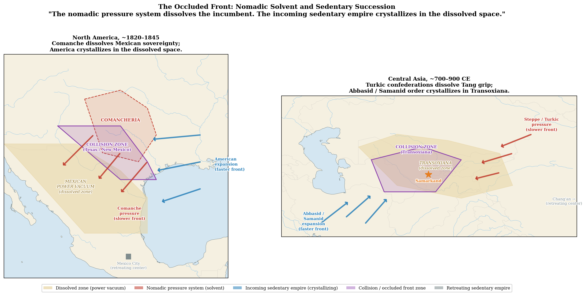

# Chapter 6: The Parallel Conquests
### *Same shock, same result, opposite sides of the planet*

---

## I. The Missing Horse

Ten thousand years ago, horses went extinct in North America. The cause was climatic — the same post-glacial warming that transformed the continent's ecology eliminated the megafauna, including the wild horses that had evolved there. The people who remained were cognitively identical to every other population on Earth. They lacked one thing: the specific mobility technology that the terrain they inhabited was optimized to exploit.[^ch6-1]

On the Eurasian steppe, horses survived. Over five thousand years, the populations there developed the institutional knowledge of horse-based civilization — the tributary systems, the border management doctrines, the raiding calibration, the strategic alliance patterns that made nomadic empires sustainable across millennia. The Xiongnu, the Scythians, the Mongols — all operating from an accumulated playbook refined across generations.[^ch6-2]

When the Spanish reintroduced horses to North America in the sixteenth century, they restarted a developmental clock that had been frozen for ten millennia. The Plains nations were not starting from zero cognitively. They were starting from zero in terms of the specific resource that the terrain was suited to produce.

The result was a speedrun. What took Eurasia five thousand years — the development of horse-based mobile civilization — compressed into roughly one hundred and fifty years on the Great Plains. And then the railroad arrived before the development could mature.

Two friction collapses in two centuries. Eurasia got five thousand years of gradual development between them. North America got one hundred and fifty.[^ch6-3]

---

## II. The Horse as Friction Collapse — Quantified

The horse was not a faster version of existing Plains transportation. It was a friction collapse — a technology that changed who the terrain served.

The numbers are specific. Before the horse, Plains peoples moved cargo on dog-pulled travois: roughly seventy-five pounds per load. The horse carried two hundred pounds and dragged three hundred on a travois — a fourfold increase in cargo capacity. Horses covered twice the daily distance of foot travel. The effective throughput increased eightfold almost overnight.[^ch6-4]

But the visible capacity increase was not the most significant change. The hidden supply chain decoupling was. Dogs competed directly with humans for the primary food resource — meat. Every unit of cargo moved required prior hunting effort to fuel the movers. Transportation capacity was directly constrained by hunting success. A bad hunt meant less food for dogs, which meant less transportation, which meant reduced mobility. The entire logistics system was fragile and interdependent with the food system.

The horse broke that interdependency entirely. Horses grazed independently on the abundant Plains grass — a resource humans could not directly consume. Transportation capacity became independent of hunting productivity. The infrastructure fed itself from a resource that imposed no opportunity cost on human caloric needs.[^ch6-5]

This is not a faster horse. This is the elimination of an entire cost category from the logistics chain. The same structural move the railroad would later make in the Tarim Basin — where camels needed oasis water but trains carried their own. The technology that removes a geographic dependency from the transportation equation is the technology that changes who the terrain serves.

*[Figure 12: Cargo Capacity Across Plains Transportation Technologies](../../figures/fig-012-cargo-capacity-friction-collapses.md)*

---

## III. The Comanche Empire

The Comanche were the first people on the Great Plains to fully exploit the horse friction collapse. They were Rogers innovators — not because they were inherently more capable than their neighbors, but because their specific position relative to Spanish horse sources and their existing semi-nomadic Shoshone heritage made them the first to recognize and scale the new resource gradient.[^ch6-6]

Within decades of acquiring horses in the early eighteenth century, the Comanche had established dominance over the southern Plains. By the 1730s they controlled a territory the size of France — the Comanchería — centered on the Arkansas River valley, which had functioned as a commerce corridor for centuries before any European arrived. They did not create the corridor. They dominated a pre-existing one, the way every successful actor on the Silk Road dominated the pre-existing corridor at Transoxiana.[^ch6-7]

The Arkansas valley's persistence is itself evidence of geographic determinism. Eight independent actors across five centuries — pre-contact indigenous trade networks, Spanish explorers, French traders, the Comanche horse empire, the Santa Fe Trail, the railroad, and the modern interstate system — all independently selected the same corridor because the terrain left them no choice. The actors changed. The route did not.[^ch6-8]

The Comanche developed recognizable corridor civilization infrastructure at compressed speed. Their language became the lingua franca of the southern Great Plains — the same mechanism that made Sogdian the commercial language of the Silk Road. A lingua franca does not emerge from pure raiding. It emerges from sustained commercial interaction across cultural boundaries that makes a common communication medium economically valuable.[^ch6-9]

The trade center at Big Timbers on the Arkansas River operated as a seasonal commercial hub where native and European trading parties exchanged horses and mules for guns and manufactured goods. The commodity structure was determined by the resource environment: bison products and captives as primary exports, metal goods and manufactured items as imports. The human cost of the captive trade was real and terrible — lives destroyed, families shattered, people reduced to commodity. Understanding the structural logic that produced it does not diminish that cost. But the captive trade was commercial adaptation to a resource environment where the only commodity with sufficient value density for long-distance exchange was human labor. The same resource logic operated on the Silk Road, where the highest-value-density portable commodities determined the trade structure at every node.[^ch6-10]

---

## IV. The Bilateral Deficit

The encounter between the Comanche Empire and the European colonial powers was characterized by a structural deficit that had no equivalent on the Silk Road: neither side possessed the institutional knowledge appropriate to the situation they found themselves in.

Spain was a maritime and Mediterranean empire projecting power into a continental interior for which it had no doctrine. Its imperial toolkit — coastal trading posts, city conquest, tribute extraction from existing sedentary administrative systems — had no template for managing mobile horse cultures across an open grassland. Every previous European imperial experience was either sedentary-on-sedentary or maritime-based. The Spanish had no capital to retreat to — unlike China, which could contract to the Jade Gate, or Persia, which could fall back to the plateau. Every frontier loss was existential rather than tactical.[^ch6-11]

The Plains nations were developing horse-enabled imperial doctrine in real time without precedent. The Eurasian steppe nomads had thousands of years to develop the playbook: how hard to raid without triggering existential retaliation, when to offer alliance, how to extract tribute without destroying the productive capacity of the sedentary neighbors they depended on. The Comanche had decades. They were improvising the entire institutional framework from scratch while simultaneously facing the most technologically asymmetric invasion in human history.[^ch6-12]

The cultural substrate that made Silk Road encounters productive over millennia was absent. The Sogdian merchants who mediated between Chinese and Persian civilizations operated within centuries of accumulated shared frameworks — trade conventions, syncretized religious elements, borrowed aesthetic conventions. Each encounter built on previous encounters. The receiver-side substrate was pre-warmed. The Comanche-European encounter had none of that accumulated substrate. No shared religious framework, no trade goods that created mutual dependency before the conflict, no centuries of border negotiation building institutional memory.[^ch6-13]

Where cultural substrate existed — between the Comanche and other Plains nations — the encounter produced functional exchange economies, kinship networks, and diplomatic relationships. The Comanche had a fully functional integration mechanism (captive adoption, intermarriage, ethnographic mosaic building) that worked precisely because it operated within a shared Plains cultural framework. The same tools were unavailable for settler integration because the settlers had no compatible receiver-side category for these mechanisms.[^ch6-14]

The maturation curve that converts extractive frontier encounters into reciprocal institutional relationships — the process that took the Silk Road centuries to develop — never had time to complete. The velocity of American expansion overwhelmed the curve before it could produce stable institutions. The tragedy was not that equilibrium was impossible. It was that the pressure differential was too fast for even partial miscibility to generate enough friction to slow the overrun to a negotiable pace.[^ch6-15]

The reason American velocity was so high is that American expansion was not confronting an intact sedentary empire. It was crystallizing in a vacuum that two prior forces had already created. The Comanche, following their commercial gradient southwest, had dissolved Mexican sovereignty over the northern frontier without intending to and without any interest in administering what they dissolved. Behind them, American settlement pressure was moving faster than the Comanche advance — an occluded front, a faster pressure system catching a slower one. The collision zone was Texas and New Mexico: not Americans fighting Mexicans, but Americans meeting Comanche at the leading edge of the faster front catching the slower one. Mexico barely appeared in the final act of its own territorial loss. The Americans weren't taking territory from Mexico. They were administering a vacuum the Comanche had already created.[^ch6-15a]

The same mechanism operated on the Eurasian steppe a millennium earlier. Turkic confederations moving west dissolved Tang sovereignty over Transoxiana without being able or willing to administer what they dissolved. The Abbasid Caliphate, then the Samanid Persian revival, crystallized in the dissolved space — not by defeating the Tang directly, but by filling the administrative vacuum the steppe confederations had opened. The nomadic pressure system is the solvent. The incoming sedentary empire is what crystallizes when the solution cools. Sedentary empires rarely replace each other through direct confrontation. The nomadic intermediary does the dissolution work first.[^ch6-15b]

*[Figure 14: The Occluded Front — Nomadic Solvent and Sedentary Succession](../../figures/fig-014-occluded-front-nomadic-solvent.md)*

---

## V. Why No Dunhuang

The Great Plains had a commerce corridor. It had a lingua franca. It had seasonal trade centers. Why did it never produce a Dunhuang — a permanent chokepoint city with multilingual archives, institutional infrastructure, and civilizational permanence?

The answer has three components.

First, the corridor's orientation. The Rocky Mountains run north-south — perpendicular to any potential east-west trade corridor. The Tian Shan mountains that organize the Silk Road's northern route run east-west — parallel to the trade routes, providing snowmelt water while channeling traffic along their base. Same mountain type. Perpendicular orientations. Opposite civilizational consequences. South Pass in Wyoming — the most viable east-west crossing of the Rockies — never generated an equivalent urban node despite being the only viable route for most of the range's length. No chokepoint city means insufficient sustained bidirectional traffic.[^ch6-16]

Second, the dual empire requirement. Dunhuang exists because China permanently generates demand at one end and Persia permanently generates demand at the other. The chokepoint city requires simultaneous permanent demand from both directions. The Rocky Mountain corridor never had simultaneous permanent sedentary empires at both ends generating constant bidirectional traffic.[^ch6-17]

Third, the climate incompatibility. East-west corridors connect civilizations at similar latitudes with similar agricultural calendars, crops, and seasonal rhythms. The trade is constant and year-round. North-south corridors connect climatically incompatible zones — cold-season territory at one end, warm-season territory at the other. The goods are seasonal. You cannot sustain a permanent merchant class on seasonal trade.

Twelve thousand years of human use at the Rocky Mountain foothills corridor. Zero permanent urban nodes. The framework predicts this from orientation, climate compatibility, and demand structure — and the archaeological record confirms it.[^ch6-18]

*[Figure 11: Comanche Non-Linear Outposts vs. Gansu Corridor Linear Infrastructure](../../figures/fig-011-comanche-non-linear-outposts.md)*

---

## VI. The Orthogonal Rotation

For four thousand years, the open steppe was a highway for nomadic peoples and a barrier for sedentary states. No empire could project power across it faster than a horse could retreat. The terrain served the mobile.

Then the railroad arrived.

The same flat, open terrain that had been the nomad's greatest strategic asset became their greatest vulnerability. There was nowhere to flee that the rail could not reach. No terrain feature to hide behind. The relationship between terrain and power rotated ninety degrees: the steppe went from being legible only to the mobile to being legible only to the state.[^ch6-19]

This happened simultaneously on opposite sides of the planet.

In the American West, the Transcontinental Railroad (completed 1869) and the subsequent expansion of rail networks into the Plains transformed the military calculus. Troops, supplies, and administrators could be moved faster than any horse culture could respond. The buffalo — the entire economic foundation of the Plains optimization — was systematically destroyed by hunters who arrived by rail, operated along rail lines, and shipped hides by rail. The economic warfare was enabled by the friction collapse: Russia imposed cotton monoculture on the Central Asian pastoral economy, America destroyed the buffalo herds. Both were attacks on the resource base that made the nomadic geographic optimization viable. Different crop, same structural move.[^ch6-20]

In Central Asia, the Transcaspian Railway (built 1880-1888) performed the identical function. General Annenkov built the line across the Karakum Desert from the Caspian Sea to Samarkand — turning a region that had been logistically impossible to hold into one that could be supplied, reinforced, and administered. Before the railroad, Perovskii's 1839 invasion of Khiva had failed because the Russians could not manage camels in the desert. Geography stopped the empire cold. The fort chain that followed was incremental friction reduction. The railroad was total friction collapse.[^ch6-21]

Same technology. Same decade. Same geographic type. Same target culture. Same result. Neither empire aware of the other's parallel campaign.

*[Figure 6: The Parallel Conquests](../../figures/fig-006-parallel-conquests-map.md) | [Interactive version](/book/figures/fig-006-parallel-conquests)*

---

## VII. The Convergence

The collapse of the Comanche Empire between 1865 and 1875 was not a single force overwhelming a weakened resistance. It was the simultaneous arrival of multiple independent forces, each of which the Comanche could have engaged on its own. None of them alone would have produced the outcome. All of them arriving in the same seven-year window did.[^ch6-28]

Their apparent territorial peak in the early 1860s was an artifact, not a peak. The Comanche had not strengthened during the Civil War years; American attention had moved elsewhere. The Civil War itself, the French intervention in Mexico from 1861 to 1867, the early phase of Reconstruction — sequential and overlapping demands on the same American capacity. The Monroe Doctrine had always been thermodynamic capacity rather than diplomatic principle. Napoleon III tested this hypothesis directly by installing Maximilian on the Mexican throne in 1864, and the test confirmed it: a European monarch could be installed in the Americas the moment American capacity collapsed inward, and could not survive the moment American capacity restored. The Comanche apex was the inverse of the resolved Civil War. When attention restored, the apparent strength evaporated almost instantly.[^ch6-29]

A specific manufacturing innovation in the late 1860s converted bison hide from a modest commercial commodity into industrial drive belting. Every factory in the industrializing American and European economies suddenly needed leather belts to transmit mechanical power, and the bison population of the Great Plains was the cheapest source of that input on Earth. Before the innovation, the Comanche multi-species rotational management could absorb hide demand without compromising population recovery. After, the demand became effectively unlimited. Industrial leather belting was a friction collapse in this book's technical sense — a specific technological capability dropping a previously prohibitive cost barrier, this time between rawhide and finished mechanical-power transmission.[^ch6-30]

The Comanche pastoral system was sophisticated by any measure modern wildlife biology applies. They had incorporated cattle into their pastoral economy and selectively bred what became the Texas Longhorn — a breed engineered for water resistance and long-march capacity. They had developed rotational protocols that selected against the prime reproductive females and rested the herd for two or three seasons between hunting cycles. The American administrative frustration with the Comanche was never about resource management capacity. It was about sedentarization. The Comanche had adapted. They had not converted. The two are different.[^ch6-31]

The bison were not destroyed because the Comanche failed to manage them. They were destroyed because the Comanche were managing them too well. Sustainability of the Plains economy meant the Comanche could continue mobile pastoral existence indefinitely. Continued mobile existence meant no conversion to sedentary agriculture. No conversion meant the land could not be incorporated into the Anglo-American agricultural political economy. Sheridan and Sherman understood this explicitly and supported the commercial buffalo hunters as a strategic asset. Two mechanisms operate simultaneously here. The railroad's destructive effect was indifference — geographic optimization brought industrial actors into a corridor whose previous occupants were not the optimization's target, only its overrun. The bison destruction's effect was deliberate strategic doctrine — the resource base of a non-converted indigenous economy explicitly targeted because the economy's continued viability prevented the conversion project. Both are real. Neither alone explains the speed of the collapse. Together they explain it precisely.[^ch6-32]

The Medicine Lodge Treaty of 1867 had already pre-positioned the legal mechanism that would convert the ecological destruction into a political outcome. The treaty's compulsion-to-reservation clause was conditional on the Plains economy remaining viable. The Comanche could continue mobile existence as long as the bison sustained that existence. If the bison failed, the treaty's letter would activate the reservation requirement. The Comanche signed what they understood to be a relationship instrument, calibrated to two centuries of diplomatic experience with Spain, Mexico, France, and the early American republic — every previous powerful neighbor had treated treaties as living relationships requiring ongoing negotiation and reciprocal exchange. American legal tradition treated the document as exhaustive and self-executing. Two parties signed the same treaty. Two parties understood completely different documents. The fine print was always going to trigger. The industrial hide market just determined the timing.[^ch6-33]

The political authorization for total war arrived in the same window. The 13th Amendment, ratified in 1865, was the moral high point of American democratic idealism — the formal constitutional repudiation of human bondage after six hundred thousand deaths. It was also the structural tipping point that made elimination-scale military commitment to the southern Plains politically possible. The captive economy the Comanche had run for generations had been managed by Spain, Mexico, and pre-Civil War America as a frontier irritant. After emancipation, the same practice read as direct affront to the new constitutional order — re-enslavement of freed people by a population that had never been part of the Civil War's resolution. The principle demanded consistency. The consistency demanded action. The behavior had not changed. The encoding had. The Comanche were doing what they had always done. The frame had shifted around them.[^ch6-34]

This is Greek tragedy in its precise classical structure. The protagonist's greatest virtue becomes the catastrophe of someone the virtue's authors were not considering — not through malice or hypocrisy, but through the logical extension of a principle that cannot be selectively applied without exposing its own contradictions. The freed Black American and the Comanche were both victims of the same underlying system, operating through completely different mechanisms. The resolution of one injustice through constitutional amendment created the political and moral conditions for the acceleration of the other. The moral progress was real. The catastrophe was real. Both flowed from the same principle. This is not exculpation. It is the structural reading the conventional narrative cannot offer because the conventional narrative needs the two stories to be separate. They were not separate. The 13th Amendment did not destroy the Comanche. The conjunction did. The 13th Amendment was the part of the conjunction the conventional narrative finds hardest to see.[^ch6-35]

The Comanche could not survive the conjunction. They had survived disease, drought, intertribal competition, Spanish encroachment, Mexican collapse, French commerce, two centuries of diplomatic and military adaptation. What they could not survive was the simultaneous arrival of restored American capacity, industrial leather demand, the 13th Amendment's political authorization, Sheridan's total war doctrine, and the Medicine Lodge tripwire — five mechanisms operating through different actors with different motivations on different timeframes, mutually reinforcing without coordinating, each requiring a different kind of response, the conjunction requiring all responses simultaneously. There was no Comanche institutional response that could address all of these at once. The conjunction was structurally beyond their adaptive range.

---

## VIII. The Parallel — Deeper Than Surface

The parallel between the American and Russian conquests is not merely coincidental timing. It is a structural convergence that the framework explains and that no other explanation accounts for.

The surface parallels are striking enough: same technology, same timeline, same target, same outcome. But the deeper structure reveals that the two cases are different expressions of the same thermodynamic logic operating through different historical contexts.

The Russian railroad did not push into empty space. It pushed into space that had been vacated by a receding Chinese empire. By the mid-nineteenth century, Chinese power projection into the Tarim Basin and western Central Asia had contracted — the Qing Dynasty weakening internally, the corridor going commercially dark just as European industrial technology matured. Nomadic disruption filled the vacuum as it always does when sedentary pressure drops. The Russian railroad exploited a corridor that was available precisely because the eastern power that had historically contested it was no longer projecting strength there.[^ch6-22]

The Russian railroad followed and amplified a mature corridor civilization. The Silk Road infrastructure was already there — two thousand years of corridor development, oasis cities, relay trade networks, tributary systems. The railroad collapsed the steppe barrier protecting the nomads who controlled the corridor's margins. It followed existing geographic logic and accelerated it.[^ch6-22a]

The American railroad terminated an immature corridor civilization mid-development. The Plains corridor was only one hundred and fifty years into its horse-enabled developmental trajectory. The Comanche lingua franca, the Arkansas valley trade center, the diplomatic alliance systems — all were developing but none had reached the institutional depth that the Silk Road's equivalent infrastructure had accumulated over millennia. The railroad did not follow an established corridor of equivalent depth. It ended one before it reached maturity.[^ch6-23]

Same technology. Same outcome. Different relationship to the underlying geographic logic. One amplifies a mature system. One terminates an immature one. Both destroy the mobile advantage that made the existing system function — because the railroad collapses the terrain's service to the mobile regardless of whether the mobile civilization is ancient or adolescent.[^ch6-24]

---

## IX. The Counterfactual

Remove the Comanche entirely from history. Does the structural outcome change?

The framework says no. The resource gradient — horses plus open grassland — still exists. Some other group fills the horse-mobility niche. Spain still declines because the structural exhaustion is independent of which specific group pressures the frontier. The railroad still wins because the technology differential is overwhelming regardless of which horse culture it faces.[^ch6-25]

Remove Kenesary Qasymov from the Central Asian steppe. The Russian expansion continues. Remove Tecumseh from the American frontier. The resistance collapses slightly sooner. Remove Peter the Great from the Russian court. The expansion happens within a generation, driven by the same geographic pressures.

The Comanche shaped the specific path — which territory was contested, which alliances formed, which battles happened where. They did not shape the structural outcome: horse-mobile empire rises on the Plains, pressures colonial Spain, then gets overrun by railroad-enabled expansion.

High-leverage draws from a loaded distribution. The distribution was loaded by the geography. The Comanche were the draw that happened. Another draw was possible. The distribution would have produced the same shape.[^ch6-26]

---

## X. The Atlantic Parallel

The railroad conquests of the 1860s-1880s were not the first instance of this pattern. The Spanish and Portuguese oceanic expansion of the 1490s-1500s performed the same structural function a friction regime earlier.

The Atlantic Ocean underwent the same orthogonal rotation the steppe would undergo with the railroad. Before oceanic sail technology: the Atlantic was an impassable barrier separating civilizations that did not know each other existed — the same way the steppe protected the nomads. After: it became the corridor for European power projection into the Western Hemisphere.

Same technology shock (oceanic sail plus firearms plus compass). Same timeline (same decade — Columbus 1492, Vasco da Gama 1498). Same geographic type (vast open space previously functioning as barrier). Spain going west, Portugal going east. Coordinated only loosely by the Treaty of Tordesillas. Same structural outcome.[^ch6-27]

The parallel conquests of the 1860s are the latest instance of a recurring pattern, not the first. When a friction collapse technology arrives, it gets deployed in multiple directions simultaneously because the technology does not care about direction — it collapses friction everywhere the terrain type matches.

Empire is the constant. Friction is the variable. The technology determines the regime. The terrain determines the outcome.

---

*The terrain was always capable. The timing was wrong twice — once by megafauna extinction, once by industrial technology arriving before the restart could mature. The river remembers. Turn the page.*

---

## Notes

[^ch6-1]: On horse extinction in North America ~10,000 years ago: the post-glacial megafauna extinction is standard paleontology. The connection between horse absence and the specific form of civilizational development on the Great Plains is this book's extension of Diamond's axis argument — the same terrain that produced steppe empires in Eurasia could not produce them in North America because the mobility technology was absent. See [ref 100](../../references/100-compressed-sequential-friction-collapses.md).

[^ch6-2]: On five thousand years of Eurasian horse-based institutional development: David Anthony, *The Horse, the Wheel, and Language: How Bronze-Age Riders from the Eurasian Steppes Shaped the Modern World* (Princeton: Princeton University Press, 2007). The accumulated steppe-nomad playbook — raiding calibration, tributary systems, border management — is documented across the full arc from Xiongnu to Kazakh hordes. See [ref 029](../../references/029-han-dynasty-steppe-frontier-template.md).

[^ch6-3]: The compressed sequential friction collapse — two shocks in 200 years vs. 5,000 years of gradual development in Eurasia — is developed in [ref 100](../../references/100-compressed-sequential-friction-collapses.md). The Comanche were still building horse-enabled institutions when the railroad made them obsolete.

[^ch6-4]: On horse cargo capacity: Pekka Hämäläinen, *The Comanche Empire* (New Haven: Yale University Press, 2008), chapter 2. Dog+travois ~75 lbs, horse carrying 200 lbs, horse+travois 300 lbs. Horse covers 2x daily distance. Effective throughput 8x over dog baseline. See [ref 106](../../references/106-horse-friction-collapse-quantified.md).

[^ch6-5]: The supply chain decoupling — dogs compete with humans for meat, horses eat grass humans can't use — eliminates a systemic vulnerability the raw capacity numbers don't reveal. Transportation cost fully decoupled from hunting productivity. See [ref 107](../../references/107-horse-supply-chain-decoupling.md). The parallel to the railroad decoupling from oasis water (ref 044) is structural: both remove a geographic dependency from the logistics chain.

[^ch6-6]: On Comanche as Rogers innovators in horse adoption: Hämäläinen, *Comanche Empire*, chapters 1-2. The question of whether Comanche adaptability was structural advantage or first-mover timing remains open — see [issue #24](https://github.com/gotoplanb/geography-as-destiny/issues/24). The counterfactual removal test (ref 102) suggests the distribution would have produced a similar outcome regardless of which specific group filled the horse-mobility niche.

[^ch6-7]: On the Arkansas River valley as pre-existing commerce corridor: the route functioned for centuries before European contact. Eight independent actors across five centuries selected the same corridor. See [ref 113](../../references/113-arkansas-river-corridor-eight-regimes.md).

[^ch6-8]: On the Arkansas corridor's eight-regime persistence: pre-contact indigenous trade → Spanish explorers → French trading post (1686) → Comanche horse empire (1720s) → French guns westward → Santa Fe Trail (1821) → railroad (1880) → Interstate highways. Zero discontinuity in geographic selection logic. See [ref 113](../../references/113-arkansas-river-corridor-eight-regimes.md).

[^ch6-9]: On Comanche language as Plains lingua franca: same mechanism as Sogdian on the Silk Road — commercial dominance producing regional communication medium. Evidence of institutional maturation beyond raiding. See [ref 111](../../references/111-comanche-lingua-franca-corridor-infrastructure.md) and [ref 076](../../references/076-sogdian-identity-dissolution-ethnogenesis.md).

[^ch6-10]: On Comanche trade structure and the resource logic of the captive trade: the commodity structure was determined by the resource environment, not by cultural pathology. Bison products had local value but insufficient scarcity elsewhere. Captives were the high-value-density portable commodity the environment made available. See [ref 110](../../references/110-comanche-slave-trade-resource-logic-not-barbarism.md). On the Arkansas trade center at Big Timbers: Hämäläinen, *Comanche Empire*; History Cooperative, "Rise and Fall of Plains Indian Horse Cultures."

[^ch6-11]: On the bilateral institutional knowledge deficit: Spain had no doctrine for managing mobile horse cultures across a continental interior. No capital to retreat to — unlike Chinese strategic contraction to the Jade Gate. Every frontier loss existential. See [ref 098](../../references/098-bilateral-institutional-knowledge-deficit.md).

[^ch6-12]: On Comanche improvising imperial doctrine without precedent: the compressed timeline (ref 100) meant the institutional maturation curve that took Eurasian steppe cultures thousands of years was compressed into decades. The "speedrunning" problem — stone to iron to guns in decades, each arriving as finished product without co-evolving institutional substrate.

[^ch6-13]: On the absence of cultural substrate between Comanche and European settlers: the mutual orthogonal encoding problem — neither side had a receiver-side category for the other's value system. Contrast with the Silk Road's centuries of accumulated shared frameworks. See [ref 098](../../references/098-bilateral-institutional-knowledge-deficit.md).

[^ch6-14]: On Comanche kinship-integration mechanisms working within the Plains sphere but not across the settler boundary: Hämäläinen's "ethnographic mosaic" through kinship and captive adoption. Same tools, compatible receivers (Plains nations), incompatible receivers (settlers). See [ref 098](../../references/098-bilateral-institutional-knowledge-deficit.md).

[^ch6-15]: On the maturation curve overwhelmed by expansion velocity: frontier relationships follow a maturation curve from extractive to reciprocal over generations. Comanche-settler relations showed signs of early maturation but the pressure differential was too fast. See [ref 098](../../references/098-bilateral-institutional-knowledge-deficit.md).

[^ch6-16]: On mountain orientation — Tian Shan (east-west, organizes corridor) vs. Rockies (north-south, blocks corridor): South Pass vs. Dunhuang as the test — same terrain function, opposite outcomes explained by mountain orientation. See [ref 103](../../references/103-mountain-orientation-tian-shan-vs-rockies.md).

[^ch6-17]: On the dual empire requirement for chokepoint city formation and the minimum necessary conditions for a Silk Road analog: see [ref 105](../../references/105-why-no-dunhuang-north-south-corridor-problem.md) and [ref 109](../../references/109-pacific-coast-silk-road-rotation-minimum-conditions.md).

[^ch6-18]: On 12,000 years of human use at the Rocky Mountain foothills corridor without permanent urban nodes: Magic Mountain (9,000+ years), Lindenmeier (12,000+ years), LoDaisKa, High Rise Village — all seasonal camps, zero permanent cities. See [ref 105](../../references/105-why-no-dunhuang-north-south-corridor-problem.md).

[^ch6-19]: The "orthogonal rotation" concept — the same terrain inverting its military function when the railroad arrives — emerged from connecting Morrison's logistics analysis with Scott's legibility framework. See [orthogonal rotation note](notes.md).

[^ch6-20]: On buffalo destruction as economic warfare: David Smits, "The Frontier Army and the Destruction of the Buffalo: 1865-1883," *Western Historical Quarterly* 25, no. 3 (1994): 313-38. On the parallel between buffalo destruction and Russian cotton monoculture as attacks on the nomadic geographic optimization: [ref 010](../../references/010-plains-nomadism-rational-optimization.md).

[^ch6-21]: On the Russian conquest of Central Asia: Alexander Morrison, *The Russian Conquest of Central Asia: A Study in Imperial Expansion, 1814-1914* (Cambridge: Cambridge University Press, 2021). On Perovskii's 1839 Khiva failure and the Transcaspian Railway: [ref 009](../../references/009-perovskii-khiva-camel-failure.md). Morrison's revisionist argument — that the conquest was ad hoc rather than strategically planned — strengthens the geographic determinism thesis.

[^ch6-22]: On the Russian railroad pushing into space vacated by the receding Qing — Chinese power projection into the Tarim Basin contracting through the nineteenth century just as European industrial technology matured: see Morrison, *The Russian Conquest of Central Asia*, on the imperial vacuum the Transcaspian Railway exploited. The geographic competition reasserts itself the moment one party's capacity drops; the railroad arrives in the vacuum the receding empire left. See [ref 115](../../references/115-chapter6-thesis-railroad-terminates-emerging-corridor.md).

[^ch6-22a]: On the Russian railroad following and amplifying a mature corridor: the Silk Road infrastructure was already 2,000+ years old. The railroad collapsed the steppe barrier that had protected the nomads at the corridor's margins, but it did not have to construct the corridor itself — the corridor's institutional, commercial, and infrastructural depth was substrate the railroad amplified rather than terrain it had to invent. See [ref 115](../../references/115-chapter6-thesis-railroad-terminates-emerging-corridor.md).

[^ch6-23]: On the American railroad terminating an immature corridor: 150 years of horse-enabled development vs. the Silk Road's 2,000+. The Comanche lingua franca emerging at roughly 2-3x the Silk Road's institutional development pace — consistent with available templates compressing the timeline. See [ref 115](../../references/115-chapter6-thesis-railroad-terminates-emerging-corridor.md).

[^ch6-24]: The distinction between amplifying a mature system and terminating an immature one is this book's contribution to the parallel conquests analysis. Previous scholarship treats the Russian and American expansions as separate events. The framework shows they are different expressions of the same thermodynamic logic — the railroad collapses the mobile advantage regardless of the mobile civilization's maturity level.

[^ch6-25]: On the Comanche failing the counterfactual removal test: remove the Comanche, the resource gradient still exists, some other group fills the niche, Spain still declines, the railroad still wins. See [ref 102](../../references/102-comanche-counterfactual-removal-test.md).

[^ch6-26]: The counterfactual removal test applied at group level rather than individual level. The Peter/Tecumseh mirror (ref 004) applied to an entire people. See [ref 026](../../references/026-great-men-as-high-leverage-draws.md).

[^ch6-27]: On the Atlantic crossing as the oceanic parallel to the railroad — same orthogonal rotation, different medium: Spain going west and Portugal going east in the same decade, same technology, minimal coordination. See [ref 094](../../references/094-atlantic-crossing-friction-collapse-sail-parallels.md).

[^ch6-15a]: The occluded front mechanism — two pressure systems moving in the same direction at different speeds, the faster catching the slower, with the collision zone at the leading edge — is developed in [ref 137](../../references/137-nomadic-universal-solvent-sedentary-succession.md). The Comanche were not American allies. They had no interest in American expansion. The coincidence of movement was thermodynamic, not coordinated. See also [ref 136](../../references/136-thermodynamic-vacuum-independent-convergence.md) on independent convergence without coordination.

[^ch6-15b]: The nomadic universal solvent mechanism — steppe confederations dissolving incumbent sedentary order, incoming sedentary empire crystallizing in the dissolved space — is the structural principle underlying both the American Southwest and the Transoxiana successions. See [ref 137](../../references/137-nomadic-universal-solvent-sedentary-succession.md).

[^ch6-28]: The conjunction reading of the Comanche collapse — multiple independent forces converging in a seven-year window, each individually survivable, none survivable in aggregate — is developed in [ref 145](../../references/145-three-independent-pressure-systems-german-immigration.md). The German immigrant settlement of the Texas Hill Country in the 1840s-50s, driven by the failed European revolutions and the Atlantic friction collapse of steam shipping, is the third independent vector beyond Anglo-American expansion and Mexican collapse. See also [ref 158](../../references/158-conjunction-logic-hamalainen-conclusion-framework-confirmation.md) on conjunction logic as the framework's primary predictive structure.

[^ch6-29]: On the Monroe Doctrine as thermodynamic capacity rather than diplomatic principle, and the Comanche apex as artifact of American distraction rather than Comanche growth: [ref 149](../../references/149-monroe-doctrine-capacity-comanche-timing-as-distraction-artifact.md). The Maximilian/French Intervention case (1861-1867) is the natural experiment — vacuum filled the moment American capacity collapsed, vacuum emptied the moment American capacity restored.

[^ch6-30]: On the industrial leather belting innovation as a friction collapse that aligned previously uncoordinated forces: [ref 157](../../references/157-industrial-belt-friction-collapse-medicine-lodge-tripwire.md). Before the innovation, bison hides had limited commercial value (robes, blankets); after, the demand became commensurate with industrial expansion across the industrializing world.

[^ch6-31]: On Comanche multi-species pastoral management — Texas Longhorn breed development, rotational protocols, female age selection, three-year reproductive cycle awareness: [ref 156](../../references/156-comanche-multi-species-management-bison-destroyed-because-it-worked.md). The framework's position from [ref 014](../../references/014-normal-distribution-human-traits.md) is that this level of management is the expected output of competent humans operating under those conditions for that long. The conventional narrative's failure to see the management was encoding work, not accurate description.

[^ch6-32]: On the distinction between indifference operating through geographic optimization (railroad) and deliberate strategic destruction responding to indigenous competence (bison): [ref 144](../../references/144-geographic-optimization-vs-intentional-disruption.md) and [ref 156](../../references/156-comanche-multi-species-management-bison-destroyed-because-it-worked.md). On Sheridan and Sherman's explicit support of the commercial buffalo hunters as a strategic asset: David Smits, "The Frontier Army and the Destruction of the Buffalo: 1865-1883," *Western Historical Quarterly* 25, no. 3 (1994): 313-38.

[^ch6-33]: On the Medicine Lodge Treaty as a tripwire — pre-positioned legal authorization activated by ecological conditions not yet present at signing — and on the encoding gap between American contract-law tradition (document = relationship) and Comanche diplomatic tradition (document = marker within a living relationship): [ref 152](../../references/152-medicine-lodge-creek-treaty-encoding-gap-payday-loan.md) and [ref 157](../../references/157-industrial-belt-friction-collapse-medicine-lodge-tripwire.md). The Comanche diplomatic apparatus had no concept of contingent legal mechanisms calibrated to future ecological tipping points, because every previous treaty regime they had operated under treated agreements as living relationships.

[^ch6-34]: On the 13th Amendment as encoding shift authorizing total war: [ref 150](../../references/150-13th-amendment-encoding-shift-comanche-captive-economy.md). Catastrophic outcomes require encoding shift and capacity recovery in the same window — the 13th Amendment provided the encoding shift, Appomattox provided the capacity recovery, the seven-year window 1865-1872 provided the conjunction. On the methodological move that distinguishes encoding shift from hypocrisy: [ref 148](../../references/148-hypocrisy-as-encoding-mismatch-not-moral-failure.md).

[^ch6-35]: On the Greek tragedy structure — the protagonist's virtue becoming the catastrophe of a third party through the principle's consistent application — and on the freed Black American and the Comanche as two victims of the same underlying system operating through different mechanisms: [ref 151](../../references/151-13th-amendment-greek-tragedy-structure-comanche.md). The Comanche didn't fail to perceive the collapse; they were running accurate models on inputs that had always been reliable until the order of magnitude changed. See [ref 143](../../references/143-comanche-collapse-accurate-models-bad-inputs.md) on accurate models, bad inputs.
