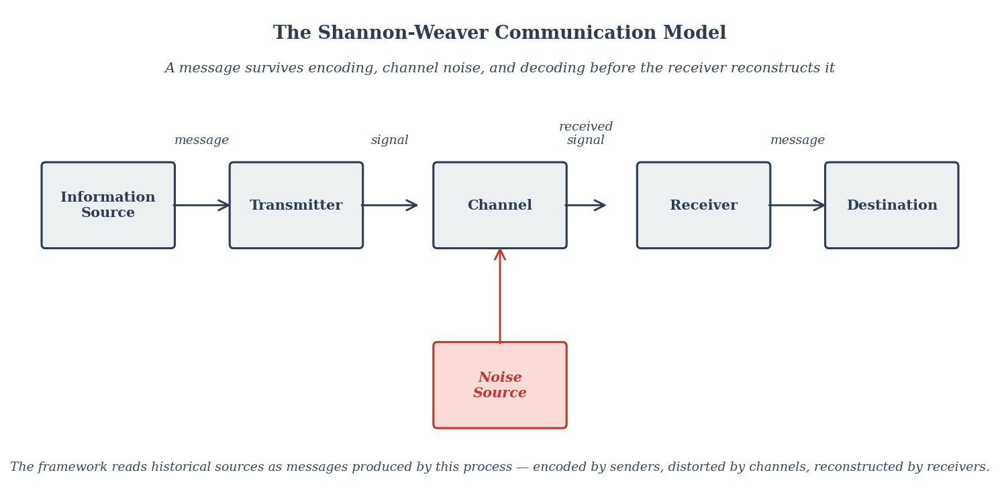

# Appendix C: Intellectual Lineage

The foreword names six traditions whose synthesis produces this book's framework, along with several archaeological terms that may be unfamiliar. This appendix is for the curious reader who wants to know more about each one — who these thinkers were, what their key contributions were, and why they matter to the argument that geography sets the probability distribution of historical outcomes.

The entries are arranged in the order the names appear in the foreword. Each is roughly one screen long. They are sketches, not full biographies; the goal is to give a reader who has never encountered Shannon or Gimbutas enough orientation to follow why the framework leans on them.

---

## 1. Claude Shannon and Information Theory

**Claude Shannon** (1916–2001) was an American mathematician and electrical engineer working at Bell Labs when, in 1948, he published *A Mathematical Theory of Communication*. The paper founded the discipline now called information theory and is one of the most consequential pieces of twentieth-century scientific work. Shannon defined information as the reduction of uncertainty, introduced the *bit* as its fundamental unit, and proved that any message could be reliably transmitted across a noisy channel up to a calculable limit — the channel's capacity.

The framework borrows two things from Shannon. The first is technical: communication is a sender-channel-receiver process in which noise is unavoidable and encoding choices shape what the receiver can actually reconstruct. The second is epistemological. Historical records are not transparent windows onto the past. They are messages sent through specific channels by specific senders with specific encoding choices — official histories, court chronicles, victors' accounts, retrospective national narratives. The historian's job is receiver-side reconstruction: stripping the encoding to recover the underlying signal.

*[Figure 16: The Shannon-Weaver Communication Model](../../figures/fig-016-shannon-weaver-model.md) — the canonical block diagram from Shannon's 1948 paper and the 1949 Weaver-co-authored book. Every historical source the framework reads is a message produced by exactly this pipeline.*

This is why the framework treats sources like the Chinese tributary system, the Mandate of Heaven, and Renaissance accounts of Genghis Khan not as direct evidence of what happened but as encoded transmissions that reveal as much about the sender as about the events. Shannon's apparatus makes the encoding visible.

---

## 2. Everett Rogers and Diffusion of Innovations

**Everett Rogers** (1931–2004) was an American communication theorist whose 1962 book *Diffusion of Innovations* synthesized decades of research across agriculture, public health, and education into a single model of how new ideas, technologies, and practices spread through populations. The model has been cited tens of thousands of times and remains the foundational text for understanding adoption dynamics.

Rogers showed that adoption follows a predictable S-curve over time: a slow start as innovators and early adopters take up the new thing, then a steep acceleration through the early and late majority, then a long tail of laggards. The shape of the curve is driven by network structure, perceived relative advantage, compatibility with existing practice, complexity, trialability, and observability. Different innovations spread at different velocities depending on how they score against these variables.

The framework applies Rogers' apparatus to history at large. The diffusion of metallurgy from the Caucasus to Scandinavia, of writing from Mesopotamia to its peripheries, of Buddhism eastward along the Silk Road, of paper and printing westward through the Islamic world — all of these are diffusion curves with measurable velocities, predictable bottlenecks, and identifiable friction zones. Rogers' work makes the diffusion lens a quantitative apparatus rather than a vague intuition about "ideas spreading."

---

## 3. The Propaganda Research Tradition

**Propaganda research** is a body of work emerging from the world wars and refined through Cold War communication studies, asking how systematically encoded messages shape what receivers believe they experienced. Key figures include Walter Lippmann (whose 1922 *Public Opinion* introduced the concept of the "pseudo-environment" between citizens and reality), Harold Lasswell (whose 1927 dissertation founded systematic propaganda analysis), Edward Bernays (whose *Propaganda*, 1928, openly described the engineering of consent), and the Frankfurt School's later critical theorists.

The tradition's central finding is that perception of events is not the direct apprehension of those events but a mediated reconstruction shaped by who is doing the sending, what channels are available, what frames are pre-loaded, and what counter-information is suppressed. This is the empirical basis for Shannon's epistemological apparatus as the framework deploys it.

The framework treats historiography as a subset of the propaganda problem. State-sponsored histories, founding-myth narratives, and retrospective national encodings are all instances of systematic sender-side shaping that the receiver-side historian must learn to decode. The Mandate of Heaven, the Four Barbarians categorization, the Manifest Destiny narrative, and the modern PRC's encoding of pre-1949 Chinese history are all propaganda artifacts in the technical sense — and the framework's job is to read them as such.

---

## 4. Jared Diamond and Continental Geography

**Jared Diamond** (born 1937) is an American polymath — biologist, biogeographer, anthropologist — whose 1997 book *Guns, Germs, and Steel* became the most influential popular argument for geographic determinism in the second half of the twentieth century. The book won the Pulitzer Prize and reframed the question of why Europeans, rather than Africans or Native Americans, ended up colonizing the planet: not because of any biological or cultural superiority but because of geographic preconditions that Eurasia happened to have and other continents largely lacked.

Diamond's signature contribution is the continental axis argument. Eurasia runs east-west; the Americas and Africa run north-south. East-west diffusion is easy because climate, day length, and growing seasons remain compatible across longitude. North-south diffusion is hard because each step crosses different climate zones, breaking the compatibility chain. Domesticated plants and animals, the technology stack they support, and the diseases that travel with them therefore spread further and faster across Eurasia than across the other continents.

The framework accepts Diamond's continent-scale apparatus as the foundational layer and extends it. Diamond reads at the resolution of continents; the framework reads at the resolution of specific terrain features — friction sieves, gravity wells, choke points, river-spine corridors — that organize the flow at the scale Diamond's model smooths over. Diamond gives the orientation logic; the framework gives the sub-regional resolution. The book is structured around this complementarity throughout.

---

## 5. Marija Gimbutas and the Kurgan Hypothesis

**Marija Gimbutas** (1921–1994) was a Lithuanian-American archaeologist whose work transformed the study of European prehistory. In a series of papers and books from 1956 onward, she proposed the **Kurgan hypothesis**: the Proto-Indo-European homeland was the Pontic-Caspian steppe (north of the Black and Caspian Seas), and the expansion of Indo-European languages and cultures into Europe was driven by waves of horse-using pastoralists from that region beginning around 4000 BCE. The name comes from the *kurgans* — burial mounds — that characterize their archaeological signature.

The Kurgan hypothesis was developed in explicit rejection of the earlier Aryan-migration narrative that Nazi ideology had weaponized, and Gimbutas grounded her account in material evidence rather than racial typology. The hypothesis was controversial for decades and has been refined repeatedly, but ancient DNA evidence since the 2010s has decisively confirmed its core claim: a steppe ancestry component sweeps across Europe in the third millennium BCE, exactly as Gimbutas predicted from archaeological evidence alone.

The framework leans on the Kurgan hypothesis for the deep prehistory of friction collapse on the steppe. Gimbutas identified the location, the timing, and the demographic signature of the expansion. David Anthony's later work added the regional terrain-feature refinement. The framework's two-friction-collapse sequence (wagon at ~3300 BCE, DOM2-and-chariot at ~2200 BCE) is built on this foundation.

---

## 6. David Anthony and the Pontic-Caspian Archaeology

**David Anthony** (born 1949) is an American archaeologist whose 2007 book *The Horse, the Wheel, and Language* is the modern synthesis of steppe archaeology, linguistics, and the Indo-European question. The book reconstructs the prehistory of the Pontic-Caspian steppe from approximately 4500 to 2000 BCE, integrating excavation data, comparative linguistics, and (in the 2010s and 2020s) ancient DNA evidence.

Anthony's signature contributions are the operational details. He showed how the domestication of the horse around 3500 BCE, the introduction of the wheel and wagon around 3300 BCE, and the eventual development of the chariot around 2000 BCE produced sequential mobility revolutions that reorganized the steppe and pushed waves of population outward. He identified the specific terrain features — the Urals as a millennium-long diffusion delay, the Caucasus as a friction sieve, the Don and Volga corridors as movement axes — that the framework's apparatus operationalizes systematically.

If Diamond gives the continent-scale orientation logic and Gimbutas gives the Kurgan-hypothesis foundation, Anthony gives the regional-resolution detail. The framework's reading of the Bronze Age substrate, including most of the substrate interlude (Chapter 1a), is built on Anthony's apparatus, refined by the framework's friction-collapse vocabulary and by the post-2021 ancient DNA chronology.

---

## 7. Yamnaya, Sintashta, and the DOM2 Horse

Three archaeological terms appear repeatedly in the foreword and the substrate interlude. They are points on a sequence.

**Yamnaya** (also Yamna or Yamnaia, from a Russian word meaning "pit," after the burial pits that define their signature) refers to a Bronze Age pastoralist culture on the Pontic-Caspian steppe between approximately 3300 and 2600 BCE. The Yamnaya are the canonical "Kurgan" population — the wave that ancient DNA evidence shows sweeping across Europe and into Central Asia in the third millennium BCE. Their expansion was wagon-driven: oxen-drawn wagons let them carry water and supplies across the dry steppe interior, converting pastoralism from a herding-radius operation tethered to river valleys into a permanent-occupation operation across the open grasslands. This is the framework's first friction collapse.

**Sintashta** (named after a site in the southern Urals) refers to a slightly later Bronze Age culture, dating from approximately 2200 to 1800 BCE, located in the Trans-Ural steppe. The Sintashta are notable for two things: the world's earliest known chariots (around 2000 BCE), and the apparent integration of these chariots with the newly emerged DOM2 horse lineage. The Sintashta package — chariot, horse, and fortified settlements organized around metallurgy — produced the cavalry-warfare pattern that dominated Eurasian history for the next 3500 years. This is the framework's second friction collapse.

**DOM2** is the name geneticists give to the modern domestic horse lineage. **Librado et al. 2021** (published in *Nature*) is the ancient DNA study that established the chronology: the lineage that produced essentially all subsequent domestic horses emerged in the lower Don-Volga region around 2200 BCE and spread outward from there within a few centuries. The redating overturned the earlier consensus that horse domestication was a single event around 3500 BCE. The framework's two-friction-collapse structure is a direct response to this redating.

The **Pontic-Caspian steppe** is the grassland zone north of the Black and Caspian Seas, roughly between modern Ukraine, southern Russia, and Kazakhstan. It is the geographic stage on which the entire sequence — Yamnaya, Sintashta, DOM2, and the Indo-European expansions — plays out.

---

## 8. Human Factors and Usability Research

**Human factors** (also called ergonomics, or in software contexts usability research and user experience research) is the discipline that studies how humans operate within designed systems — physical, cognitive, or social — and how those systems can be designed to fit human capabilities and limitations. The field emerged from military aviation research in World War II, when high-performance aircraft began producing crashes that could not be explained by mechanical failure or pilot incompetence: the cockpits had been designed without regard for the operator, and otherwise capable pilots were making predictable errors that the design itself induced.

The discipline's central finding is that humans, individually and collectively, operate as **optimizing systems within constraints**. Given a task, a set of affordances, and feedback about results, people will find paths that minimize effort and risk while maximizing reward, even when those paths are not the ones the system designer intended. Design that fights this optimization fails; design that aligns with it succeeds.

The framework's claims about historical actors rest on this cognitive-behavioral substrate. Plains nomadism, the choice between pastoralism and agriculture, the formation of trade networks, the willingness to migrate, the patterns of urban settlement — these are all products of optimizing humans operating within geographic constraints. They are not products of biological capacity, cultural deficit, or historical accident. This is what makes the framework's geographic determinism coherent rather than over-determined: terrain shapes the constraint set, and human optimization within that set produces the observed outcomes.

---

## 9. Anti-Eugenics and Social Constructionism

Two epistemological commitments position the framework against specific alternatives.

**Anti-eugenics** is the explicit rejection of biological determinism as an explanation for historical outcomes. Eugenics — the belief that human populations differ in inherent biological capacity and that these differences explain civilizational outcomes — was the dominant scientific consensus in the early twentieth century, enshrined in academic departments, public policy, and ultimately Nazi state ideology. The post-1945 collapse of the scientific case for eugenics was decisive, but the underlying instinct to explain unequal outcomes by appealing to inherent population differences has proven durable, and resurfaces under different vocabularies.

The framework's geographic determinism is the structural opposite of biological determinism. Where eugenics posits stratified populations producing different outcomes, the framework posits normally-distributed populations producing different outcomes through different selection pressures imposed by different terrain. Same observed history. Opposite causal mechanisms. The framework therefore functions as a positive alternative to eugenic explanation, not merely a refutation of it.

**Social constructionism** is the philosophical position that human knowledge and social categories are products of historically situated processes rather than direct apprehensions of objective truth. In its strong forms, social constructionism is sometimes invoked to deny that any historical claim can be evaluated against evidence — a position the framework rejects. In its useful form, social constructionism reminds us that any framework, including this one, is a tool built for specific purposes within a specific intellectual moment, and is evaluated by whether it explains more variance and generates more falsifiable predictions than its alternatives — not by whether it captures the truth in some final sense.

This is the epistemological humility built into the framework. Geography as destiny is offered as a more useful lens, not as the final word. The framework is a draw from a distribution. Better drawings remain possible.

---

## 10. Buddhist and Taoist Flow-Substrate Insights

Two traditions that the foreword does not explicitly name in its intellectual lineage but that nonetheless exhibit substantial substrate-resonance convergence with the framework's apparatus. The convergence requires careful framing: the framework is not derivatively Buddhist or Taoist; its explicit intellectual sources are diverse and Western-tradition-heavy. The framework independently arrives at insights that Buddhist and Taoist traditions articulated millennia earlier in their respective vocabularies. The convergence is what substrate-aligned analytical traditions look like when they meet across radically different intellectual contexts.

**Taoism** (also Daoism) is the Chinese philosophical-religious tradition associated with the *Dao De Jing* (compiled probably in the fourth or third century BCE, traditionally attributed to the legendary Laozi) and the *Zhuangzi* (third century BCE). The tradition's central concept is the *Dao* (the Way) — the underlying principle of how things naturally move — and its central methodological commitment is *wu wei* (often translated as "non-action" or "effortless action aligned with the natural flow"). The Taoist insight that things flow naturally without forced intervention, and that the wise person aligns with the flow rather than acting against it, exhibits substantial structural parallel to the framework's thermodynamic river-metaphor apparatus. Water flows downhill not because it strives but because the differential exists; the Tao that Laozi points at is, in the framework's reading, the same thermodynamic gradient-following that the framework reads everywhere else.

**Buddhism** (founded in India in the sixth or fifth century BCE through the teachings traditionally attributed to Siddhartha Gautama) is a philosophical-religious tradition that articulates a systematic analysis of suffering and its cessation. Buddhist apparatus (the Four Noble Truths; the Eightfold Path; the various meditative and contemplative practices) provides psychological technology for maintaining equanimity within difficult circumstances rather than prescribing how circumstances should be arranged. The framework's reading: Buddhist prescriptions operate at the individual-internal-disposition level where individual discipline can sustain them, making Buddhism substrate-aligned in a way that the framework's apparatus reads as continuously durable across millennia.

The framework's central insight that recurs across the Hammond arc — "the framework is the tool for perceiving the larger system" — has substantial parallel to the Buddhist diagnosis that the fundamental human problem is local optimization without perceiving the larger system within which the optimization is occurring. The Taoist insight that wu wei (alignment with the natural flow) produces sustainable outcomes while wu wei violated (acting against the flow without perceiving its direction or magnitude) produces catastrophic consequences proportional to the system's accumulated potential — the framework's anti-hero apparatus articulates exactly this dynamic through different specific vocabulary. The framework's substrate-determinism analysis operates on geographic-historical material; Buddhist and Taoist analysis operates on universal/cosmic material; both address the same fundamental problem (local optimization without larger-system perception) through different specific apparatus.

Multiple independent intellectual traditions arriving at convergent insights about substrate-flow logic constitutes evidence that the underlying dynamics are real. If only one tradition articulated flow-substrate insights, the insights might be culturally-specific cognitive constructs. The convergence across radically different intellectual contexts — Chinese-Taoist, Indian-Buddhist, twenty-first-century-geographic-determinist — is the framework's substrate-alignment self-test producing confirmation. The framework practices the substrate-aligned analytical posture it (implicitly) prescribes, and the practice produces the kind of convergent insights with other substrate-recognition traditions that would not occur if the framework were operating with substrate-misaligned apparatus. The Tao flows downhill to Samarkand whether one names it through Western thermodynamic vocabulary or Chinese cosmic-principle vocabulary.

---

## 11. Ibn Khaldun and the Muqaddimah

**Ibn Khaldun** (1332–1406) was a North African Arab historian, philosopher, and statesman whose *Muqaddimah* (Introduction to the *Kitab al-Ibar*, completed in its first version in 1377) is one of the most important works of pre-modern social-historical theory. Ibn Khaldun lived through the late phase of Islamic Spain and the political turbulence of fourteenth-century North Africa, observing the rise and fall of multiple dynasties from a close vantage point. His apparatus is empirical-comparative-historical operating at substantial analytical sophistication centuries before equivalent Western intellectual apparatus emerged.

The *Muqaddimah*'s central theoretical contribution is the **cyclical theory of nomadic-sedentary dynamics** centered on the concept of *asabiyya* (often translated as "group feeling" or "social solidarity," though the term carries substantial untranslatable cultural-specific content). The argument: nomadic groups have strong *asabiyya* produced by the harsh conditions of nomadic life and the cohesion-requirement of pastoral cooperation; this group cohesion gives them the social capacity to conquer sedentary civilizations whose populations have substantially weakened group feeling due to the comforts and divisions of urban life; once the nomadic group conquers and settles into sedentary administration, their *asabiyya* gradually weakens over three to four generations as they assimilate into sedentary luxury and lose the harsh conditions that produced their original solidarity; weakened by this loss, they become vulnerable to the next nomadic wave with fresh group feeling; the cycle repeats.

The framework's substrate-resonance with Ibn Khaldun's apparatus is substantial but operates at a different analytical level. Where Ibn Khaldun explains the cyclical pattern through sociological-cultural variables (group-cohesion dynamics; the corrupting effects of urban luxury; generational decay of nomadic discipline), the framework explains the same observed pattern through substrate-geographic variables (terrain converting displaced-population kinetic energy into local-system assimilation energy when the substrate does not reward the displaced population's organizational forms; substrate-driven middleware-rebuild requirements; combined-toolkit dynamics in assimilated conquest dynasties). The two apparatus identify the same underlying historical pattern through different specific mechanism explanations. The connection is structural-equivalence (two apparatus reading the same dynamics through different vocabularies) rather than derivative-lineage (the framework does not derive from Ibn Khaldun's work).

The framework's bumper-as-transformer mechanism — articulated through the Mongol four-khanate cross-substrate case (Yuan Sinicization; Ilkhanate Islamic conversion + Persian administrative adoption; Chagatai Turkic-Islamic absorption; Golden Horde slower Turkic-Tatar absorption) — operates with substantial parallel to Khaldunian dynamics on the specific cases Ibn Khaldun himself analyzed (Berber, Arab, and Turkish dynasty succession in the medieval Islamic world). The convergence is what substrate-aligned analytical traditions look like when they meet across radically different specific historical contexts.

Future framework engagements can deploy the Ibn Khaldun connection explicitly in two ways. First, the *Muqaddimah* provides substantial historical material for testing the framework's predictions on cases Ibn Khaldun himself analyzed — North African, Andalusian, and Near Eastern dynastic-cycle cases that the framework's apparatus reads through bumper-as-transformer and unification-vs-sustainment lenses. Second, the framework's substrate-resonance convergence pattern (which this appendix entry exemplifies) extends to multiple other independent substrate-recognition traditions, including the Buddhist/Taoist tradition (above), the meteorological-substrate-friction tradition the framework's weather-metaphor refinement draws on, and the spontaneous use of substrate-recognition vocabulary by contemporary observers (Kenneth Hammond's "the north absorbed the energy of the invasion" being one canonical recent example).

---

## 12. Abraham Wald and Survivorship Bias

**Abraham Wald** (1902–1950) was a Hungarian-American mathematician who made foundational contributions to statistical decision theory, sequential analysis, and econometrics. During World War II he worked at the Statistical Research Group (SRG) at Columbia University, an organization the U.S. military assembled to apply rigorous statistical analysis to operational problems. The SRG's roster included some of the most distinguished mathematical minds of the period (Milton Friedman among them); Wald's specific work there became the canonical illustration of a logical move that the framework uses repeatedly.

The canonical story: the U.S. Army Air Forces wanted to add armor to bombers to reduce loss rates. The naive analysis was to inspect bombers returning from missions, identify where they had been hit, and reinforce those areas. Wald recognized the inversion: the returning bombers were the survivors. The damage patterns visible on returning bombers showed where a bomber could be hit and still return. Reinforcement should go where the returning bombers had *no* damage — because hits in those locations were the ones that brought the bomber down. The bombers that took hits in the engines or the cockpit did not return for inspection. The absence of damage in those locations on returning bombers was the most diagnostic data available about which hits were lethal.

The conceptual move is **survivorship bias**: when you observe only the surviving members of a category, the patterns visible in the survivors systematically mislead inferences about the underlying process that produced both survivors and casualties. The casualties carry information that the survivors cannot. Treating the survivors as a representative sample produces predictably wrong conclusions about the underlying dynamics.

The framework extends Wald's apparatus to historiography. The historical record is overwhelmingly composed of returning bombers — the documents, artifacts, monuments, and chronicles that survived to be inspected. The casualties — the suppressed perspectives, the destroyed records, the populations whose internal logic was never written down, the processes that left no physical trace, the substrate mechanisms that explain historical outcomes without producing the kind of testable named events the documentary record captures — these are the engine hits. They are systematically absent from the surviving record not because they were unimportant but because their absence is structurally produced by the survival mechanism itself.

The framework's specific vocabulary deploys Wald's apparatus through two terms that recur across the book. **Returning bombers** are the survivors that the historical record preserves — named battles, dated events, famous individuals, testable facts, all the curriculum-optimized content of conventional history. **Engine hits** are the substrate processes and mechanisms that actually explain historical outcomes but lack the survival properties (specific dates, named individuals, dramatic narrative shape) that the documentary record privileges. The framework exists partly to recover the engine hits — to provide the analytical apparatus that makes substrate processes visible despite their systematic absence from the standard curriculum.

Several specific framework moves derive from this apparatus. The *absence-as-data* principle (the silence along a transmission route between civilizations tells you the transmission mechanism — oral encoding through high friction, written decoding at low-friction destinations). The *receiver-side reading* of all sources (every preserved document was preserved by someone, and the act of preservation itself encodes information about which content survived the survival mechanism). The *time-capsule preservation* mechanism (per Appendix A entry 11) — discrete cases where engine-hit material was preserved by deliberate community action of people who recognized what was being lost, producing unusually rich evidence base for the substrate apparatus the survival mechanism would otherwise have systematically suppressed. The framework's reading of conventional historiography's curriculum bias (per Chapter 8's methodological commitments section) is the standard Wald apparatus operating on historiography itself: the curriculum optimizes for testability and memorability; the optimization systematically biases against explanatorily-important-but-untestable substrate processes; the framework exists partly to address the systematic bias the optimization produces.

Wald himself did not extend his apparatus to historiography. The extension is the framework's analytical contribution. But the underlying logic — the survivors mislead inferences about the underlying process unless the casualties are deliberately reconstructed — is Wald's, and the framework borrows it as one of its most-used analytical moves.

---

## 13. Machine Learning Analytical Apparatus

Machine learning developed as a discipline through the second half of the twentieth century, formalizing into its modern form during the 1980s and 1990s with the broader artificial intelligence revival, and reaching contemporary prominence through the deep learning advances of the 2010s and the large language model advances of the 2020s. The discipline's central technical concepts — gradient descent, local minima, regularization, loss function, overfitting — have specific mathematical content within the machine learning literature and substantial general analytical utility outside it. The framework borrows several of these concepts as analytical apparatus, with careful framing: the framework is not derivatively machine learning; the structural-equivalence with machine learning apparatus operates as analytical extension that makes existing framework concepts more precise.

**Gradient descent** is the family of optimization algorithms that find local optima by repeatedly stepping in the direction of steepest descent. Given a loss function (a measurement of how poorly the current solution performs), the algorithm computes the gradient (direction of fastest improvement) and takes a step in that direction; repeating this process converges toward a local minimum (point where every direction appears worse than the current position). The framework's analytical extension applies gradient descent vocabulary to historical-civilizational optimization decisions: populations and civilizations make decisions that follow the steepest local descent toward what looks like the best position; the algorithm settles into what appears optimal from the local perspective. The framework's contribution is the structural-equivalence reading that connects this analytical apparatus to historical-civilizational outcomes.

**Local minimum trap** is the specific dynamic where gradient descent settles into a position that is the lowest point in the immediate vicinity but is not the global minimum (the lowest point in the entire landscape). The algorithm has no way to distinguish a local minimum from a global minimum because every direction from the local minimum appears to go uphill. The Southern Song commercial economy operates as the framework's canonical historical illustration: every local decision was correct given the immediate gradient; the system settled into what looked like the optimal position; the Mongol conquest revealed it was a local minimum rather than the global minimum. The previously-optimal position was maximally vulnerable rather than maximally productive once substrate conditions changed.

**Loss function** is the measurement function the optimization algorithm minimizes. Different loss functions produce different optimization landscapes; changes to the loss function transform the landscape itself, making previously-optimal positions suboptimal or vice versa. The framework's analytical extension reads disruption as loss-function change rather than as force operating on a fixed landscape: the Mongol conquest did not just disrupt the Southern Song's optimized position; it changed the loss function the Song had been optimizing for. Previously-optimal positions became maximally vulnerable because the landscape the Song had been optimizing against no longer existed.

**Regularization** is the family of techniques that prevent overfitting by adding penalty terms to the loss function. The penalty discourages the model from optimizing too aggressively for the training data, producing a model that performs slightly worse on the training data and substantially better on previously unseen data. The framework's analytical extension applies regularization vocabulary to cultural-moral frameworks: cultural-moral apparatus operates structurally as regularization that penalizes pure optimization in favor of maintained generalizability across conditions. Cultural-moral frameworks look inefficient under stable conditions because they penalize pure optimization that would maximize performance under those conditions; they do load-bearing resilience work when conditions change because the maintained generalizability preserves apparatus that pure efficiency-optimization would have destroyed. Zhu Xi's Neo-Confucianism emerging during the late Southern Song operates as canonical regularization case in this framing.

**The framework's broader analytical position.** Multiple intellectual traditions independently arriving at convergent insights about substrate-flow logic constitutes evidence that the underlying dynamics are real. The framework's substrate-resonance convergence with Buddhist/Taoist flow-substrate apparatus (entry 10), meteorological pressure-systems-and-surface-friction logic (foundational to the weather-metaphor refinement in the framework's central metaphorical apparatus), Ibn Khaldun's fourteenth-century *asabiyya*-based cyclical theory (entry 11), and now machine learning gradient-descent-and-regularization apparatus (this entry) all operate through the same convergence pattern: independent analytical traditions, radically different theoretical apparatus, convergent insights about the underlying substrate dynamics. The convergence is what substrate-aligned analytical traditions look like when they meet across different intellectual contexts.

The framework's specific deployment of machine learning apparatus is methodological extension rather than theoretical foundation. The thermodynamic river-metaphor and the weather-metaphor refinement remain the framework's central metaphorical apparatus articulated in the foreword and Chapter 1. The gradient-descent and regularization apparatus extend this central toolkit with additional dimensions: gradient descent explains why the flow gets trapped; regularization explains why cultural-moral frameworks that seem inefficient are actually doing load-bearing resilience work. The four metaphors operate together as integrated analytical toolkit producing analytical reach no single metaphor alone provides.

---

*The reference cards behind each of these entries, with their full sourcing and cross-connections, are available in the project repository at <https://github.com/gotoplanb/geography-as-destiny>.*
